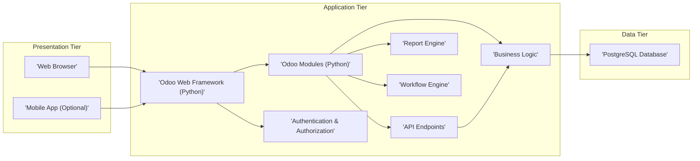
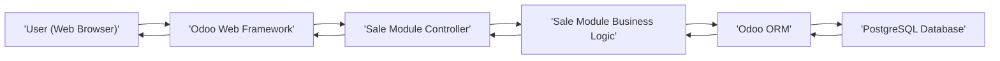
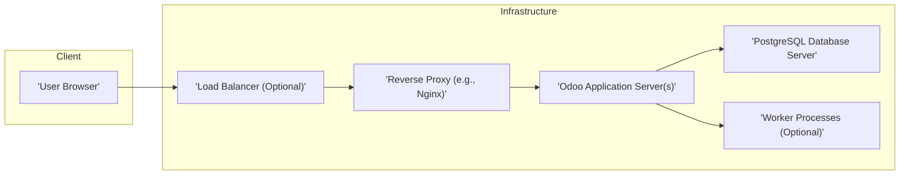

## Project Design Document: Odoo ERP System - Improved

**1. Introduction**

This document provides a comprehensive design overview of the Odoo ERP system, based on the codebase available at [https://github.com/odoo/odoo](https://github.com/odoo/odoo). It details the system's architecture, core components, data flow, and critical security considerations to facilitate effective threat modeling. This document serves as a blueprint for understanding the system's inner workings and potential vulnerabilities.

**2. Goals and Objectives**

Odoo aims to provide a unified suite of open-source business applications, enabling organizations to manage various aspects of their operations. Key objectives include:

*   Offering a modular and highly customizable platform for businesses of all sizes.
*   Providing integrated applications covering core business functions such as Sales, CRM, Accounting, Inventory Management, Manufacturing, Human Resources, and Marketing.
*   Enabling seamless data flow and automation across different business processes.
*   Providing a modern, user-friendly web interface accessible across various devices.
*   Facilitating the development of custom applications and extensions to meet specific business requirements.

**3. System Architecture**

Odoo employs a modular, three-tier architecture designed for scalability and maintainability:

*   **Presentation Tier:** Responsible for user interaction and data presentation. This tier primarily consists of:
    *   The Odoo Web Client: A dynamic web application built with JavaScript, HTML, and CSS, rendered in user's web browsers.
    *   Mobile Applications (Optional): Native or hybrid mobile apps that interact with the Application Tier via APIs.
*   **Application Tier:** The core of Odoo, handling business logic, data processing, and application functionality. Key components include:
    *   Odoo Web Framework (Python): Provides the foundation for handling HTTP requests, routing, session management, and rendering views.
    *   Odoo Modules (Python):  Self-contained units of functionality, each representing a specific business application (e.g., `sale`, `crm`, `account`). These modules contain business logic, data models, and view definitions.
    *   Authentication and Authorization Services: Manages user authentication (login) and authorization (access control) based on defined roles and permissions.
    *   Business Logic Implementation:  Python code within modules that implements the specific rules and processes for each application.
    *   API Endpoints:  Provide programmatic access to Odoo functionalities, enabling integration with external systems. This includes standard protocols like XML-RPC and JSON-RPC, and increasingly RESTful APIs.
    *   Reporting Engine: Generates reports in various formats (PDF, XLSX, etc.) by querying and processing data from the Data Tier.
    *   Workflow Engine: Manages automated processes and transitions between different states within the system.
*   **Data Tier:** Manages persistent data storage. The primary component is:
    *   PostgreSQL Database: Stores all application data, user information, configuration settings, and module definitions.

**4. Key Components**

*   **Odoo Web Framework:** The foundational layer responsible for:
    *   Handling incoming HTTP requests and routing them to the appropriate controllers.
    *   Managing user sessions and authentication.
    *   Rendering web pages using a templating engine.
    *   Providing a base for building Odoo modules.
*   **Odoo Modules:**  Encapsulated units of functionality, examples include:
    *   `sale`: Manages sales orders, quotations, and invoicing.
    *   `crm`: Handles customer relationship management, leads, and opportunities.
    *   `account`: Manages financial accounting, invoicing, and payments.
    *   `stock`: Manages inventory, warehousing, and product movements.
    *   Each module defines its own data models (using Odoo's ORM), business logic (in Python), and user interface elements (views).
*   **Authentication and Authorization System:**  Secures access to the system by:
    *   Verifying user credentials (username/password, potentially OAuth).
    *   Managing user sessions using cookies or tokens.
    *   Enforcing access control based on user roles, groups, and record-level permissions.
*   **Business Logic Layer:** Implemented within Odoo modules, defining the core functionality:
    *   Data validation and manipulation.
    *   Implementation of business rules and workflows.
    *   Interaction with the Data Tier through Odoo's ORM.
*   **API Endpoints:** Provide interfaces for external systems to interact with Odoo:
    *   XML-RPC: A traditional remote procedure call protocol.
    *   JSON-RPC: A lightweight JSON-based protocol.
    *   RESTful APIs (increasingly common):  Provide resource-based access to Odoo data and functionalities.
*   **Report Engine:**  Generates reports by:
    *   Fetching data from the PostgreSQL database.
    *   Processing and formatting the data according to report definitions.
    *   Outputting reports in various formats (PDF, XLSX, HTML).
*   **Workflow Engine:** Automates business processes by:
    *   Defining workflows as sequences of activities and transitions.
    *   Managing the state of business objects and triggering actions based on defined rules.
*   **PostgreSQL Database:** The primary data store:
    *   Stores all persistent data for Odoo applications.
    *   Provides relational database capabilities.
    *   Accessed and managed through Odoo's Object-Relational Mapper (ORM).
*   **File Storage:** Manages uploaded files and attachments:
    *   Typically stored within the server's file system.
    *   Can be configured to use cloud storage services (e.g., AWS S3).
*   **Scheduler:**  Executes scheduled tasks and background jobs:
    *   Used for automating recurring processes (e.g., sending emails, generating reports).
*   **Email System:**  Handles sending and receiving emails:
    *   Used for notifications, marketing campaigns, and communication with users and customers.

**5. Data Flow**

A typical user interaction flow for creating a sales order illustrates the data flow:

1. A user interacts with the Odoo web client, filling out the sales order form.
2. The web client sends an HTTP request containing the sales order data to the Odoo Web Framework.
3. The framework routes the request to the `sale` module's controller responsible for handling sales order creation.
4. The controller invokes the business logic within the `sale` module to validate the data and create a new sales order object.
5. The `sale` module's business logic interacts with the Odoo ORM to persist the sales order data in the PostgreSQL database.
6. The database confirms the data insertion.
7. The `sale` module generates a response, potentially including the newly created sales order ID.
8. The Odoo Web Framework renders the response and sends it back to the user's web browser, displaying a confirmation message or the newly created sales order.

**6. Security Considerations**

Security is paramount for an ERP system like Odoo. Key considerations include:

*   **Authentication:**
    *   Strong password policies and enforcement.
    *   Secure storage of user credentials (hashing and salting).
    *   Support for multi-factor authentication (MFA).
    *   Protection against brute-force attacks (e.g., account lockout).
*   **Authorization:**
    *   Role-Based Access Control (RBAC) to manage user permissions.
    *   Granular access control at the module and record level.
    *   Regular review and auditing of user permissions.
*   **Session Management:**
    *   Securely generated and managed session identifiers.
    *   Session timeouts and inactivity handling.
    *   Protection against session hijacking.
*   **Data Validation and Input Sanitization:**
    *   Server-side validation of all user inputs to prevent injection attacks (SQL injection, XSS, etc.).
    *   Proper encoding of output data to prevent XSS.
*   **Data Privacy and Encryption:**
    *   Encryption of sensitive data at rest in the database.
    *   Encryption of data in transit using HTTPS (TLS).
    *   Compliance with relevant data privacy regulations (e.g., GDPR).
*   **Secure Communication:**
    *   Enforcing HTTPS for all client-server communication.
    *   Proper configuration of TLS certificates.
*   **Dependency Management:**
    *   Regularly updating third-party libraries and dependencies to patch known vulnerabilities.
    *   Using dependency scanning tools to identify potential security risks.
*   **File Upload Security:**
    *   Validating file types and sizes.
    *   Scanning uploaded files for malware.
    *   Storing uploaded files securely and preventing direct access.
*   **API Security:**
    *   Authentication and authorization for API endpoints (e.g., API keys, OAuth).
    *   Rate limiting to prevent abuse.
    *   Input validation for API requests.
*   **Reporting Security:**
    *   Ensuring that users only have access to reports containing data they are authorized to view.
    *   Secure generation and delivery of reports.
*   **Database Security:**
    *   Strong database user credentials and access controls.
    *   Regular database backups and recovery procedures.
    *   Network segmentation to restrict access to the database server.

**7. Deployment Architecture**

Odoo offers flexible deployment options:

*   **Odoo Online (SaaS):** Odoo manages the entire infrastructure and application.
*   **Odoo.sh (PaaS):** A platform specifically designed for hosting Odoo instances, providing tools for deployment, scaling, and maintenance.
*   **On-Premise:** Deploying Odoo on the organization's own servers or private cloud infrastructure. A typical on-premise setup might include:
    *   **Load Balancer (Optional):** Distributes incoming traffic across multiple Odoo application servers for scalability and high availability.
    *   **Reverse Proxy (e.g., Nginx, Apache):** Handles SSL termination, routing, and provides an additional layer of security.
    *   **Odoo Application Server(s):** Run the Python application and handle business logic.
    *   **PostgreSQL Database Server:** Stores the application data.
    *   **Worker Processes (Optional):** For handling background tasks and asynchronous operations.

**8. Technologies Used**

*   **Primary Programming Language:** Python
*   **Web Framework:** Odoo Web Framework (built on Werkzeug)
*   **Database:** PostgreSQL
*   **Frontend Technologies:** JavaScript (primarily ECMAScript), HTML, CSS, XML
*   **Templating Engine:** QWeb (XML-based)
*   **Reporting Libraries:** ReportLab, WeasyPrint
*   **Communication Protocols:** HTTP/HTTPS, XML-RPC, JSON-RPC
*   **Operating System (Typical Deployment):** Linux-based distributions

**9. Future Considerations**

*   Enhanced focus on RESTful API development and standardization.
*   Further improvements to security features, including more robust MFA options and advanced threat detection capabilities.
*   Scalability enhancements to support larger deployments and higher user concurrency.
*   Deeper integration with cloud services and third-party platforms.
*   Continued development of new modules and functionalities to address evolving business needs.

This improved design document provides a more detailed and comprehensive overview of the Odoo ERP system, emphasizing aspects relevant to security and threat modeling. It aims to equip security professionals with the necessary information to effectively analyze potential vulnerabilities and design appropriate mitigation strategies.