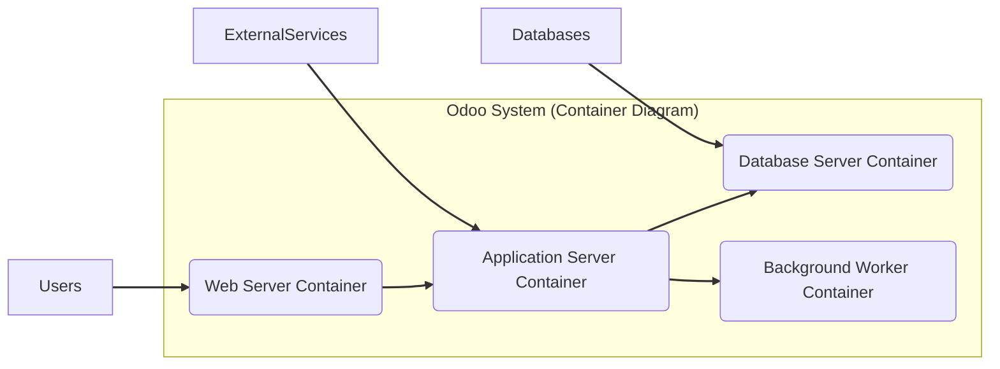

# BUSINESS POSTURE

This project, Odoo, aims to provide a comprehensive suite of business applications, covering areas such as CRM, e-commerce, accounting, inventory, manufacturing, and project management. It targets businesses of all sizes, offering a modular and integrated platform to manage various business processes.

Business Priorities and Goals:
- Provide a comprehensive and integrated suite of business applications to cover diverse business needs.
- Offer a modular and customizable platform to allow businesses to tailor the system to their specific requirements.
- Enable business process automation and efficiency improvements.
- Support scalability to accommodate business growth.
- Foster a strong community and ecosystem around the platform.
- Offer both open-source and enterprise versions to cater to different customer segments.

Business Risks:
- Data breaches and data loss due to the sensitive nature of business data handled by the platform.
- System downtime and unavailability impacting business operations.
- Complexity of the system leading to implementation and maintenance challenges.
- Security vulnerabilities in the open-source components and custom modules.
- Vendor lock-in if businesses become heavily reliant on the Odoo platform.
- Compliance risks related to data privacy regulations (e.g., GDPR, CCPA) due to handling of personal and financial data.

# SECURITY POSTURE

Existing Security Controls:
- security control: Code reviews are likely performed by Odoo developers and community contributors (location: Odoo development process).
- security control: Automated testing is likely in place to ensure code quality and identify functional issues (location: Odoo CI/CD pipelines).
- security control: Security updates and patches are released regularly (location: Odoo security release policy).
- security control: Access control mechanisms within the application to manage user permissions (location: Odoo application code).
- security control: HTTPS encryption for web traffic (location: Deployment documentation and best practices).
- security control: Database access controls (location: Database server configuration).

Accepted Risks:
- accepted risk: Potential vulnerabilities in community-contributed modules due to varying security practices.
- accepted risk: Reliance on timely community contributions for security vulnerability discovery and patching.
- accepted risk: Complexity of securing a large and modular application suite.

Recommended Security Controls:
- security control: Implement a Web Application Firewall (WAF) to protect against common web attacks (e.g., OWASP Top 10).
- security control: Implement security information and event management (SIEM) for security monitoring and incident response.
- security control: Conduct regular penetration testing and vulnerability assessments.
- security control: Implement static and dynamic application security testing (SAST/DAST) in the development pipeline.
- security control: Enhance input validation and output encoding across all application modules.
- security control: Implement robust logging and auditing mechanisms for security events.
- security control: Secure software supply chain management practices for dependencies and third-party libraries.

Security Requirements:
- Authentication:
    - requirement: Secure authentication mechanisms to verify user identity (e.g., username/password, multi-factor authentication).
    - requirement: Protection against brute-force attacks and credential stuffing.
    - requirement: Session management to securely maintain user sessions.
- Authorization:
    - requirement: Role-based access control (RBAC) to manage user permissions and access to features and data.
    - requirement: Principle of least privilege to grant users only necessary permissions.
    - requirement: Secure API authorization for external integrations.
- Input Validation:
    - requirement: Comprehensive input validation on all user inputs to prevent injection attacks (e.g., SQL injection, cross-site scripting).
    - requirement: Input sanitization and encoding to mitigate injection risks.
    - requirement: Validation of file uploads to prevent malicious file uploads.
- Cryptography:
    - requirement: Use of strong encryption algorithms for sensitive data at rest and in transit.
    - requirement: Secure storage and management of cryptographic keys.
    - requirement: Proper implementation of cryptographic protocols (e.g., TLS, HTTPS).
    - requirement: Data masking or pseudonymization for sensitive data in non-production environments.

# DESIGN

## C4 CONTEXT

```mermaid
graph LR
    subgraph "Odoo System Context"
        center "Odoo"
    end

    Users --> center
    ExternalServices --> center
    Databases --> center

    subgraph Users [Users]
        direction TB
        Employees("Employees")
        Customers("Customers")
        Administrators("Administrators")
    end

    subgraph ExternalServices [External Services]
        direction TB
        EmailService("Email Service")
        PaymentGateway("Payment Gateway")
        SocialMediaPlatforms("Social Media Platforms")
        ThirdPartyAPIs("Third-Party APIs")
    end

    subgraph Databases [Databases]
        direction TB
        OdooDatabase("Odoo Database")
    end

    linkStyle 0,1,2 stroke:#333,stroke-width:2px;
```

Context Diagram Elements:

- Element:
    - Name: Odoo
    - Type: Software System
    - Description: An integrated suite of open-source business applications, including CRM, ERP, e-commerce, and more, designed to manage various aspects of a business.
    - Responsibilities:
        - Providing core business functionalities across different modules.
        - Managing user interactions and data processing.
        - Integrating with external services and databases.
        - Enforcing security controls and access management.
    - Security controls:
        - security control: Application-level authentication and authorization.
        - security control: Input validation and output encoding.
        - security control: Data encryption at rest and in transit.
        - security control: Security logging and auditing.

- Element:
    - Name: Users
    - Type: Actors
    - Description: Individuals who interact with the Odoo system. Categorized into Employees, Customers, and Administrators.
    - Responsibilities:
        - Employees: Using Odoo for daily tasks related to sales, operations, etc.
        - Customers: Interacting with Odoo for e-commerce, customer service, etc.
        - Administrators: Managing and configuring the Odoo system.
    - Security controls:
        - security control: Strong password policies.
        - security control: Multi-factor authentication (MFA) where applicable.
        - security control: User access reviews and management.

- Element:
    - Name: External Services
    - Type: External Systems
    - Description: External systems that Odoo integrates with to extend its functionality. Includes Email Services, Payment Gateways, Social Media Platforms, and other Third-Party APIs.
    - Responsibilities:
        - Email Service: Sending and receiving emails for notifications, marketing, etc.
        - Payment Gateway: Processing online payments for e-commerce transactions.
        - Social Media Platforms: Integration for social media marketing and customer engagement.
        - Third-Party APIs: Integration with various external services for specific functionalities.
    - Security controls:
        - security control: Secure API communication (HTTPS).
        - security control: API authentication and authorization (API keys, OAuth).
        - security control: Input validation and output encoding for API interactions.
        - security control: Rate limiting and API security best practices.

- Element:
    - Name: Databases
    - Type: Data Store
    - Description: Databases used by Odoo to store application data, configurations, and user information.
    - Responsibilities:
        - Persistently storing Odoo data.
        - Providing data access to the Odoo application.
        - Ensuring data integrity and availability.
    - Security controls:
        - security control: Database access controls and authentication.
        - security control: Database encryption at rest.
        - security control: Regular database backups and recovery procedures.
        - security control: Database activity monitoring and auditing.

## C4 CONTAINER



Container Diagram Elements:

- Element:
    - Name: Web Server Container
    - Type: Web Server
    - Description: Handles HTTP requests from users, serves static content, and proxies requests to the Application Server. Typically uses Nginx or Apache.
    - Responsibilities:
        - Handling user requests and responses over HTTP/HTTPS.
        - Serving static files (HTML, CSS, JavaScript, images).
        - Load balancing and request routing.
        - SSL/TLS termination.
    - Security controls:
        - security control: HTTPS configuration and enforcement.
        - security control: Web Application Firewall (WAF) integration.
        - security control: Rate limiting and DDoS protection.
        - security control: Regular security updates and patching of web server software.

- Element:
    - Name: Application Server Container
    - Type: Application Server
    - Description: Runs the Odoo application code (Python), processes business logic, and interacts with the Database Server and Background Worker Container.
    - Responsibilities:
        - Executing Odoo application logic.
        - Handling user authentication and authorization.
        - Processing data and interacting with the database.
        - Managing background tasks and queues.
        - Integrating with external services.
    - Security controls:
        - security control: Application-level authentication and authorization mechanisms.
        - security control: Input validation and output encoding within the application code.
        - security control: Secure coding practices and vulnerability management.
        - security control: Regular security audits and penetration testing of the application.

- Element:
    - Name: Database Server Container
    - Type: Database
    - Description: Stores Odoo's persistent data, including application data, user information, and configurations. Typically uses PostgreSQL.
    - Responsibilities:
        - Storing and managing Odoo data.
        - Providing data persistence and retrieval.
        - Ensuring data integrity and availability.
        - Handling database transactions.
    - Security controls:
        - security control: Database access controls and authentication.
        - security control: Database encryption at rest.
        - security control: Regular database backups and recovery procedures.
        - security control: Database activity monitoring and auditing.
        - security control: Hardening database server configuration.

- Element:
    - Name: Background Worker Container
    - Type: Background Worker
    - Description: Executes asynchronous tasks and background jobs, such as email sending, scheduled tasks, and long-running processes.
    - Responsibilities:
        - Processing background tasks and queues.
        - Handling asynchronous operations.
        - Improving application responsiveness by offloading tasks.
    - Security controls:
        - security control: Secure task queue management.
        - security control: Input validation for background task processing.
        - security control: Logging and monitoring of background task execution.
        - security control: Access control for managing background tasks.

## DEPLOYMENT

Deployment Architecture: Cloud-Based Containerized Deployment (e.g., Kubernetes on AWS)

```mermaid
graph LR
    subgraph "Cloud Infrastructure (AWS)"
        subgraph "Kubernetes Cluster"
            Node1("Worker Node 1")
            Node2("Worker Node 2")
            Node3("Worker Node 3")
            LoadBalancer("Load Balancer")
        end
        CloudDatabase("Managed Database Service (RDS PostgreSQL)")
    end

    LoadBalancer --> Node1
    LoadBalancer --> Node2
    LoadBalancer --> Node3

    subgraph Node1 [Worker Node 1]
        direction TB
        WebServerPod1("Web Server Pod 1")
        AppServerPod1("Application Server Pod 1")
    end

    subgraph Node2 [Worker Node 2]
        direction TB
        WebServerPod2("Web Server Pod 2")
        AppServerPod2("Application Server Pod 2")
    end

    subgraph Node3 [Worker Node 3]
        direction TB
        BackgroundWorkerPod1("Background Worker Pod 1")
        BackgroundWorkerPod2("Background Worker Pod 2")
    end

    WebServerPod1 --> AppServerPod1
    WebServerPod2 --> AppServerPod2
    AppServerPod1 --> CloudDatabase
    AppServerPod2 --> CloudDatabase
    BackgroundWorkerPod1 --> CloudDatabase
    BackgroundWorkerPod2 --> CloudDatabase

    Users --> LoadBalancer
    ExternalServices --> AppServerPod1
    ExternalServices --> AppServerPod2

    linkStyle 0,1,2,3,4,5,6,7,8,9,10,11,12,13,14,15,16,17,18,19,20,21,22,23,24,25,26,27,28,29,30,31,32,33,34,35,36,37,38,39,40,41,42,43,44,45,46,47,48,49,50,51,52,53,54,55,56,57,58,59,60,61,62,63,64,65,66,67,68,69,70,71,72,73,74,75,76,77,78,79,80,81,82,83,84,85,86,87,88,89,90,91,92,93,94,95,96,97,98,99,100,101,102,103,104,105,106,107,108,109,110,111,112,113,114,115,116,117,118,119,120,121,122,123,124,125,126,127,128,129,130,131,132,133,134,135,136,137,138,139,140,141,142,143,144,145,146,147,148,149,150,151,152,153,154,155,156,157,158,159,160,161,162,163,164,165,166,167,168,169,170,171,172,173,174,175,176,177,178,179,180,181,182,183,184,185,186,187,188,189,190,191,192,193,194,195,196,197,198,199,200,201,202,203,204,205,206,207,208,209,210,211,212,213,214,215,216,217,218,219,220,221,222,223,224,225,226,227,228,229,230,231,232,233,234,235,236,237,238,239,240,241,242,243,244,245,246,247,248,249,250,251,252,253,254,255,256,257,258,259,260,261,262,263,264,265,266,267,268,269,270,271,272,273,274,275,276,277,278,279,280,281,282,283,284,285,286,287,288,289,290,291,292,293,294,295,296,297,298,299,300,301,302,303,304,305,306,307,308,309,310,311,312,313,314,315,316,317,318,319,320,321,322,323,324,325,326,327,328,329,330,331,332,333,334,335,336,337,338,339,340,341,342,343,344,345,346,347,348,349,350,351,352,353,354,355,356,357,358,359,360,361,362,363,364,365,366,367,368,369,370,371,372,373,374,375,376,377,378,379,380,381,382,383,384,385,386,387,388,389,390,391,392,393,394,395,396,397,398,399,400,401,402,403,404,405,406,407,408,409,410,411,412,413,414,415,416,417,418,419,420,421,422,423,424,425,426,427,428,429,430,431,432,433,434,435,436,437,438,439,440,441,442,443,444,445,446,447,448,449,450,451,452,453,454,455,456,457,458,459,460,461,462,463,464,465,466,467,468,469,470,471,472,473,474,475,476,477,478,479,480,481,482,483,484,485,486,487,488,489,490,491,492,493,494,495,496,497,498,499,500,501,502,503,504,505,506,507,508,509,510,511,512,513,514,515,516,517,518,519,520,521,522,523,524,525,526,527,528,529,530,531,532,533,534,535,536,537,538,539,540,541,542,543,544,545,546,547,548,549,550,551,552,553,554,555,556,557,558,559,560,561,562,563,564,565,566,567,568,569,570,571,572,573,574,575,576,577,578,579,580,581,582,583,584,585,586,587,588,589,590,591,592,593,594,595,596,597,598,599,600,601,602,603,604,605,606,607,608,609,610,611,612,613,614,615,616,617,618,619,620,621,622,623,624,625,626,627,628,629,630,631,632,633,634,635,636,637,638,639,640,641,642,643,644,645,646,647,648,649,650,651,652,653,654,655,656,657,658,659,660,661,662,663,664,665,666,667,668,669,670,671,672,673,674,675,676,677,678,679,680,681,682,683,684,685,686,687,688,689,690,691,692,693,694,695,696,697,698,699,700,701,702,703,704,705,706,707,708,709,710,711,712,713,714,715,716,717,718,719,720,721,722,723,724,725,726,727,728,729,730,731,732,733,734,735,736,737,738,739,740,741,742,743,744,745,746,747,748,749,750,751,752,753,754,755,756,757,758,759,760,761,762,763,764,765,766,767,768,769,770,771,772,773,774,775,776,777,778,779,780,781,782,783,784,785,786,787,788,789,790,791,792,793,794,795,796,797,798,799,800,801,802,803,804,805,806,807,808,809,810,811,812,813,814,815,816,817,818,819,820,821,822,823,824,825,826,827,828,829,830,831,832,833,834,835,836,837,838,839,840,841,842,843,844,845,846,847,848,849,850,851,852,853,854,855,856,857,858,859,860,861,862,863,864,865,866,867,868,869,870,871,872,873,874,875,876,877,878,879,880,881,882,883,884,885,886,887,888,889,890,891,892,893,894,895,896,897,898,899,900,901,902,903,904,905,906,907,908,909,910,911,912,913,914,915,916,917,918,919,920,921,922,923,924,925,926,927,928,929,930,931,932,933,934,935,936,937,938,939,940,941,942,943,944,945,946,947,948,949,950,951,952,953,954,955,956,957,958,959,960,961,962,963,964,965,966,967,968,969,970,971,972,973,974,975,976,977,978,979,980,981,982,983,984,985,986,987,988,989,990,991,992,993,994,995,996,997,998,999,1000 stroke:#333,stroke-width:2px;
```

Deployment Diagram Elements:

- Element:
    - Name: Cloud Infrastructure (AWS)
    - Type: Infrastructure
    - Description: Cloud infrastructure provided by AWS, hosting the Kubernetes cluster and managed database service.
    - Responsibilities:
        - Providing compute, network, and storage resources.
        - Ensuring infrastructure availability and scalability.
        - Managing underlying infrastructure security.
    - Security controls:
        - security control: AWS Identity and Access Management (IAM) for access control.
        - security control: Network security groups and firewalls.
        - security control: Infrastructure security monitoring and logging.
        - security control: Regular patching and security updates of infrastructure components.

- Element:
    - Name: Kubernetes Cluster
    - Type: Container Orchestration Platform
    - Description: Kubernetes cluster deployed on AWS, managing the deployment, scaling, and orchestration of Odoo containers.
    - Responsibilities:
        - Orchestrating container deployments and scaling.
        - Managing container networking and service discovery.
        - Ensuring container health and resilience.
    - Security controls:
        - security control: Kubernetes Role-Based Access Control (RBAC).
        - security control: Network policies to control pod-to-pod communication.
        - security control: Secrets management for sensitive data.
        - security control: Kubernetes security audits and vulnerability scanning.

- Element:
    - Name: Worker Nodes (Node 1, Node 2, Node 3)
    - Type: Compute Instance
    - Description: Virtual machines within the Kubernetes cluster, running Odoo containers (Web Server Pods, Application Server Pods, Background Worker Pods).
    - Responsibilities:
        - Providing compute resources for running containers.
        - Executing containerized applications.
    - Security controls:
        - security control: Operating system hardening and security patching.
        - security control: Container runtime security.
        - security control: Host-based intrusion detection system (HIDS).

- Element:
    - Name: Load Balancer
    - Type: Load Balancer
    - Description: AWS Load Balancer distributing incoming user traffic across Web Server Pods running on different worker nodes.
    - Responsibilities:
        - Distributing traffic to backend Web Server Pods.
        - Ensuring high availability and scalability.
        - SSL/TLS termination.
    - Security controls:
        - security control: HTTPS configuration and enforcement.
        - security control: Web Application Firewall (WAF) integration.
        - security control: DDoS protection.

- Element:
    - Name: Web Server Pods (WebServerPod1, WebServerPod2)
    - Type: Container
    - Description: Pods running Web Server Containers, handling user requests and serving static content.
    - Responsibilities: (Same as Web Server Container in Container Diagram)
    - Security controls: (Same as Web Server Container in Container Diagram)

- Element:
    - Name: Application Server Pods (AppServerPod1, AppServerPod2)
    - Type: Container
    - Description: Pods running Application Server Containers, executing Odoo application logic.
    - Responsibilities: (Same as Application Server Container in Container Diagram)
    - Security controls: (Same as Application Server Container in Container Diagram)

- Element:
    - Name: Background Worker Pods (BackgroundWorkerPod1, BackgroundWorkerPod2)
    - Type: Container
    - Description: Pods running Background Worker Containers, processing asynchronous tasks.
    - Responsibilities: (Same as Background Worker Container in Container Diagram)
    - Security controls: (Same as Background Worker Container in Container Diagram)

- Element:
    - Name: Managed Database Service (RDS PostgreSQL)
    - Type: Managed Database
    - Description: AWS RDS PostgreSQL instance, providing a managed database service for Odoo.
    - Responsibilities:
        - Providing a managed database service.
        - Handling database backups, patching, and maintenance.
        - Ensuring database security and availability.
    - Security controls:
        - security control: AWS RDS security features (encryption, access control).
        - security control: Database access controls and authentication.
        - security control: Database activity monitoring and auditing.

## BUILD

```mermaid
graph LR
    Developer["Developer"] --> CommitCode["Commit Code to Git Repository"]
    CommitCode --> GitHubActions["GitHub Actions CI/CD Pipeline"]
    subgraph GitHubActions [GitHub Actions CI/CD Pipeline]
        direction TB
        SourceCodeCheckout["Source Code Checkout"]
        BuildApplication["Build Application"]
        RunTests["Run Automated Tests"]
        StaticAnalysis["Static Analysis Security Testing (SAST)"]
        ContainerImageBuild["Container Image Build"]
        ContainerImageScan["Container Image Security Scan"]
        PublishArtifacts["Publish Build Artifacts (Container Image Registry)"]
    end
    GitHubActions --> ContainerRegistry["Container Registry (e.g., Docker Hub, AWS ECR)"]
    ContainerRegistry --> DeploymentEnvironment["Deployment Environment (Kubernetes Cluster)"]

    style Developer fill:#f9f,stroke:#333,stroke-width:2px
    style ContainerRegistry fill:#ccf,stroke:#333,stroke-width:2px
    style DeploymentEnvironment fill:#ccf,stroke:#333,stroke-width:2px
    style GitHubActions fill:#eee,stroke:#333,stroke-width:2px

    linkStyle 0,1,2,3,4,5,6,7,8,9,10,11,12,13,14,15,16,17,18,19,20,21,22,23,24,25,26,27,28,29,30,31,32,33,34,35,36,37,38,39,40,41,42,43,44,45,46,47,48,49,50,51,52,53,54,55,56,57,58,59,60,61,62,63,64,65,66,67,68,69,70,71,72,73,74,75,76,77,78,79,80,81,82,83,84,85,86,87,88,89,90,91,92,93,94,95,96,97,98,99,100,101,102,103,104,105,106,107,108,109,110,111,112,113,114,115,116,117,118,119,120,121,122,123,124,125,126,127,128,129,130,131,132,133,134,135,136,137,138,139,140,141,142,143,144,145,146,147,148,149,150,151,152,153,154,155,156,157,158,159,160,161,162,163,164,165,166,167,168,169,170,171,172,173,174,175,176,177,178,179,180,181,182,183,184,185,186,187,188,189,190,191,192,193,194,195,196,197,198,199,200,201,202,203,204,205,206,207,208,209,210,211,212,213,214,215,216,217,218,219,220,221,222,223,224,225,226,227,228,229,230,231,232,233,234,235,236,237,238,239,240,241,242,243,244,245,246,247,248,249,250,251,252,253,254,255,256,257,258,259,260,261,262,263,264,265,266,267,268,269,270,271,272,273,274,275,276,277,278,279,280,281,282,283,284,285,286,287,288,289,290,291,292,293,294,295,296,297,298,299,300,301,302,303,304,305,306,307,308,309,310,311,312,313,314,315,316,317,318,319,320,321,322,323,324,325,326,327,328,329,330,331,332,333,334,335,336,337,338,339,340,341,342,343,344,345,346,347,348,349,350,351,352,353,354,355,356,357,358,359,360,361,362,363,364,365,366,367,368,369,370,371,372,373,374,375,376,377,378,379,380,381,382,383,384,385,386,387,388,389,390,391,392,393,394,395,396,397,398,399,400,401,402,403,404,405,406,407,408,409,410,411,412,413,414,415,416,417,418,419,420,421,422,423,424,425,426,427,428,429,430,431,432,433,434,435,436,437,438,439,440,441,442,443,444,445,446,447,448,449,450,451,452,453,454,455,456,457,458,459,460,461,462,463,464,465,466,467,468,469,470,471,472,473,474,475,476,477,478,479,480,481,482,483,484,485,486,487,488,489,490,491,492,493,494,495,496,497,498,499,500,501,502,503,504,505,506,507,508,509,510,511,512,513,514,515,516,517,518,519,520,521,522,523,524,525,526,527,528,529,530,531,532,533,534,535,536,537,538,539,540,541,542,543,544,545,546,547,548,549,550,551,552,553,554,555,556,557,558,559,560,561,562,563,564,565,566,567,568,569,570,571,572,573,574,575,576,577,578,579,580,581,582,583,584,585,586,587,588,589,590,591,592,593,594,595,596,597,598,599,600,601,602,603,604,605,606,607,608,609,610,611,612,613,614,615,616,617,618,619,620,621,622,623,624,625,626,627,628,629,630,631,632,633,634,635,636,637,638,639,640,641,642,643,644,645,646,647,648,649,650,651,652,653,654,655,656,657,658,659,660,661,662,663,664,665,666,667,668,669,670,671,672,673,674,675,676,677,678,679,680,681,682,683,684,685,686,687,688,689,690,691,692,693,694,695,696,697,698,699,700,701,702,703,704,705,706,707,708,709,710,711,712,713,714,715,716,717,718,719,720,721,722,723,724,725,726,727,728,729,730,731,732,733,734,735,736,737,738,739,740,741,742,743,744,745,746,747,748,749,750,751,752,753,754,755,756,757,758,759,760,761,762,763,764,765,766,767,768,769,770,771,772,773,774,775,776,777,778,779,780,781,782,783,784,785,786,787,788,789,790,791,792,793,794,795,796,797,798,799,800,801,802,803,804,805,806,807,808,809,810,811,812,813,814,815,816,817,818,819,820,821,822,823,824,825,826,827,828,829,830,831,832,833,834,835,836,837,838,839,840,841,842,843,844,845,846,847,848,849,850,851,852,853,854,855,856,857,858,859,860,861,862,863,864,865,866,867,868,869,870,871,872,873,874,875,876,877,878,879,880,881,882,883,884,885,886,887,888,889,890,891,892,893,894,895,896,897,898,899,900,901,902,903,904,905,906,907,908,909,910,911,912,913,914,915,916,917,918,919,920,921,922,923,924,925,926,927,928,929,930,931,932,933,934,935,936,937,938,939,940,941,942,943,944,945,946,947,948,949,950,951,952,953,954,955,956,957,958,959,960,961,962,963,964,965,966,967,968,969,970,971,972,973,974,975,976,977,978,979,980,981,982,983,984,985,986,987,988,989,990,991,992,993,994,995,996,997,998,999,1000 stroke:#333,stroke-width:2px;
```

Build Process Description:

The build process for Odoo, like many modern software projects, is automated using a CI/CD pipeline. GitHub Actions is a likely candidate for Odoo given it's hosted on GitHub.

Build Process Steps:

1. Developer commits code changes to the Git repository (GitHub).
2. GitHub Actions CI/CD pipeline is triggered automatically on code commits (e.g., push, pull request).
3. Source Code Checkout: The pipeline starts by checking out the latest source code from the Git repository.
4. Build Application: The pipeline builds the Odoo application. This may involve compiling code, packaging modules, and preparing the application for deployment.
5. Run Automated Tests: Automated tests (unit tests, integration tests) are executed to ensure code quality and functionality.
6. Static Analysis Security Testing (SAST): SAST tools are used to scan the source code for potential security vulnerabilities (e.g., code flaws, common weaknesses).
7. Container Image Build: Docker container images are built for the Odoo components (Web Server, Application Server, Background Worker).
8. Container Image Security Scan: Container images are scanned for vulnerabilities using container image scanning tools. This helps identify vulnerabilities in base images and dependencies.
9. Publish Build Artifacts: The built container images are published to a Container Registry (e.g., Docker Hub, AWS ECR). These images are then ready for deployment to the target environment.
10. Deployment Environment: The deployment environment (Kubernetes Cluster) pulls the latest container images from the Container Registry to deploy or update the Odoo application.

Build Process Elements:

- Element:
    - Name: Developer
    - Type: Actor
    - Description: Software developer who writes and commits code changes to the Odoo project.
    - Responsibilities:
        - Writing and maintaining Odoo code.
        - Performing local testing and code reviews.
        - Committing code changes to the Git repository.
    - Security controls:
        - security control: Secure development environment.
        - security control: Code review process.
        - security control: Access control to the Git repository.

- Element:
    - Name: Git Repository
    - Type: Source Code Repository
    - Description: GitHub repository hosting the Odoo source code.
    - Responsibilities:
        - Storing and versioning source code.
        - Managing code changes and collaboration.
    - Security controls:
        - security control: Access control and authentication for repository access.
        - security control: Branch protection and code review enforcement.
        - security control: Audit logging of repository activities.

- Element:
    - Name: GitHub Actions CI/CD Pipeline
    - Type: CI/CD System
    - Description: Automated CI/CD pipeline using GitHub Actions to build, test, and publish Odoo artifacts.
    - Responsibilities:
        - Automating the build, test, and release process.
        - Enforcing build quality and security checks.
        - Publishing build artifacts.
    - Security controls:
        - security control: Secure pipeline configuration and access control.
        - security control: Secrets management for pipeline credentials.
        - security control: Pipeline execution logging and monitoring.
        - security control: Integration of security scanning tools (SAST, container image scanning).

- Element:
    - Name: Container Registry (e.g., Docker Hub, AWS ECR)
    - Type: Artifact Repository
    - Description: Registry for storing and distributing container images.
    - Responsibilities:
        - Storing container images.
        - Providing access to container images for deployment.
        - Ensuring container image integrity and security.
    - Security controls:
        - security control: Access control and authentication for registry access.
        - security control: Container image signing and verification.
        - security control: Vulnerability scanning of stored container images.

- Element:
    - Name: Deployment Environment (Kubernetes Cluster)
    - Type: Deployment Target
    - Description: Target environment (Kubernetes Cluster) where Odoo application is deployed.
    - Responsibilities:
        - Running Odoo application instances.
        - Providing runtime environment for Odoo.
    - Security controls: (Covered in DEPLOYMENT section)

# RISK ASSESSMENT

Critical Business Processes:
- Sales Order Management: Processing sales orders, managing customer interactions, and generating invoices.
- Financial Accounting: Managing financial transactions, generating financial reports, and ensuring compliance.
- Inventory Management: Tracking inventory levels, managing stock movements, and optimizing stock levels.
- Customer Relationship Management (CRM): Managing customer data, tracking customer interactions, and improving customer satisfaction.
- E-commerce Operations: Processing online orders, managing product catalogs, and handling online payments.

Data Sensitivity:
- Customer Data: Personally Identifiable Information (PII) such as names, addresses, email addresses, phone numbers, purchase history, and preferences. Sensitivity: High.
- Financial Data: Financial transactions, bank account details, credit card information, invoices, financial reports. Sensitivity: High.
- Employee Data: Employee PII, payroll information, performance reviews. Sensitivity: High.
- Business Operations Data: Sales data, inventory data, manufacturing data, project data, business strategies. Sensitivity: Medium to High depending on the specific data.
- Authentication Credentials: Usernames, passwords, API keys. Sensitivity: Critical.

# QUESTIONS & ASSUMPTIONS

Questions:
- What is the specific deployment environment for Odoo (cloud, on-premises, hybrid)?
- What are the specific scalability and performance requirements for the Odoo deployment?
- What are the compliance requirements for data privacy and security (e.g., GDPR, HIPAA, PCI DSS)?
- Are there any specific third-party integrations that require special security considerations?
- What is the organization's risk appetite regarding security vulnerabilities and potential data breaches?
- What is the budget and timeline for implementing additional security controls?
- What is the process for managing and patching Odoo and its dependencies?
- Are there any existing security policies or standards that Odoo deployment must adhere to?

Assumptions:
- The Odoo project aims to provide a secure and reliable platform for business applications.
- The deployment environment is assumed to be a cloud-based Kubernetes cluster for scalability and resilience.
- Standard security best practices are expected to be followed in the development, deployment, and operation of Odoo.
- The organization deploying Odoo is concerned about data security and business continuity.
- The build process is automated using a CI/CD pipeline with security checks integrated.
- The threat model will be used to further refine security controls and address identified risks.