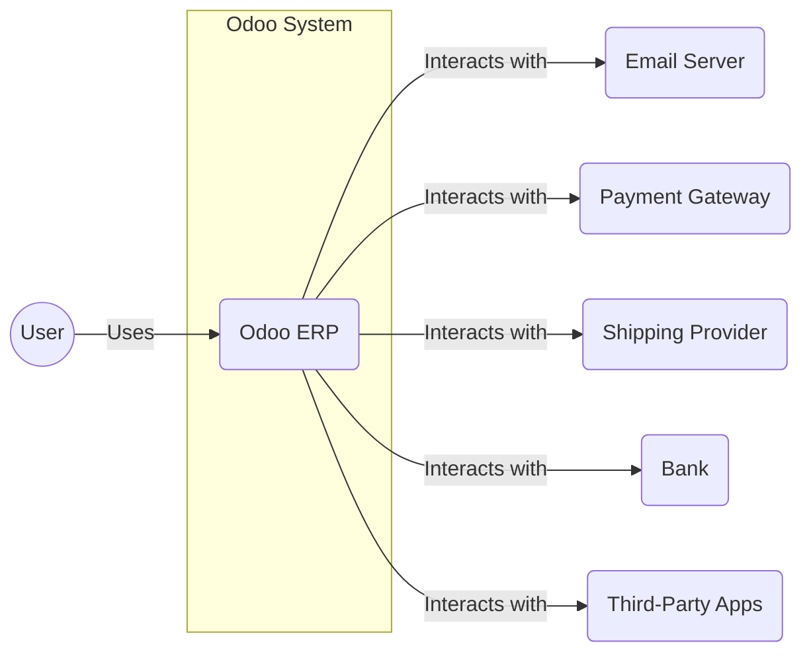
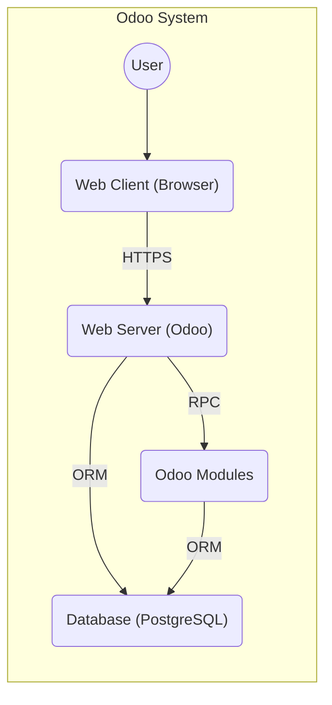
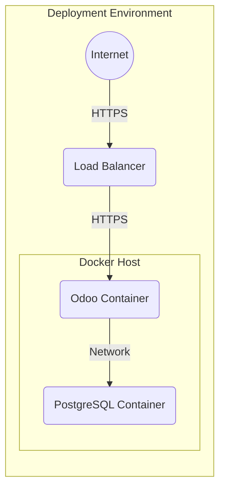
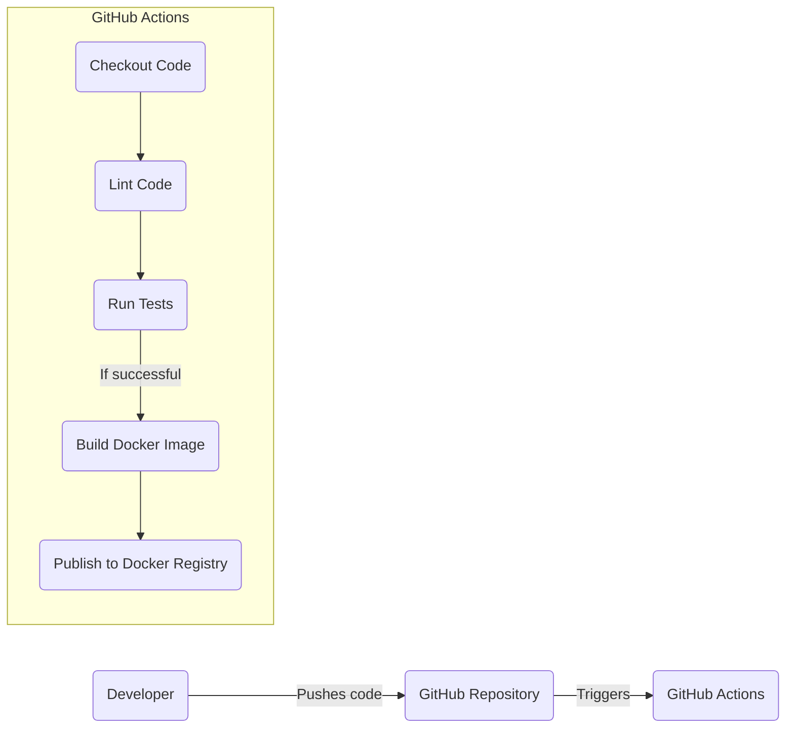

# BUSINESS POSTURE

Odoo is a large, established open-source ERP system. It's used by a wide variety of businesses, from small startups to large enterprises. This suggests a moderate risk tolerance, balancing the need for rapid development and feature releases with the stability and security requirements of their diverse customer base. The core business value is providing a comprehensive, customizable, and integrated suite of business applications.

Business Priorities:

*   Maintain a large and active open-source community.
*   Provide a stable and reliable platform for businesses of all sizes.
*   Offer a wide range of features and modules to cover diverse business needs.
*   Enable extensive customization and extensibility.
*   Ensure data integrity and security for users.
*   Maintain a competitive advantage in the ERP market.

Business Goals:

*   Increase user adoption and market share.
*   Expand the ecosystem of available modules and integrations.
*   Improve user experience and satisfaction.
*   Maintain a high level of code quality and security.
*   Reduce the risk of data breaches and system compromises.

Most Important Business Risks:

*   Data breaches or loss of customer data due to vulnerabilities in the core platform or third-party modules.
*   Reputational damage due to security incidents or system instability.
*   Loss of competitive advantage due to slow development or lack of innovation.
*   Legal and financial liabilities arising from data breaches or non-compliance.
*   Disruption of customer operations due to system outages or performance issues.

# SECURITY POSTURE

Existing Security Controls:

*   security control: Access control mechanisms (ACLs) to manage user permissions and data access. (Implemented in Odoo's security model, defined in `ir.model.access.csv` files and security rules).
*   security control: Input validation to prevent common web vulnerabilities like XSS and SQL injection. (Partially implemented, but requires careful attention in module development).
*   security control: Password hashing and salting to protect user credentials. (Implemented using the `passlib` library).
*   security control: Regular security updates and patches to address known vulnerabilities. (Provided through Odoo's update mechanism).
*   security control: Support for HTTPS to encrypt communication between the client and server. (Requires proper server configuration).
*   security control: Object-Relational Mapping (ORM) to help prevent SQL injection vulnerabilities. (Odoo's ORM provides a layer of abstraction over direct database queries).
*   security control: Session management to control user authentication and authorization. (Implemented in Odoo's web framework).
*   security control: Audit logging to track user activity and system events. (Available through Odoo's logging framework, but may require configuration).

Accepted Risks:

*   accepted risk: Reliance on third-party modules, which may have varying levels of security and quality.
*   accepted risk: Potential for misconfiguration of security settings by users or administrators.
*   accepted risk: Complexity of the codebase, which can make it difficult to identify and fix all vulnerabilities.
*   accepted risk: The open-source nature of the project, which makes the code publicly available for scrutiny (both by security researchers and malicious actors).

Recommended Security Controls:

*   Implement a comprehensive Web Application Firewall (WAF) to protect against common web attacks.
*   Conduct regular penetration testing and vulnerability assessments.
*   Implement a robust security training program for developers and administrators.
*   Enforce strong password policies and multi-factor authentication (MFA).
*   Implement a Content Security Policy (CSP) to mitigate XSS attacks.
*   Implement Subresource Integrity (SRI) to ensure that loaded resources haven't been tampered with.

Security Requirements:

*   Authentication:
    *   Support for strong password policies.
    *   Support for multi-factor authentication (MFA).
    *   Secure storage of user credentials (hashing and salting).
    *   Protection against brute-force attacks.
*   Authorization:
    *   Fine-grained access control mechanisms (ACLs).
    *   Role-based access control (RBAC).
    *   Ability to define custom security rules.
*   Input Validation:
    *   Validation of all user inputs to prevent common web vulnerabilities (XSS, SQL injection, etc.).
    *   Use of whitelisting rather than blacklisting where possible.
    *   Proper encoding of output to prevent XSS.
*   Cryptography:
    *   Use of strong, industry-standard cryptographic algorithms.
    *   Secure storage of cryptographic keys.
    *   Proper implementation of HTTPS.
    *   Protection of sensitive data in transit and at rest.

# DESIGN

## C4 CONTEXT

Element Descriptions:

*   Element:
    *   Name: User
    *   Type: Person
    *   Description: A person who interacts with the Odoo ERP system.
    *   Responsibilities: Accessing and using Odoo features, entering data, managing business processes.
    *   Security controls: Authentication, authorization, session management.

*   Element:
    *   Name: Odoo ERP
    *   Type: Software System
    *   Description: The core Odoo ERP system.
    *   Responsibilities: Providing a platform for managing various business processes, storing and processing data, interacting with external systems.
    *   Security controls: Access control, input validation, password hashing, session management, audit logging, ORM.

*   Element:
    *   Name: Email Server
    *   Type: External System
    *   Description: An external system used for sending and receiving emails.
    *   Responsibilities: Handling email communication.
    *   Security controls: Secure communication protocols (e.g., TLS), spam filtering, authentication.

*   Element:
    *   Name: Payment Gateway
    *   Type: External System
    *   Description: An external system used for processing online payments.
    *   Responsibilities: Handling payment transactions securely.
    *   Security controls: PCI DSS compliance, encryption, fraud prevention.

*   Element:
    *   Name: Shipping Provider
    *   Type: External System
    *   Description: An external system used for managing shipping and logistics.
    *   Responsibilities: Providing shipping rates, tracking information, and label generation.
    *   Security controls: Secure API communication, data encryption.

*   Element:
    *   Name: Bank
    *   Type: External System
    *   Description: An external system used for financial transactions.
    *   Responsibilities: Handling bank transfers, account reconciliation.
    *   Security controls: Secure communication protocols, strong authentication, fraud detection.

*   Element:
    *   Name: Third-Party Apps
    *   Type: External System
    *   Description: External applications that integrate with Odoo.
    *   Responsibilities: Providing additional functionality or integration with other systems.
    *   Security controls: Secure API communication, data validation, authentication.

## C4 CONTAINER

Element Descriptions:

*   Element:
    *   Name: Web Client (Browser)
    *   Type: Web Browser
    *   Description: The user's web browser.
    *   Responsibilities: Rendering the Odoo user interface, handling user interactions, communicating with the web server.
    *   Security controls: Browser security settings, HTTPS, CSP, SRI.

*   Element:
    *   Name: Web Server (Odoo)
    *   Type: Web Server
    *   Description: The Odoo web server, which handles HTTP requests and serves the Odoo application.
    *   Responsibilities: Handling user requests, routing requests to the appropriate modules, managing sessions, serving static files.
    *   Security controls: Access control, input validation, session management, HTTPS configuration.

*   Element:
    *   Name: Database (PostgreSQL)
    *   Type: Database
    *   Description: The PostgreSQL database, which stores Odoo's data.
    *   Responsibilities: Storing and retrieving data, ensuring data integrity.
    *   Security controls: Database access control, encryption at rest (if configured), regular backups.

*   Element:
    *   Name: Odoo Modules
    *   Type: Application Component
    *   Description: The various Odoo modules that provide specific business functionality.
    *   Responsibilities: Implementing business logic, interacting with the database, handling user requests.
    *   Security controls: Module-specific security rules, input validation, access control.

## DEPLOYMENT

Possible deployment solutions:

1.  Odoo.sh (Odoo's official cloud platform).
2.  Self-hosting on a dedicated server or VPS.
3.  Deployment using Docker containers.
4.  Deployment on a Kubernetes cluster.

Chosen solution: Deployment using Docker containers.

Element Descriptions:

*   Element:
    *   Name: Internet
    *   Type: Network
    *   Description: The public internet.
    *   Responsibilities: Providing connectivity to the deployment environment.
    *   Security controls: Firewall, intrusion detection/prevention systems.

*   Element:
    *   Name: Load Balancer
    *   Type: Load Balancer
    *   Description: A load balancer that distributes traffic across multiple Odoo instances.
    *   Responsibilities: Distributing traffic, handling SSL termination, providing high availability.
    *   Security controls: SSL/TLS configuration, DDoS protection, WAF (if configured).

*   Element:
    *   Name: Docker Host
    *   Type: Server
    *   Description: A server that runs Docker.
    *   Responsibilities: Hosting the Docker containers.
    *   Security controls: Operating system security, Docker security best practices, firewall.

*   Element:
    *   Name: Odoo Container
    *   Type: Docker Container
    *   Description: A Docker container running the Odoo application.
    *   Responsibilities: Running the Odoo web server and modules.
    *   Security controls: Container security best practices, minimal base image, regular image updates.

*   Element:
    *   Name: PostgreSQL Container
    *   Type: Docker Container
    *   Description: A Docker container running the PostgreSQL database.
    *   Responsibilities: Running the PostgreSQL database server.
    *   Security controls: Container security best practices, minimal base image, regular image updates, database access control.

## BUILD

The Odoo build process is complex due to its modular architecture and open-source nature. While there isn't a single, centralized build system, the following describes a common and secure approach using GitHub Actions for continuous integration and testing:

Build Process Description:

1.  Developer pushes code changes to the GitHub repository.
2.  GitHub Actions workflow is triggered.
3.  The workflow checks out the code.
4.  Code linters (e.g., Pylint, ESLint) are run to check for code style and potential errors.
5.  Automated tests (unit tests, integration tests) are executed.
6.  If tests pass, a Docker image is built.
7.  The Docker image is published to a Docker registry (e.g., Docker Hub, GitHub Container Registry).

Security Controls in Build Process:

*   security control: Code review: All code changes should be reviewed by at least one other developer before being merged.
*   security control: Linting: Linters help enforce code style and identify potential errors.
*   security control: Automated testing: Tests help ensure that code changes don't introduce regressions or vulnerabilities.
*   security control: Dependency management: Dependencies should be carefully managed and scanned for known vulnerabilities. Tools like `pip-audit` or Dependabot can be used.
*   security control: Docker image security: Use minimal base images, scan images for vulnerabilities, and regularly update images.
*   security control: Secure build environment: GitHub Actions provides a secure and isolated environment for building and testing code.
*   security control: Secrets management: Sensitive information (e.g., API keys, passwords) should be stored securely using GitHub Actions secrets.

# RISK ASSESSMENT

Critical Business Processes:

*   Sales and order management.
*   Customer relationship management (CRM).
*   Inventory management.
*   Accounting and finance.
*   Human resources management.
*   Manufacturing resource planning (MRP).
*   Project management.

Data Sensitivity:

*   Customer data (PII): Names, addresses, contact information, purchase history (High sensitivity).
*   Financial data: Transaction details, bank account information, credit card numbers (if stored, which is discouraged) (High sensitivity).
*   Employee data (PII): Names, addresses, contact information, social security numbers (High sensitivity).
*   Business data: Sales figures, inventory levels, marketing plans (Medium sensitivity).
*   System configuration data: Database credentials, API keys (High sensitivity).

# QUESTIONS & ASSUMPTIONS

Questions:

*   What specific third-party modules are commonly used with Odoo in this context?
*   What is the current level of security awareness and training among developers and administrators?
*   Are there any existing security policies or procedures in place?
*   What is the expected deployment environment (cloud, on-premise, hybrid)?
*   What is the budget for security tools and services?
*   What compliance requirements apply (e.g., GDPR, HIPAA, PCI DSS)?

Assumptions:

*   BUSINESS POSTURE: The organization has a moderate risk tolerance.
*   SECURITY POSTURE: Basic security controls are in place, but there is room for improvement.
*   DESIGN: The system will be deployed using Docker containers. The system will use a load balancer. The system will use a PostgreSQL database.