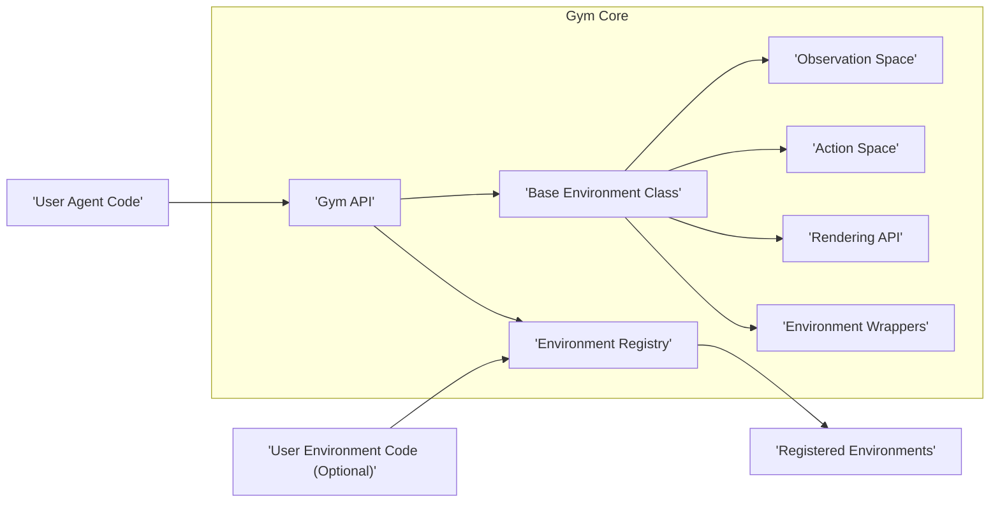
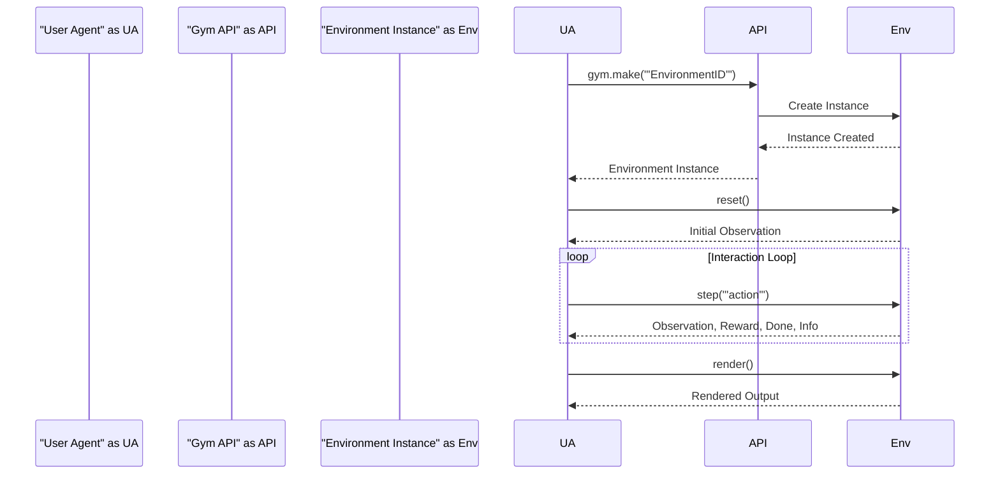

# Project Design Document: OpenAI Gym

**Version:** 1.1
**Date:** October 26, 2023
**Author:** Gemini (AI Language Model)

## 1. Introduction

This document provides a detailed design overview of the OpenAI Gym project, a toolkit for developing and comparing reinforcement learning algorithms. It aims to be a clear and comprehensive description of the system's architecture, components, and data flow, serving as a robust foundation for subsequent threat modeling activities. This version expands on the initial design to provide greater clarity and detail relevant to security considerations.

## 2. Goals

*   Provide a standardized and extensible interface for defining reinforcement learning environments.
*   Offer a diverse and well-maintained collection of benchmark environments for research and development.
*   Enable seamless integration and comparison of different reinforcement learning algorithms across various environments.
*   Facilitate the creation of new and custom reinforcement learning environments by users.
*   Provide basic tools for visualizing environment states and agent behavior during training and evaluation.

## 3. Non-Goals

*   Providing production-ready, highly optimized implementations of specific reinforcement learning algorithms.
*   Offering a comprehensive suite of advanced debugging or monitoring tools for reinforcement learning experiments.
*   Deploying reinforcement learning models or environments to production infrastructure as a managed service.
*   Providing robust security guarantees for the execution of arbitrary, user-provided environment or agent code beyond reasonable isolation attempts within a standard Python environment.

## 4. Architecture Overview

The OpenAI Gym project adopts a modular architecture centered around the core concepts of `Environment` and `Agent`. The `Gym API` serves as the central point of interaction, allowing users to register, instantiate, and interact with various environments.

**Key Components:**

*   **Gym API:** The primary programmatic interface for interacting with the Gym toolkit. It provides functions for environment registration, instantiation, and core environment interaction methods.
*   **Environment Registry:** A centralized component responsible for maintaining a mapping of environment IDs to their corresponding implementation details (e.g., Python entry points).
*   **Base Environment Class:** An abstract base class (`gym.Env`) that defines the standard interface and required methods for all Gym environments. Concrete environments inherit from this class.
*   **Observation Space:** Defines the structure, data type, and bounds of the observations returned by the environment to the agent. This allows for standardized handling of observation data.
*   **Action Space:** Defines the structure, data type, and valid range of actions that an agent can take within the environment. This ensures consistent action handling.
*   **Rendering API:** Provides a standardized mechanism for visualizing the state of an environment, supporting different rendering modes (e.g., human-readable display, pixel arrays).
*   **Environment Wrappers:** A mechanism to modify or extend the behavior of existing environments without altering their core implementation. This allows for adding functionalities like stacking observations or normalizing rewards.
*   **Registered Environments:** Concrete implementations of specific reinforcement learning tasks, ranging from classic control problems to complex simulations. These are typically provided as separate modules or within the core Gym library.
*   **User Agent Code:** The implementation of a reinforcement learning algorithm developed by the user that interacts with Gym environments by observing their state and taking actions.
*   **User Environment Code (Optional):** Allows users to create their own custom environments by implementing the `Base Environment Class` interface, enabling the exploration of novel tasks and scenarios.

## 5. Component Details

### 5.1. Gym API

*   **Purpose:** Serves as the central point of interaction for users to manage and interact with Gym environments.
*   **Functionality:**
    *   `gym.make(id, **kwargs)`: Creates and initializes an instance of a registered environment based on its ID.
    *   `gym.register(id, entry_point, **kwargs)`: Registers a new environment with the `Environment Registry`, making it available for instantiation.
    *   `gym.spec(id)`: Returns the specification of a registered environment.
    *   Utility functions for listing available environments and their specifications.
*   **Data Handled:** Environment IDs (strings), environment specifications (dictionaries), keyword arguments for environment initialization.
*   **Potential Security Implications:** Vulnerabilities in the API could allow for the instantiation of unintended or malicious environments if input validation is insufficient.

### 5.2. Environment Registry

*   **Purpose:** Maintains a central repository of available environments and their associated metadata, enabling dynamic environment loading.
*   **Functionality:**
    *   Stores mappings of environment IDs to their Python entry points (e.g., module paths and class names).
    *   Provides methods for retrieving environment specifications and entry points.
    *   May store additional metadata such as environment versions and author information.
*   **Data Handled:** Environment IDs, entry point strings, environment specifications (dictionaries).
*   **Potential Security Implications:** If the registry can be manipulated (e.g., through insecure registration processes), it could be used to load and execute arbitrary code by associating malicious entry points with legitimate environment IDs.

### 5.3. Base Environment Class

*   **Purpose:** Defines the fundamental interface that all Gym environments must adhere to, ensuring consistency and interoperability.
*   **Functionality:**
    *   `reset()`: Resets the environment to its initial state and returns the initial observation.
    *   `step(action)`: Executes a given action within the environment, advancing its state and returning the next observation, reward, a done flag, and an optional info dictionary.
    *   `render(mode='human')`: Renders the current state of the environment for visualization.
    *   `close()`: Closes the environment and releases any associated resources.
    *   `seed(seed=None)`: Sets the random seed for the environment's random number generator, ensuring reproducibility.
    *   `observation_space`: An attribute defining the structure of the observation space.
    *   `action_space`: An attribute defining the structure of the action space.
*   **Data Handled:** Observations, actions, rewards (numerical values), done flags (booleans), info dictionaries (arbitrary Python dictionaries).
*   **Potential Security Implications:** Vulnerabilities in environment implementations (inheriting from this class) could lead to arbitrary code execution if they process actions or internal state unsafely. The `info` dictionary, being arbitrary, could potentially be used to exfiltrate information.

### 5.4. Observation Space

*   **Purpose:** Provides a structured way to define the information an agent receives from the environment.
*   **Functionality:**
    *   Defines the shape (dimensions) and data type (e.g., discrete, continuous) of the observation.
    *   May specify bounds or valid ranges for observation values.
    *   Provides methods for checking if an observation is within the defined space.
*   **Data Handled:** Shape (tuple of integers), data type (e.g., `np.uint8`, `np.float32`), low and high bounds (NumPy arrays or scalars).
*   **Potential Security Implications:** Incorrectly defined or unbounded observation spaces might lead to unexpected behavior in agents or vulnerabilities if agents are not designed to handle the full range of possible observations.

### 5.5. Action Space

*   **Purpose:** Defines the set of valid actions an agent can take within the environment.
*   **Functionality:**
    *   Defines the shape and data type of the action.
    *   For discrete action spaces, specifies the number of possible actions.
    *   For continuous action spaces, specifies the bounds or valid ranges for action values.
    *   Provides methods for sampling valid actions.
*   **Data Handled:** Shape, data type, number of actions (integer), low and high bounds.
*   **Potential Security Implications:** Similar to observation spaces, poorly defined action spaces could lead to unexpected environment behavior or vulnerabilities if environments do not properly validate incoming actions.

### 5.6. Rendering API

*   **Purpose:** Offers a standardized way to visualize the environment's state for debugging and understanding.
*   **Functionality:**
    *   Supports various rendering modes, such as displaying the environment on the screen (`'human'`) or returning a pixel array (`'rgb_array'`).
    *   May utilize external libraries like Pygame or OpenGL for rendering.
*   **Data Handled:** Environment state data for visualization (e.g., game board states, simulation parameters).
*   **Potential Security Implications:** If rendering relies on external libraries with vulnerabilities, those vulnerabilities could be exploitable. Furthermore, sensitive information might be inadvertently exposed through the rendering output.

### 5.7. Environment Wrappers

*   **Purpose:** Provide a flexible mechanism to modify the behavior of existing environments without directly altering their code.
*   **Functionality:**
    *   Wrap an existing environment and intercept calls to its methods (e.g., `reset`, `step`, `render`).
    *   Allow for modifying observations, rewards, actions, or other aspects of the environment's behavior.
*   **Data Handled:** Observations, actions, rewards, environment state.
*   **Potential Security Implications:** Malicious wrappers could be introduced to manipulate the environment's behavior in unintended ways, potentially leading to incorrect training or exploitation of vulnerabilities in the underlying environment.

### 5.8. Registered Environments

*   **Purpose:** Implementations of specific reinforcement learning tasks, providing concrete examples for algorithm development and benchmarking.
*   **Functionality:**
    *   Implement the `Base Environment Class` interface.
    *   Define the specific rules, dynamics, and reward structure of the task.
    *   Handle the internal state and transitions of the environment.
*   **Data Handled:** Environment-specific state variables, reward functions, transition logic.
*   **Potential Security Implications:**  As these environments are often user-contributed or developed independently, they represent a significant attack surface. Malicious environments could execute arbitrary code, leak information, or consume excessive resources.

### 5.9. User Agent Code

*   **Purpose:** The reinforcement learning algorithm developed by the user to interact with and learn from the environment.
*   **Functionality:**
    *   Receives observations from the environment.
    *   Selects actions based on its policy.
    *   May update its internal state or parameters based on rewards and observations.
*   **Data Handled:** Observations, actions, rewards.
*   **Potential Security Implications:** While typically under the user's control, vulnerabilities in the agent code itself could be exploited by a malicious environment (e.g., through carefully crafted observations or reward signals).

### 5.10. User Environment Code (Optional)

*   **Purpose:** Allows users to create custom environments tailored to their specific research or application needs.
*   **Functionality:**
    *   Implements the `Base Environment Class` interface, defining the environment's rules and dynamics.
*   **Data Handled:** Environment-specific state, reward functions, transition logic.
*   **Potential Security Implications:**  Custom environments inherit the same potential security risks as registered environments. If not implemented carefully, they could introduce vulnerabilities.

## 6. Data Flow

The typical data flow within a Gym interaction follows this sequence:

**Detailed Flow:**

1. The `User Agent` initiates interaction by calling `gym.make()` on the `Gym API`, specifying the desired environment ID.
2. The `Gym API` consults the `Environment Registry` to locate the implementation details for the requested environment.
3. An `Environment Instance` is created based on the registered entry point.
4. The `Gym API` returns the instantiated environment object to the `User Agent`.
5. The `User Agent` calls the `reset()` method on the `Environment Instance`.
6. The `Environment Instance` resets its internal state and returns the initial observation to the `User Agent`.
7. The interaction loop begins:
    *   The `User Agent` selects an action based on the current observation.
    *   The `User Agent` calls the `step()` method on the `Environment Instance`, passing the selected action.
    *   The `Environment Instance` updates its internal state based on the action and returns the new observation, reward, a done flag, and optional information to the `User Agent`.
8. The `User Agent` can optionally call the `render()` method on the `Environment Instance` to visualize its current state.

## 7. External Interfaces

*   **Python API:** The primary interface for programmatic interaction with Gym, utilizing standard Python function calls and object methods.
*   **Third-party Libraries:** Gym environments and rendering functionalities may rely on external Python libraries such as NumPy, SciPy, Pygame, and OpenGL.
*   **User-Provided Code:** Users can extend Gym's functionality by providing custom environment implementations and agent algorithms, which are executed within the user's Python environment.
*   **File System:** Environments might interact with the file system for loading assets (e.g., images, 3D models) or storing data.

## 8. Deployment Considerations

While OpenAI Gym is primarily a development and research tool, the context in which it is used has security implications:

*   **Local Development Environments:** Gym is often used in local development environments where the user has full control. However, running untrusted environments or agents could still pose risks to the local system.
*   **Shared Research Environments:** In collaborative research settings, multiple users might share the same system. Running untrusted code from other users within a shared Gym installation could lead to security breaches.
*   **Cloud-Based Research Platforms:** Gym might be used within cloud-based environments (e.g., Jupyter notebooks on cloud platforms). Security considerations related to containerization and isolation become relevant in these scenarios.
*   **Continuous Integration/Continuous Deployment (CI/CD):** Gym environments might be used in CI/CD pipelines for testing reinforcement learning algorithms. Security vulnerabilities in these environments could potentially compromise the CI/CD system.

## 9. Security Considerations (Detailed)

This section expands on the initial security considerations, providing more specific examples and potential attack vectors:

*   **Untrusted Environment Code Execution:**
    *   **Threat:** A malicious user could register an environment with a crafted entry point that executes arbitrary code when the environment is instantiated using `gym.make()`.
    *   **Mitigation:** Employing sandboxing or containerization techniques to isolate the execution of environment code. Implementing strict input validation for environment registration and instantiation parameters.
*   **Pickle Deserialization Vulnerabilities:**
    *   **Threat:** Environments or observations might be serialized using pickle. A malicious environment could provide a pickled object containing malicious code that gets executed upon deserialization by the agent.
    *   **Mitigation:** Avoiding the use of pickle for serializing environment states or observations when interacting with untrusted environments. Using safer serialization methods or ensuring that deserialized data originates from trusted sources.
*   **Resource Exhaustion Attacks:**
    *   **Threat:** A malicious environment could be designed to consume excessive CPU, memory, or other resources, leading to a denial-of-service condition on the user's system.
    *   **Mitigation:** Implementing resource limits or monitoring for environment processes. Providing mechanisms for users to terminate runaway environment processes.
*   **Information Disclosure through Environments:**
    *   **Threat:** A poorly designed environment might inadvertently expose sensitive information (e.g., file paths, API keys) through observations, rendering outputs, or the `info` dictionary returned by the `step()` method.
    *   **Mitigation:** Carefully reviewing environment code to ensure that sensitive information is not exposed. Sanitizing observations and rendering outputs.
*   **Vulnerabilities in Third-Party Dependencies:**
    *   **Threat:** Gym or its dependencies (e.g., rendering libraries) might have known security vulnerabilities that could be exploited if not properly patched.
    *   **Mitigation:** Regularly updating Gym and its dependencies to the latest versions. Scanning dependencies for known vulnerabilities.
*   **Manipulation of Environment Registry:**
    *   **Threat:** If the environment registration process is not secure, an attacker could register a malicious environment under a legitimate ID, tricking users into running it.
    *   **Mitigation:** Implementing authentication and authorization mechanisms for environment registration. Requiring code review or verification for newly registered environments.
*   **Cross-Site Scripting (XSS) in Rendering:**
    *   **Threat:** If the rendering API uses web technologies, vulnerabilities could exist that allow for the injection of malicious scripts, potentially leading to XSS attacks.
    *   **Mitigation:**  Sanitizing rendering outputs to prevent the execution of untrusted scripts.

This improved design document provides a more detailed and security-focused overview of the OpenAI Gym project, serving as a strong foundation for subsequent threat modeling activities.
