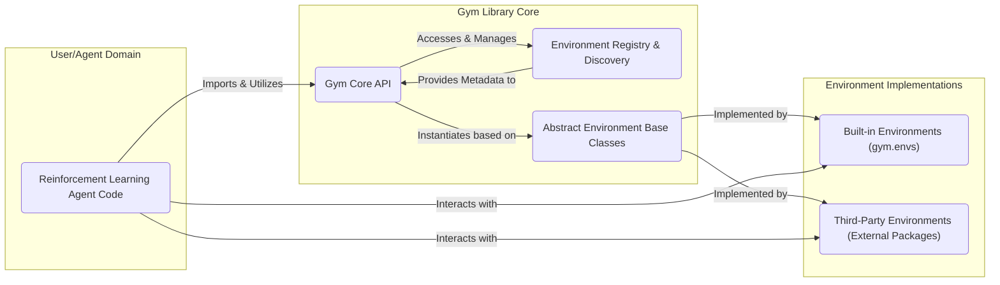
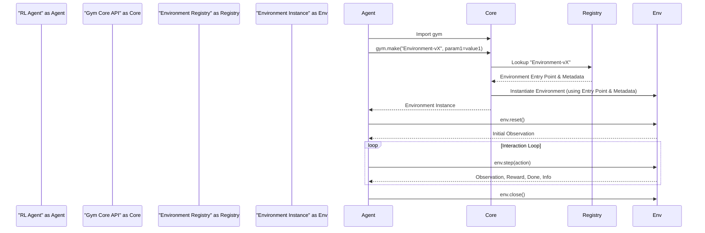

# Project Design Document: OpenAI Gym - Improved

**Version:** 1.1
**Date:** October 26, 2023
**Author:** AI Architecture Expert

## 1. Introduction

This document provides an enhanced design overview of the OpenAI Gym project, an open-source Python library crucial for developing and comparing reinforcement learning algorithms. Building upon the initial design, this version offers a more detailed exploration of the project's architecture, components, and data flow, specifically tailored to facilitate comprehensive threat modeling.

## 2. Goals

The primary goals of the OpenAI Gym project are:

*   **Standardization:** To establish a uniform interface for interacting with a diverse range of reinforcement learning environments, promoting interoperability and reducing development friction.
*   **Accessibility:** To democratize reinforcement learning research by providing a readily available collection of benchmark environments, lowering the barrier to entry for researchers and practitioners.
*   **Reproducibility:** To enhance the rigor of reinforcement learning research by offering well-defined and consistent environments, enabling the reliable replication of experimental results.
*   **Ease of Use:** To provide a simple, intuitive, and Pythonic API for seamless interaction with various environments, minimizing the learning curve for new users.
*   **Extensibility:** To empower users to effortlessly create and integrate their own custom environments, fostering innovation and catering to specialized research needs.

## 3. Non-Goals

This design document explicitly excludes the following aspects, as they fall outside the core responsibilities of the Gym library:

*   **Reinforcement Learning Algorithm Implementations:** Gym's focus is strictly on providing environments; it does not offer pre-built or recommended reinforcement learning algorithms.
*   **Distributed Training Infrastructure:** Gym does not inherently provide tools or infrastructure for scaling training across multiple machines or processing units.
*   **Deployment of Trained Agents:** Gym is primarily intended for development and research purposes, not for deploying trained agents into production systems.
*   **Specific Cloud Provider Integrations:** While Gym can be utilized within cloud environments, it lacks explicit, built-in integrations with specific cloud platforms or services.
*   **Security Auditing of User-Created Environments:** Gym provides the framework for environment creation, but the security assessment and maintenance of these custom environments are the sole responsibility of their creators.

## 4. High-Level Architecture

The OpenAI Gym project's architecture can be visualized as a collaborative ecosystem involving several key components:

*   **User/Agent Domain:** Represents the user's code where reinforcement learning agents are implemented and interact with Gym environments.
*   **Gym Library Core:** The central part of the Gym library, providing the fundamental API and mechanisms for environment management.
    *   **Gym Core API:** Exposes the primary functions for environment interaction (e.g., `gym.make()`, `env.step()`, `env.reset()`).
    *   **Environment Registry & Discovery:**  Manages the catalog of available environments, facilitating their discovery and instantiation.
    *   **Abstract Environment Base Classes:** Defines the standardized interface that all Gym environments must adhere to.
*   **Environment Implementations:** The actual implementations of various reinforcement learning environments.
    *   **Built-in Environments (`gym.envs`):** A collection of environments included directly within the Gym library.
    *   **Third-Party Environments (External Packages):** Environments created and maintained by the community, typically distributed as separate Python packages.

## 5. Component Details

### 5.1. Gym Core API

*   **Functionality:**
    *   Provides the primary programmatic interface for users to create, interact with, and manage reinforcement learning environments.
    *   Handles the process of looking up and instantiating environments based on their registered IDs.
    *   Manages the lifecycle of environment instances, from creation to cleanup.
    *   Offers utility functions for working with observation spaces and action spaces, ensuring type consistency and validation.
*   **Key Modules & Functions:**
    *   `gym.make(id, **kwargs)`:  The central function for creating an environment instance based on its ID.
    *   `env.step(action)`: Executes an action within the environment and returns the resulting observation, reward, done flag, and informational dictionary.
    *   `env.reset()`: Resets the environment to its initial state, returning the initial observation.
    *   `env.render(mode='human')`: Provides a visual representation of the environment's current state.
    *   `env.close()`: Releases any resources held by the environment instance.
    *   `gym.spaces`:  Defines classes for representing different types of observation and action spaces (e.g., `Discrete`, `Box`, `MultiDiscrete`, `MultiBinary`).
    *   `gym.wrappers`:  A collection of classes that modify the behavior of existing environments, such as adding frame stacking or reward scaling.

### 5.2. Environment Registry & Discovery

*   **Functionality:**
    *   Acts as a central repository for information about all available Gym environments, both built-in and third-party.
    *   Maintains a mapping between unique environment IDs (strings) and the corresponding Python entry points (functions or classes) responsible for creating environment instances.
    *   Allows users and external packages to register new custom environments, making them discoverable and usable within the Gym ecosystem.
    *   Provides mechanisms for listing and searching available environments based on various criteria.
*   **Data Stored:**
    *   **Environment ID:** A unique string identifier for the environment (e.g., "CartPole-v1", "MountainCar-v0").
    *   **Entry Point:** A Python callable (function or class) that, when invoked, returns an instance of the environment.
    *   **Optional Keyword Arguments (`kwargs`):**  A dictionary of keyword arguments that can be passed to the environment's constructor during instantiation.
    *   **Optional Metadata:**  Additional information about the environment, such as its author, description, and whether it is considered deterministic or stochastic.

### 5.3. Abstract Environment Base Classes

*   **Functionality:**
    *   Defines the fundamental interface and contract that all concrete Gym environment implementations must adhere to.
    *   Ensures a consistent and predictable way for reinforcement learning agents to interact with different environments, regardless of their underlying implementation.
    *   Provides abstract methods that must be implemented by concrete environment classes, enforcing a standardized structure.
*   **Key Abstract Methods (defined in `gym.Env`):**
    *   `step(action)`:  Abstract method for executing an action in the environment.
    *   `reset()`: Abstract method for resetting the environment to its initial state.
    *   `render(mode='human')`: Abstract method for rendering the environment.
    *   `close()`: Abstract method for releasing environment resources.
    *   `seed(seed=None)`: Abstract method for setting the random seed of the environment.
    *   `observation_space`: An attribute defining the structure of the environment's observations.
    *   `action_space`: An attribute defining the structure of the environment's actions.

### 5.4. Built-in Environments (`gym.envs`)

*   **Functionality:**
    *   Provides a curated collection of commonly used and well-established reinforcement learning environments directly within the Gym library.
    *   Serves as a set of benchmark tasks for evaluating and comparing the performance of different reinforcement learning algorithms.
    *   Offers examples and templates for developers who want to create their own custom environments.
*   **Categorization:**
    *   **Classic Control:**  Simple, well-defined control problems with continuous or discrete action spaces (e.g., `CartPole-v1`, `MountainCar-v0`, `Acrobot-v1`).
    *   **Algorithmic:** Environments based on algorithmic tasks, often used for testing the ability of agents to learn specific patterns or procedures (e.g., `Copy-v0`, `RepeatCopy-v0`, `ReversedAddition-v0`).
    *   **Atari:**  Interfaces to a suite of Atari 2600 video games, providing challenging high-dimensional observation spaces.
    *   **Board Games:** Environments for playing classic board games against an opponent or a fixed strategy (e.g., `GoEnv`, `ChessEnv`).
    *   **Box2D:** Physics simulation environments based on the Box2D physics engine (e.g., `BipedalWalker-v3`, `LunarLanderContinuous-v2`).
    *   **Mujoco:** More advanced physics simulation environments powered by the MuJoCo physics engine (requires a separate license).

### 5.5. Third-Party Environments (External Packages)

*   **Functionality:**
    *   Extends the range of available Gym environments beyond those included in the core library.
    *   Allows researchers and developers to create and share specialized environments tailored to their specific research domains or applications.
    *   Fosters a collaborative ecosystem where the community can contribute and benefit from a wider variety of tasks and challenges.
*   **Integration Mechanism:**
    *   Third-party environments are typically packaged as separate Python packages that can be installed using standard Python package managers like `pip`.
    *   These packages register their environments with the Gym Environment Registry using the `gym.register()` function, making them accessible through the standard `gym.make()` interface.

## 6. Data Flow

The interaction between a reinforcement learning agent and a Gym environment follows a well-defined sequence:

1. **Import Gym:** The reinforcement learning agent's code begins by importing the `gym` library to access its functionalities.
2. **Make Environment:** The agent calls `gym.make(environment_id, **kwargs)` to request the creation of a specific environment instance, potentially providing initialization parameters.
3. **Lookup Environment:** The Gym Core API consults the Environment Registry to retrieve the necessary information (entry point and metadata) for the requested environment ID.
4. **Return Entry Point & Metadata:** The Environment Registry provides the Gym Core API with the entry point (how to create the environment) and any associated metadata.
5. **Instantiate Environment:** The Gym Core API uses the retrieved entry point and metadata to create an instance of the desired environment class.
6. **Return Environment Instance:** The instantiated environment object is returned to the reinforcement learning agent.
7. **Reset Environment:** The agent calls the `env.reset()` method to initialize the environment to its starting state and receive the initial observation.
8. **Interaction Loop:** The agent interacts with the environment in a loop:
    *   The agent calls `env.step(action)`, providing an action to be executed within the environment.
    *   The environment processes the action and returns the next observation, the reward received for the action, a boolean flag indicating whether the episode has terminated (`done`), and an optional dictionary containing additional information (`info`).
9. **Close Environment:** Once the interaction is complete (e.g., the episode ends or the agent finishes its task), the agent calls `env.close()` to release any resources held by the environment instance.

## 7. Security Considerations (Pre-Threat Modeling)

Given Gym's role in executing potentially arbitrary code within environment implementations, several security considerations are paramount:

*   **Execution of Untrusted Code (Third-Party Environments):**  A primary concern is the potential for malicious code within user-provided or third-party environments. When an environment is instantiated or its methods are called (e.g., `step`, `reset`), this code is executed within the user's Python environment, potentially leading to:
    *   **Arbitrary Code Execution:** Malicious environments could execute arbitrary commands on the user's system.
    *   **Data Exfiltration:** Sensitive data from the user's machine could be accessed and transmitted.
    *   **System Compromise:** The user's system could be compromised or taken over.
*   **Dependency Vulnerabilities:** Gym and its environments rely on various third-party libraries. Vulnerabilities in these dependencies could be exploited if not properly managed and updated, potentially allowing attackers to compromise the user's environment.
*   **Pickle/Serialization Risks:** Environments might use Python's `pickle` module or other serialization mechanisms to save or load internal states. Deserializing data from untrusted sources can lead to arbitrary code execution vulnerabilities.
*   **Resource Exhaustion and Denial of Service (Local):** Maliciously crafted environments could be designed to consume excessive computational resources (CPU, memory, disk space), leading to performance degradation or denial of service on the user's local machine.
*   **Information Disclosure through Environments:**  Environments might unintentionally or maliciously expose sensitive information through the observation space, the reward signal, or the `info` dictionary.
*   **Supply Chain Attacks on Third-Party Environments:** If third-party environment packages are obtained from compromised or untrusted sources (e.g., malicious PyPI packages), they could contain malware or vulnerabilities.
*   **Namespace Pollution and Conflicts:** Poorly designed environments might introduce naming conflicts or pollute the user's namespace, potentially interfering with other parts of their code.

## 8. Assumptions and Constraints

*   **User Awareness of Risks:** It is assumed that users are aware of the potential risks associated with running code from untrusted sources, particularly when using third-party environments.
*   **Standard Python Environment:** Gym is primarily designed to operate within a standard Python environment with access to common system resources.
*   **Optional Network Access:** Some environments may require network access for specific functionalities (e.g., downloading assets, connecting to external services). This is environment-dependent and should be documented by the environment provider.
*   **Computational Resource Availability:** Running Gym environments requires sufficient computational resources (CPU, memory, potentially GPU). The specific requirements vary significantly depending on the complexity of the environment.

## 9. Future Considerations

*   **Sandboxing and Isolation of Environments:** Investigating and implementing mechanisms to sandbox or isolate the execution of environment code, limiting the potential impact of malicious or buggy environments. This could involve using containerization technologies or virtual machines.
*   **Enhanced Security Auditing and Guidelines:** Establishing more rigorous security auditing processes for the core Gym library and providing clear guidelines and best practices for developers creating third-party environments to minimize security risks.
*   **Improved Dependency Management and Security Scanning:** Implementing stricter dependency management practices, including the use of dependency pinning and security scanning tools to identify and mitigate vulnerabilities in dependencies.
*   **Standardized Security Metadata for Environments:**  Expanding the metadata associated with environments to include security-related information, such as declared dependencies, potential security risks, and recommended usage guidelines.
*   **Formal Verification of Environment Code:** Exploring techniques for formally verifying the behavior and security properties of environment implementations, although this is a challenging task.

This improved design document provides a more in-depth understanding of the OpenAI Gym project's architecture and potential security considerations. This enhanced detail will be invaluable for conducting a comprehensive threat modeling exercise, allowing for a more thorough identification and mitigation of potential risks.