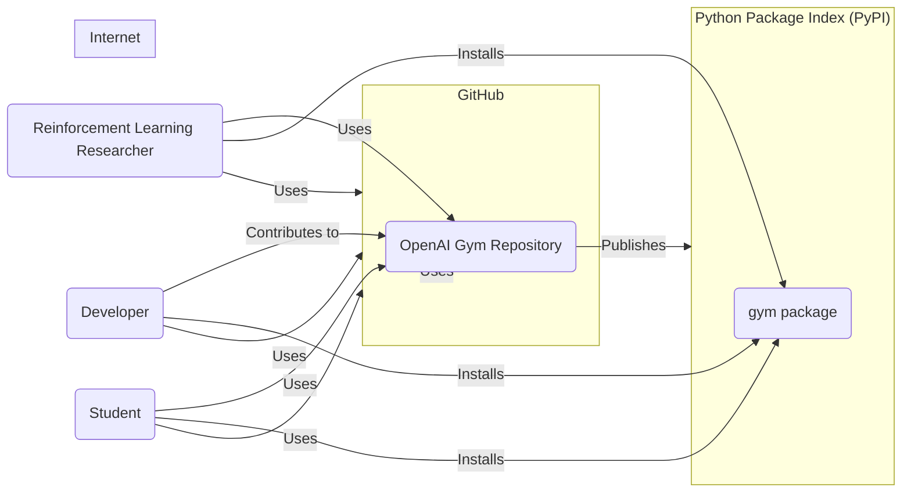
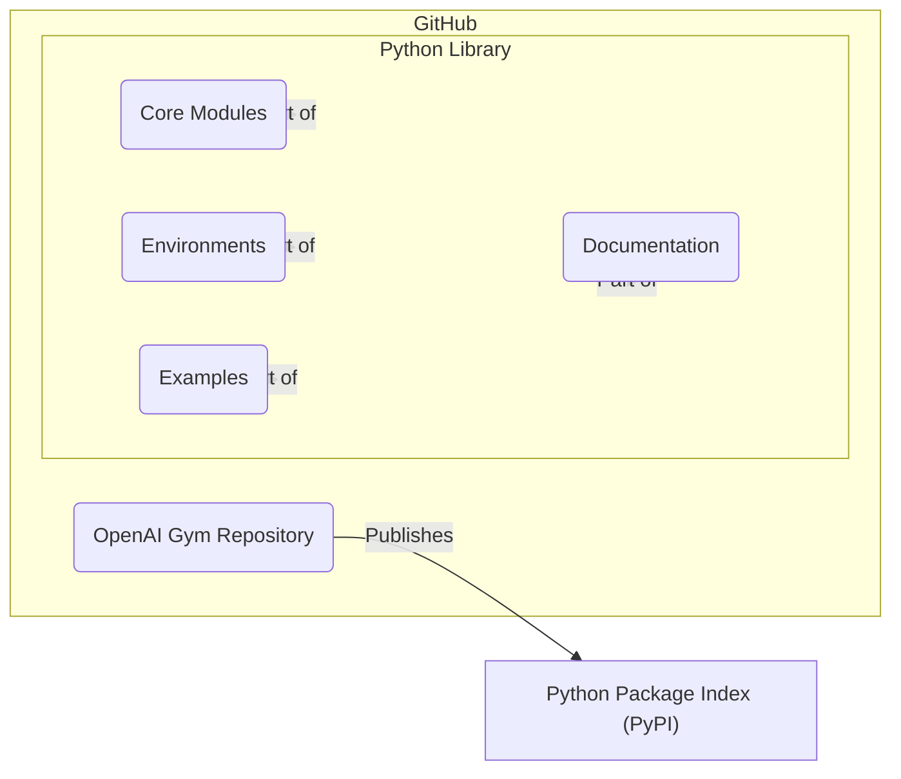
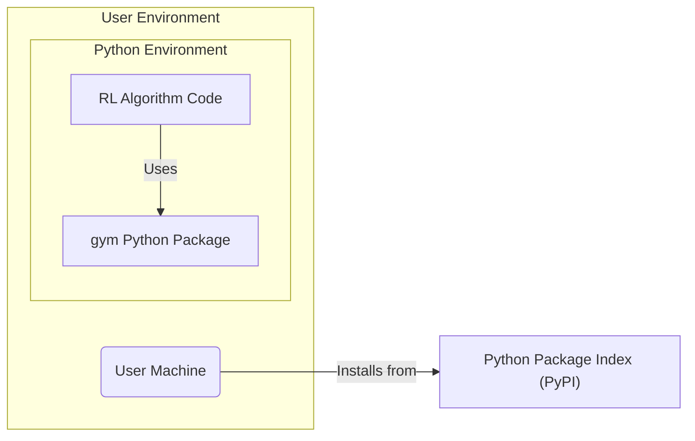
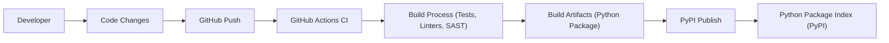

# BUSINESS POSTURE

- Business Priorities and Goals:
  - Goal: To provide a widely accessible and standardized toolkit for developing and comparing reinforcement learning algorithms.
  - Priority: Ease of use for researchers and developers.
  - Priority: Broad range of environments to support diverse research areas.
  - Priority: Performance and efficiency of the library and environments.
  - Priority: Community contributions and extensibility.
- Business Risks:
  - Risk: Vulnerabilities in the library could lead to incorrect research results or security issues in systems using the library.
  - Risk: Availability issues with the library or its distribution channels could disrupt research workflows.
  - Risk: Malicious contributions could introduce vulnerabilities or backdoors into the library.
  - Risk: Lack of maintenance and updates could lead to the library becoming outdated and insecure.

# SECURITY POSTURE

- Existing Security Controls:
  - security control: GitHub repository access control to manage who can contribute code. Implemented in: GitHub repository settings.
  - security control: Code review process for pull requests. Implemented in: GitHub pull request workflow.
  - security control: Public vulnerability reporting through GitHub. Implemented in: GitHub repository security policy (if defined) and issue tracker.
- Accepted Risks:
  - accepted risk: As an open-source project, vulnerabilities may be publicly disclosed before a patch is available.
  - accepted risk: Reliance on community contributions introduces a risk of unintentionally or intentionally malicious code.
  - accepted risk: Security testing might be less rigorous compared to commercial software due to resource constraints.
- Recommended Security Controls:
  - security control: Implement automated vulnerability scanning for dependencies and code.
  - security control: Introduce static analysis security testing (SAST) in the CI/CD pipeline.
  - security control: Define and enforce a clear security policy for contributions, including guidelines for secure coding practices.
  - security control: Regularly review and update dependencies to address known vulnerabilities.
  - security control: Implement a process for security incident response and vulnerability disclosure.
- Security Requirements:
  - Authentication:
    - Requirement: Authentication is required for contributors to the repository to manage code changes.
    - Requirement: Authentication is required for maintainers to manage the project and releases.
  - Authorization:
    - Requirement: Authorization is needed to control access to repository resources (code, issues, pull requests).
    - Requirement: Authorization is needed to manage releases and package publishing.
  - Input Validation:
    - Requirement: Environment definitions should be validated to prevent unexpected behavior or vulnerabilities.
    - Requirement: User inputs to environments (actions, observations) should be validated to prevent unexpected behavior or vulnerabilities within environments.
  - Cryptography:
    - Requirement: Cryptography might be relevant for specific environments that involve secure communication or data handling, but is not a core requirement for the library itself. Consider if any environments require secure storage or transmission of sensitive data.

# DESIGN

- C4 CONTEXT

- C4 CONTEXT Elements:
  - Element:
    - Name: Reinforcement Learning Researcher
    - Type: User
    - Description: Researchers who use OpenAI Gym to develop and test reinforcement learning algorithms.
    - Responsibilities: Utilize OpenAI Gym environments and library to conduct research, develop new algorithms, and compare performance.
    - Security controls: Responsible for using the library securely in their research environments, ensuring data and computational resources are protected.
  - Element:
    - Name: Developer
    - Type: User/Contributor
    - Description: Software developers who contribute to the OpenAI Gym project by adding new environments, features, or bug fixes.
    - Responsibilities: Contribute high-quality, secure code to the project, following project guidelines and security best practices.
    - Security controls: Authentication and authorization via GitHub for code contributions, adherence to secure coding practices, participation in code review.
  - Element:
    - Name: Student
    - Type: User
    - Description: Students learning reinforcement learning who use OpenAI Gym for educational purposes and to understand RL concepts.
    - Responsibilities: Use OpenAI Gym to learn and experiment with reinforcement learning, understand the library's functionalities and limitations.
    - Security controls: Responsible for using the library safely in their learning environments, understanding basic security considerations when using software.
  - Element:
    - Name: OpenAI Gym Repository
    - Type: Software System
    - Description: The GitHub repository containing the source code, environment definitions, documentation, and examples for the OpenAI Gym toolkit.
    - Responsibilities: Host the project codebase, manage contributions, facilitate collaboration, and provide a platform for issue tracking and project management.
    - Security controls: GitHub access controls, code review process, issue tracking for vulnerability reporting, potentially GitHub Advanced Security features (if enabled).
  - Element:
    - Name: Python Package Index (PyPI)
    - Type: External System
    - Description: The public repository for Python packages, used to distribute the 'gym' package.
    - Responsibilities: Host and distribute the 'gym' Python package, ensuring availability and integrity of the package.
    - Security controls: PyPI's infrastructure security, package signing (if implemented by OpenAI Gym), vulnerability scanning of packages on PyPI.

- C4 CONTAINER

- C4 CONTAINER Elements:
  - Element:
    - Name: Python Library
    - Type: Container
    - Description: The core Python package of OpenAI Gym, containing all the necessary modules, environment definitions, examples, and documentation.
    - Responsibilities: Provide the core functionalities of OpenAI Gym, including environment interfaces, environment implementations, example usage, and user documentation.
    - Security controls: Code review, static analysis security testing (SAST), dependency vulnerability scanning, secure coding practices.
  - Element:
    - Name: Core Modules
    - Type: Component
    - Description: Python modules containing the core logic of the Gym library, such as environment registration, API definitions, and base classes.
    - Responsibilities: Implement the fundamental functionalities of the Gym library, manage environment lifecycle, and provide the API for interacting with environments.
    - Security controls: Input validation, secure coding practices, unit and integration testing.
  - Element:
    - Name: Environments
    - Type: Component
    - Description: A collection of Python modules defining various reinforcement learning environments (e.g., Atari, classic control, robotics).
    - Responsibilities: Implement specific environment dynamics, observation spaces, action spaces, and reward functions.
    - Security controls: Input validation for environment parameters and user actions, secure implementation of environment logic to prevent exploits, environment sandboxing if necessary.
  - Element:
    - Name: Examples
    - Type: Component
    - Description: Example scripts and notebooks demonstrating how to use OpenAI Gym to train and evaluate reinforcement learning agents.
    - Responsibilities: Provide practical examples for users to learn and get started with OpenAI Gym, showcase different environments and algorithms.
    - Security controls: Examples should follow secure coding practices to avoid demonstrating vulnerable patterns.
  - Element:
    - Name: Documentation
    - Type: Component
    - Description: User guides, API documentation, and tutorials for OpenAI Gym, hosted within the repository and potentially on external documentation platforms.
    - Responsibilities: Provide comprehensive and up-to-date documentation for users to understand and use the library effectively.
    - Security controls: Documentation should not contain misleading or insecure advice, ensure documentation website security if hosted externally.

- DEPLOYMENT

- DEPLOYMENT Elements:
  - Element:
    - Name: User Machine
    - Type: Infrastructure
    - Description: The local computer or server used by a researcher, developer, or student to run reinforcement learning experiments and use OpenAI Gym.
    - Responsibilities: Provide the computational resources to execute Python code, run RL algorithms, and simulate OpenAI Gym environments.
    - Security controls: User's responsibility to secure their own machine, including operating system security, network security, and access controls.
  - Element:
    - Name: Python Environment
    - Type: Runtime Environment
    - Description: A Python runtime environment on the user's machine where OpenAI Gym and RL algorithms are installed and executed.
    - Responsibilities: Provide the necessary Python interpreter and libraries to run OpenAI Gym and RL code.
    - Security controls: Keeping Python environment and packages up-to-date with security patches, using virtual environments to isolate projects.
  - Element:
    - Name: gym Python Package
    - Type: Software Component
    - Description: The installed OpenAI Gym Python library within the user's Python environment.
    - Responsibilities: Provide the OpenAI Gym functionalities to the user's RL algorithms.
    - Security controls: Package integrity verification during installation (e.g., using pip's hash checking), vulnerability scanning of installed packages.
  - Element:
    - Name: RL Algorithm Code
    - Type: Software Component
    - Description: The reinforcement learning algorithm code developed by the user, which utilizes the OpenAI Gym library.
    - Responsibilities: Implement the RL algorithm logic, interact with OpenAI Gym environments, and process observations and actions.
    - Security controls: Developer's responsibility to write secure and robust RL algorithm code, handle data and environment interactions securely.

- BUILD

- BUILD Elements:
  - Element:
    - Name: Developer
    - Type: Actor
    - Description: Software developers contributing to the OpenAI Gym project.
    - Responsibilities: Write code, fix bugs, add features, and contribute to the project following coding standards and security guidelines.
    - Security controls: Secure development practices, code review participation, authentication and authorization for code contributions.
  - Element:
    - Name: Code Changes
    - Type: Data
    - Description: Modifications to the source code of OpenAI Gym, including new features, bug fixes, and environment definitions.
    - Responsibilities: Represent the changes being introduced to the codebase.
    - Security controls: Version control using Git, code review to ensure code quality and security.
  - Element:
    - Name: GitHub Push
    - Type: Action
    - Description: The action of pushing code changes to the GitHub repository.
    - Responsibilities: Committing and pushing code changes to trigger the CI/CD pipeline.
    - Security controls: Authentication and authorization via GitHub for pushing code.
  - Element:
    - Name: GitHub Actions CI
    - Type: Automation System
    - Description: GitHub's built-in CI/CD service used to automate the build, test, and release process for OpenAI Gym.
    - Responsibilities: Automate the build process, run tests, perform security checks, and prepare release artifacts.
    - Security controls: Secure configuration of CI/CD pipelines, access control to CI/CD workflows, secrets management for credentials, logging and monitoring of CI/CD activities.
  - Element:
    - Name: Build Process (Tests, Linters, SAST)
    - Type: Process
    - Description: The automated build process within GitHub Actions, including running unit tests, code linters, and static analysis security testing (SAST).
    - Responsibilities: Ensure code quality, identify potential bugs and vulnerabilities, and enforce coding standards.
    - Security controls: SAST tools to detect security vulnerabilities, linters to enforce coding standards, comprehensive test suite to verify functionality and security aspects.
  - Element:
    - Name: Build Artifacts (Python Package)
    - Type: Artifact
    - Description: The packaged Python distribution of OpenAI Gym, ready for publishing to PyPI.
    - Responsibilities: Represent the distributable version of the library.
    - Security controls: Package signing to ensure integrity and authenticity, vulnerability scanning of dependencies included in the package.
  - Element:
    - Name: PyPI Publish
    - Type: Action
    - Description: The action of publishing the built Python package to the Python Package Index (PyPI).
    - Responsibilities: Make the OpenAI Gym package available for public download and installation via pip.
    - Security controls: Secure credentials management for PyPI publishing, verification of package integrity before publishing, PyPI's security controls for package hosting.
  - Element:
    - Name: Python Package Index (PyPI)
    - Type: External System
    - Description: The public repository for Python packages, used to distribute the 'gym' package.
    - Responsibilities: Host and distribute the 'gym' Python package, ensuring availability and integrity of the package.
    - Security controls: PyPI's infrastructure security, package signing (if implemented by OpenAI Gym), vulnerability scanning of packages on PyPI.

# RISK ASSESSMENT

- Critical Business Processes:
  - Process: Facilitating reinforcement learning research and development.
  - Process: Maintaining the integrity and availability of the OpenAI Gym library.
  - Process: Ensuring the security and reliability of environments provided by the library.
- Data to Protect:
  - Data: OpenAI Gym library source code.
    - Sensitivity: Publicly available, but integrity and availability are critical.
  - Data: Environment definitions and implementations.
    - Sensitivity: Publicly available, but integrity and correctness are crucial for research validity.
  - Data: User contributions (code, issues, pull requests).
    - Sensitivity: Publicly available, but integrity and authenticity are important.
  - Data: Build and release artifacts (Python packages).
    - Sensitivity: Publicly available, but integrity and authenticity are critical for secure distribution.

# QUESTIONS & ASSUMPTIONS

- BUSINESS POSTURE:
  - Assumption: The primary goal is to support the research community and make the library widely accessible.
  - Assumption: Performance and ease of use are key priorities.
  - Question: Are there any specific commercial use cases or enterprise adoption plans that would change the business risk profile?
  - Question: What is the acceptable level of risk regarding potential vulnerabilities in the library?

- SECURITY POSTURE:
  - Assumption: Current security controls are primarily focused on GitHub's built-in features and code review.
  - Assumption: The project is open to community contributions and relies on the community for vulnerability reporting.
  - Question: Are there any plans to implement more advanced security measures, such as GitHub Advanced Security or dedicated security audits?
  - Question: What is the process for handling and responding to security vulnerabilities reported by the community?

- DESIGN:
  - Assumption: The project is primarily a Python library distributed via PyPI.
  - Assumption: Deployment is mainly on user machines for research and development purposes.
  - Question: Are there any plans to introduce web-based interfaces or cloud deployments for OpenAI Gym environments in the future?
  - Question: Are there any specific environments that handle sensitive data or require additional security considerations beyond the core library?