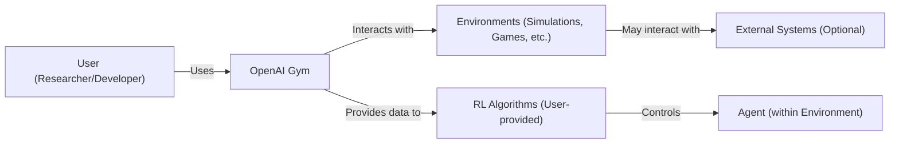
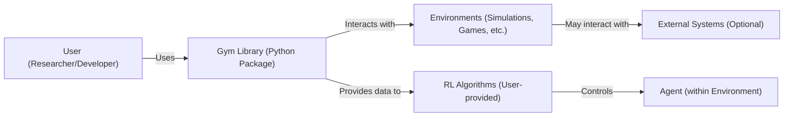
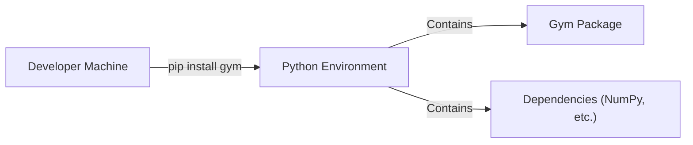
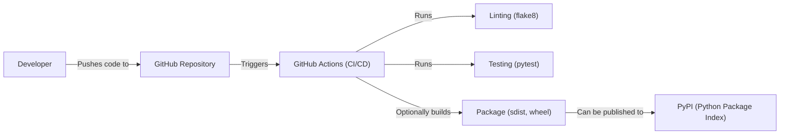

Okay, let's create a design document for the OpenAI Gym project, keeping in mind its purpose and potential security considerations.

# BUSINESS POSTURE

OpenAI Gym is a toolkit for developing and comparing reinforcement learning (RL) algorithms.  It provides a standardized interface for connecting learning agents to environments (simulations or real-world interactions).  The primary business goals are:

*   Facilitate research and development in reinforcement learning.
*   Provide a common benchmark for comparing different RL algorithms.
*   Lower the barrier to entry for researchers and developers interested in RL.
*   Promote reproducibility of RL research.

The most important business risks that need to be addressed are:

*   Incorrect or misleading benchmark results, leading to flawed conclusions about algorithm performance.
*   Malicious code execution within the Gym environment, potentially compromising the user's system.
*   Lack of maintainability and extensibility, hindering future development and adoption.
*   Difficulty in integrating with other tools and frameworks.

# SECURITY POSTURE

The repository itself doesn't explicitly detail a comprehensive security policy. However, we can infer some aspects and recommend improvements.

Existing security controls:

*   security control: Code Style and Linting: The project uses tools like `flake8` (mentioned in the contribution guidelines) to enforce code style and identify potential errors. Where: .github/workflows/linting.yml
*   security control: Testing: The project includes a test suite (using `pytest`) to verify the functionality of the environments. Where: tests folder.
*   security control: Community Review: As an open-source project, Gym benefits from community scrutiny of the codebase. Where: GitHub pull requests and issues.

Accepted risks:

*   accepted risk: Users are responsible for the security of their own agents and the environments they create. Gym provides the interface, but the user-provided code is outside its direct control.
*   accepted risk: Environments may have inherent vulnerabilities, especially if they interact with external systems or user-provided code.

Recommended security controls:

*   security control: Input Validation: Implement rigorous input validation for all user-provided parameters to the Gym API, especially when creating or configuring environments.
*   security control: Sandboxing: Explore options for sandboxing or isolating the execution of user-provided agents and environments, particularly for complex or untrusted environments. This could involve using containers (Docker), virtual machines, or other isolation techniques.
*   security control: Dependency Management: Regularly review and update dependencies to address known vulnerabilities. Use tools like Dependabot to automate this process.
*   security control: Security Audits: Conduct periodic security audits of the codebase, focusing on areas that handle user input or interact with external systems.

Security Requirements:

*   Authentication: Not directly applicable to the core Gym library, as it primarily provides an interface. Authentication would be relevant for any services built *on top* of Gym (e.g., a web service for sharing environments).
*   Authorization: Similarly, authorization is not a primary concern for the core library. It would be relevant for services built on top of Gym.
*   Input Validation: Crucial for preventing malicious code injection and ensuring the integrity of the environment. All user-provided inputs (e.g., environment configurations, agent actions) should be validated against expected types and ranges.
*   Cryptography: Not directly applicable to the core functionality, but may be relevant for specific environments or extensions (e.g., if an environment simulates cryptographic operations).

# DESIGN

## C4 CONTEXT

Context Diagram Element List:

*   User (Researcher/Developer)
    *   Name: User
    *   Type: Person
    *   Description: A researcher or developer who uses OpenAI Gym to train and evaluate reinforcement learning algorithms.
    *   Responsibilities: Provides RL algorithms, interacts with the Gym API, and interprets results.
    *   Security controls: Responsible for the security of their own code and any external systems they interact with.

*   OpenAI Gym
    *   Name: OpenAI Gym
    *   Type: Software System
    *   Description: A toolkit for developing and comparing reinforcement learning algorithms.
    *   Responsibilities: Provides a standardized interface for connecting agents to environments, manages environment execution, and provides feedback to the agent.
    *   Security controls: Input validation, code style and linting, testing, community review.

*   Environments
    *   Name: Environments
    *   Type: Software System
    *   Description: Simulations, games, or real-world interactions that the agent interacts with.
    *   Responsibilities: Simulates the environment, provides observations to the agent, receives actions from the agent, and calculates rewards.
    *   Security controls: May require sandboxing or isolation, depending on the complexity and source of the environment.

*   RL Algorithms
    *   Name: RL Algorithms
    *   Type: Software System
    *   Description: User-provided algorithms that learn to control the agent.
    *   Responsibilities: Receives observations and rewards from the Gym interface, selects actions for the agent.
    *   Security controls: User is responsible for the security of their algorithm.

*   Agent
    *   Name: Agent
    *   Type: Software Component
    *   Description: The entity that interacts with the environment and learns to achieve a goal.
    *   Responsibilities: Takes actions in the environment, receives observations and rewards.
    *   Security controls: Controlled by the RL algorithm.

*   External Systems
    *   Name: External Systems
    *   Type: Software System
    *   Description: Optional external systems that the environment may interact with (e.g., databases, web services, physical robots).
    *   Responsibilities: Varies depending on the specific system.
    *   Security controls: Responsibility of the environment creator and/or the external system provider.

## C4 CONTAINER

Since OpenAI Gym is primarily a library, the container diagram is very similar to the context diagram. The main "container" is the Gym library itself.

Container Diagram Element List:

*   User (Researcher/Developer)
    *   Name: User
    *   Type: Person
    *   Description: A researcher or developer who uses OpenAI Gym to train and evaluate reinforcement learning algorithms.
    *   Responsibilities: Provides RL algorithms, interacts with the Gym API, and interprets results.
    *   Security controls: Responsible for the security of their own code and any external systems they interact with.

*   Gym Library (Python Package)
    *   Name: Gym Library
    *   Type: Container (Python Package)
    *   Description: The core OpenAI Gym library, providing the API and environment management.
    *   Responsibilities: Provides a standardized interface, manages environment execution, handles communication between the agent and the environment.
    *   Security controls: Input validation, code style and linting, testing, community review.

*   Environments
    *   Name: Environments
    *   Type: Container (Varies - could be Python code, external processes, etc.)
    *   Description: Simulations, games, or real-world interactions that the agent interacts with.
    *   Responsibilities: Simulates the environment, provides observations to the agent, receives actions from the agent, and calculates rewards.
    *   Security controls: May require sandboxing or isolation, depending on the complexity and source of the environment.

*   RL Algorithms
    *   Name: RL Algorithms
    *   Type: Container (User-provided code)
    *   Description: User-provided algorithms that learn to control the agent.
    *   Responsibilities: Receives observations and rewards from the Gym interface, selects actions for the agent.
    *   Security controls: User is responsible for the security of their algorithm.

*   Agent
    *   Name: Agent
    *   Type: Software Component
    *   Description: The entity that interacts with the environment and learns to achieve a goal.
    *   Responsibilities: Takes actions in the environment, receives observations and rewards.
    *   Security controls: Controlled by the RL algorithm.

*   External Systems
    *   Name: External Systems
    *   Type: Software System
    *   Description: Optional external systems that the environment may interact with (e.g., databases, web services, physical robots).
    *   Responsibilities: Varies depending on the specific system.
    *   Security controls: Responsibility of the environment creator and/or the external system provider.

## DEPLOYMENT

OpenAI Gym is typically installed as a Python package using `pip`.  There are several deployment scenarios:

1.  **Local Installation:** The most common scenario is installing Gym directly on the user's machine (physical or virtual).
2.  **Containerized Installation:** Gym can be installed within a Docker container, providing a consistent and isolated environment.
3.  **Cloud-based Installation:** Gym can be installed on cloud platforms (e.g., AWS, Google Cloud, Azure) within virtual machines or container services.

We'll describe the local installation in detail, as it's the most common and fundamental.

Deployment Diagram Element List:

*   Developer Machine
    *   Name: Developer Machine
    *   Type: Infrastructure Node (Physical or Virtual Machine)
    *   Description: The machine where the developer installs and uses OpenAI Gym.
    *   Responsibilities: Runs the Python environment and executes the Gym code.
    *   Security controls: Operating system security, user account security, firewall, etc.

*   Python Environment
    *   Name: Python Environment
    *   Type: Runtime Environment
    *   Description: The Python environment (e.g., virtualenv, conda) where Gym is installed.
    *   Responsibilities: Provides the Python interpreter and manages package dependencies.
    *   Security controls: Isolation from other Python environments (if using virtual environments).

*   Gym Package
    *   Name: Gym Package
    *   Type: Software Artifact
    *   Description: The installed OpenAI Gym library.
    *   Responsibilities: Provides the Gym API and environment management functionality.
    *   Security controls: Inherits security controls from the Python environment and the developer machine.

*   Dependencies
    *   Name: Dependencies
    *   Type: Software Artifact
    *   Description: The libraries that Gym depends on (e.g., NumPy, SciPy).
    *   Responsibilities: Provide supporting functionality for Gym.
    *   Security controls: Regular updates to address known vulnerabilities.

## BUILD

OpenAI Gym uses GitHub Actions for continuous integration and building. The build process includes:

1.  **Code Checkout:** The workflow checks out the code from the GitHub repository.
2.  **Setup Python:** Sets up the Python environment with the specified version.
3.  **Install Dependencies:** Installs the required dependencies using `pip`.
4.  **Linting:** Runs `flake8` to check for code style and potential errors.
5.  **Testing:** Runs the test suite using `pytest`.
6.  **Package Building (Optional):** Although not explicitly shown in all workflows, the process could include building source distributions and wheels for distribution on PyPI.

Build Process Element List:

* Developer
    * Name: Developer
    * Type: Person
    * Description: Contributes code to the project.
    * Responsibilities: Writes code, tests, and documentation.
    * Security controls: Secure coding practices.

* GitHub Repository
    * Name: GitHub Repository
    * Type: Source Code Repository
    * Description: Stores the project's source code, documentation, and configuration files.
    * Responsibilities: Version control, collaboration, and triggering CI/CD workflows.
    * Security controls: Access controls, branch protection rules.

* GitHub Actions
    * Name: GitHub Actions
    * Type: CI/CD Platform
    * Description: Automates the build, testing, and deployment process.
    * Responsibilities: Executes the defined workflows.
    * Security controls: Secure configuration of workflows, secrets management.

* Linting
    * Name: Linting
    * Type: Build Step
    * Description: Checks the code for style and potential errors using `flake8`.
    * Responsibilities: Enforces code quality and consistency.
    * Security controls: Identifies potential vulnerabilities related to coding errors.

* Testing
    * Name: Testing
    * Type: Build Step
    * Description: Runs the test suite using `pytest`.
    * Responsibilities: Verifies the functionality of the code.
    * Security controls: Detects bugs and regressions that could lead to vulnerabilities.

* Package
    * Name: Package
    * Type: Build Artifact
    * Description: The distributable package (source distribution or wheel).
    * Responsibilities: Contains the compiled code and necessary resources.
    * Security controls: Integrity checks during distribution.

* PyPI
    * Name: PyPI
    * Type: Package Repository
    * Description: The Python Package Index, where Gym can be published.
    * Responsibilities: Hosts and distributes Python packages.
    * Security controls: Package signing, vulnerability scanning (may be provided by PyPI or third-party services).

# RISK ASSESSMENT

*   Critical Business Processes:
    *   Providing a reliable and accurate platform for RL research.
    *   Maintaining a healthy and active open-source community.
    *   Ensuring the reproducibility of research results.

*   Data to Protect:
    *   Source code of the Gym library and environments.
    *   Test data (if any).
    *   User-provided code (RL algorithms and custom environments) - This is primarily the user's responsibility, but Gym should provide mechanisms to mitigate risks.
    *   Benchmark results - Integrity of these results is crucial.

*   Data Sensitivity:
    *   Source code: Public (open-source).
    *   Test data: Generally low sensitivity.
    *   User-provided code: Varies widely, potentially high sensitivity depending on the user's application.
    *   Benchmark results: Medium sensitivity (incorrect results can mislead research).

# QUESTIONS & ASSUMPTIONS

*   Questions:
    *   Are there any specific security requirements or compliance standards that Gym needs to adhere to (e.g., for specific research domains or collaborations)?
    *   What level of support is provided for users who create custom environments, particularly regarding security best practices?
    *   Are there plans to integrate with any specific security tools or frameworks?
    *   What is the process for handling security vulnerabilities reported by the community?

*   Assumptions:
    *   Business Posture: We assume a moderate risk appetite, typical of an open-source research project. The focus is on providing a useful tool, but with reasonable security considerations.
    *   Security Posture: We assume that users are responsible for the security of their own code and environments, but Gym should provide reasonable safeguards and guidance.
    *   Design: We assume a standard Python package installation and usage scenario. We also assume that the primary interaction is through the Python API.
    *   We assume that project is using GitHub best practices for security, e.g. branch protection, code review, etc.