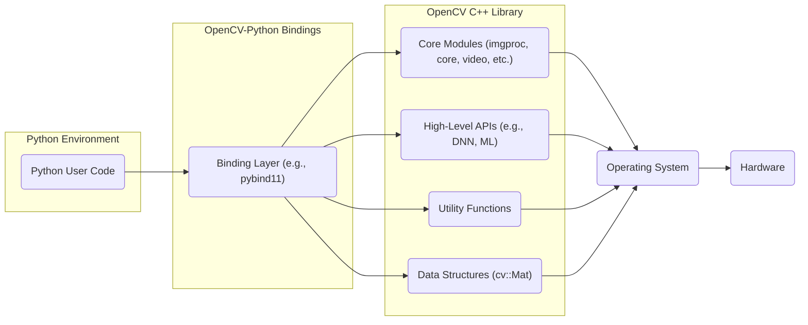
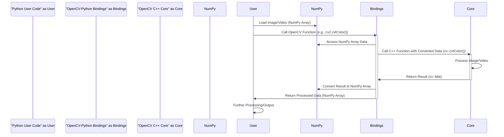

# Project Design Document: OpenCV-Python

**Version:** 1.1
**Date:** October 26, 2023
**Author:** AI Software Architect

## 1. Introduction

This document provides an enhanced design overview of the OpenCV-Python project (accessible at [https://github.com/opencv/opencv-python](https://github.com/opencv/opencv-python)). Building upon the previous version, this document offers a more detailed articulation of the system's architecture, components, and data flow, with a stronger emphasis on security considerations relevant for subsequent threat modeling activities. The focus remains on the structure and interactions within the library itself, rather than specific applications built using it.

## 2. Goals and Objectives

The primary goal of OpenCV-Python is to provide a robust and efficient Python interface to the comprehensive OpenCV (Open Source Computer Vision Library) C++ library. Key objectives include:

* **Seamless Integration:**  Providing a Pythonic and natural way to access OpenCV's functionalities without significant performance penalties.
* **Comprehensive Coverage:**  Exposing a wide range of OpenCV's algorithms and data structures to the Python environment.
* **Maintainability:**  Ensuring the binding layer is maintainable and can adapt to changes in the underlying OpenCV C++ library.
* **Extensibility:**  Allowing for the potential extension of the bindings to include custom C++ functionalities.
* **Security:**  Minimizing potential security vulnerabilities introduced by the binding layer or through interactions with the underlying C++ code.

## 3. System Architecture

OpenCV-Python employs a layered architecture, acting as a bridge between the high-level Python environment and the performance-critical C++ implementation of OpenCV. This separation of concerns is crucial for both usability and performance.

* **Layer 1: Python User Code:** This is the outermost layer where developers write Python scripts to leverage OpenCV's capabilities. This code interacts with the library through the exposed Python API, typically using the `cv2` module.
* **Layer 2: OpenCV-Python Bindings:** This critical layer is responsible for the bi-directional translation between Python calls and corresponding C++ function calls within the OpenCV library. Technologies like `pybind11` are commonly used for generating these efficient bindings. This layer handles data marshalling and memory management across the language boundary.
* **Layer 3: OpenCV C++ Core:** This layer constitutes the core of the system, containing the highly optimized implementations of image and video processing algorithms, fundamental data structures (such as `cv::Mat`), and a wide array of utility functions.
* **Layer 4: Operating System and Hardware:** The foundational layer providing the execution environment, including memory management, file system access, threading capabilities, and interaction with underlying hardware components like CPU, GPU, and camera interfaces.

## 4. Component Design

This section provides a more detailed breakdown of the key components within the OpenCV-Python ecosystem, highlighting their responsibilities and potential security considerations.

* **Python User Code:**
    * **Description:** Python scripts developed by users to perform various image and video processing tasks using the OpenCV-Python library. This is the primary interface for interacting with OpenCV.
    * **Responsibilities:**
        * Invoking OpenCV functions through the `cv2` module.
        * Managing image and video data, often represented as NumPy arrays.
        * Controlling the program flow and logic.
    * **Key Interactions:** Directly interacts with the OpenCV-Python bindings by calling functions exposed by the `cv2` module.
    * **Security Considerations:**
        * **Vulnerable Dependencies:**  User code might introduce vulnerabilities through other imported libraries.
        * **Data Handling:** Improper handling of sensitive image data (e.g., personally identifiable information) within user code.
        * **Input Sanitization:**  User code should sanitize external inputs (e.g., file paths, user-provided parameters) before passing them to OpenCV functions to prevent potential issues like path traversal.

* **OpenCV-Python Bindings:**
    * **Description:** The crucial intermediary layer, often generated using tools like `pybind11`, that enables communication between Python and the C++ OpenCV library.
    * **Responsibilities:**
        * **Function Wrapping:** Exposing C++ functions and classes to the Python environment.
        * **Data Marshalling:** Converting data types between Python objects (e.g., NumPy arrays, lists) and C++ data structures (`cv::Mat`, vectors, etc.). This involves memory management and data copying.
        * **Exception Handling:** Translating C++ exceptions into Python exceptions and vice versa.
        * **Resource Management:** Managing the lifetime of C++ objects created and used within the Python environment.
    * **Key Interactions:** Receives function calls and data from Python user code and invokes corresponding functions in the OpenCV C++ core. It also receives results from the C++ core and returns them to Python.
    * **Security Considerations:**
        * **Buffer Overflows:** Incorrect data marshalling or insufficient bounds checking in the binding layer could lead to buffer overflows when passing data to C++.
        * **Memory Leaks:** Failure to properly manage the lifetime of C++ objects can result in memory leaks.
        * **Type Confusion:**  Mismatched data types between Python and C++ could lead to unexpected behavior or vulnerabilities.
        * **Integer Overflows:**  Potential for integer overflows during size calculations or data conversions.
        * **Unsafe C++ Code:** If the binding layer itself contains vulnerabilities in its C++ implementation.

* **OpenCV C++ Core Modules:**
    * **Description:** The fundamental part of OpenCV, implemented in C++, containing a vast collection of optimized algorithms and data structures for computer vision tasks.
    * **Responsibilities:**
        * **Algorithm Implementation:** Implementing core image and video processing algorithms (e.g., filtering, transformations, feature detection, object tracking).
        * **Data Structure Management:** Providing and managing fundamental data structures like `cv::Mat` for image and matrix representation.
        * **Utility Functions:** Offering a range of utility functions for tasks such as file I/O, mathematical operations, and system interactions.
    * **Key Modules (Examples):**
        * `"core"`: Basic data structures, linear algebra routines, and system functionalities.
        * `"imgproc"`: Image processing functions (filtering, transformations, color conversions, histograms).
        * `"video"`: Video analysis and processing algorithms (motion estimation, background subtraction, tracking).
        * `"highgui"`: Simple UI capabilities for displaying images and videos (less common in server-side deployments).
        * `"dnn"`: Deep Neural Network module for inference with pre-trained models.
        * `"objdetect"`: Object detection algorithms (e.g., face detection, pedestrian detection).
    * **Key Interactions:** Receives function calls and data from the binding layer and interacts with the operating system for resource access (e.g., file system, memory).
    * **Security Considerations:**
        * **Memory Safety:** Being written in C++, the core is susceptible to memory safety issues like buffer overflows, use-after-free vulnerabilities, and dangling pointers if not carefully implemented.
        * **Integer Overflows:**  Vulnerable to integer overflows in calculations related to image dimensions, pixel access, or loop counters.
        * **Algorithm-Specific Vulnerabilities:** Certain algorithms might have inherent vulnerabilities if processing malformed or adversarial inputs.
        * **Dependency Vulnerabilities:** The C++ core might rely on other C/C++ libraries, which could have their own vulnerabilities.

* **External Libraries (Dependencies):**
    * **Description:** OpenCV-Python relies on various external libraries for its functionality and performance.
    * **Examples:**
        * `"NumPy"`:  Crucial for efficient numerical operations and representing images as multi-dimensional arrays. The binding layer heavily interacts with NumPy arrays.
        * **Image Codec Libraries (e.g., libjpeg, libpng, libtiff):** Used for encoding and decoding various image formats.
        * **Video Codec Libraries (e.g., FFmpeg):** Used for encoding and decoding video formats.
        * **GUI Backends (e.g., Qt, GTK):** Used by the `highgui` module for displaying images and creating user interfaces.
        * **BLAS/LAPACK Libraries (e.g., OpenBLAS, MKL):**  Used for optimized linear algebra operations.
    * **Responsibilities:** Providing underlying functionalities for numerical computation, image/video encoding/decoding, and GUI support.
    * **Key Interactions:** The binding layer often converts between NumPy arrays and OpenCV's `cv::Mat` data structure. The C++ core utilizes image and video codec libraries for I/O operations.
    * **Security Considerations:**
        * **Vulnerabilities in Dependencies:**  Security vulnerabilities in any of these external libraries can directly impact the security of OpenCV-Python. This includes vulnerabilities in image/video codec libraries that could be exploited by processing malicious files.
        * **Supply Chain Security:** Ensuring the integrity and trustworthiness of the dependencies used during the build process.

## 5. Data Flow

The typical data flow within OpenCV-Python involves the following sequence of steps, highlighting the data transformations and component interactions:

1. **Image/Video Input:** Python user code initiates the process by loading an image or video. This often involves reading data from a file using functions from libraries like `cv2.imread()` or capturing frames from a camera. The data is typically represented as a NumPy array in memory.
2. **Function Call (Python):** The Python user code calls an OpenCV function from the `cv2` module (e.g., `cv2.cvtColor(image, cv2.COLOR_BGR2GRAY)`).
3. **Binding Layer Transition:** The Python call is intercepted by the OpenCV-Python binding layer.
4. **Data Marshalling:** The binding layer converts Python data structures (like the NumPy array representing the image) into corresponding C++ data structures (like `cv::Mat`). This might involve copying the data.
5. **Function Call (C++):** The binding layer calls the appropriate C++ function within the OpenCV core library (e.g., `cv::cvtColor()`), passing the converted data.
6. **Processing (C++):** The OpenCV C++ function executes the requested image or video processing operation on the `cv::Mat` data.
7. **Result Marshalling:** The result of the C++ function (often a modified `cv::Mat` or a new `cv::Mat`) is converted back into a Python-compatible data structure (typically a NumPy array) by the binding layer.
8. **Return to Python:** The processed data (as a NumPy array) is returned to the Python user code.
9. **Output/Further Processing:** The Python user code can then display the result, save it to a file, or perform further processing steps.

## 6. Security Considerations (Detailed)

This section expands on the preliminary security considerations, providing more specific potential threats and vulnerabilities at each layer.

* **Python User Code:**
    * **Threats:**
        * **Injection Attacks:** If user code constructs commands or file paths based on untrusted input and passes them to OpenCV functions, it could lead to command injection or path traversal vulnerabilities.
        * **Data Exfiltration:**  Improper handling of sensitive image data could lead to accidental or intentional data leaks.
        * **Denial of Service:**  User code could intentionally or unintentionally consume excessive resources by processing very large or malformed inputs.
    * **Mitigations:**
        * **Input Validation and Sanitization:**  Thoroughly validate and sanitize all external inputs before using them with OpenCV functions.
        * **Secure Data Handling Practices:** Implement appropriate access controls and encryption for sensitive image data.
        * **Resource Limits:** Implement mechanisms to limit the resources consumed by image processing operations.

* **OpenCV-Python Bindings:**
    * **Threats:**
        * **Buffer Overflows:**  Maliciously crafted input data could cause buffer overflows in the binding layer during data marshalling, potentially leading to arbitrary code execution.
        * **Memory Corruption:**  Errors in memory management within the binding layer could lead to memory corruption vulnerabilities.
        * **Type Confusion:**  Exploiting type mismatches between Python and C++ could lead to unexpected behavior or security breaches.
    * **Mitigations:**
        * **Secure Coding Practices:** Adhere to secure coding practices when developing the binding layer, including thorough bounds checking and memory management.
        * **Automated Testing:** Implement comprehensive unit and integration tests to detect potential vulnerabilities.
        * **Static Analysis:** Utilize static analysis tools to identify potential security flaws in the binding layer code.

* **OpenCV C++ Core Modules:**
    * **Threats:**
        * **Memory Safety Vulnerabilities:**  Buffer overflows, use-after-free errors, and other memory safety issues in the C++ code could be exploited for arbitrary code execution.
        * **Integer Overflows:**  Integer overflows in calculations could lead to unexpected behavior or vulnerabilities.
        * **Algorithm-Specific Attacks:**  Certain algorithms might be vulnerable to adversarial inputs that could cause crashes or unexpected behavior.
    * **Mitigations:**
        * **Secure C++ Coding Practices:**  Employ secure coding practices, including careful memory management and bounds checking.
        * **Code Reviews:** Conduct thorough code reviews to identify potential vulnerabilities.
        * **Fuzzing:** Utilize fuzzing techniques to test the robustness of the C++ core against various inputs.
        * **AddressSanitizer/MemorySanitizer:** Use memory error detection tools during development and testing.

* **External Libraries (Dependencies):**
    * **Threats:**
        * **Known Vulnerabilities:**  Using versions of dependencies with known security vulnerabilities can expose OpenCV-Python to those vulnerabilities.
        * **Supply Chain Attacks:**  Compromised dependencies could introduce malicious code into the OpenCV-Python ecosystem.
    * **Mitigations:**
        * **Dependency Management:**  Use a robust dependency management system to track and update dependencies.
        * **Vulnerability Scanning:** Regularly scan dependencies for known vulnerabilities.
        * **Software Bill of Materials (SBOM):** Maintain an SBOM to track the components used in the project.
        * **Secure Build Pipeline:** Implement a secure build pipeline to ensure the integrity of the build process.

## 7. Dependencies

* **Python (>= 3.6 recommended):** The core programming language environment.
* **NumPy (>= 1.14.5 recommended):**  Essential for numerical operations and image representation.
* **OpenCV C++ Library (version compatibility is crucial):** The underlying C++ implementation.
* **`pybind11` (or similar binding generation tool):** Used for creating the Python bindings.
* **Image Codec Libraries (e.g., libjpeg-turbo, libpng, libwebp, libtiff):** For handling various image formats.
* **Video Codec Libraries (e.g., FFmpeg, libv4l):** For handling various video formats and camera input.
* **GUI Backends (Optional, e.g., Qt, GTK, Cocoa):** For the `highgui` module.
* **BLAS/LAPACK Libraries (Optional, e.g., OpenBLAS, MKL):** For optimized linear algebra.

## 8. Deployment Considerations

* **OpenCV C++ Library Installation:** The correct version of the underlying OpenCV C++ library must be installed and accessible on the deployment environment.
* **Python Environment Setup:** A compatible Python environment with the required dependencies (especially NumPy and the correct OpenCV-Python package) needs to be configured.
* **Platform Compatibility:** Ensure that the chosen OpenCV-Python package and its dependencies are compatible with the target operating system and architecture.
* **Security Hardening:** Apply appropriate security hardening measures to the deployment environment, such as limiting network access and using secure configurations.

## 9. Future Considerations

* **Enhanced Security Audits:**  Regular and thorough security audits of the binding layer and the interaction with the C++ core, potentially involving external security experts.
* **Improved Input Validation in Bindings:**  Strengthening input validation within the binding layer to prevent potentially malicious data from reaching the C++ core.
* **Memory Safety Improvements in C++ Core:**  Continued efforts to improve memory safety within the OpenCV C++ core, potentially through the adoption of safer coding practices or memory-safe languages for certain components.
* **Formal Verification:** Exploring the use of formal verification techniques to prove the correctness and security of critical components.
* **Standardized Security Testing:** Implementing standardized security testing procedures as part of the development lifecycle.

This improved design document provides a more detailed and security-focused overview of the OpenCV-Python project. It serves as a valuable resource for conducting thorough threat modeling and identifying potential vulnerabilities within the system. The enhanced descriptions of components, data flow, and security considerations offer a solid foundation for building more secure applications using OpenCV-Python.