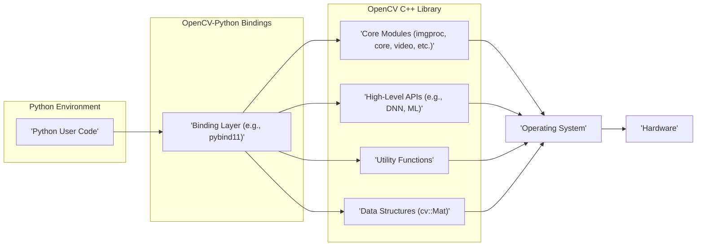
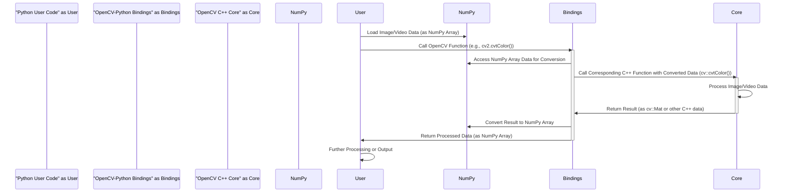

# Project Design Document: OpenCV-Python

**Version:** 1.1
**Date:** October 26, 2023
**Author:** AI Software Architect

## 1. Introduction

This document provides an enhanced design overview of the OpenCV-Python project ([https://github.com/opencv/opencv-python](https://github.com/opencv/opencv-python)). Building upon the previous version, this document offers a more detailed articulation of the system's architecture, components, and data flow, specifically tailored for comprehensive threat modeling. The focus remains on the internal structure and interactions of the library, excluding specific application implementations.

## 2. Goals and Objectives

The core goal of OpenCV-Python is to seamlessly integrate the robust OpenCV (Open Source Computer Vision Library) C++ library into the Python ecosystem. Key objectives include:

* **Pythonic Accessibility:** Providing an idiomatic and user-friendly Python interface to OpenCV's extensive computer vision functionalities.
* **Performance Considerations:**  Striving for optimal performance within the constraints of the Python binding layer, minimizing overhead.
* **Comprehensive Feature Coverage:**  Ensuring a wide range of OpenCV's capabilities are accessible through the Python API.
* **Developer Experience:**  Offering an intuitive and easy-to-use API for Python developers working with computer vision tasks.
* **Platform Independence:**  Maintaining compatibility across various operating systems where both Python and the native OpenCV library can be installed.

## 3. System Architecture

OpenCV-Python employs a layered architecture to bridge the semantic and implementation gap between Python and the underlying C++ OpenCV library.

* **Layer 1: Python User Interface:** This is the outermost layer where Python developers write code that utilizes the OpenCV-Python library. Interaction occurs through the exposed Python API (`cv2` module).
* **Layer 2: OpenCV-Python Binding Layer:** This critical layer acts as the translator, converting Python function calls and data structures into their C++ equivalents for the OpenCV library. Technologies like `pybind11` are commonly used for this purpose.
* **Layer 3: Native OpenCV C++ Library:** This layer contains the core implementation of computer vision algorithms, data structures (e.g., `cv::Mat`), and utility functions, written in C++.
* **Layer 4: System Resources:** The underlying operating system provides essential resources such as memory management, file system access, and hardware interaction for the OpenCV C++ library.

## 4. Component Design

This section provides a more detailed breakdown of the key components within the OpenCV-Python ecosystem.

* **Python User Code:**
    * **Description:** Python scripts developed by users to perform image and video processing tasks using the `cv2` module.
    * **Responsibilities:**
        * Invoking functions from the OpenCV-Python API.
        * Managing image and video data, often represented as NumPy arrays.
        * Controlling the program flow and logic.
    * **Key Interactions:** Directly interacts with the OpenCV-Python binding layer by calling functions exposed through the `cv2` module.

* **OpenCV-Python Binding Layer:**
    * **Description:** The crucial intermediary that enables communication between Python and C++. Often implemented using tools like `pybind11`, Cython, or similar technologies.
    * **Responsibilities:**
        * **Function Wrapping:** Creating Python wrappers around C++ functions and methods.
        * **Data Marshalling:** Converting data types between Python objects (e.g., NumPy arrays, lists, tuples) and their C++ equivalents (e.g., `cv::Mat`, `std::vector`). This involves memory management and data copying or sharing.
        * **Exception Handling:** Translating C++ exceptions into Python exceptions and vice versa.
        * **Object Lifetime Management:** Ensuring proper allocation and deallocation of memory for objects shared between Python and C++.
    * **Key Interactions:** Receives function calls and data from Python user code and makes corresponding calls to the OpenCV C++ core. Manages the conversion of data back and forth.

* **Native OpenCV C++ Library:**
    * **Description:** The foundational layer containing the core computer vision algorithms and data structures, implemented in C++.
    * **Responsibilities:**
        * Implementing a wide range of image and video processing algorithms (e.g., filtering, edge detection, object tracking).
        * Providing fundamental data structures for image and video representation (`cv::Mat`).
        * Offering utility functions for tasks like file input/output, mathematical operations, and system interactions.
    * **Key Modules (Examples):**
        * `core`:  Defines basic data structures, mathematical functions, and core functionalities.
        * `imgproc`: Implements image processing functions (filtering, transformations, color manipulation).
        * `video`: Provides algorithms for video analysis, motion estimation, and tracking.
        * `highgui`: Offers basic UI functionalities for displaying images and videos (less commonly used in headless environments).
        * `dnn`: Enables deep neural network inference.
        * `objdetect`: Implements object detection algorithms (e.g., face detection, pedestrian detection).
    * **Key Interactions:** Receives function calls and data from the binding layer. Interacts with the operating system for tasks like memory allocation and file access.

* **External Libraries (Dependencies):**
    * **Description:** OpenCV-Python relies on other libraries to provide essential functionalities.
    * **Examples:**
        * **NumPy:**  Provides efficient numerical array operations and is the standard way to represent images in OpenCV-Python. The binding layer often directly works with NumPy arrays.
        * **Potentially other libraries:** Depending on the build configuration and features used, this might include libraries for image codecs (e.g., JPEG, PNG), video codecs, or GUI backends.
    * **Responsibilities:** Providing underlying functionalities for numerical computation, data representation, and potentially other tasks.
    * **Key Interactions:** The binding layer frequently converts between NumPy arrays and OpenCV's `cv::Mat` data structure. OpenCV C++ might also directly interact with certain external libraries.

## 5. Data Flow

The typical data flow within OpenCV-Python involves these steps:

1. **Data Acquisition:** Python user code loads an image or video. This often involves reading data from a file using functions like `cv2.imread()` or capturing frames from a camera. The data is typically represented as a NumPy array.
2. **Function Invocation:** The Python user code calls an OpenCV function from the `cv2` module (e.g., `cv2.cvtColor(image, cv2.COLOR_BGR2GRAY)`).
3. **Binding Layer Transition:** The Python interpreter invokes the corresponding function in the OpenCV-Python binding layer.
4. **Data Conversion (Marshalling):** The binding layer converts the Python data structures (e.g., the NumPy array representing the image) into the appropriate C++ data structures (e.g., `cv::Mat`). This might involve copying the data or creating a view of the data.
5. **C++ Function Execution:** The binding layer calls the corresponding C++ function within the OpenCV core library, passing the converted data.
6. **Native Processing:** The OpenCV C++ function performs the requested image or video processing operation.
7. **Result Conversion (Marshalling):** The result of the C++ function (often a modified `cv::Mat` or other data) is converted back into a Python-compatible data structure (typically a NumPy array).
8. **Return to Python:** The processed data is returned to the Python user code.
9. **Further Operations:** The Python user code can then display the result, save it to a file, or perform further processing steps.

## 6. Security Considerations

This section outlines potential security considerations relevant to OpenCV-Python, focusing on areas that could be exploited.

* **Input Validation Vulnerabilities (C++ Layer):** The underlying OpenCV C++ library, being written in C++, is susceptible to memory corruption vulnerabilities like buffer overflows if input data (e.g., image dimensions, pixel data) is not rigorously validated. Maliciously crafted input could potentially lead to crashes or arbitrary code execution.
* **Binding Layer Security:**
    * **Incorrect Data Marshalling:** Errors in the binding layer's data conversion logic could lead to type confusion or memory corruption when passing data between Python and C++.
    * **Object Lifetime Issues:** Improper management of object lifetimes across the language boundary could result in use-after-free vulnerabilities.
    * **Exposure of Internal APIs:** If the binding layer inadvertently exposes internal C++ APIs without proper sanitization, it could create security risks.
* **Dependency Vulnerabilities:** OpenCV-Python relies on external libraries like NumPy. Security vulnerabilities in these dependencies could be exploited through OpenCV-Python. Regularly updating dependencies is crucial.
* **Denial of Service (DoS):** Processing extremely large or malformed images or videos could consume excessive CPU, memory, or other resources, leading to denial of service. This could occur at both the Python and C++ layers.
* **Integer Overflows (C++ Layer):** Integer overflows in C++ code when calculating image dimensions or performing arithmetic operations on pixel values could lead to unexpected behavior or security vulnerabilities.
* **Path Traversal:** If OpenCV-Python functions accept file paths as input (e.g., `cv2.imread()`), insufficient sanitization of these paths could lead to path traversal vulnerabilities, allowing access to unauthorized files.
* **Serialization/Deserialization Issues:** If OpenCV-Python involves serialization or deserialization of data (e.g., when using the DNN module), vulnerabilities in the serialization format or implementation could be exploited.
* **Untrusted Input to DNN Module:** When using the `dnn` module, providing untrusted or maliciously crafted model files could potentially lead to vulnerabilities within the underlying deep learning framework.

## 7. Dependencies

* **Python:** The core programming language environment.
* **NumPy:**  Essential for numerical array operations and image representation.
* **OpenCV C++ Library:** The underlying native library providing the core functionalities.
* **`pybind11` (or similar binding generator):** Used to create the Python bindings for the C++ library.
* **Potentially other libraries:**  Depending on the build configuration and enabled features, this may include libraries for:
    * Image codecs (e.g., libjpeg, libpng, libtiff).
    * Video codecs (e.g., FFmpeg, libv4l).
    * GUI backends (e.g., Qt, GTK).
    * Linear algebra libraries (e.g., BLAS, LAPACK).

## 8. Deployment Considerations

* **Native Library Installation:** The underlying OpenCV C++ library must be installed and accessible on the target system. This often involves installing system packages or building from source.
* **Python Environment Setup:** A compatible Python environment with the necessary dependencies (especially NumPy and the OpenCV-Python package itself) must be configured. This can be done using package managers like `pip` or `conda`.
* **Platform Compatibility:** Ensure that the installed OpenCV C++ library and the Python environment are compatible with the target operating system and architecture (e.g., Windows, Linux, macOS, x86, ARM).
* **Security Best Practices:** When deploying applications using OpenCV-Python, standard security practices should be followed, such as keeping dependencies updated, validating user inputs, and running with appropriate privileges.

## 9. Future Considerations

* **Enhanced Security Audits:**  Regular and thorough security audits of the binding layer and the interaction between Python and the C++ core to proactively identify and address potential vulnerabilities.
* **Improved Input Sanitization:** Implementing more robust input validation and sanitization mechanisms, especially at the C++ layer, to prevent memory corruption vulnerabilities.
* **Strengthening Binding Layer Security:** Employing secure coding practices in the binding layer to prevent issues related to data marshalling, object lifetime management, and exposure of internal APIs.
* **Fuzzing and Static Analysis:** Utilizing fuzzing techniques and static analysis tools to automatically detect potential bugs and vulnerabilities in both the Python bindings and the C++ core.
* **Memory Safety Improvements:** Exploring and adopting memory-safe programming practices or tools within the OpenCV C++ codebase where feasible.
* **Fine-grained Permissions:**  Investigating ways to implement more fine-grained permissions or sandboxing for specific OpenCV functionalities to limit the impact of potential vulnerabilities.

This improved design document provides a more detailed and security-focused overview of the OpenCV-Python project. It serves as a valuable resource for conducting thorough threat modeling and identifying potential security risks within the library.