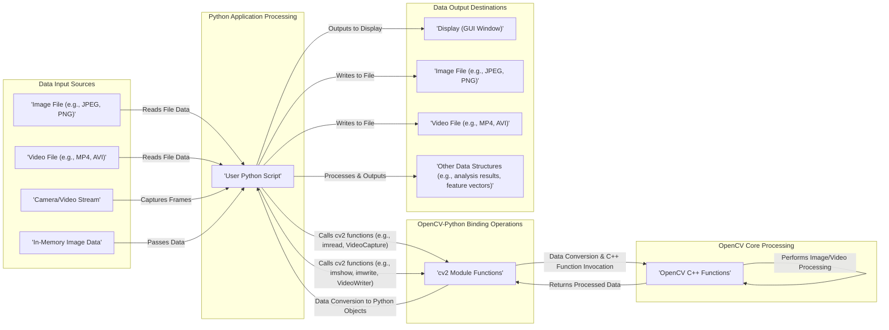

# Project Design Document: OpenCV-Python Bindings

**Version:** 1.1
**Date:** October 26, 2023
**Author:** AI Software Architect

## 1. Project Overview

This document provides an enhanced design overview of the `opencv-python` project, which serves as a crucial bridge enabling Python developers to utilize the robust capabilities of the core OpenCV (Open Source Computer Vision Library). OpenCV is a widely adopted library offering a rich set of programming functions primarily focused on real-time computer vision tasks. The `opencv-python` project facilitates seamless interaction with OpenCV's highly optimized C++ implementation through an intuitive Python interface. This refined document is intended to be a more detailed foundation for subsequent threat modeling efforts.

## 2. Goals

* Provide a highly performant and user-friendly Python interface to the comprehensive features of the core OpenCV library.
* Empower Python developers to readily access and leverage OpenCV's extensive suite of computer vision algorithms and functionalities within their Python projects.
* Maintain optimal performance by establishing an efficient communication layer between the dynamically typed Python environment and the statically typed C++ backend.
* Offer a consistent and intuitive Application Programming Interface (API) that closely mirrors the organizational structure and naming conventions of the underlying C++ library, promoting ease of use for developers familiar with OpenCV.
* Ensure broad compatibility by supporting a range of operating systems (Windows, Linux, macOS) and various actively maintained Python versions.
* Streamline the integration process by providing easy installation and seamless incorporation of OpenCV's capabilities into diverse Python project structures.

## 3. Non-Goals

* To undertake any redesign or significant modifications to the fundamental architecture or API of the core OpenCV C++ library.
* To implement novel computer vision algorithms directly within the Python bindings layer; the primary focus is on exposing the pre-existing, highly optimized C++ functionalities.
* To provide bindings for every conceivable function and feature present within the entirety of the core OpenCV library. Prioritization is based on common use cases and developer demand.
* To assume responsibility for the development, maintenance, or security of the underlying OpenCV C++ library itself. This document focuses specifically on the Python binding layer.
* To develop or document end-user applications built using OpenCV-Python. The scope of this document is limited to the design of the library itself.

## 4. Target Audience

This document is primarily intended for the following individuals and teams:

* **Security Engineers:** Those responsible for conducting threat modeling exercises, security audits, and penetration testing of systems incorporating `opencv-python`.
* **Software Architects and Developers:** Individuals and teams designing and implementing software solutions that utilize `opencv-python` for computer vision tasks.
* **DevOps Engineers:** Personnel responsible for the deployment, configuration, and ongoing maintenance of applications that depend on `opencv-python`.
* **Contributors to the `opencv-python` Project:** Developers actively involved in the development, maintenance, and improvement of the `opencv-python` bindings.

## 5. Architectural Overview

The `opencv-python` project operates as an intermediary layer, facilitating communication between Python code and the pre-compiled OpenCV C++ library. This interoperation is achieved through the utilization of binding generators, with `cv2.cpp` being a central component, leveraging tools such as `pybind11` to automate the generation of the necessary interface code.

**Component Descriptions:**

* **'User Python Script':**  This represents the Python code written by developers that imports and utilizes the functionalities exposed by the `cv2` module.
* **'cv2 Module (.py)':** The Python module that serves as the primary interface to OpenCV. While largely generated from the C++ code, it provides Pythonic access to OpenCV features.
* **'cv2.cpp (C++ Binding Code)':**  This crucial C++ code, often automatically generated using tools like `pybind11`, manages the complex process of translating Python objects and function calls into their corresponding C++ equivalents within the OpenCV library. It is responsible for handling data type conversions, memory management across language boundaries, and error propagation.
* **'OpenCV Libraries (.so/.dylib/.dll)':** These are the compiled, platform-specific native C++ libraries of OpenCV. They contain the highly optimized implementations of the various computer vision algorithms and data structures.

**Detailed Interaction Flow:**

1. The 'User Python Script' initiates interaction by importing the `cv2` module, making its functionalities available.
2. The 'User Python Script' then invokes functions within the `cv2` module (e.g., `cv2.imread()`, `cv2.cvtColor()`), intending to utilize OpenCV's capabilities.
3. These function calls are intercepted by the wrapper functions defined within the 'cv2 Module (.py)', which then delegate to the underlying binding code in `'cv2.cpp (C++ Binding Code)'`.
4. The `'cv2.cpp (C++ Binding Code)'` meticulously translates the Python arguments passed to the function into the appropriate C++ data types that the OpenCV C++ library expects. This involves handling potential type mismatches and ensuring data integrity.
5. Subsequently, `'cv2.cpp (C++ Binding Code)'` makes calls to the corresponding functions within the 'OpenCV Libraries (.so/.dylib/.dll)'.
6. The 'OpenCV Libraries (.so/.dylib/.dll)' execute the requested computer vision operations, leveraging their highly optimized C++ implementations.
7. Upon completion, the results of the C++ function calls are passed back to `'cv2.cpp (C++ Binding Code)'`.
8. `'cv2.cpp (C++ Binding Code)'` then converts the C++ results back into Python objects, ensuring they are compatible with the Python environment.
9. Finally, these converted Python objects are returned to the original calling 'User Python Script', completing the interaction cycle.

## 6. Data Flow

The primary data manipulated by `opencv-python` consists of image and video data. Within the Python environment, this data is typically represented using the efficient multi-dimensional arrays provided by the NumPy library.

**Detailed Data Flow Description:**

1. **Data Ingress:** Image or video data enters the system from various sources, including local files (in formats like JPEG or PNG for images, and MP4 or AVI for videos), live camera feeds, or pre-existing image data already residing in memory.
2. **Loading and Capture:** The 'User Python Script' utilizes functions provided by the `cv2` module (e.g., `cv2.imread()` for images, `cv2.VideoCapture()` for video streams) to load data from files or capture frames from live sources. This process involves the `cv2` module interacting with OpenCV's input/output (I/O) capabilities. The loaded or captured image and video data is typically represented as NumPy arrays within the Python environment.
3. **Data Processing:** The 'User Python Script' then calls a variety of `cv2` functions to perform diverse image processing, analysis, or manipulation tasks. These function calls are seamlessly passed through the binding layer to the corresponding highly optimized OpenCV C++ functions.
4. **Crucial Data Conversion:** The binding layer plays a critical role in efficiently and accurately converting data between Python objects (primarily NumPy arrays) and the underlying C++ data structures used by OpenCV (primarily the `cv::Mat` class). This conversion step is essential for maintaining performance and ensuring data integrity across the language barrier.
5. **Core OpenCV Processing:** The core OpenCV C++ library executes the actual image processing algorithms, leveraging its optimized implementations for tasks such as filtering, transformations, object detection, and more.
6. **Data Egress:** The processed data can then be directed to various output destinations. This includes displaying images or videos on the screen using functions like `cv2.imshow()`, saving the processed data to files using functions like `cv2.imwrite()`, or utilizing the processed data for further analysis or manipulation within the 'User Python Script'.

## 7. Key Components

* **`cv2` Python Module:**
    * Serves as the primary and most accessible entry point for Python developers seeking to utilize OpenCV's functionalities.
    * Contains a vast collection of wrapper functions and classes that mirror the structure of the underlying OpenCV C++ API.
    * Exhibits a strong dependency on the NumPy library for the efficient representation and manipulation of image and video data as multi-dimensional arrays.
    * Installation is typically streamlined through the use of the `pip` package installer.
* **`cv2.cpp` Binding Code:**
    * This C++ source file is the linchpin that facilitates interoperability between the Python and OpenCV C++ environments.
    * Employs binding generation tools, such as `pybind11`, to automate the creation of the necessary wrapper functions, minimizing manual coding effort and potential errors.
    * Handles critical tasks such as parsing arguments passed from Python, performing necessary type conversions between Python and C++ data types, and managing exception handling across the language boundary.
    * Is responsible for managing the lifecycle of OpenCV objects that are created and manipulated from within the Python environment, ensuring proper memory management and preventing leaks.
* **OpenCV Core C++ Libraries:**
    * These libraries represent the foundational C++ implementation of OpenCV's extensive collection of algorithms and fundamental data structures.
    * Provide a wide array of functionalities encompassing image processing, video analysis, object detection and recognition, machine learning algorithms tailored for computer vision, and much more.
    * Are compiled into platform-specific shared library files (e.g., `.so` on Linux, `.dylib` on macOS, `.dll` on Windows), which are dynamically linked at runtime.
* **NumPy Library:**
    * A cornerstone library for numerical computing within the Python ecosystem.
    * `opencv-python` relies heavily on NumPy arrays as the standard way to represent images and other multi-dimensional data structures, owing to their efficiency and direct compatibility with OpenCV's core `cv::Mat` data structure.
* **`setup.py` and Build System:**
    * These files and associated tools define the process by which the `opencv-python` package is built, packaged, and installed.
    * Manage the project's dependencies, orchestrate the compilation of the binding code, and create the distributable package.
    * Typically leverage `setuptools` for Python packaging and `cmake` as a cross-platform build system generator.

## 8. Dependencies

* **Python:** The core programming language for which these bindings are specifically designed. The documentation typically specifies the supported Python versions.
* **NumPy:** A mandatory dependency for efficient numerical operations and data exchange with OpenCV.
* **OpenCV Core (C++):** The underlying native library that provides the fundamental computer vision functionalities. The `opencv-python` package usually bundles or links against a specific version of these core libraries.
* **`setuptools`:** A standard Python library used for packaging and distributing Python projects.
* **`cmake`:** A widely used cross-platform build system generator essential for the compilation process.
* **`pybind11` (or alternative binding generation tools):** A C++ library that simplifies the creation of Python bindings for C++ code.

## 9. Deployment Model

The `opencv-python` package is predominantly deployed as a library that is integrated into larger Python-based applications.

**Common Installation Methods:**

* The most prevalent method is using the `pip` package installer: `pip install opencv-python`.
* Alternatively, installation from source is possible by cloning the project's repository and manually executing the build process.
* In data science and scientific computing environments, the Conda package manager is also a popular choice for installing `opencv-python`.

**Typical Usage Pattern:**

* Python developers import the `cv2` module into their Python scripts to gain access to OpenCV's functionalities.
* The `cv2` module then provides the necessary interface to interact with the underlying OpenCV C++ libraries.
* The OpenCV C++ libraries are dynamically linked into the application's process at runtime.

**Key Deployment Considerations:**

* Ensuring that the correct version of the `opencv-python` package is installed, which is compatible with the target Python version and the operating system where the application will be deployed.
* Verifying that all necessary dependencies, including NumPy and the core OpenCV C++ libraries, are present and correctly configured in the deployment environment.
* For applications that require specific, less common OpenCV features or necessitate custom build configurations, building `opencv-python` directly from the source code might be the required approach.

## 10. Security Considerations (Detailed for Threat Modeling)

This section provides a more detailed exploration of potential security considerations relevant to `opencv-python`, serving as a starting point for a comprehensive threat modeling process.

* **Insufficient Input Validation:** OpenCV functions, when accessed through the Python bindings, can be susceptible to vulnerabilities if the input data they receive (e.g., image files, video streams, numerical parameters) is not rigorously validated. Maliciously crafted input data could potentially trigger crashes due to unexpected data formats, lead to out-of-bounds memory access within the underlying C++ code, or even enable remote code execution in certain scenarios. For example, providing an image with an extremely large header could cause a buffer overflow during parsing.
* **Memory Management Issues at the Binding Layer:** The interaction between Python's automatic garbage collection and C++'s manual memory management introduces complexities. If the binding code (`cv2.cpp`) does not correctly manage the allocation and deallocation of memory when passing data between the two languages, vulnerabilities such as memory leaks (where memory is allocated but never freed) or double frees (where the same memory is freed multiple times, leading to corruption) can arise. These issues can potentially be exploited to cause denial-of-service or even arbitrary code execution.
* **Dependency Chain Vulnerabilities:** The security of `opencv-python` is intrinsically linked to the security of its dependencies, most notably NumPy and the core OpenCV C++ library. Known vulnerabilities in these upstream dependencies could be exploited by attackers targeting applications using `opencv-python`. Furthermore, the supply chain for these dependencies needs to be considered; a compromise of a dependency's build or distribution infrastructure could lead to the introduction of malicious code.
* **Integer Overflow and Underflow Vulnerabilities:** Image processing algorithms often involve manipulating pixel values and array indices. If these values are not handled carefully, particularly during arithmetic operations, integer overflows (where a value exceeds the maximum representable value) or underflows (where a value goes below the minimum representable value) can occur. These can lead to unexpected behavior, incorrect calculations, and potentially exploitable conditions within the underlying C++ code, such as incorrect memory allocation sizes.
* **Buffer Overflow Vulnerabilities:** When transferring data, particularly image data represented as NumPy arrays, between Python and the underlying C++ code, there is a risk of buffer overflows. This occurs if the binding code does not correctly account for the size of the data being passed, potentially writing data beyond the allocated buffer. This can lead to crashes or, in more severe cases, allow attackers to overwrite adjacent memory regions and potentially execute arbitrary code.
* **Insecure Deserialization:** Certain OpenCV functionalities might involve saving or loading data structures, such as trained machine learning models or configuration files. If these deserialization processes are not implemented securely, they could be vulnerable to attacks where maliciously crafted data is loaded, leading to arbitrary code execution or other security breaches. For instance, if pickle is used for serialization without proper safeguards, it can be exploited.
* **File System and Resource Access Control Issues:** When `opencv-python` applications interact with the file system (e.g., reading or writing image/video files) or access hardware resources (e.g., cameras), proper permission checks and access control mechanisms are crucial. Vulnerabilities can arise if the application runs with excessive privileges or if file access is not appropriately restricted, potentially allowing attackers to read sensitive data or modify system files.
* **Build-Time Security:** The security of the `opencv-python` build process itself is a critical consideration. If the build environment or any of the tools used in the build process (e.g., compilers, build scripts, dependency download mechanisms) are compromised, it could lead to the introduction of malicious code into the distributed `opencv-python` package. This highlights the importance of secure build pipelines and verification of dependencies.

This enhanced design document provides a more detailed and comprehensive overview of the `opencv-python` project's architecture, data flow, and critical components. The expanded security considerations section offers a more robust foundation for conducting thorough and effective threat modeling activities.