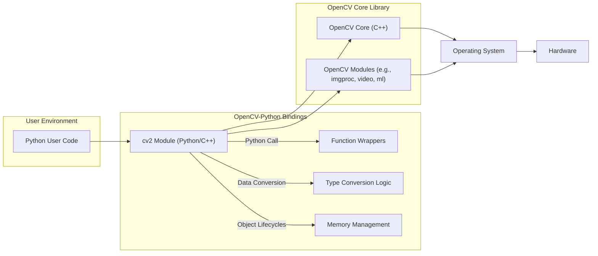
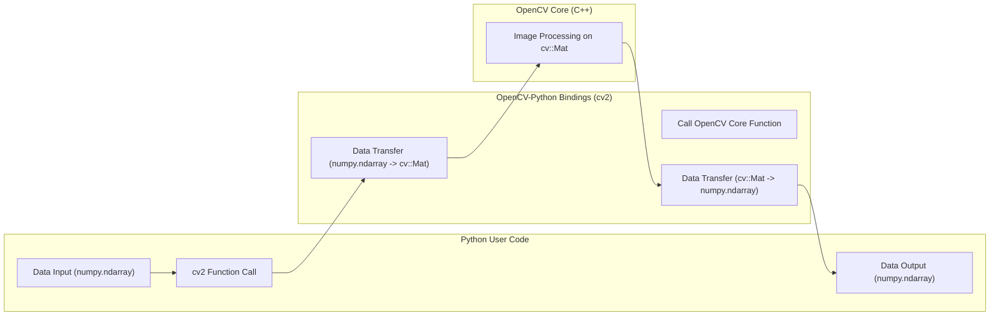

# Project Design Document: OpenCV-Python Bindings

**Project Name:** OpenCV-Python Bindings

**Project Repository:** [https://github.com/opencv/opencv-python](https://github.com/opencv/opencv-python)

**Document Version:** 1.1

**Date:** October 26, 2023

**Author:** AI Software Architect

## 1. Introduction

This document details the design of the OpenCV-Python bindings project. OpenCV (Open Source Computer Vision Library) is a widely adopted library for computer vision, machine learning, and image processing tasks. This project facilitates the use of the core OpenCV C++ library's functionalities within Python environments by providing a binding layer. This document aims to provide a clear understanding of the system's architecture, data flow, and key components, serving as a crucial input for subsequent threat modeling activities.

## 2. Goals and Objectives

The primary goals of the OpenCV-Python bindings project are:

* **Seamless Integration:** To enable Python developers to utilize the robust functionalities of the underlying OpenCV C++ library without significant impedance mismatch.
* **Performance Optimization:** To minimize the performance overhead introduced by the binding layer, ensuring that Python users can achieve near-native C++ performance for computationally intensive tasks.
* **Comprehensive Coverage:** To provide bindings for a substantial portion of the OpenCV C++ API, allowing access to a wide range of computer vision algorithms and data structures.
* **Pythonic Interface:** To offer a Python-friendly and intuitive interface for interacting with OpenCV functionalities, adhering to Python conventions and best practices.
* **Sustainable Development:** To ensure the bindings are easily maintainable, adaptable to changes in the core OpenCV library, and contribute to the long-term viability of the project.

## 3. System Architecture

The OpenCV-Python bindings project employs a layered architecture to bridge the gap between Python and C++:

* **Layer 1: Python User Code:** This is the outermost layer where developers write Python scripts, importing the `cv2` module to access OpenCV functionalities. User code interacts with OpenCV objects and functions through the provided Python interface.
* **Layer 2: OpenCV-Python Bindings (`cv2` module):** This crucial intermediary layer is responsible for translating Python calls into corresponding C++ function calls within the OpenCV core library. It leverages libraries like `pybind11` to achieve this. This layer handles:
    * **Function Wrapping:** Exposing C++ functions as callable Python functions.
    * **Type Conversion:** Converting Python objects (e.g., NumPy arrays) to their C++ equivalents (e.g., `cv::Mat`) and vice-versa.
    * **Memory Management:** Managing the memory lifecycle of objects shared between Python and C++.
* **Layer 3: OpenCV Core C++ Library:** This is the heart of OpenCV, implemented in C++, providing the actual implementations of image processing, computer vision, and machine learning algorithms. It consists of various modules:
    * **Core:** Basic data structures and fundamental algorithms.
    * **Imgproc:** Image processing functions.
    * **Video:** Video analysis and processing functionalities.
    * **ML:** Machine learning algorithms.
    * And many others (e.g., `highgui`, `calib3d`, `features2d`).
* **Layer 4: Operating System and Hardware:** The foundational layer comprising the operating system and hardware resources that the OpenCV C++ library interacts with directly. This includes memory allocation, CPU instruction execution, and GPU utilization (if enabled).

## 4. Data Flow

The typical data flow when utilizing OpenCV-Python involves these key stages:

* **Data Input:** Python code initiates the process by loading image or video data. The data source can vary:
    * **File System:** Reading image files (e.g., JPEG, PNG) or video files (e.g., MP4, AVI) from local storage. The data is typically loaded into NumPy arrays.
    * **Network Streams:** Capturing video frames from webcams, network cameras (IP cameras), or video streaming services. The captured frames are often represented as NumPy arrays.
    * **In-Memory Data Structures:** Utilizing existing data already present in memory, often as NumPy arrays (`numpy.ndarray`).
* **Function Call and Data Transfer to Bindings:** When a Python function from the `cv2` module is invoked with image data (typically a `numpy.ndarray`), the following occurs:
    * The Python interpreter identifies the corresponding C++ function wrapper in the `cv2` module.
    * The `pybind11` framework facilitates the conversion of the `numpy.ndarray` (and other Python arguments) into their C++ equivalents (e.g., `cv::Mat`). This involves creating a `cv::Mat` object that shares the underlying data buffer with the NumPy array (when possible, to avoid unnecessary copying).
* **Processing in OpenCV Core:** The binding layer then calls the appropriate C++ function within the OpenCV core library, passing the converted data (e.g., the `cv::Mat` object). The core library executes the requested computer vision algorithm or operation (e.g., image filtering, edge detection, object tracking).
* **Result Transfer to Bindings:** After processing, the OpenCV core library returns the results, which might be modified image data (as a `cv::Mat`), detected objects (as vectors of data structures), or other relevant information. This data is then transferred back to the binding layer.
* **Data Return to Python:** The binding layer, again using `pybind11`, converts the C++ results back into Python objects. A `cv::Mat` is typically converted back into a `numpy.ndarray`. Other data structures are converted to appropriate Python types (e.g., lists, tuples). This converted data is then returned to the calling Python code.
* **Data Output:** The Python code receives the processed data and can utilize it for various purposes: further processing, display on the screen, saving to a file, or transmitting over a network.

## 5. Key Components

The essential components that constitute the OpenCV-Python bindings project are:

* **`cv2` Python Module (`cv2.pyd` or `cv2.so`):** This is the compiled binary module, the heart of the bindings. When Python code imports `cv2`, this module is loaded, providing access to the wrapped OpenCV functionalities. It contains the C++ code generated by `pybind11` that bridges Python and the OpenCV C++ library.
* **`pybind11` Library:** A crucial header-only C++ library that simplifies the creation of Python bindings for C++ code. OpenCV-Python heavily relies on `pybind11` for:
    * **Automatic Type Conversion:** Handling the conversion of data types between Python and C++.
    * **Function and Class Wrapping:** Exposing C++ functions and classes to Python with minimal boilerplate code.
    * **Managing Object Lifecycles:** Ensuring proper memory management for objects shared between Python and C++.
* **NumPy Library:** A fundamental Python library for numerical computing, particularly for handling multi-dimensional arrays. OpenCV-Python uses NumPy arrays (`numpy.ndarray`) as the standard way to represent images and other matrix data, enabling efficient data sharing with the underlying C++ library.
* **OpenCV Core C++ Libraries:** The pre-compiled or dynamically linked C++ libraries that contain the actual implementations of the computer vision algorithms. These libraries are built separately and linked with the Python binding module. They provide the core functionalities that the Python bindings expose.
* **Build System (CMake):** CMake is the build system used to manage the compilation process of the OpenCV-Python bindings. It orchestrates the compilation of the C++ binding code, links it with the OpenCV C++ libraries, and generates the final Python module (`cv2.pyd`/`.so`).
* **Packaging Tools (e.g., `setuptools`, `wheel`):** These tools are used to package the compiled bindings, along with any necessary supporting files, into distributable packages (like wheels) that can be easily installed using `pip`.

## 6. External Interfaces

The OpenCV-Python bindings interact with several external entities:

* **Python Interpreter:** The runtime environment where Python code is executed. The bindings are loaded and used within this environment.
* **Operating System:** The underlying OS provides essential services such as file system access, memory management, and access to hardware resources (CPU, GPU).
* **Hardware:** The physical hardware on which the code runs. The performance of OpenCV-Python is directly influenced by the available CPU, GPU (if utilized), and memory.
* **Package Index (e.g., PyPI):** The primary repository for Python packages. Users typically download and install `opencv-python` from PyPI.
* **Dependent Libraries (e.g., NumPy):** OpenCV-Python has dependencies on other Python libraries, most notably NumPy. These dependencies must be installed for OpenCV-Python to function correctly.

## 7. Security Considerations (Preliminary)

This section outlines preliminary security considerations that will be further analyzed during dedicated threat modeling sessions:

* **Input Validation Vulnerabilities:** The OpenCV core library processes image and video data. Maliciously crafted input (e.g., malformed image files with unexpected headers or excessive dimensions) could exploit vulnerabilities in the underlying C++ code, potentially leading to:
    * **Buffer Overflows:** Writing data beyond the allocated buffer, potentially causing crashes or allowing arbitrary code execution.
    * **Denial of Service (DoS):**  Consuming excessive resources (CPU, memory) to render the system unresponsive.
* **Memory Management Errors:** The interaction between Python's automatic garbage collection and C++'s manual memory management in the binding layer is a potential source of vulnerabilities:
    * **Memory Leaks:** Failure to release allocated memory, leading to gradual resource depletion and potential crashes.
    * **Use-After-Free:** Accessing memory that has already been freed, leading to unpredictable behavior and potential security exploits.
    * **Double Free:** Attempting to free the same memory region multiple times, potentially corrupting memory management structures.
* **Dependency Vulnerabilities:** OpenCV-Python relies on external libraries like NumPy and the underlying OpenCV C++ libraries. Known vulnerabilities in these dependencies could be exploited if not properly addressed through updates and security patching.
* **Supply Chain Attacks:** Compromise of the build, packaging, or distribution process could allow malicious actors to inject backdoors or malware into the `opencv-python` package, affecting a large number of users.
* **Integer Overflow/Underflow:** Image processing often involves arithmetic operations on pixel values. Integer overflows or underflows in the C++ code could lead to unexpected behavior, incorrect calculations, or potentially exploitable conditions. For example, an overflow could lead to an undersized buffer allocation.
* **Path Traversal Vulnerabilities:** When loading files from disk (e.g., using functions to read images), insufficient validation of file paths provided by the user could allow attackers to access or overwrite arbitrary files on the system.
* **Serialization/Deserialization Issues:** If OpenCV-Python involves serializing or deserializing complex data structures, vulnerabilities in the serialization format or implementation could be exploited to execute arbitrary code.

## 8. Future Considerations

* **Enhanced GPU Acceleration and API:** Further optimization of GPU utilization through the bindings, potentially exposing more fine-grained control over GPU operations to Python users.
* **Expansion of Bindings Coverage:** Continuously extending the bindings to encompass a larger portion of the OpenCV C++ API, ensuring access to the latest features and modules.
* **Asynchronous Operation Support:** Exploring the implementation of asynchronous interfaces for long-running operations to improve responsiveness in certain applications and prevent blocking the main Python thread.
* **Improved Error Handling and Diagnostics:** Providing more informative and Pythonic error messages that map clearly to issues in the underlying C++ library, aiding in debugging and troubleshooting.
* **Support for Newer Python Features:**  Adapting the bindings to leverage new features and improvements in the Python language and ecosystem.

This detailed design document provides a comprehensive understanding of the OpenCV-Python bindings project. It highlights the key architectural components, data flow mechanisms, and potential security considerations, serving as a valuable resource for subsequent threat modeling and security analysis activities.