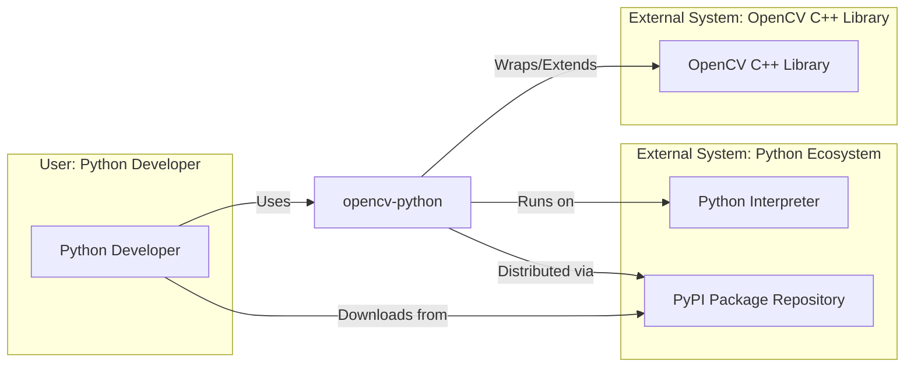
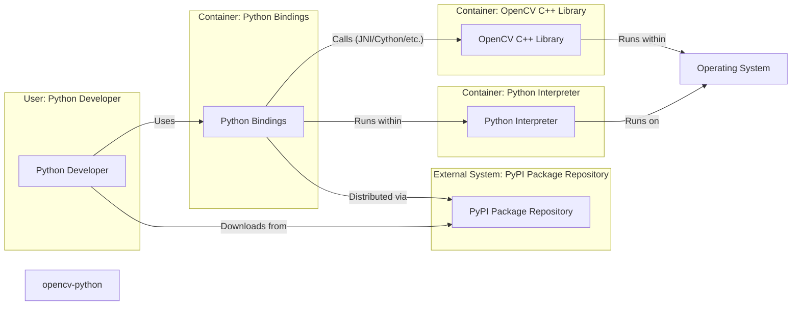
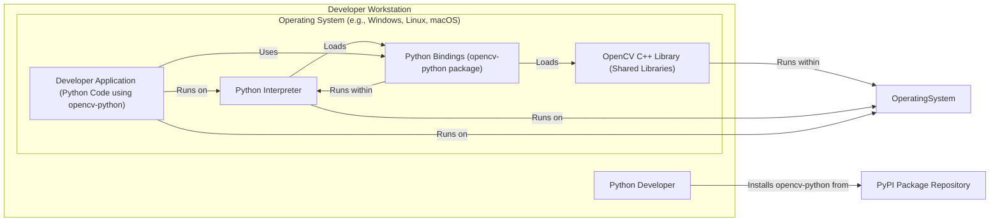

# BUSINESS POSTURE

The opencv-python project aims to provide readily usable Python bindings for the comprehensive OpenCV (Open Source Computer Vision Library). This allows Python developers to easily access and utilize OpenCV's vast array of computer vision algorithms and functionalities within their Python projects.

Business Priorities and Goals:

- Accessibility: Make OpenCV's powerful computer vision capabilities easily accessible to a wide range of Python developers, regardless of their C++ expertise.
- Ease of Use: Provide a Pythonic and user-friendly interface to OpenCV, simplifying its usage and integration into Python workflows.
- Performance: Maintain good performance despite the Python wrapper, leveraging the underlying efficiency of the C++ OpenCV library.
- Community Growth: Foster a strong community around opencv-python, encouraging contributions, feedback, and wider adoption.
- Broad Applicability: Support a wide range of platforms and Python versions to maximize the library's usability across diverse environments.

Business Risks:

- Security Vulnerabilities in OpenCV: As opencv-python relies on the underlying C++ OpenCV library, vulnerabilities in OpenCV directly impact opencv-python users.
- Security Vulnerabilities in Python Bindings:  Improperly implemented Python bindings could introduce security vulnerabilities specific to opencv-python.
- Supply Chain Risks: Compromise of the build or distribution process could lead to distribution of malicious opencv-python packages.
- Misuse of OpenCV Functionality:  While not directly a risk to the library itself, misuse of computer vision capabilities in applications built with opencv-python could have ethical and security implications (e.g., privacy violations through facial recognition).

# SECURITY POSTURE

Existing Security Controls:

- security control: Code Review - OpenCV project likely employs code review processes for contributions to the core C++ library. (Location: OpenCV project development practices)
- security control: Static Analysis -  Likely usage of static analysis tools within the OpenCV C++ project to identify potential vulnerabilities. (Location: OpenCV project development practices)
- security control: Vulnerability Scanning -  OpenCV project likely monitors for and addresses reported vulnerabilities. (Location: OpenCV project security policies and community reports)
- security control: Package Signing - Python packages distributed via PyPI are signed, providing some assurance of integrity and origin. (Location: PyPI infrastructure)

Accepted Risks:

- accepted risk: Dependency on OpenCV Security - opencv-python's security is inherently tied to the security of the upstream OpenCV C++ library. Vulnerabilities in OpenCV will affect opencv-python.
- accepted risk: Complexity of C++ and Python Interop - The complexity of bridging C++ and Python can introduce subtle security vulnerabilities that are difficult to detect.
- accepted risk: Open Source Nature - As an open-source project, vulnerabilities may be publicly disclosed before patches are available, potentially increasing the window of exploitation.

Recommended Security Controls:

- security control: Automated Security Scanning for Python Bindings - Implement automated security scanning specifically for the Python binding code to detect Python-specific vulnerabilities.
- security control: Dependency Scanning -  Automate scanning of dependencies (both Python and C++ libraries) for known vulnerabilities.
- security control: Fuzzing - Employ fuzzing techniques to test the robustness of the Python bindings and OpenCV functions against unexpected or malicious inputs.
- security control: Secure Build Pipeline - Harden the build pipeline to prevent supply chain attacks, including verifying dependencies, using secure build environments, and signing artifacts.

Security Requirements:

- Authentication: Not directly applicable to a library. Authentication is the responsibility of applications using opencv-python.
- Authorization: Not directly applicable to a library. Authorization is the responsibility of applications using opencv-python.
- Input Validation: Critical. OpenCV functions, especially those dealing with image and video processing, must perform robust input validation to prevent vulnerabilities like buffer overflows, injection attacks, and denial-of-service. This should be implemented in both the C++ OpenCV library and the Python bindings to ensure consistent protection.
- Cryptography: If opencv-python or underlying OpenCV functions handle cryptographic operations (e.g., image encryption, watermarking with digital signatures), these must be implemented using secure cryptographic libraries and best practices to protect data confidentiality and integrity.  If not directly handling crypto, ensure no accidental crypto vulnerabilities are introduced.

# DESIGN

## C4 CONTEXT



### Context Diagram Elements:

- Name: Python Developer
  - Type: User
  - Description: Software developers who use Python and want to incorporate computer vision capabilities into their applications.
  - Responsibilities:  Develop applications using opencv-python, provide feedback and contributions to the project.
  - Security controls: Responsible for secure usage of opencv-python in their applications, including proper input validation and handling of sensitive data.

- Name: opencv-python
  - Type: System
  - Description: Python bindings for the OpenCV (Open Source Computer Vision Library), providing a Python interface to OpenCV's computer vision functionalities.
  - Responsibilities:  Provide a Pythonic and efficient interface to OpenCV, ensure compatibility with different Python versions and platforms, maintain security and stability.
  - Security controls: Input validation within bindings, secure build and release process, dependency management, vulnerability scanning.

- Name: OpenCV C++ Library
  - Type: External System
  - Description: The core Open Source Computer Vision Library written in C++, providing the underlying computer vision algorithms and functionalities.
  - Responsibilities: Implement and maintain computer vision algorithms, ensure performance and correctness, address security vulnerabilities in the core library.
  - Security controls: Code review, static analysis, vulnerability scanning, input validation in C++ code.

- Name: Python Interpreter
  - Type: External System
  - Description: The Python runtime environment that executes opencv-python code.
  - Responsibilities: Execute Python code, manage memory, provide standard library functionalities.
  - Security controls: Security features of the Python interpreter itself (e.g., memory safety features), security updates to the interpreter.

- Name: PyPI Package Repository
  - Type: External System
  - Description: The Python Package Index, a repository for distributing Python packages, used to distribute opencv-python.
  - Responsibilities: Host and distribute Python packages, ensure package integrity and availability.
  - Security controls: Package signing, malware scanning, infrastructure security.

## C4 CONTAINER



### Container Diagram Elements:

- Name: Python Developer
  - Type: User
  - Description: Software developers who use Python and want to incorporate computer vision capabilities into their applications.
  - Responsibilities: Develop applications using opencv-python, provide feedback and contributions to the project.
  - Security controls: Responsible for secure usage of opencv-python in their applications.

- Name: Python Bindings
  - Type: Container
  - Description: The Python code that wraps the OpenCV C++ library, providing the Python API and handling data conversion between Python and C++.  Likely implemented using Cython or similar technology.
  - Responsibilities: Expose OpenCV functionalities to Python, handle Pythonic API, manage memory between Python and C++, perform input validation at the Python level.
  - Security controls: Input validation, secure coding practices in Python and Cython/interop code, memory management to prevent leaks or corruption.

- Name: OpenCV C++ Library
  - Type: Container
  - Description: The compiled C++ OpenCV library, containing the core computer vision algorithms and functionalities.
  - Responsibilities: Implement and execute computer vision algorithms, manage resources, ensure performance and correctness, implement input validation at the C++ level.
  - Security controls: Code review, static analysis, vulnerability scanning, input validation in C++ code, memory safety in C++ code.

- Name: Python Interpreter
  - Type: Container
  - Description: The Python runtime environment that executes the Python bindings and user code.
  - Responsibilities: Execute Python code, manage Python memory, provide Python standard library functionalities, isolate Python processes.
  - Security controls: Security features of the Python interpreter (e.g., memory safety), operating system level security controls for processes.

- Name: PyPI Package Repository
  - Type: External System
  - Description: The Python Package Index, used to distribute the opencv-python package.
  - Responsibilities: Host and distribute Python packages, ensure package integrity and availability.
  - Security controls: Package signing, malware scanning, infrastructure security.

- Name: Operating System
  - Type: Infrastructure
  - Description: The operating system on which the Python interpreter and OpenCV C++ library are running. Could be Windows, Linux, macOS, etc.
  - Responsibilities: Provide system resources, manage processes, enforce security policies at the OS level.
  - Security controls: Operating system security features (firewall, access control, kernel security), security updates to the OS.

## DEPLOYMENT

Deployment of opencv-python itself is primarily distribution to developers via PyPI.  Developers then deploy applications *using* opencv-python in various ways.  Let's consider a typical developer workstation deployment for development and testing.



### Deployment Diagram Elements:

- Name: Developer Workstation
  - Type: Environment
  - Description: The local computer used by a Python developer for developing and testing applications using opencv-python.
  - Responsibilities: Provide a development environment, execute Python code, run OpenCV libraries.
  - Security controls: Workstation security practices (OS hardening, antivirus, firewall), user access controls, developer security awareness.

- Name: Operating System (e.g., Windows, Linux, macOS)
  - Type: Infrastructure
  - Description: The operating system on the developer's workstation.
  - Responsibilities: Provide system resources, manage processes, enforce security policies at the OS level.
  - Security controls: Operating system security features, security updates.

- Name: Python Interpreter
  - Type: Software
  - Description: The Python runtime environment installed on the developer workstation.
  - Responsibilities: Execute Python code, manage Python libraries.
  - Security controls: Python interpreter security features, security updates.

- Name: OpenCV C++ Library (Shared Libraries)
  - Type: Software
  - Description: The compiled OpenCV C++ libraries installed on the developer workstation, typically as shared libraries (.dll, .so, .dylib).
  - Responsibilities: Provide the underlying computer vision algorithms.
  - Security controls:  Operating system's library loading mechanisms, file system permissions.

- Name: Python Bindings (opencv-python package)
  - Type: Software
  - Description: The opencv-python package installed in the Python environment on the developer workstation.
  - Responsibilities: Provide the Python API to OpenCV.
  - Security controls: File system permissions, Python package management security.

- Name: Developer Application (Python Code using opencv-python)
  - Type: Software
  - Description: The Python application being developed by the developer, which utilizes opencv-python.
  - Responsibilities: Implement application logic, use opencv-python for computer vision tasks.
  - Security controls: Application-level security controls (input validation, secure coding practices), secure usage of opencv-python.

- Name: PyPI Package Repository
  - Type: External System
  - Description: The Python Package Index, from which opencv-python is downloaded and installed.
  - Responsibilities: Distribute the opencv-python package.
  - Security controls: Package signing, secure infrastructure.

## BUILD

```mermaid
flowchart LR
    subgraph "Developer"
        Developer["Developer"]
    end
    subgraph "Source Code Repository (GitHub)"
        SourceCode["Source Code (C++, Python, Build Scripts)"]
    end
    subgraph "Build System (e.g., GitHub Actions, CI Server)"
        BuildEnvironment["Build Environment"]
        Compiler["C++ Compiler"]
        PythonBuildTools["Python Build Tools"]
        SecurityScanners["Security Scanners (SAST, Dependency Scan)"]
        PackageBuilder["Package Builder"]
        Signer["Package Signer"]
    end
    subgraph "Artifact Repository (PyPI)"
        PackageRepository["Package Repository (PyPI)"]
    end

    Developer -- "Commits Code" --> SourceCode
    SourceCode -- "Triggers Build" --> BuildEnvironment
    BuildEnvironment -- "Compiles C++" --> Compiler
    BuildEnvironment -- "Builds Python Bindings" --> PythonBuildTools
    BuildEnvironment -- "Runs Security Checks" --> SecurityScanners
    BuildEnvironment -- "Packages Artifacts" --> PackageBuilder
    PackageBuilder -- "Signs Artifacts" --> Signer
    Signer -- "Publishes Artifacts" --> PackageRepository
    BuildEnvironment -- "Pulls Dependencies from" --> DependencyRepositories["Dependency Repositories (e.g., Conan, PyPI)"]
```

### Build Diagram Elements:

- Name: Developer
  - Type: Person
  - Description: A developer contributing code to the opencv-python project.
  - Responsibilities: Write code, fix bugs, implement new features, adhere to secure coding practices.
  - Security controls: Secure coding training, code review participation, access control to source code repository.

- Name: Source Code Repository (GitHub)
  - Type: System
  - Description:  The Git repository hosted on GitHub that stores the source code for opencv-python, including C++, Python bindings, and build scripts.
  - Responsibilities: Version control, code collaboration, track changes, store project history.
  - Security controls: Access control (authentication and authorization), branch protection, audit logging.

- Name: Build System (e.g., GitHub Actions, CI Server)
  - Type: System
  - Description: An automated system that builds, tests, and packages opencv-python. Could be GitHub Actions, Jenkins, or another CI/CD platform.
  - Responsibilities: Automate build process, compile code, run tests, perform security checks, package artifacts, publish releases.
  - Security controls: Secure build environment, access control to build system, audit logging, hardened build agents, dependency scanning, SAST integration.

- Name: Build Environment
  - Type: Component
  - Description: The environment within the build system where the build process executes. Includes necessary tools and configurations.
  - Responsibilities: Provide a consistent and reproducible build environment, execute build steps.
  - Security controls: Isolated build environment, minimal tools installed, hardened OS image.

- Name: Compiler (C++)
  - Type: Tool
  - Description: The C++ compiler used to compile the OpenCV C++ library. (e.g., GCC, Clang, MSVC).
  - Responsibilities: Compile C++ source code into machine code.
  - Security controls: Use of trusted compiler versions, compiler security features (e.g., stack protection).

- Name: Python Build Tools
  - Type: Tool
  - Description: Tools used to build Python packages and extensions (e.g., setuptools, Cython).
  - Responsibilities: Build Python bindings, create Python packages (wheels, sdists).
  - Security controls: Use of trusted build tools, secure configuration of build tools.

- Name: Security Scanners (SAST, Dependency Scan)
  - Type: Tool
  - Description: Static Application Security Testing (SAST) tools to scan source code for vulnerabilities and dependency scanning tools to identify vulnerable dependencies.
  - Responsibilities: Identify potential security vulnerabilities in code and dependencies during the build process.
  - Security controls: Regularly updated scanners, configured to detect relevant vulnerability types, automated execution in the build pipeline.

- Name: Package Builder
  - Type: Tool
  - Description: Tool that packages the build artifacts into distributable packages (e.g., wheels, sdists).
  - Responsibilities: Create package artifacts in the correct format for distribution.
  - Security controls: Secure packaging process, integrity checks of packaged artifacts.

- Name: Signer
  - Type: Tool
  - Description: Tool used to digitally sign the package artifacts to ensure integrity and authenticity.
  - Responsibilities: Sign package artifacts using a private key.
  - Security controls: Secure key management, secure signing process, verification of signatures during distribution.

- Name: Package Repository (PyPI)
  - Type: System
  - Description: The Python Package Index, where the built and signed opencv-python packages are published for distribution.
  - Responsibilities: Host and distribute Python packages, verify signatures.
  - Security controls: Package signature verification, malware scanning, infrastructure security.

- Name: Dependency Repositories (e.g., Conan, PyPI)
  - Type: External System
  - Description: Repositories from which the build system pulls dependencies (both C++ and Python libraries) required for building opencv-python.
  - Responsibilities: Provide dependencies required for the build process.
  - Security controls: Dependency verification (checksums, signatures), use of trusted repositories, dependency scanning.

# RISK ASSESSMENT

Critical Business Processes:

- Providing a secure and reliable opencv-python library to the Python developer community.
- Maintaining the integrity and availability of the opencv-python package distribution.
- Ensuring the ongoing development and maintenance of opencv-python.

Data to Protect:

- Source code of opencv-python (C++, Python, build scripts): Sensitivity: Public, but integrity is critical to prevent malicious modifications.
- Build artifacts (Python packages): Sensitivity: Public, but integrity and authenticity are critical to prevent distribution of compromised packages.
- Signing keys used to sign packages: Sensitivity: Highly sensitive, compromise would allow malicious actors to distribute fake packages.
- Build environment secrets and credentials: Sensitivity: Sensitive, compromise could allow unauthorized modifications to the build process or access to internal systems.

Data Sensitivity:

- Source code: Publicly available, but modifications need to be controlled and auditable.
- Build artifacts: Publicly available, but must be authentic and untampered with.
- Signing keys: Highly confidential, must be protected with strong access controls and encryption.
- Build environment secrets: Confidential, must be stored and managed securely.

# QUESTIONS & ASSUMPTIONS

Questions:

- What specific static analysis tools are currently used in the OpenCV and opencv-python projects?
- Is there a formal vulnerability disclosure and patching process for opencv-python?
- What dependency scanning is performed during the build process, if any?
- How are signing keys managed and protected for package signing?
- What is the process for verifying dependencies used in the build process?
- Are there any specific security tests (e.g., fuzzing) performed on the Python bindings or OpenCV functions?

Assumptions:

- BUSINESS POSTURE: The primary goal is to provide a widely accessible, user-friendly, and performant Python interface to OpenCV for the benefit of the Python developer community. Security and reliability are important for achieving this goal.
- SECURITY POSTURE:  The opencv-python project benefits from the security practices of the upstream OpenCV project. However, additional security controls specific to Python bindings and the distribution process are necessary. The project aims to provide a reasonably secure library, acknowledging the inherent complexities of C++ and Python interoperation and open-source development.
- DESIGN: The design assumes a typical open-source project structure with a separation between the core C++ library and Python bindings. The build and deployment processes are assumed to be standard for Python packages distributed via PyPI. Security is considered throughout the design, focusing on input validation, secure build practices, and supply chain security.