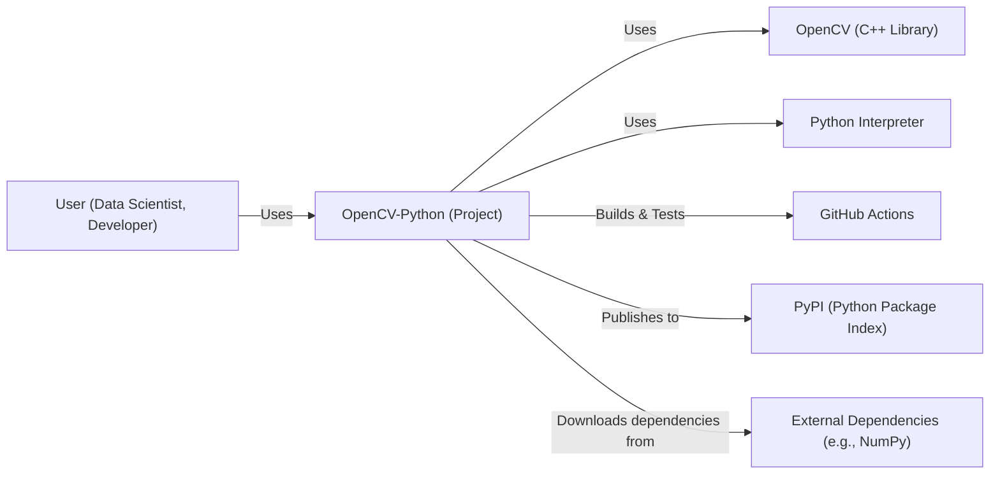
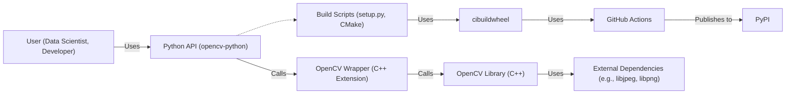
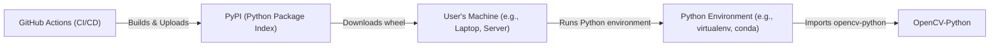

# BUSINESS POSTURE

Business Priorities and Goals:

*   Provide Python bindings for the popular OpenCV library, making it accessible to a wider range of developers, particularly those in the data science and machine learning communities.
*   Simplify the installation process for OpenCV with Python, removing the need for manual compilation and dependency management.
*   Maintain compatibility with various operating systems (Windows, macOS, Linux) and Python versions.
*   Offer pre-built packages that include optimized OpenCV builds for different CPU architectures.
*   Enable rapid prototyping and development of computer vision applications in Python.
*   Support a continuous integration and delivery pipeline to ensure timely updates and bug fixes.

Most Important Business Risks:

*   Supply chain attacks: Compromised dependencies or build processes could introduce malicious code into the pre-built OpenCV packages, affecting a large number of users.
*   Compatibility issues: Inconsistent behavior or failures across different operating systems, Python versions, or CPU architectures could damage the project's reputation and usability.
*   Lack of maintenance: Insufficient resources or community involvement could lead to outdated packages, unaddressed security vulnerabilities, and eventual project abandonment.
*   Performance bottlenecks: Poorly optimized builds or inefficient Python bindings could limit the performance of OpenCV applications, hindering adoption in performance-critical scenarios.
*   Licensing issues: Incorrect handling of OpenCV's or its dependencies' licenses could lead to legal problems.

# SECURITY POSTURE

Existing Security Controls:

*   security control: Use of GitHub Actions for automated builds and testing. (Described in the repository's workflow files).
*   security control: Multi-platform build matrix, covering various operating systems, Python versions, and CPU architectures. (Described in the repository's workflow files).
*   security control: Use of `auditwheel`, `delocate`, and `repairwheel` to manage dependencies and ensure portability on Linux, macOS, and Windows, respectively. (Described in the repository's build scripts).
*   security control: Basic linting with `flake8`. (Described in the repository's workflow files).
*   security control: Some static analysis checks via LGTM/CodeQL. (Visible on the GitHub repository page).
*   security control: Use of `cibuildwheel` to simplify the build process and handle platform-specific configurations. (Described in the repository's configuration files).
*   security control: Basic tests are run as part of the build process. (Described in the repository's workflow files).

Accepted Risks:

*   accepted risk: Limited dynamic analysis or fuzzing of the Python bindings.
*   accepted risk: Reliance on external contributors for maintaining build scripts and addressing platform-specific issues.
*   accepted risk: No formal code signing of the released packages.
*   accepted risk: No Software Bill of Materials (SBOM) generation.
*   accepted risk: No dedicated security reviews or penetration testing.

Recommended Security Controls:

*   security control: Implement Software Bill of Materials (SBOM) generation during the build process to improve supply chain security.
*   security control: Integrate static application security testing (SAST) tools specifically designed for C/C++ and Python, going beyond basic linting.
*   security control: Explore options for code signing the released packages to ensure authenticity and integrity.
*   security control: Conduct regular security reviews and penetration testing, focusing on the Python bindings and the build infrastructure.
*   security control: Implement a vulnerability disclosure program to encourage responsible reporting of security issues.
*   security control: Add dynamic analysis and fuzzing to the testing process.

Security Requirements:

*   Authentication: Not directly applicable to this project, as it primarily provides library bindings. Authentication would be handled by applications using the library.
*   Authorization: Not directly applicable, similar to authentication. Authorization would be the responsibility of applications using the library.
*   Input Validation:
    *   The Python bindings should ensure that data passed to OpenCV functions is of the expected type and format.
    *   Appropriate error handling should be implemented to gracefully handle invalid input and prevent crashes or vulnerabilities.
    *   Consider using type hints and static analysis tools to enforce type safety.
*   Cryptography:
    *   If the bindings expose cryptographic functions from OpenCV, they should be used correctly and securely.
    *   Key management and secure storage of sensitive data are the responsibility of applications using the library.
*   General:
    *   Follow secure coding practices for both Python and C/C++ to minimize vulnerabilities.
    *   Regularly update dependencies to address known security issues.
    *   Monitor for security advisories related to OpenCV and its dependencies.

# DESIGN

## C4 CONTEXT

C4 Context Element List:

*   Element:
    *   Name: User (Data Scientist, Developer)
    *   Type: Person
    *   Description: A person who uses OpenCV-Python for computer vision tasks.
    *   Responsibilities: Develops and runs applications that utilize OpenCV-Python.
    *   Security controls: Implements application-level security controls.
*   Element:
    *   Name: OpenCV-Python (Project)
    *   Type: Software System
    *   Description: Python bindings for the OpenCV library.
    *   Responsibilities: Provides a Python interface to OpenCV functionality, manages builds and packaging.
    *   Security controls: Input validation, dependency management, build process security.
*   Element:
    *   Name: OpenCV (C++ Library)
    *   Type: Software System
    *   Description: The core OpenCV library written in C++.
    *   Responsibilities: Provides computer vision algorithms and functionality.
    *   Security controls: Relies on OpenCV's internal security measures and secure coding practices.
*   Element:
    *   Name: Python Interpreter
    *   Type: Software System
    *   Description: The runtime environment for executing Python code.
    *   Responsibilities: Executes Python code, including the OpenCV-Python bindings.
    *   Security controls: Relies on the security of the Python interpreter itself.
*   Element:
    *   Name: GitHub Actions
    *   Type: Software System
    *   Description: A continuous integration and continuous delivery (CI/CD) platform.
    *   Responsibilities: Automates the build, test, and packaging process for OpenCV-Python.
    *   Security controls: GitHub Actions security features, secure configuration of workflows.
*   Element:
    *   Name: PyPI (Python Package Index)
    *   Type: Software System
    *   Description: A repository for Python packages.
    *   Responsibilities: Hosts and distributes OpenCV-Python packages.
    *   Security controls: PyPI's security measures, package signing (if implemented).
*   Element:
    *   Name: External Dependencies (e.g., NumPy)
    *   Type: Software System
    *   Description: Libraries that OpenCV-Python depends on.
    *   Responsibilities: Provide necessary functionality for OpenCV-Python.
    *   Security controls: Relies on the security of the external dependencies themselves.

## C4 CONTAINER

C4 Container Element List:

*   Element:
    *   Name: User (Data Scientist, Developer)
    *   Type: Person
    *   Description: A person who uses OpenCV-Python for computer vision tasks.
    *   Responsibilities: Develops and runs applications that utilize OpenCV-Python.
    *   Security controls: Implements application-level security controls.
*   Element:
    *   Name: Python API (opencv-python)
    *   Type: Container: Python Package
    *   Description: The user-facing Python API for OpenCV.
    *   Responsibilities: Provides Python functions and classes for accessing OpenCV functionality.
    *   Security controls: Input validation, type checking.
*   Element:
    *   Name: OpenCV Wrapper (C++ Extension)
    *   Type: Container: C++ Extension Module
    *   Description: A C++ extension module that bridges Python and the OpenCV C++ library.
    *   Responsibilities: Translates Python calls to OpenCV C++ functions, manages memory and data conversion.
    *   Security controls: Secure coding practices in C++, careful handling of memory and data types.
*   Element:
    *   Name: OpenCV Library (C++)
    *   Type: Container: C++ Library
    *   Description: The core OpenCV library.
    *   Responsibilities: Provides computer vision algorithms and functionality.
    *   Security controls: Relies on OpenCV's internal security measures and secure coding practices.
*   Element:
    *   Name: Build Scripts (setup.py, CMake)
    *   Type: Container: Scripts
    *   Description: Scripts used to build and package OpenCV-Python.
    *   Responsibilities: Configure the build process, manage dependencies, create distributable packages.
    *   Security controls: Secure configuration, dependency management.
*   Element:
    *   Name: cibuildwheel
    *   Type: Container: Tool
    *   Description: A tool for building Python wheels across multiple platforms.
    *   Responsibilities: Simplifies the build process and ensures cross-platform compatibility.
    *   Security controls: Relies on cibuildwheel's security and the security of its dependencies.
*   Element:
    *   Name: GitHub Actions
    *   Type: Container: CI/CD Platform
    *   Description: A continuous integration and continuous delivery (CI/CD) platform.
    *   Responsibilities: Automates the build, test, and packaging process for OpenCV-Python.
    *   Security controls: GitHub Actions security features, secure configuration of workflows.
*   Element:
    *   Name: PyPI
    *   Type: Container: Package Repository
    *   Description: A repository for Python packages.
    *   Responsibilities: Hosts and distributes OpenCV-Python packages.
    *   Security controls: PyPI's security measures, package signing (if implemented).
*   Element:
    *   Name: External Dependencies (e.g., libjpeg, libpng)
    *   Type: Container: Libraries
    *   Description: Libraries that OpenCV depends on.
    *   Responsibilities: Provide necessary functionality for OpenCV.
    *   Security controls: Relies on the security of the external dependencies themselves.

## DEPLOYMENT

Possible Deployment Solutions:

1.  User downloads pre-built wheels from PyPI.
2.  User builds OpenCV-Python from source.
3.  User uses a system package manager (e.g., apt, yum, brew) that provides OpenCV-Python.

Chosen Solution (most common): User downloads pre-built wheels from PyPI.

Deployment Element List:

*   Element:
    *   Name: GitHub Actions (CI/CD)
    *   Type: Node: CI/CD Platform
    *   Description: The CI/CD platform that builds and uploads OpenCV-Python wheels.
    *   Responsibilities: Automates the build, test, and upload process.
    *   Security controls: GitHub Actions security features, secure configuration of workflows.
*   Element:
    *   Name: PyPI (Python Package Index)
    *   Type: Node: Package Repository
    *   Description: The repository where OpenCV-Python wheels are hosted.
    *   Responsibilities: Stores and serves OpenCV-Python wheels.
    *   Security controls: PyPI's security measures, package signing (if implemented).
*   Element:
    *   Name: User's Machine (e.g., Laptop, Server)
    *   Type: Node: Computing Device
    *   Description: The machine where OpenCV-Python will be used.
    *   Responsibilities: Runs the Python environment and the user's application.
    *   Security controls: Operating system security, user account security.
*   Element:
    *   Name: Python Environment (e.g., virtualenv, conda)
    *   Type: Node: Isolated Environment
    *   Description: An isolated Python environment to manage dependencies.
    *   Responsibilities: Provides a clean and consistent environment for running OpenCV-Python.
    *   Security controls: Isolation from other Python environments.
*   Element:
    *   Name: OpenCV-Python
    *   Type: Node: Software
    *   Description: The installed OpenCV-Python package.
    *   Responsibilities: Provides Python bindings for OpenCV.
    *   Security controls: Input validation, dependency management, build process security.

## BUILD

```mermaid
graph LR
    Developer["Developer"] -- "Pushes code" --> GitHubRepo["GitHub Repository"]
    GitHubRepo -- "Triggers" --> GitHubActions["GitHub Actions (CI/CD)"]
    GitHubActions -- "Clones repository" --> Clone["Clone Repository"]
    Clone -- "Sets up build environment" --> Setup["Setup Build Environment"]
    Setup -- "Installs dependencies" --> InstallDeps["Install Dependencies (cibuildwheel, etc.)"]
    InstallDeps -- "Runs cibuildwheel" --> Cibuildwheel["cibuildwheel"]
    Cibuildwheel -- "Builds wheels for each platform" --> BuildWheels["Build Wheels (many parallel jobs)"]
    BuildWheels -- "Runs tests" --> RunTests["Run Tests"]
    RunTests -- "Uploads artifacts" --> UploadArtifacts["Upload Artifacts (wheels)"]
    UploadArtifacts -- "Publishes to" --> PyPI["PyPI"]
    Cibuildwheel -- "Runs linters" --> Linters["Run Linters (flake8)"]

```

Build Process Description:

1.  A developer pushes code changes to the GitHub repository.
2.  This triggers a GitHub Actions workflow.
3.  The workflow clones the repository.
4.  The build environment is set up (e.g., installing required tools, configuring the operating system).
5.  Dependencies like `cibuildwheel` are installed.
6.  `cibuildwheel` is executed.
7.  `cibuildwheel` orchestrates the build process for multiple platforms (different operating systems, Python versions, CPU architectures). This is done in parallel.
8.  For each platform, the OpenCV C++ library is built, and the Python bindings are generated.
9.  Tests are run to ensure the built wheels work correctly.
10. Linters (e.g., `flake8`) are run to check code style.
11. The built wheels are uploaded as artifacts.
12. Finally, the wheels are published to PyPI.

Security Controls in Build Process:

*   security control: GitHub Actions provides a controlled and isolated build environment.
*   security control: `cibuildwheel` helps manage dependencies and ensures consistent builds across platforms.
*   security control: Tests are run as part of the build process to catch errors early.
*   security control: Linters are used to enforce code style and identify potential issues.
*   security control: The build process is automated, reducing the risk of manual errors.
*   security control: GitHub Actions logs provide an audit trail of the build process.

# RISK ASSESSMENT

Critical Business Processes to Protect:

*   The build and distribution pipeline for OpenCV-Python packages.
*   The integrity and availability of the OpenCV-Python packages on PyPI.
*   The reputation and trustworthiness of the OpenCV-Python project.

Data to Protect and Sensitivity:

*   Source code of the OpenCV-Python bindings (Moderate sensitivity): The source code itself is publicly available, but vulnerabilities in the code could be exploited.
*   Build scripts and configuration files (Moderate sensitivity): These files control the build process and could be targeted to inject malicious code.
*   Test data (Low sensitivity): Test data is generally not sensitive, but it should be handled appropriately to avoid any unintended exposure.
*   User data (Variable sensitivity): OpenCV-Python itself does not handle user data directly. However, applications built using OpenCV-Python may process sensitive data (e.g., images, videos). The sensitivity of this data depends on the specific application.

# QUESTIONS & ASSUMPTIONS

Questions:

*   Are there any specific performance requirements or benchmarks that the OpenCV-Python bindings need to meet?
*   What is the expected frequency of releases and updates for OpenCV-Python?
*   Are there any plans to support other package managers or distribution channels besides PyPI?
*   What is the process for handling bug reports and security vulnerabilities?
*   Are there any specific compliance requirements (e.g., GDPR, HIPAA) that need to be considered?
*   What level of support is provided for older versions of OpenCV and Python?
*   Is there a mechanism for users to report issues or provide feedback?

Assumptions:

*   BUSINESS POSTURE: The primary goal is to provide a reliable and easy-to-use Python interface for OpenCV, prioritizing accessibility and ease of installation over strict security measures.
*   SECURITY POSTURE: The current security posture relies heavily on the security of GitHub Actions, PyPI, and the underlying dependencies. There is an acceptance of some risk due to the open-source nature of the project and limited resources.
*   DESIGN: The design is relatively straightforward, focusing on providing a thin wrapper around the OpenCV C++ library. The build process is the most complex part, aiming for cross-platform compatibility.
*   The project relies on community contributions for maintenance and support.
*   Users are responsible for the security of their own applications that use OpenCV-Python.
*   The project follows standard open-source practices for versioning and release management.