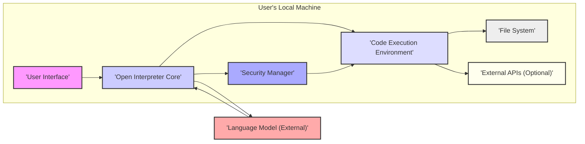

## Project Design Document: Open Interpreter - Version 1.1

**Project Name:** Open Interpreter

**Project Repository:** https://github.com/OpenInterpreter/open-interpreter

**Document Version:** 1.1

**Date:** October 26, 2023

**Author:** AI Software Architect

**1. Introduction**

This document provides an enhanced design overview of the Open Interpreter project, building upon the previous version. It aims to offer a more detailed and refined understanding of the system's architecture, components, and data flow, specifically tailored for subsequent threat modeling activities. This detailed view will facilitate a more granular analysis of potential security vulnerabilities.

Open Interpreter bridges the gap between natural language and local code execution, enabling Large Language Models (LLMs) to run code directly on a user's machine. This capability unlocks powerful applications in automation, data analysis, and more, all driven by intuitive natural language instructions.

**2. Goals**

* Provide a clear, concise, and detailed description of the Open Interpreter system architecture.
* Clearly identify key components, their specific functionalities, and their interactions.
* Illustrate the flow of data within the system with greater granularity, highlighting security-relevant transitions.
* Serve as a robust and comprehensive basis for identifying potential security threats and vulnerabilities.
* Facilitate a deeper understanding for developers, security analysts, and all relevant stakeholders.

**3. System Architecture**

The Open Interpreter system comprises the following core components, interacting within the user's local environment and with an external Language Model:

* **User Interface (UI):** The primary interface for user interaction, accepting natural language commands and displaying results.
    * Can be a Command Line Interface (CLI).
    * Can be a Graphical User Interface (GUI).
    * Potentially includes an Application Programming Interface (API) for programmatic access.
* **Language Model Interface:** Manages communication with the external LLM.
    * Responsible for formatting user prompts for the LLM.
    * Handles authentication and authorization with the LLM service.
    * Parses the LLM's responses, extracting code and natural language.
* **Open Interpreter Core:** The central orchestrator, managing the entire process.
    * Receives and interprets the LLM's response.
    * Determines the appropriate code execution environment.
    * Manages the execution process.
    * Interacts with the Security Manager for policy enforcement.
* **Code Execution Environment:** Executes the code generated by the LLM.
    * Supports various interpreters (Python, JavaScript, Shell, etc.).
    * Provides the runtime environment for the code.
    * Captures the output and error streams of the executed code.
* **Security Manager:** Enforces security policies and mitigates risks.
    * Implements sandboxing or other isolation techniques.
    * Manages permissions for code execution.
    * Controls access to system resources.
    * May perform static analysis on the generated code.
* **File System Access:** Enables interaction with the user's local file system.
    * Allows reading and writing files.
    * Potentially allows execution of local scripts.
    * Subject to the Security Manager's access controls.
* **External API Integrations (Optional):** Facilitates interaction with external services.
    * Managed by the executed code.
    * Subject to network access policies and security considerations.

**4. Data Flow (Detailed)**

The data flow within Open Interpreter involves several key steps, with the Security Manager playing a crucial role in mediating interactions:

1. **User Input:** The user provides a natural language instruction through the User Interface.
2. **Prompt Formulation:** The User Interface sends the user's input to the Open Interpreter Core. The Core formats this input into a prompt suitable for the configured Language Model.
3. **LLM Request:** The Open Interpreter Core sends the formulated prompt to the Language Model Interface.
4. **LLM Processing and Generation:** The Language Model processes the prompt and generates a response, including:
    * Natural language explanation or confirmation.
    * Code snippet(s) intended to fulfill the user's request.
5. **Response Reception:** The Language Model Interface receives the LLM's response and forwards it to the Open Interpreter Core.
6. **Code Extraction and Analysis:** The Open Interpreter Core parses the LLM's response, extracting the code snippet and identifying the intended programming language.
7. **Security Manager Evaluation:** The Open Interpreter Core sends the extracted code snippet to the Security Manager for evaluation. The Security Manager performs checks based on predefined rules and configurations, potentially including:
    * Static analysis of the code.
    * Checking for disallowed functions or commands.
    * Evaluating resource requirements.
8. **Execution Environment Preparation:** If the Security Manager approves the code for execution, the Open Interpreter Core prepares the Code Execution Environment.
9. **Code Execution Invocation:** The Open Interpreter Core instructs the Code Execution Environment to execute the extracted code.
10. **Resource Interaction (Mediated by Security Manager):** The executed code may attempt to interact with local resources:
    * **File System Access Request:** If the code attempts to access the file system, the request is intercepted by the Security Manager. The Security Manager evaluates the request based on configured permissions and either allows or denies access.
    * **External API Call:** If the code attempts to make an external API call, this action might be subject to network policies enforced by the operating system or potentially by the Security Manager.
11. **Output Capture:** The Code Execution Environment captures the standard output and standard error streams generated by the executed code.
12. **Result Relay:** The output from the Code Execution Environment is relayed back to the Open Interpreter Core.
13. **User Feedback:** The Open Interpreter Core formats the output (along with any natural language feedback from the LLM) and presents it to the user through the User Interface.

**5. Key Components in Detail**

* **User Interface (UI):**
    * **Functionality:** Provides the user's entry point and displays results. Manages user sessions and potentially user preferences.
    * **Implementation Details:** Could be a simple terminal interface using libraries like `readline`, a more sophisticated CLI using `click` or `Typer`, or a web-based GUI using frameworks like `Flask` or `Streamlit`.
    * **Security Relevance:**  Susceptible to input validation vulnerabilities. Needs to handle potentially malicious output from the LLM or executed code safely.

* **Language Model Interface:**
    * **Functionality:**  Abstracts the communication with different LLM providers. Handles API key management and potential rate limiting.
    * **Implementation Details:** Likely uses libraries specific to the LLM provider (e.g., `openai`, `transformers`). May include caching mechanisms for efficiency.
    * **Security Relevance:** Secure storage and handling of API keys are critical. Vulnerable to man-in-the-middle attacks if communication is not encrypted.

* **Open Interpreter Core:**
    * **Functionality:** The brain of the system. Manages the state of the interaction, orchestrates component interactions, and enforces high-level logic.
    * **Implementation Details:** Primarily Python-based. Handles parsing of structured LLM responses (e.g., JSON). Implements the core logic for determining execution context.
    * **Security Relevance:**  Central point for enforcing security policies. Vulnerabilities here could have wide-ranging impact.

* **Code Execution Environment:**
    * **Functionality:** Provides isolated environments for executing code. Manages the lifecycle of execution processes.
    * **Implementation Details:** Can leverage system interpreters directly, use virtual environments (for Python), or employ containerization technologies like Docker for stronger isolation.
    * **Security Relevance:**  The primary defense against arbitrary code execution risks. The level of isolation directly impacts the potential damage from malicious code.

* **Security Manager:**
    * **Functionality:**  The gatekeeper for sensitive operations. Enforces policies related to file system access, network access, and resource usage.
    * **Implementation Details:** Could involve a rule-based system, integration with operating system security features (e.g., sandboxing profiles), or custom security policies defined in code.
    * **Security Relevance:**  Crucial for mitigating the risks of executing untrusted code. The effectiveness of the Security Manager is paramount.

* **File System Access:**
    * **Functionality:** Allows controlled interaction with the user's file system.
    * **Implementation Details:** Uses standard file I/O operations, but these operations are mediated by the Security Manager. May involve whitelisting or blacklisting specific directories or file types.
    * **Security Relevance:**  A major attack vector if not properly controlled. Vulnerabilities could lead to data breaches or system compromise.

* **External API Integrations (Optional):**
    * **Functionality:** Enables the executed code to interact with external services.
    * **Implementation Details:** Relies on standard HTTP libraries or specific SDKs. Security depends on the security practices of the executed code and the underlying libraries.
    * **Security Relevance:** Introduces potential vulnerabilities related to insecure API usage, data transmission, and authentication.

**6. Security Considerations (Detailed)**

This section expands on the initial security considerations, providing more specific details and potential impacts:

* **Arbitrary Code Execution:**
    * **Threat:** Malicious or poorly generated code from the LLM could be executed, potentially harming the user's system.
    * **Impact:** System compromise, data loss, malware installation, denial of service.
    * **Mitigation:** Robust sandboxing, input validation of LLM responses, static code analysis, user confirmation before execution.
* **File System Access Control:**
    * **Threat:** Unauthorized access to the file system could lead to data breaches or modification of critical files.
    * **Impact:** Confidentiality breach, data integrity compromise, system instability.
    * **Mitigation:** Principle of least privilege, user-configurable access controls, monitoring of file system operations.
* **Resource Exhaustion:**
    * **Threat:**  Runaway code could consume excessive CPU, memory, or disk space, leading to system instability or denial of service.
    * **Impact:** System slowdown, application crashes, inability to use the system.
    * **Mitigation:** Resource limits (CPU time, memory limits), process monitoring, timeouts for code execution.
* **Data Exfiltration:**
    * **Threat:** Malicious code could transmit sensitive data to external locations without the user's knowledge.
    * **Impact:** Confidentiality breach, privacy violation.
    * **Mitigation:** Network access controls, monitoring of network activity, restrictions on external API calls.
* **Prompt Injection:**
    * **Threat:** Attackers could craft prompts that manipulate the LLM into generating harmful code or performing unintended actions.
    * **Impact:** Execution of malicious code, bypassing security controls.
    * **Mitigation:** Careful prompt engineering, input sanitization, potentially using LLMs with built-in safeguards against prompt injection.
* **Dependency Vulnerabilities:**
    * **Threat:** The project or the executed code might rely on external libraries with known security vulnerabilities.
    * **Impact:** Exploitation of vulnerabilities leading to various security breaches.
    * **Mitigation:** Regular dependency updates, vulnerability scanning tools, using well-maintained and reputable libraries.
* **Authentication and Authorization (Future Consideration):**
    * **Threat:** If the system evolves to support multiple users or remote access, inadequate authentication and authorization could allow unauthorized access.
    * **Impact:** Unauthorized access to data and functionality.
    * **Mitigation:** Implementing robust authentication mechanisms (e.g., OAuth 2.0) and fine-grained authorization controls.
* **Secrets Management:**
    * **Threat:**  Exposure of API keys or other sensitive credentials could lead to unauthorized access to external services.
    * **Impact:** Financial loss, data breaches, compromised accounts.
    * **Mitigation:** Secure storage of secrets (e.g., using environment variables or dedicated secrets management tools), avoiding hardcoding secrets in the code.
* **Logging and Auditing:**
    * **Threat:** Insufficient logging can hinder security monitoring and incident response.
    * **Impact:** Difficulty in detecting and responding to security incidents.
    * **Mitigation:** Comprehensive logging of user actions, LLM interactions, code execution events, and security-related events.

**7. Deployment Model**

Open Interpreter is primarily designed for local deployment on a user's machine.

* **Installation:** Users typically install Open Interpreter using package managers like `pip`.
* **Execution:** The application is run directly from the command line or through a GUI launcher.
* **Dependencies:** Requires Python and potentially other dependencies depending on the features used.
* **No Central Server:**  The core functionality does not rely on a central server, enhancing user privacy and control.

**8. Assumptions and Constraints**

* **User Awareness:** It is assumed that users understand the inherent risks of executing code generated by an external LLM.
* **Local Resource Availability:** The system assumes the availability of necessary interpreters and system resources on the user's machine.
* **LLM Provider Security:** The security of the external Language Model service is assumed to be the responsibility of the LLM provider.
* **Open Source Transparency:** The open-source nature allows for community scrutiny, which can aid in identifying and addressing security issues.
* **Ongoing Development:** The project is actively developed, and the architecture and security measures are subject to change.

**9. Future Considerations**

* **Advanced Sandboxing Techniques:** Exploring more sophisticated sandboxing solutions like virtual machines or secure containers with fine-grained resource control.
* **Integration of Static Application Security Testing (SAST) Tools:** Automatically analyze generated code for potential vulnerabilities before execution.
* **Dynamic Application Security Testing (DAST) Capabilities:**  Potentially incorporating methods to test the security of the executed code in a controlled environment.
* **Granular Permission Management:**  Allowing users to define more specific permissions for the code execution environment.
* **Secure Credential Management Integration:**  Seamless integration with secure secrets management solutions.
* **Enhanced Logging and Monitoring:**  Providing more detailed and configurable logging options for security auditing.

This revised document provides a more detailed and nuanced understanding of the Open Interpreter project's design, specifically focusing on aspects relevant to security. It serves as a more robust foundation for subsequent threat modeling activities.