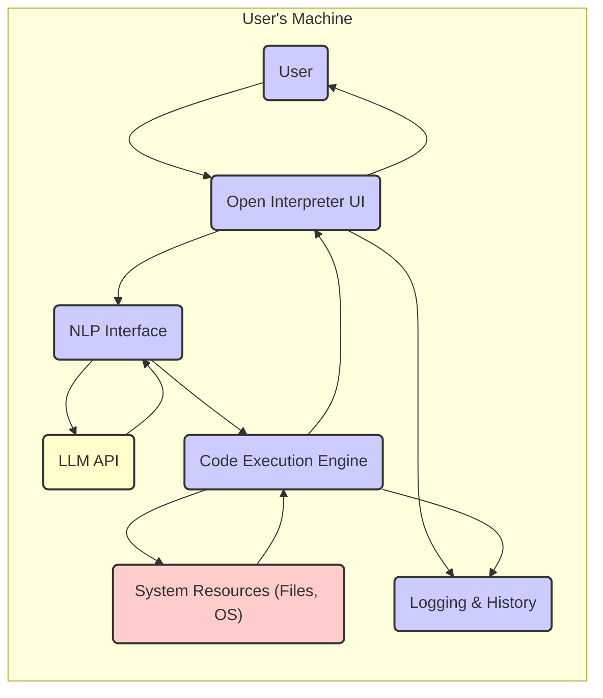
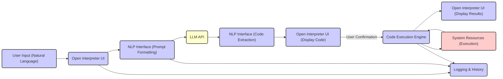

## Project Design Document: Open Interpreter (Improved)

**Project Name:** Open Interpreter

**Project Repository:** [https://github.com/openinterpreter/open-interpreter](https://github.com/openinterpreter/open-interpreter)

**Document Version:** 1.1

**Date:** October 26, 2023

**Author:** AI Software Architecture Expert

### 1. Introduction

This document provides an enhanced design overview of the Open Interpreter project. Open Interpreter empowers Large Language Models (LLMs) to execute code (Python, Javascript, Shell commands, etc.) directly on a user's local machine. This capability allows the LLM to interact with the user's operating system, file system, and other local resources. This document details the system's architecture, components, and data flow, serving as a foundation for comprehensive threat modeling and further development.

### 2. Goals and Objectives

* **Primary Goal:** To enable seamless and intuitive local code execution driven by LLM-generated instructions.
* **Key Objectives:**
    * Provide a user-friendly and accessible interface for interacting with the interpreter.
        * Support both command-line and potentially web-based interaction.
    * Offer broad language support for code execution.
        * Include popular languages like Python, Javascript, and common shell environments.
    * Implement robust security measures to control and mitigate risks associated with code execution.
        * Prioritize user review and confirmation before executing any code.
    * Maintain a transparent and auditable record of all interactions and code executions.
        * Log user inputs, LLM responses, executed code, and their outcomes.
    * Ensure ease of installation and configuration across various operating systems.

### 3. System Architecture

Open Interpreter comprises the following core components:

* **User Interface (UI):** The primary point of interaction for the user.
* **Natural Language Processing (NLP) Interface:** Manages communication with the LLM.
* **Code Execution Engine:** Responsible for the secure execution of LLM-generated code.
* **Security and Control Layer:** Enforces security policies and user confirmations.
* **Logging and History:** Records all interactions and execution details.

#### 3.1. High-Level Architecture Diagram

### 4. Detailed Component Description

* **User Interface (UI):**
    * **Functionality:**
        * Accepts natural language input from the user.
        * Displays LLM-generated code for review.
        * Presents the results of code execution.
        * Allows users to confirm or reject code execution.
    * **Implementation:**
        * Typically a Python-based Command-Line Interface (CLI) using libraries like `typer` or `argparse`.
        * Potential for a web-based interface using frameworks like Flask or FastAPI in the future.
    * **Key Interactions:**
        * Sends user prompts to the NLP Interface.
        * Receives code suggestions and execution results from the Code Execution Engine.
        * Provides user confirmation signals to the Security and Control Layer.

* **Natural Language Processing (NLP) Interface:**
    * **Functionality:**
        * Formats user prompts for optimal interaction with the LLM API.
        * Sends requests to the designated LLM API (e.g., OpenAI, Anthropic).
        * Parses the LLM's response to extract executable code snippets.
        * May involve prompt engineering techniques to guide the LLM's code generation.
    * **Implementation:**
        * Utilizes libraries like `openai`, `anthropic`, or similar SDKs for interacting with LLM APIs.
        * May employ regular expressions or parsing libraries to extract code blocks.
    * **Key Interactions:**
        * Receives user input from the UI.
        * Communicates with the external LLM API.
        * Passes extracted code to the Code Execution Engine.

* **Code Execution Engine:**
    * **Functionality:**
        * Executes the code received from the NLP Interface in the appropriate environment.
        * Supports multiple programming languages and shell commands.
        * Captures the output and error streams of the executed code.
    * **Implementation:**
        * Leverages Python's `subprocess` module for executing external commands and scripts.
        * May involve creating temporary files for script execution.
        * Could potentially integrate with language-specific execution environments (e.g., Node.js runtime).
    * **Key Interactions:**
        * Receives code from the NLP Interface.
        * Interacts with the local operating system and installed interpreters.
        * Sends execution results (output, errors) back to the UI.

* **Security and Control Layer:**
    * **Functionality:**
        * Enforces a mandatory user confirmation step before executing any LLM-generated code.
        * Provides a mechanism for users to review the code before execution.
        * Potentially integrates with sandboxing technologies to isolate the execution environment (future enhancement).
        * May include rate limiting for LLM API calls to prevent abuse.
    * **Implementation:**
        * Core logic embedded within the main application flow.
        * Could utilize libraries for sandboxing or containerization if implemented.
    * **Key Interactions:**
        * Intercepts code from the NLP Interface before execution.
        * Prompts the user for confirmation via the UI.
        * Potentially interacts with sandboxing mechanisms to create isolated environments.

* **Logging and History:**
    * **Functionality:**
        * Records all user interactions, including prompts and confirmations.
        * Logs LLM API requests and responses.
        * Stores the generated code and the commands executed.
        * Captures the output and error messages from code execution.
    * **Implementation:**
        * Uses Python's `logging` module for writing to log files.
        * Could potentially integrate with more sophisticated logging solutions or databases for persistent storage.
    * **Key Interactions:**
        * Receives data from the UI, NLP Interface, and Code Execution Engine.

### 5. Data Flow

The typical data flow within Open Interpreter follows these steps:

1. **User Input:** The user provides a natural language instruction through the UI.
2. **Prompt Transmission:** The UI sends the user's instruction to the NLP Interface.
3. **LLM API Request:** The NLP Interface formats the prompt and sends it to the configured LLM API.
4. **LLM Response Generation:** The LLM processes the prompt and generates a response, which includes the code intended to fulfill the user's request.
5. **Code Extraction and Presentation:** The NLP Interface parses the LLM's response to extract the code, and the UI displays this code to the user for review.
6. **User Confirmation:** The user explicitly confirms or rejects the execution of the displayed code through the UI.
7. **Code Execution Initiation:** If the user confirms, the UI signals the Code Execution Engine to proceed.
8. **Code Execution and System Interaction:** The Code Execution Engine executes the provided code, potentially interacting with the local file system, executing commands, or utilizing other system resources.
9. **Execution Result Capture:** The Code Execution Engine captures the output and any error messages generated during execution.
10. **Result Display:** The execution results are sent back to the UI and presented to the user.
11. **Logging:** Throughout the entire process, relevant data points (prompts, code, execution details, results) are sent to the Logging and History component for record-keeping.

#### 5.1. Data Flow Diagram

### 6. Security Considerations

Security is a critical aspect of Open Interpreter due to its ability to execute code locally. Key security considerations and potential threats include:

* **Malicious Code Generation and Execution:**
    * **Threat:** The LLM could be manipulated (prompt injection) into generating malicious code that could harm the user's system (e.g., deleting files, installing malware).
    * **Mitigation:** Mandatory user review and confirmation before execution is the primary defense. Future enhancements could include static code analysis.
* **Data Exfiltration by Executed Code:**
    * **Threat:** Executed code could access sensitive user data and transmit it to external locations.
    * **Mitigation:** User awareness and careful review of the code are crucial. Sandboxing (future enhancement) would further limit the scope of access.
* **Prompt Injection Attacks:**
    * **Threat:** Malicious users could craft prompts that trick the LLM into generating unintended or harmful code.
    * **Mitigation:** Robust prompt engineering and input validation can help mitigate this. Educating users about the risks of running untrusted code is also important.
* **Resource Exhaustion (Denial of Service):**
    * **Threat:** Runaway or poorly written code could consume excessive system resources, leading to a denial of service.
    * **Mitigation:** Implementing timeouts for code execution and potentially resource limits within a sandbox (future enhancement).
* **Supply Chain Vulnerabilities:**
    * **Threat:** Dependencies used by Open Interpreter could contain vulnerabilities that could be exploited.
    * **Mitigation:** Regularly updating dependencies and using vulnerability scanning tools.
* **LLM API Key Security:**
    * **Threat:** If the user needs to provide an LLM API key, its insecure storage or transmission could lead to unauthorized access.
    * **Mitigation:** Secure storage of API keys (e.g., using environment variables or secure credential management).
* **Lack of Robust Sandboxing (Current State):**
    * **Threat:** Currently, without strong sandboxing, executed code has broad access to the user's system.
    * **Mitigation:** Emphasize user review and confirmation. Prioritize the implementation of robust sandboxing in future versions.

### 7. Technologies Used

* **Primary Programming Language:** Python
* **LLM API Interaction:**
    * `openai` library for OpenAI models.
    * Potentially other libraries like `anthropic` for Claude.
* **User Interface (Likely):**
    * `typer` or `argparse` for CLI development.
    * Potential use of Flask or FastAPI for a web interface in the future.
* **Code Execution:** Python's `subprocess` module.
* **Logging:** Python's built-in `logging` module.
* **Potential Sandboxing Technologies (Future):**
    * Docker
    * Virtual Machines (e.g., using `virtualbox` or `libvirt` APIs)
    * Specialized sandboxing libraries (e.g., `firejail` integration).
* **Dependency Management:** `pip` and `setuptools`.

### 8. Deployment Considerations

Open Interpreter is primarily intended for local deployment on a user's machine.

* **Installation:** Typically via `pip install open-interpreter`.
* **Configuration:** May require setting environment variables for LLM API keys.
* **Platform Support:** Aims for cross-platform compatibility (Windows, macOS, Linux).

### 9. Future Considerations

* **Enhanced Sandboxing Capabilities:** Implementing robust and configurable sandboxing to isolate code execution environments with varying levels of restriction.
* **Granular Permission Management:** Allowing users to define specific permissions and restrictions for the interpreter's access to system resources.
* **Expanded Language Support:** Integrating support for a wider range of programming languages and shell environments.
* **Static Code Analysis Integration:** Incorporating tools to automatically scan LLM-generated code for potential security vulnerabilities before execution.
* **Web Interface Development:** Creating a more user-friendly web-based interface for broader accessibility.
* **Plugin Architecture:** Enabling developers to extend the functionality of Open Interpreter through a plugin system.
* **Improved Error Handling and Reporting:** Providing more informative error messages and debugging capabilities.
* **User Authentication and Authorization (for potential multi-user scenarios or web interface):** Implementing mechanisms to manage user access and permissions.

This improved design document provides a more detailed and refined understanding of the Open Interpreter project, particularly focusing on security considerations and future development directions. This information will be invaluable for subsequent threat modeling activities and ongoing development efforts.