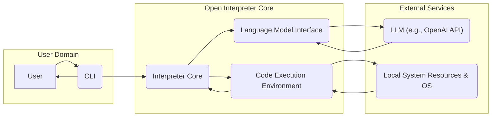
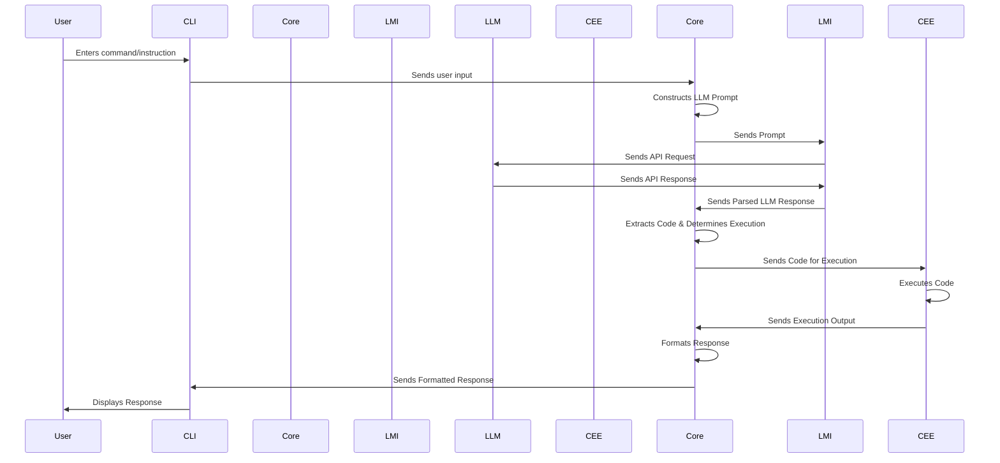

# Project Design Document: Open Interpreter

**Version:** 1.1
**Date:** October 26, 2023
**Author:** AI Software Architect

## 1. Introduction

This document provides an enhanced design specification for the Open Interpreter project, an open-source tool enabling Large Language Models (LLMs) to execute code directly on a user's local machine. This detailed design serves as a critical foundation for understanding the system's architecture, individual components, and the flow of data, which is essential for subsequent threat modeling and security analysis. This revision aims to provide greater clarity and detail compared to the initial design.

## 2. Goals and Objectives

The core goals driving the development of Open Interpreter are:

* **Facilitate LLM-Driven Code Execution:** To empower LLMs to interact with and manipulate the user's local operating environment through code execution.
* **Intuitive User Experience:** To offer a straightforward and user-friendly command-line interface (CLI) for seamless interaction.
* **Prioritize Secure Execution Practices:** To implement robust mechanisms that mitigate potential security risks inherent in allowing LLMs to execute arbitrary code.
* **Promote Extensibility and Adaptability:** To design the system with modularity in mind, allowing for easy integration with diverse LLMs and execution environments.

## 3. High-Level Architecture

Open Interpreter's architecture comprises the following principal components, working in concert:

* **Command Line Interface (CLI):** The primary point of interaction for users, responsible for receiving input and displaying output.
* **Interpreter Core:** The central processing unit, managing user requests, LLM communication, and code execution orchestration.
* **Language Model Interface:** A dedicated module that handles communication specifics with various LLM providers, abstracting away API differences.
* **Code Execution Environment:** The isolated or controlled space where LLM-generated code is executed, with a focus on security.

## 4. Detailed Design

### 4.1. Command Line Interface (CLI)

* **Purpose:** To provide the user's entry point and output display for Open Interpreter.
* **Functionality:**
    * Accepts textual input from the user, encompassing both commands and natural language instructions.
    * Presents responses from the LLM and the output generated by executed code.
    * Manages user-configurable settings and preferences for the interpreter.
    * Maintains a history of the conversation with the LLM for context.
    * Offers mechanisms for interrupting or terminating code execution.
* **Implementation Details:**
    * Likely implemented using Python libraries such as `click` or `argparse` for robust CLI management.
    * Implements basic input sanitization to prevent obvious command injection attempts before passing to the core.
    * Could include features like syntax highlighting for code output.

### 4.2. Interpreter Core

* **Purpose:** To act as the central orchestrator, managing the flow of information and execution.
* **Functionality:**
    * Receives processed user input from the CLI.
    * Constructs well-formed prompts for the chosen LLM, incorporating user input and relevant conversation history for context.
    * Delegates prompt transmission to the Language Model Interface.
    * Parses the LLM's textual response to identify and extract code blocks and execution instructions.
    * Determines the appropriate Code Execution Environment based on configuration and the nature of the code.
    * Transfers the extracted code to the Code Execution Environment for execution.
    * Receives the output (standard output and standard error) from the Code Execution Environment.
    * Formats the LLM's textual response and the code execution output for coherent presentation to the user.
    * Manages the state of the current conversation, including variables and execution context.
    * Implements security checks and policies before initiating code execution.
* **Implementation Details:**
    * Primarily implemented in Python.
    * Employs parsing techniques, potentially using regular expressions or dedicated parsing libraries, to reliably extract code from LLM responses.
    * Includes logic for managing conversation history and context window for LLM prompts.
    * Implements a decision-making process for selecting the appropriate execution environment.

### 4.3. Language Model Interface

* **Purpose:** To provide an abstraction layer for interacting with different LLM services.
* **Functionality:**
    * Handles authentication and authorization procedures required by the specific LLM API.
    * Formats prompts according to the specific requirements and conventions of the target LLM.
    * Transmits requests to the LLM API endpoint.
    * Receives and parses responses from the LLM API, handling different response formats.
    * Implements error handling and retry mechanisms for robust communication with external LLM services.
    * Potentially includes rate limiting and cost management features.
* **Implementation Details:**
    * Designed as a modular component, allowing for the addition of support for new LLMs with minimal code changes.
    * Utilizes specific API client libraries provided by LLM vendors (e.g., the `openai` Python library).
    * Responsible for securely managing API keys and access tokens, potentially using environment variables or secure configuration management.

### 4.4. Code Execution Environment

* **Purpose:** To provide a secure and controlled environment for executing code generated by the LLM.
* **Functionality:**
    * Receives code snippets from the Interpreter Core.
    * Executes the received code within the designated environment.
    * Captures the standard output and standard error streams generated during code execution.
    * Returns the captured output to the Interpreter Core.
    * Implements resource management and limitations (e.g., CPU time, memory usage) to prevent runaway processes.
    * May offer different levels of isolation or sandboxing based on user configuration and security needs.
    * Supports execution of code in various programming languages as determined by the LLM and user context.
* **Implementation Details:**
    * Can range from direct execution in the user's shell (least secure) to more isolated environments.
    * May leverage Python's `subprocess` module with carefully managed permissions and arguments for basic isolation.
    * Could integrate with containerization technologies like Docker or virtualization for stronger sandboxing.
    * Requires careful consideration of file system access and network access permissions granted to the execution environment.
    * Might involve language-specific execution mechanisms (e.g., invoking Python interpreter, Node.js runtime).

## 5. Data Flow

The sequence of actions and data exchange during a typical user interaction is as follows:

1. **User Initiates Interaction:** The user inputs a command or natural language instruction via the CLI.
2. **Input Transmission:** The CLI transmits the user's input to the Interpreter Core.
3. **Prompt Generation:** The Interpreter Core constructs a prompt for the LLM, incorporating the user's input and relevant conversational history to maintain context.
4. **Prompt Delivery:** The Interpreter Core sends the generated prompt to the Language Model Interface.
5. **API Request:** The Language Model Interface formats the prompt and sends it as a request to the configured LLM API.
6. **LLM Processing:** The LLM processes the received prompt and generates a response, potentially including code.
7. **API Response:** The LLM sends its response back to the Language Model Interface.
8. **Response Reception:** The Language Model Interface receives and parses the LLM's response.
9. **Response Forwarding:** The Language Model Interface forwards the parsed LLM response to the Interpreter Core.
10. **Code Extraction and Analysis:** The Interpreter Core analyzes the LLM's response, extracting any identified code blocks and determining the intended execution.
11. **Code Transfer:** The Interpreter Core sends the extracted code to the designated Code Execution Environment.
12. **Code Execution:** The Code Execution Environment executes the received code.
13. **Output Capture:** The Code Execution Environment captures the standard output and standard error generated during execution.
14. **Output Return:** The Code Execution Environment returns the captured output to the Interpreter Core.
15. **Response Formatting:** The Interpreter Core formats the LLM's textual response and the code execution output for clear presentation.
16. **Output Display:** The Interpreter Core sends the formatted response to the CLI.
17. **User Feedback:** The CLI displays the final response to the user.

## 6. Security Considerations (Pre-Threat Modeling)

This section outlines potential security vulnerabilities and concerns that will be the focus of detailed threat modeling activities:

* **Malicious Code Injection:**  LLM responses could inadvertently or maliciously contain code designed to harm the user's system. This includes attempts to execute arbitrary commands, modify files, or install malware.
* **Sensitive Data Exfiltration:** LLM-generated code might attempt to access and transmit sensitive user data (e.g., files, credentials, environment variables) to external locations.
* **Resource Exhaustion Attacks:** Malicious code could be generated to consume excessive system resources (CPU, memory, disk space), leading to denial-of-service or system instability.
* **Prompt Injection Vulnerabilities:** Users could craft prompts that manipulate the LLM into generating unintended or harmful code, bypassing intended security measures.
* **Supply Chain Vulnerabilities:** Security flaws in the project's dependencies (e.g., LLM client libraries, execution environment tools) could be exploited.
* **Insecure API Key Management:** Improper storage or handling of LLM API keys could lead to unauthorized access and usage.
* **Lack of Authentication and Authorization:** While currently focused on local execution, future features involving remote access or shared environments would require robust authentication and authorization mechanisms.
* **Insufficient Logging and Auditing:** Inadequate logging of user interactions and code execution makes it difficult to detect and respond to security incidents.
* **Bypass of Sandboxing Measures:**  Vulnerabilities in the Code Execution Environment's sandboxing implementation could allow malicious code to escape the sandbox and affect the host system.
* **Exposure of Internal State:**  LLM prompts might inadvertently expose internal system details or configurations, which could be exploited.

## 7. Assumptions and Constraints

* **General LLM Reliability:** The system operates under the assumption that the underlying LLM is generally reliable and adheres to instructions, although adversarial inputs are a concern.
* **Basic User Security Awareness:** Users are expected to possess a fundamental understanding of the potential risks associated with executing code generated by an external entity like an LLM.
* **Primary Python Environment:** The project is primarily developed for and intended to be run within a Python environment.
* **Network Connectivity for LLM Access:**  Communication with external LLM APIs necessitates reliable network access.
* **Sufficient Local Resources:** The system assumes the availability of adequate local computing resources (CPU, memory, disk space) for code execution.

## 8. Future Considerations

* **Advanced Sandboxing Techniques:** Implementing more sophisticated and robust sandboxing mechanisms for the Code Execution Environment, potentially leveraging virtualization or secure containers.
* **Expanded LLM Support:** Broadening the Language Model Interface to seamlessly integrate with a wider array of LLM providers and models.
* **Plugin and Extension Architecture:** Developing a plugin system to allow users and developers to extend the functionality and security features of Open Interpreter.
* **Graphical User Interface (GUI):** Exploring the development of a GUI to provide an alternative, potentially more user-friendly interface.
* **Formal Security Audits and Penetration Testing:**  Conducting regular security assessments by independent experts to identify and address potential vulnerabilities.
* **Fine-grained Permission Controls:** Implementing mechanisms for users to define and restrict the permissions granted to the Code Execution Environment.
* **Code Review and Static Analysis Integration:** Incorporating tools for automated code review and static analysis of LLM-generated code before execution.

This enhanced design document provides a more detailed and comprehensive understanding of the Open Interpreter project. It serves as a vital resource for the upcoming threat modeling process, enabling a thorough analysis of potential security risks and the development of appropriate mitigation strategies.