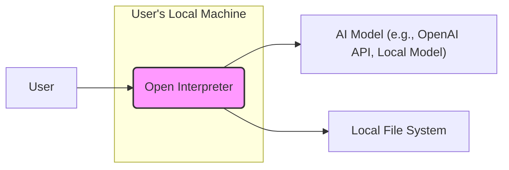
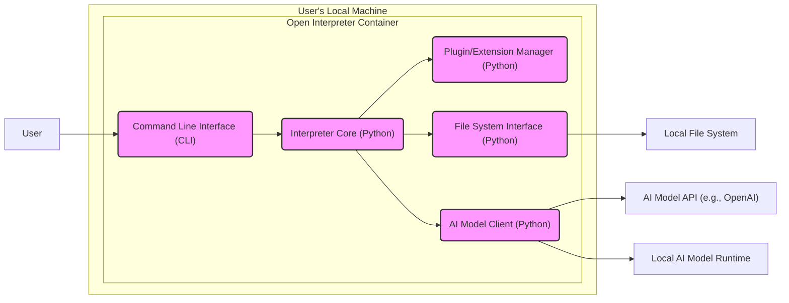
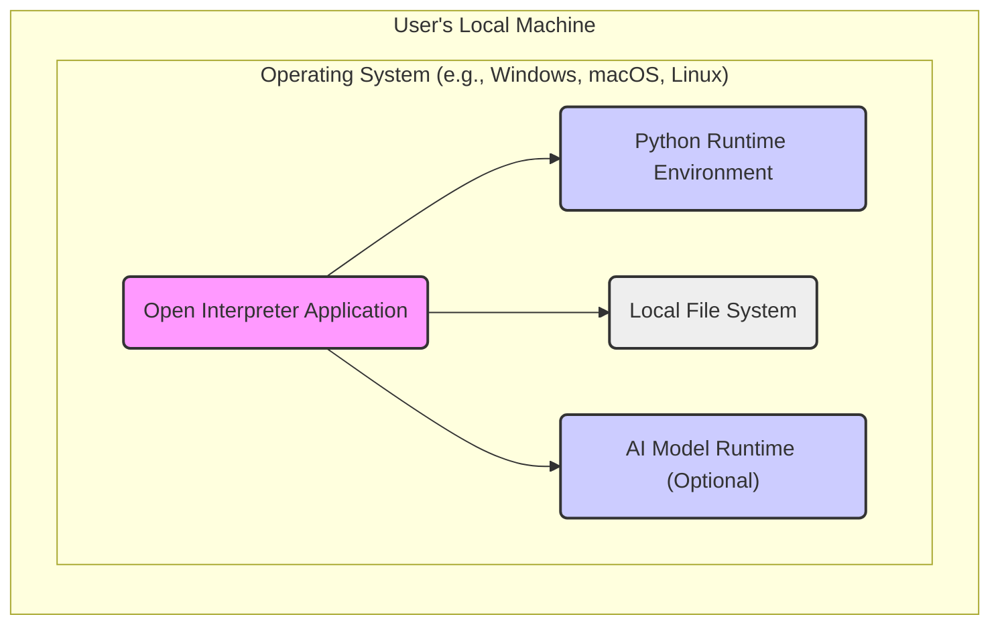
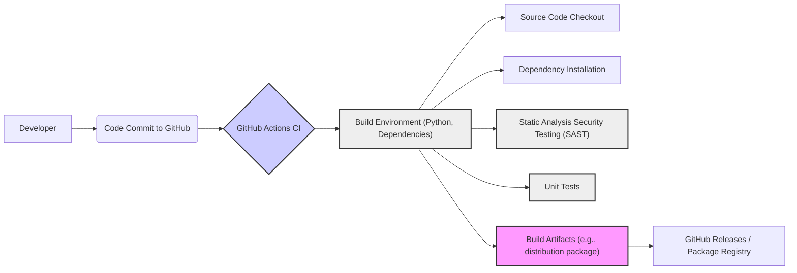

# BUSINESS POSTURE

This project, Open Interpreter, aims to bridge the gap between powerful AI models and everyday users by enabling natural language interaction with these models directly on a local computer. The primary business priority is to democratize access to advanced AI capabilities, making them user-friendly and readily available without requiring extensive technical expertise or cloud infrastructure.

The key business goals are:
- Accessibility: Make AI models easily accessible to a broad audience, including non-technical users.
- Local Execution: Enable AI model execution on local machines, enhancing privacy and reducing reliance on cloud services.
- User-Friendliness: Provide a simple and intuitive interface for interacting with complex AI models.
- Extensibility: Allow users to extend and customize the interpreter for various use cases and models.

Most important business risks that need to be addressed:
- Misuse of AI capabilities: The ease of use could lead to unintended or malicious applications of AI models.
- Data privacy: Handling user data locally introduces risks if the local environment is not secure.
- Software vulnerabilities: Security flaws in the interpreter software could be exploited, compromising user systems.
- Lack of user trust: Security concerns and potential misuse could hinder user adoption and trust in the project.

# SECURITY POSTURE

Existing security controls:
- security control: Open source code - publicly available for review and community contribution (location: GitHub repository).
- security control: Standard Python security practices - likely relies on common Python security measures and library vulnerabilities are addressed as part of the Python ecosystem. (location: assumed, based on project technology).
- security control: Local execution - data processing happens on the user's machine, reducing exposure to external networks during processing. (location: project design).

Accepted risks:
- accepted risk: Reliance on user's local machine security - the security of the interpreter is dependent on the security posture of the user's operating system and local environment.
- accepted risk: Potential for misuse - as a general-purpose tool, it can be used for unintended or malicious purposes.
- accepted risk: Vulnerabilities in dependencies - the project relies on external Python libraries, which may contain vulnerabilities.

Recommended security controls:
- security control: Input validation and sanitization - implement robust input validation to prevent injection attacks and ensure data integrity.
- security control: Secure dependency management - utilize tools and processes to manage and monitor dependencies for known vulnerabilities.
- security control: Regular security audits - conduct periodic security audits and penetration testing to identify and address potential security flaws.
- security control: User education and security guidelines - provide clear guidelines and best practices for users to securely use the interpreter.
- security control: Sandboxing or isolation - explore options to run AI model execution in a sandboxed or isolated environment to limit potential damage from malicious code or model behavior.

Security requirements:
- Authentication: Not applicable for local execution. Authentication is relevant if remote access or centralized management is considered in the future.
- Authorization: Authorization is relevant to control access to sensitive resources or actions within the interpreter, especially if plugins or extensions are introduced. For the current scope, it's less critical as it runs locally under user's permissions.
- Input validation: Critical. The interpreter must validate all user inputs and data received from external sources (if any) to prevent injection attacks, data corruption, and unexpected behavior. This includes validating commands, file paths, and data passed to AI models.
- Cryptography: Potentially relevant for secure storage of configuration or sensitive data locally, or for secure communication if the interpreter interacts with external services in the future. For the current scope, cryptography is less critical but should be considered for future enhancements.

# DESIGN

## C4 CONTEXT

Elements of context diagram:
- - Name: User
  - Type: Person
  - Description: Individual who interacts with the Open Interpreter to execute commands and interact with AI models.
  - Responsibilities: Provides natural language instructions to the Open Interpreter, reviews outputs, and manages local files.
  - Security controls: Responsible for the security of their local machine and the data they provide to the interpreter.

- - Name: Open Interpreter
  - Type: Software System
  - Description: The core application that processes user commands, interacts with AI models, and manages local file system operations.
  - Responsibilities: Interprets user commands, orchestrates interactions with AI models, manages file system access, and presents results to the user.
  - Security controls: Input validation, secure file system operations, dependency management, and potentially sandboxing for model execution.

- - Name: AI Model (e.g., OpenAI API, Local Model)
  - Type: External System / Software System
  - Description: Represents the AI model that performs the actual language processing, code execution, or other AI tasks as instructed by the Open Interpreter. Can be a cloud-based API (like OpenAI) or a locally hosted model.
  - Responsibilities: Executes AI tasks based on requests from the Open Interpreter, provides responses and outputs.
  - Security controls: API authentication and authorization (if using cloud-based API), model security and integrity (if using local models), and data privacy in model interactions.

- - Name: Local File System
  - Type: Data Store
  - Description: The user's local file system where the Open Interpreter can read and write files as instructed by the user.
  - Responsibilities: Stores user files, project data, and potentially temporary files used by the interpreter.
  - Security controls: File system permissions, access control mechanisms provided by the operating system, and secure file handling within the Open Interpreter.

## C4 CONTAINER

Elements of container diagram:
- - Name: Command Line Interface (CLI)
  - Type: Application
  - Description: The user interface for interacting with the Open Interpreter. Accepts user commands and displays output.
  - Responsibilities: User input and output handling, command parsing, and interaction with the Interpreter Core.
  - Security controls: Input validation on user commands, secure handling of sensitive information in the CLI output.

- - Name: Interpreter Core (Python)
  - Type: Application
  - Description: The main logic of the Open Interpreter, written in Python. Orchestrates all operations, including command interpretation, plugin management, file system interaction, and AI model communication.
  - Responsibilities: Command processing, plugin management, security control enforcement, data flow management, and interaction with other containers.
  - Security controls: Input validation, authorization logic (if implemented), secure coding practices, dependency management, and logging/auditing.

- - Name: Plugin/Extension Manager (Python)
  - Type: Application
  - Description: Manages plugins and extensions that extend the functionality of the Open Interpreter.
  - Responsibilities: Plugin loading, management, and isolation. Enforcing security policies for plugins.
  - Security controls: Plugin validation, sandboxing or isolation of plugins, secure plugin loading mechanisms, and access control for plugin functionalities.

- - Name: File System Interface (Python)
  - Type: Application
  - Description: Handles all interactions with the local file system. Provides an abstraction layer for file operations.
  - Responsibilities: Secure file read/write operations, path validation, access control to the file system based on user commands and interpreter logic.
  - Security controls: Path sanitization, access control checks before file operations, secure file handling practices to prevent vulnerabilities like path traversal.

- - Name: AI Model Client (Python)
  - Type: Application
  - Description: Handles communication with AI models, either through cloud APIs or local model runtimes.
  - Responsibilities: API request construction, response parsing, data serialization/deserialization for AI model interaction, and handling different AI model interfaces.
  - Security controls: Secure API key management (if applicable), secure communication protocols (HTTPS), input/output validation for AI model interactions, and error handling for API failures.

- - Name: AI Model API (e.g., OpenAI)
  - Type: External System
  - Description: Cloud-based AI model API service.
  - Responsibilities: Provides AI model capabilities via API.
  - Security controls: API authentication, authorization, rate limiting, and data encryption in transit.

- - Name: Local AI Model Runtime
  - Type: Software System
  - Description: Locally installed software to run AI models on the user's machine.
  - Responsibilities: Executes AI models locally.
  - Security controls: Model integrity verification, resource management, and isolation from the host system.

- - Name: Local File System
  - Type: Data Store
  - Description: User's local file system.
  - Responsibilities: Stores user data and files.
  - Security controls: Operating system level file permissions and access controls.

## DEPLOYMENT

Deployment architecture: Local Machine Deployment

Elements of deployment diagram:
- - Name: Open Interpreter Application
  - Type: Software
  - Description: The packaged and installed Open Interpreter application, including all necessary code and resources.
  - Responsibilities: Executes the interpreter logic, manages user interactions, and interfaces with other components.
  - Security controls: Application-level security controls, code integrity checks during installation, and secure update mechanisms.

- - Name: Python Runtime Environment
  - Type: Software
  - Description: The Python interpreter and libraries required to run the Open Interpreter application.
  - Responsibilities: Provides the execution environment for the Python-based Open Interpreter.
  - Security controls: Security updates for Python runtime and libraries, isolation from other applications on the system (to some extent provided by OS).

- - Name: Local File System
  - Type: Infrastructure
  - Description: The user's local file system where the application is installed and operates.
  - Responsibilities: Provides storage for application files, user data, and temporary files.
  - Security controls: Operating system-level file permissions and access controls, disk encryption (optional, OS-level).

- - Name: AI Model Runtime (Optional)
  - Type: Software
  - Description: If using local AI models, this represents the runtime environment for those models (e.g., specific libraries or containers).
  - Responsibilities: Executes AI models locally.
  - Security controls: Model integrity verification, resource management, and isolation from the host system.

## BUILD

Build process: Automated Build using GitHub Actions (example)

Elements of build diagram:
- - Name: Developer
  - Type: Person
  - Description: Software developer contributing code to the Open Interpreter project.
  - Responsibilities: Writes code, performs local testing, and commits code changes.
  - Security controls: Secure development practices, code review, and adherence to security guidelines.

- - Name: Code Commit to GitHub
  - Type: Process
  - Description: The action of committing code changes to the GitHub repository.
  - Responsibilities: Version control and code change tracking.
  - Security controls: Branch protection, access control to the repository, and commit signing.

- - Name: GitHub Actions CI
  - Type: Automation Platform
  - Description: GitHub's built-in CI/CD service used to automate the build, test, and release process.
  - Responsibilities: Automated build execution, testing, and artifact generation.
  - Security controls: Secure workflow definitions, secret management, and access control to CI/CD pipelines.

- - Name: Build Environment (Python, Dependencies)
  - Type: Infrastructure
  - Description: The environment where the build process is executed, including Python runtime and necessary build tools and dependencies.
  - Responsibilities: Provides a consistent and reproducible build environment.
  - Security controls: Secure base images for build environments, dependency scanning for vulnerabilities, and isolation of build environments.

- - Name: Source Code Checkout
  - Type: Process
  - Description: Retrieving the latest source code from the GitHub repository.
  - Responsibilities: Obtaining the code to be built.
  - Security controls: Secure connection to GitHub, verification of code integrity.

- - Name: Dependency Installation
  - Type: Process
  - Description: Installing required Python dependencies for the project.
  - Responsibilities: Setting up the build environment with necessary libraries.
  - Security controls: Dependency vulnerability scanning, using trusted package sources, and verifying package integrity.

- - Name: Static Analysis Security Testing (SAST)
  - Type: Security Tool
  - Description: Automated SAST tools to scan the codebase for potential security vulnerabilities.
  - Responsibilities: Identifying potential security flaws in the code.
  - Security controls: SAST tool configuration, vulnerability reporting, and integration into the build pipeline.

- - Name: Unit Tests
  - Type: Testing Process
  - Description: Automated unit tests to verify the functionality of individual code components.
  - Responsibilities: Ensuring code quality and detecting functional regressions.
  - Security controls: Security-focused unit tests to cover security-relevant functionalities.

- - Name: Build Artifacts (e.g., distribution package)
  - Type: Data
  - Description: The output of the build process, such as installable packages or distribution files.
  - Responsibilities: Packaging the application for distribution.
  - Security controls: Artifact signing, integrity checks, and secure storage of build artifacts.

- - Name: GitHub Releases / Package Registry
  - Type: Distribution Platform
  - Description: Platforms for distributing the built artifacts, such as GitHub Releases or package registries like PyPI.
  - Responsibilities: Distributing the application to users.
  - Security controls: Secure release process, integrity checks for distributed packages, and access control to release platforms.

# RISK ASSESSMENT

Critical business process we are trying to protect:
- Democratized access to AI: Ensuring the Open Interpreter remains accessible, user-friendly, and functional for a broad audience.
- User privacy: Protecting user data and ensuring local execution remains private and secure.
- Software integrity: Maintaining the integrity and security of the Open Interpreter software to prevent misuse and vulnerabilities.

Data we are trying to protect and their sensitivity:
- User commands and inputs: Sensitivity depends on the nature of the commands. Could contain personal or sensitive information if users interact with AI models using such data. Medium to High sensitivity depending on use case.
- Local files accessed by the interpreter: Sensitivity depends on the content of the files. Could be highly sensitive if users process confidential documents or data. High sensitivity.
- AI model interaction data: Sensitivity depends on the AI model and the data exchanged. If using cloud APIs, data might be transmitted externally. Medium sensitivity.
- Interpreter configuration and settings: Low sensitivity, but could contain API keys or sensitive configuration in the future. Medium sensitivity if API keys are involved.

# QUESTIONS & ASSUMPTIONS

Questions:
- What is the intended user base for Open Interpreter? (Technical users, general public, specific industries?)
- Are there plans for future features that might involve network communication or remote access?
- What is the process for managing and updating dependencies?
- Are there any specific security concerns or incidents that have been identified in the past?
- What is the expected level of security expertise among the users?

Assumptions:
- BUSINESS POSTURE: The primary goal is to provide a user-friendly and locally executable AI interaction tool for general use.
- SECURITY POSTURE: Security is important but not the primary focus in the initial stages. The project relies on standard Python security practices and open-source community review. Local execution is considered a key security feature for data privacy.
- DESIGN: The project is primarily designed for local execution on user machines. The architecture is modular, with clear separation of concerns between UI, core logic, file system interaction, and AI model communication. The build process is automated using standard CI/CD practices.