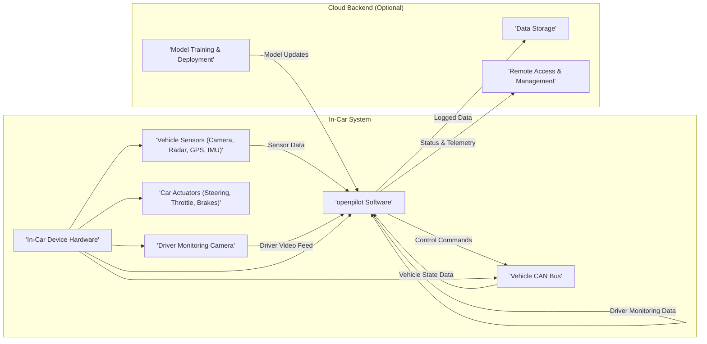

## Project Design Document: Openpilot (Improved)

**1. Introduction**

This document provides a detailed architectural design of the openpilot project, an open-source advanced driver-assistance system (ADAS) developed by comma.ai. This document aims to provide a comprehensive understanding of the system's components, their interactions, and data flows, specifically tailored for subsequent threat modeling activities.

**1.1. Purpose**

The primary purpose of this document is to thoroughly outline the architecture of openpilot, providing the necessary context and detail for effective threat modeling. It meticulously describes the key components, their specific functionalities, and the intricate interactions between them. This document will empower security professionals to systematically identify potential vulnerabilities, attack surfaces, and associated risks within the openpilot ecosystem.

**1.2. Scope**

This document encompasses the core software and hardware components of the openpilot system. This includes the in-car software stack, the communication interfaces facilitating interaction with the host vehicle, and the optional cloud infrastructure utilized for data logging, remote access, and model updates. The focus is on the logical architecture, data flows, and key interfaces, rather than delving into the fine-grained implementation details of individual software modules.

**1.3. Target Audience**

This document is primarily intended for:

* Security architects and engineers tasked with performing threat modeling, security assessments, and penetration testing of the openpilot system.
* Software developers contributing to the openpilot project who require a comprehensive, high-level understanding of the system architecture and its security implications.
* Researchers and individuals interested in gaining a deep understanding of the design, functionality, and security considerations of the openpilot system.

**2. High-Level Overview**

Openpilot is a sophisticated software suite engineered to deliver advanced driver-assistance features, such as adaptive cruise control (ACC) and lane keeping assist (LKA), on a range of compatible vehicles. It leverages a combination of computer vision algorithms, machine learning models, and real-time sensor data to perceive the surrounding environment and execute control actions on the vehicle. The system fundamentally comprises in-car software executing on a dedicated hardware device (e.g., comma three, comma two), which interfaces with the vehicle's Controller Area Network (CAN) bus and various sensors. An optional cloud backend provides supplementary functionalities.

**2.1. Key Features**

* **Adaptive Cruise Control (ACC):**  Automatically regulates the vehicle's speed to maintain a driver-set speed and dynamically adjusts to maintain a safe following distance from preceding vehicles.
* **Lane Keeping Assist (LKA):** Provides active steering inputs to keep the vehicle positioned within the boundaries of its detected lane.
* **Driver Monitoring (DM):** Continuously monitors the driver's attentiveness through visual analysis and provides alerts if signs of distraction or drowsiness are detected.
* **Data Logging (Optional):** Records a comprehensive set of sensor data, vehicle state information, and internal system events for subsequent analysis, debugging, and model improvement.
* **Cloud Connectivity (Optional):** Enables functionalities such as remote data upload, remote access for diagnostics, and the potential for over-the-air (OTA) software and model updates.

**3. System Architecture**

The openpilot architecture can be conceptually divided into the following key components, highlighting their roles and interactions:

* **In-Car Device:** The dedicated hardware platform responsible for hosting and executing the openpilot software stack.
* **Vehicle Interface:** The communication layer that manages the exchange of data and commands between the in-car device and the vehicle's internal systems.
* **Perception System:** The suite of algorithms and models responsible for processing raw sensor data to create a comprehensive understanding of the vehicle's surroundings.
* **Planning System:** The decision-making component that determines the desired vehicle behavior based on the perceived environment and driver inputs.
* **Control System:** The module that translates the planned actions into precise control commands that are sent to the vehicle's actuators.
* **Driver Monitoring System:** The component dedicated to monitoring the driver's state of attentiveness.
* **Cloud Backend (Optional):** A collection of cloud-based services providing functionalities such as data storage, model management, and remote access.

**3.1. Component Descriptions**

* **Vehicle Sensors (Camera, Radar, GPS, IMU):** These sensors are the primary source of environmental and vehicle state information.
    * **Camera:** Captures high-resolution visual information of the road ahead and surrounding objects.
    * **Radar:** Provides measurements of the distance, speed, and angle of objects, particularly useful in adverse weather conditions.
    * **GPS (Global Positioning System):** Determines the precise geographic location of the vehicle.
    * **IMU (Inertial Measurement Unit):** Measures the vehicle's linear acceleration and angular velocity across three axes.
* **Vehicle CAN Bus:** The standardized communication network within the vehicle, facilitating the exchange of data and control signals between various Electronic Control Units (ECUs).
* **openpilot Software:** The core software suite, encompassing various modules responsible for the ADAS functionalities. Key sub-modules include:
    * **Sensor Acquisition & Processing:**  Handles the retrieval and initial processing of raw data from the vehicle's sensors.
    * **Perception:** Employs computer vision and sensor fusion techniques to interpret sensor data and build a representation of the environment, including lane lines, road edges, traffic objects, and traffic signs.
    * **Planning:**  Utilizes the perceived environment and driver inputs to determine the desired trajectory, speed profile, and control actions.
    * **Control:** Translates the planned actions into specific commands for the vehicle's actuators, ensuring smooth and safe vehicle control.
    * **Driver Monitoring:** Analyzes the video feed from the driver monitoring camera to detect signs of driver distraction, drowsiness, or disengagement.
    * **Data Logging:**  Records selected sensor data, vehicle states, and internal system events for debugging, analysis, and model improvement purposes.
    * **Communication:** Manages communication with the vehicle's CAN bus and, optionally, with the cloud backend.
* **In-Car Device Hardware:** The physical hardware platform hosting the openpilot software. This typically includes:
    * **Processor (CPU/GPU):**  Provides the computational power required for real-time processing of sensor data and execution of algorithms.
    * **Memory (RAM):**  Provides temporary storage for active data and program instructions.
    * **Storage (Flash):** Stores the operating system, openpilot software, and logged data.
    * **Communication Interfaces:**  Includes interfaces for connecting to the vehicle's CAN bus, sensors, and potentially network connections (Wi-Fi, Cellular).
* **Car Actuators (Steering, Throttle, Brakes):** The mechanical components responsible for controlling the vehicle's movement, receiving commands from the openpilot system via the CAN bus.
* **Driver Monitoring Camera:** A dedicated camera focused on the driver's face, capturing video data for the driver monitoring system.
* **Cloud Backend (Optional):** A suite of cloud-based services that may include:
    * **Data Storage:** Provides scalable and persistent storage for logged data uploaded from vehicles.
    * **Model Training & Deployment:**  Infrastructure for training and deploying machine learning models used by the openpilot software.
    * **Remote Access & Management:** Enables remote monitoring of device status, diagnostics, and potentially the delivery of over-the-air (OTA) software and model updates.

**3.2. Data Flow**

The primary data flow within the openpilot system can be described as follows:

1. **Sensor Data Acquisition:** Raw data is captured by the vehicle's sensors (camera, radar, GPS, IMU).
2. **Data Ingestion:** The openpilot software receives the raw sensor data from the respective interfaces.
3. **Sensor Preprocessing:** Initial processing steps are applied to the raw sensor data to prepare it for further analysis (e.g., noise filtering, calibration).
4. **Environment Perception:** The perception module processes the preprocessed sensor data to build a comprehensive understanding of the surrounding environment, identifying lane lines, objects, and other relevant features.
5. **Planning and Decision Making:** Based on the perceived environment, driver inputs (if any), and predefined rules, the planning module determines the desired vehicle behavior, including trajectory and speed.
6. **Control Command Generation:** The control module translates the planned actions into specific control commands for the steering, throttle, and brake actuators.
7. **Vehicle Control Execution:** The generated control commands are transmitted to the vehicle's CAN bus, where they are interpreted by the relevant ECUs to actuate the vehicle's controls.
8. **Driver Monitoring Analysis:** The driver monitoring camera feed is continuously analyzed to assess the driver's attentiveness and detect signs of distraction or drowsiness.
9. **Data Logging (Optional):** Selected sensor data, vehicle states, and internal system events are logged locally on the in-car device and may be optionally uploaded to the cloud backend.
10. **Model Updates (Optional):** Updated machine learning models may be downloaded from the cloud backend and deployed on the in-car device.
11. **Telemetry and Status Reporting (Optional):** The in-car device may periodically send status and telemetry data to the cloud backend for monitoring and diagnostics.

**4. Key Technologies**

* **Primary Programming Languages:** Python (for high-level logic, machine learning), C++ (for performance-critical components).
* **Operating System:** Typically a Linux-based embedded operating system, often based on the Android Open Source Project (AOSP).
* **Communication Protocols:** CAN bus (for vehicle communication), Ethernet (for internal device communication), Wi-Fi and Cellular (optional, for cloud connectivity).
* **Machine Learning Frameworks:** Primarily TensorFlow and/or PyTorch for developing and deploying machine learning models.
* **Cloud Platforms (Optional):**  May utilize various cloud platforms such as AWS, Google Cloud Platform, or Azure for backend services.

**5. Deployment Model**

Openpilot is typically deployed as an aftermarket solution, requiring the installation of a dedicated in-car device that interfaces with the vehicle's existing systems. The device runs the openpilot software and interacts directly with the vehicle's CAN bus and sensors. Cloud connectivity is an optional feature, configurable by the user.

**6. Security Considerations (Initial)**

This section outlines initial security considerations relevant to the openpilot system, serving as a starting point for a more in-depth threat modeling exercise.

* **Compromise of the In-Car Device:**  If an attacker gains unauthorized access to the in-car device, they could potentially manipulate vehicle controls, inject malicious CAN messages, or exfiltrate sensitive data.
* **CAN Bus Attacks:**  Vulnerabilities in the vehicle's CAN bus implementation or insufficient access controls could allow attackers to inject malicious messages, leading to unintended or dangerous vehicle behavior.
* **Sensor Spoofing and Manipulation:**  Attacks targeting the vehicle's sensors could provide false or misleading data to the openpilot system, causing it to make incorrect decisions.
* **Data Privacy and Security:** Logged data may contain sensitive information about driving habits, locations, and potentially personal information, requiring appropriate security measures to protect its confidentiality and integrity.
* **Cloud Account Compromise (Optional):** If cloud connectivity is enabled, a compromised user account or cloud infrastructure could allow unauthorized access to logged data, remote control of the device, or the injection of malicious software updates.
* **Supply Chain Security:**  The security of the hardware and software components used in the in-car device is critical. Compromised components could introduce vulnerabilities into the system.
* **Software Vulnerabilities:**  Bugs or vulnerabilities in the openpilot software itself could be exploited by attackers to gain control of the system or cause it to malfunction.
* **Over-the-Air (OTA) Update Security (Optional):** The mechanisms for delivering and verifying software and model updates must be robust to prevent the installation of malicious or compromised updates.
* **Physical Security:**  The physical security of the in-car device is important to prevent unauthorized access or tampering.

**7. Assumptions and Constraints**

* **Vehicle Compatibility:** Openpilot's functionality and effectiveness are dependent on the specific vehicle model and its supported features and communication protocols.
* **User Responsibility:** The driver remains ultimately responsible for the safe operation of the vehicle at all times. Openpilot is designed as an assistive system and not a fully autonomous driving solution.
* **Open Source Nature:** The open-source nature of the project fosters community contributions and transparency but also necessitates careful management of security vulnerabilities and code quality.
* **Ongoing Development:** Openpilot is an actively developed project, and its architecture, features, and security measures are subject to change and improvement over time.
* **Ethical Considerations:** The development and deployment of ADAS technologies raise ethical considerations regarding safety, privacy, and the potential impact on society.

This document provides a comprehensive architectural overview of the openpilot project, specifically designed to facilitate thorough threat modeling activities. The information presented here serves as a foundation for identifying and mitigating potential security risks within the system.