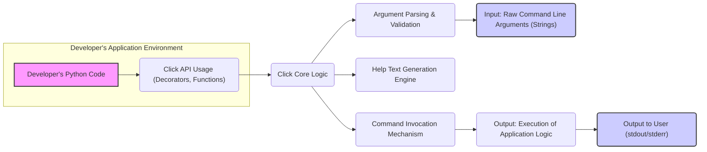

# Project Design Document: Click - Command-Line Interface Creation Kit

**Version:** 1.1
**Date:** October 26, 2023
**Author:** AI Software Architect

## 1. Introduction

This document provides an enhanced architectural design for the Click Python library, a widely adopted package for crafting elegant and composable command-line interfaces. Building upon the previous version, this iteration offers a more detailed exploration of Click's internal structure, data flow, and security considerations. This document is intended to serve as a robust foundation for subsequent threat modeling activities, enabling a deeper understanding of potential vulnerabilities and the design of effective security mitigations.

## 2. Goals

*   Present a refined and more detailed overview of Click's architecture.
*   Clearly delineate the key components and their intricate interactions.
*   Provide a comprehensive description of the data flow within a Click-based application, including transformations and validation steps.
*   Emphasize areas critically relevant to security considerations and the threat modeling process, offering more specific examples.
*   Serve as an authoritative and up-to-date reference point for ongoing development, security analysis, and architectural discussions.

## 3. Non-Goals

*   Exhaustive, line-by-line code-level documentation.
*   Microscopic implementation details of every function or class within the Click library.
*   Performance benchmarking data or specific optimization strategies for Click.
*   Instructions for deploying or packaging the Click library itself.
*   A completed security analysis or a definitive list of vulnerabilities (this document is a *precursor* to such activities).

## 4. Architectural Overview

Click is architected as a library seamlessly integrated into Python applications. Its core strength lies in providing a declarative paradigm for defining command-line interfaces, abstracting away the complexities of argument parsing, automatic help text generation, and robust error handling. The underlying design prioritizes developer experience, aiming for an intuitive and less error-prone approach to CLI creation.

### 4.1. High-Level Architecture Diagram

### 4.2. Key Components

*   **Click API Layer:** This is the primary point of interaction for developers. It comprises decorators (e.g., `@click.command`, `@click.option`, `@click.argument`) and functions (e.g., `click.echo`, `click.prompt`, `click.get_current_context`) that enable the declarative definition of commands, options, arguments, and user interaction elements.
*   **Command Object:** Represents a single, executable unit within the CLI application. Commands are typically defined using the `@click.command()` decorator, associating a Python function with a command name.
*   **Group Object:**  Functions as a container for organizing multiple commands, facilitating the creation of nested CLI structures (subcommands). Defined using the `@click.group()` decorator.
*   **Option Object:** Represents a named parameter that modifies the behavior of a command. Defined using the `@click.option()` decorator. Options have attributes like data type, default values, help text, and flags (short options).
*   **Argument Object:** Represents a positional parameter passed to a command. Defined using the `@click.argument()` decorator. The order of arguments is significant.
*   **Context Object:** A crucial object that holds state information relevant to the current command execution. This includes parsed arguments, parent contexts for nested commands, and allows for sharing data across the command invocation hierarchy. Accessible via `click.get_current_context()`.
*   **Parameter Processing Engine:** The core logic responsible for parsing the raw command-line arguments provided by the user. This involves tokenization, matching arguments and options to their definitions, and converting string inputs into the appropriate Python data types. It also includes built-in validation based on defined types and constraints.
*   **Help Text Generation Engine:** Automatically generates user-friendly help messages based on the defined commands, options, and arguments. This includes usage instructions and descriptions.
*   **Command Invocation Mechanism:** The process by which Click calls the developer-defined Python function associated with a command, passing the parsed and validated arguments as parameters.
*   **Input/Output Handling Utilities:** Provides functions for interacting with the user, such as `click.echo` for controlled output to the console (supporting styling) and `click.prompt` for securely reading user input (including password prompting).
*   **Type System:** Defines a set of built-in data types for options and arguments (e.g., `str`, `int`, `float`, `bool`, `File`, `Choice`). It also allows developers to define custom types for more specialized validation and conversion.
*   **Exception and Error Handling Framework:** Manages errors that occur during argument parsing and command execution. Click provides informative error messages to the user and handles exceptions gracefully.

### 4.3. Data Flow

The flow of data within a Click-based application generally follows these stages:

1. **CLI Definition:** The developer utilizes the Click API (decorators and functions) to define the structure of their command-line interface. This definition resides within the developer's Python source code.
    *   Data Representation: Python code defining commands, options, and arguments.
2. **Command-Line Invocation:** The end-user executes the Python script from the command line, providing arguments and options.
    *   Input Source: Command-line interpreter (shell).
    *   Data Type: Strings (initially).
3. **Argument Parsing and Validation:** Click's parameter processing engine receives the raw command-line arguments as input.
    *   Process: The input string is tokenized (split into words). Click attempts to match these tokens to defined commands, options, and arguments.
    *   Validation:  Crucially, Click validates the provided input against the defined types, constraints (e.g., choices for options), and required parameters. Type conversion from strings to Python objects occurs here.
    *   Error Handling: If parsing or validation fails (e.g., incorrect number of arguments, invalid option values), Click generates an informative error message and typically exits the application.
4. **Context Creation and Management:** A `Context` object is instantiated to maintain state information for the current command execution. For nested commands, a hierarchy of contexts is established, allowing for data sharing and management across the command structure.
    *   Data Stored: Parsed arguments (as Python objects), command object, parent context (if applicable).
5. **Command Invocation:** Based on the successful parsing of the command and its arguments, Click invokes the corresponding developer-defined Python function.
    *   Input: The parsed and validated arguments are passed as parameters to the function. The `Context` object can also be accessed within the function.
6. **Application Logic Execution:** The developer's function executes, utilizing the provided arguments to perform its intended task.
7. **Output Generation:** The application logic produces output, which is often presented to the user via Click's output handling utilities.
    *   Output Destination: Typically standard output (stdout) or standard error (stderr).
    *   Data Type: Strings (primarily), potentially formatted using Click's styling features.
8. **Exit:** The command execution concludes, and the application terminates.

### 4.4. Extensibility Points

Click's design incorporates several avenues for extending its core functionality:

*   **Custom Parameter Types:** Developers can define their own data types for options and arguments, enabling highly specific validation and data conversion tailored to their application's needs. This allows for handling complex input formats or domain-specific data.
*   **Custom Commands and Groups:** The ability to create reusable commands and groups promotes modularity and code reuse. Developers can build libraries of custom CLI components that can be easily integrated into different Click-based applications.
*   **Callbacks for Parameter Processing:** Functions can be associated with options and arguments to perform custom processing or validation logic *before* the main command function is executed. This allows for pre-processing input or implementing more complex validation rules.
*   **Decorators for Customization:** Click's decorator-based API facilitates extending the behavior of commands and groups in a declarative and readable manner. This allows for adding custom logic around command execution.
*   **Plugin System (via Entry Points):** Click supports a plugin system based on Python entry points, allowing external packages to register new commands or extend existing functionality without modifying the core Click library.

## 5. Security Considerations (For Threat Modeling)

This section details security aspects of Click's architecture that are crucial for threat modeling.

*   **Command-Line Argument Injection:**
    *   **Threat:** Maliciously crafted command-line arguments could potentially be interpreted in unintended ways by the application or underlying system, especially if Click is used to construct system commands (though this is generally discouraged).
    *   **Mitigation:** Click's parameter parsing and validation provide a degree of protection, but developers must be mindful of how user input is used, particularly when interacting with external processes.
*   **Input Validation Vulnerabilities:**
    *   **Threat:** Insufficient or incorrect validation of command-line arguments can lead to various vulnerabilities, such as buffer overflows (less likely in Python but still a concern in underlying C libraries), format string bugs (if logging user input directly), or unexpected program behavior.
    *   **Mitigation:** Leverage Click's built-in type system and validation capabilities. Define specific types and constraints for options and arguments. Consider using custom types for more complex validation.
*   **Dependency Chain Risks:**
    *   **Threat:** Click relies on other Python packages. Vulnerabilities in these dependencies could indirectly affect the security of applications using Click.
    *   **Mitigation:** Regularly audit and update Click's dependencies. Utilize tools like `safety` or `pip-audit` to scan for known vulnerabilities.
*   **Information Disclosure through Error Messages:**
    *   **Threat:** Overly verbose or poorly crafted error messages might reveal sensitive information about the application's internal workings, file paths, or environment, aiding attackers.
    *   **Mitigation:** Ensure error messages are informative to the user but avoid exposing sensitive details. Handle exceptions gracefully and log errors securely.
*   **Security of Extensibility Mechanisms:**
    *   **Threat:** If custom types, commands, or plugins are used, they could introduce vulnerabilities if not developed securely. Malicious plugins could compromise the application.
    *   **Mitigation:**  Carefully review and vet any custom extensions or plugins. Follow secure coding practices when developing custom components. Consider using code signing or other mechanisms to verify the integrity of extensions.
*   **Insecure Defaults:**
    *   **Threat:** While Click aims for secure defaults, developers might inadvertently introduce insecure configurations or usage patterns.
    *   **Mitigation:**  Review Click's documentation for security best practices. Be aware of potential security implications when configuring options or using advanced features.
*   **Handling of Sensitive Data on the Command Line:**
    *   **Threat:** Passing sensitive information like passwords or API keys directly as command-line arguments can expose them in shell history or process listings.
    *   **Mitigation:** Avoid passing sensitive data directly on the command line. Utilize `click.prompt(hide_input=True)` for secure password input or consider alternative methods for managing sensitive credentials (e.g., environment variables, configuration files).
*   **Denial of Service (DoS) Attacks:**
    *   **Threat:** An attacker might provide a large number of invalid or specially crafted command-line arguments to overwhelm the parsing logic and cause a denial of service.
    *   **Mitigation:** While Click handles parsing efficiently, consider implementing rate limiting or input sanitization at a higher level if DoS is a significant concern.
*   **Locale and Encoding Exploits:**
    *   **Threat:** Issues related to handling different character encodings or locales could potentially be exploited to bypass validation or introduce unexpected behavior.
    *   **Mitigation:** Ensure consistent encoding handling throughout the application. Be aware of potential vulnerabilities related to locale settings.

## 6. Future Considerations

*   **Enhanced Security Guidance in Documentation:**  Provide more explicit and comprehensive documentation on secure coding practices when using Click, highlighting potential security pitfalls and recommended mitigations.
*   **Optional Built-in Security Features:** Explore the feasibility of adding optional features like automatic input sanitization or stricter validation rules that developers can easily enable.
*   **Improved Integration with Security Analysis Tools:**  Ensure that Click-based applications can be easily analyzed by common security scanning and vulnerability assessment tools.
*   **Regular Security Audits and Vulnerability Disclosure Program:**  Conduct periodic security audits of the Click library itself and establish a clear process for reporting and addressing security vulnerabilities.

This enhanced design document provides a more in-depth understanding of the Click library's architecture and its security implications. This detailed information is essential for conducting thorough threat modeling and building secure command-line applications using Click.
