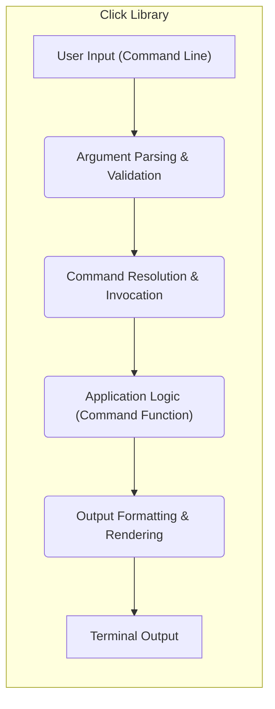
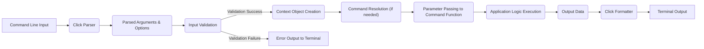
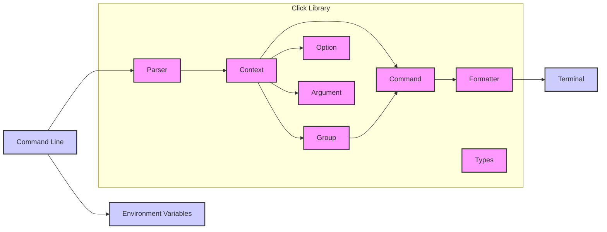
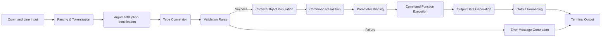

# Project Design Document: Click - Command-Line Interface Creation Kit

**Version:** 1.1
**Date:** October 26, 2023
**Author:** AI Software Architect

## 1. Introduction

This document provides an enhanced and detailed design overview of the Click library, a Python package renowned for creating user-friendly and composable command-line interfaces. This document is specifically crafted to serve as a robust foundation for subsequent threat modeling activities. It meticulously outlines the key components, the intricate flow of data, and crucial architectural considerations within the Click library.

## 2. Goals and Objectives

The overarching goal of this document is to furnish a comprehensive and in-depth architectural understanding of the Click library, specifically tailored for security analysis. The specific objectives are:

*   Clearly define each of the major components within Click, elaborating on their individual responsibilities and interactions.
*   Illustrate the precise flow of data within the library during the execution of a command, highlighting transformation points.
*   Identify and describe key interaction points between the Click library and its external environment, including potential attack surfaces.
*   Provide a solid and detailed basis for identifying potential security vulnerabilities and attack vectors during subsequent threat modeling exercises.

## 3. Scope

This document maintains its focus on the internal architecture and inherent functionality of the Click library itself. It comprehensively covers:

*   The fundamental core components that constitute the Click library.
*   The step-by-step process involved in defining and subsequently executing commands.
*   The mechanisms for handling arguments, options, and parameters passed to commands.
*   The processes involved in output formatting and the interaction with the user's terminal.

This document explicitly excludes:

*   Specific applications that are built utilizing the Click library.
*   The underlying Python interpreter or the host operating system on which Click runs.
*   Third-party libraries that might be integrated or used in conjunction with Click within specific applications.

## 4. High-Level Architecture

Click's architectural design is fundamentally based on the principle of constructing command-line interfaces as a structured hierarchy of commands. It offers decorators and classes that facilitate the definition of commands, options, and arguments, while internally managing the complex logic of parsing user input and executing the corresponding command.



## 5. Detailed Design

### 5.1. Core Components (Detailed)

*   **`Command`:**  Represents a distinct, executable command-line action. It encapsulates the specific logic to be performed when the command is invoked. Crucially, `Command` objects can be nested within `Group` objects to create hierarchical command structures (subcommands). They hold metadata about expected arguments and options.
*   **`Group`:** A specialized type of `Command` that serves as a container for organizing other `Command` objects (subcommands). A `Group` itself typically doesn't have directly associated execution logic but is responsible for correctly dispatching execution to its contained subcommands based on user input.
*   **`Option`:** Represents an optional parameter that modifies the behavior of a `Command`. `Option` objects have associated names (e.g., `--verbose`, `-v`), can accept values, and define how these values should be parsed and validated. They can also have default values and help text.
*   **`Argument`:** Represents a positional parameter that is typically required for a `Command` to execute correctly. `Argument` values are provided in a specific order on the command line and are identified by their position rather than a name. They also have associated types and can have validation rules.
*   **`Context`:** A crucial object that holds state information relevant to the current command execution. This includes the parsed values of arguments and options, a reference to the parent context (for nested commands), and utility functions for tasks like prompting the user or exiting the application. The `Context` is passed to the command function.
*   **`Parameter`:** An abstract base class from which both `Option` and `Argument` inherit. It defines common attributes and methods shared by parameters, such as name, type, and help text. This promotes code reuse and a consistent parameter handling mechanism.
*   **`Parser`:** The core component responsible for taking the raw string input from the command line and transforming it into a structured representation of arguments and options. It interprets the command-line syntax based on the defined `Command`, `Option`, and `Argument` configurations. This is a critical point for potential input manipulation attacks.
*   **`Formatter`:** Handles the presentation and styling of output messages, help texts, and error messages displayed to the user. It ensures a consistent and user-friendly output format. This component can be influenced by configuration settings.
*   **`Types`:** Defines a collection of built-in data types (e.g., string, integer, boolean, file) that can be associated with arguments and options. It also provides mechanisms for defining custom data types and their associated parsing and validation logic.

### 5.2. Command Definition and Registration (Elaborated)

Commands are typically defined by applying decorators provided by the Click library to standard Python functions. Decorators like `@click.command()` and `@click.group()` attach metadata to these functions, signaling to Click that they represent command-line commands or groups of commands, respectively. The order and configuration of these decorators are crucial in defining the command's interface.

```python
import click

@click.command()
@click.option('--count', default=1, help='Number of greetings.')
@click.argument('name')
def hello(count, name):
    """A simple program that greets NAME for a total of COUNT times."""
    for x in range(count):
        click.echo(f'Hello {name}!')

if __name__ == '__main__':
    hello()
```

In this example, the decorators perform the following actions:

*   `@click.command()`:  Registers the `hello` function as a top-level command. This makes the function callable directly from the command line.
*   `@click.option('--count', ...)`: Defines an optional parameter named `--count`. The `default` argument specifies a default value if the option is not provided. The `help` argument provides descriptive text for the help message.
*   `@click.argument('name')`: Defines a positional argument named `name`. The order of `@click.argument` decorators is significant as it determines the order in which arguments must be provided on the command line.

### 5.3. Command Invocation Flow (Detailed)

The process of invoking a Click command involves a series of well-defined steps, ensuring proper parsing, validation, and execution:

1. **Parsing:** The `Parser` component is initiated, taking the raw command-line arguments (e.g., `my_script.py --count=3 John`) as input. It analyzes this input based on the defined options and arguments associated with the invoked command. This stage involves tokenizing the input and matching tokens to defined parameters.
2. **Validation:** The parsed arguments and options undergo validation against their declared data types and any specified constraints (e.g., allowed values, ranges). Click attempts to convert the string inputs to the expected types. Validation errors will halt execution and display an error message.
3. **Context Creation:** A `Context` object is instantiated to maintain the state relevant to the current command execution. This includes storing the validated argument and option values, establishing a link to any parent contexts (for subcommands), and providing access to utility functions.
4. **Command Resolution:** For nested commands, Click determines the specific command function to execute based on the subcommand path provided by the user.
5. **Parameter Passing:** The validated and type-converted argument and option values are passed as keyword arguments to the Python function associated with the invoked command. The `Context` object itself is also typically passed as an argument.
6. **Command Execution:** The Python function containing the core logic of the command is executed. This is where the application-specific actions are performed.
7. **Output Handling:** During execution, the command logic may utilize functions like `click.echo()` to generate output intended for the user. The `Formatter` component then takes this output and renders it appropriately for display on the terminal, respecting any configured styling or formatting options.



### 5.4. Data Flow (Detailed)

The flow of data within Click is primarily concerned with the transformation of raw command-line input into actionable data and the subsequent presentation of results.

*   **Input:** The initial data consists of raw strings entered by the user on the command line. This input is untrusted and potentially malicious.
*   **Parsing:** The `Parser` component attempts to interpret these raw strings according to the defined command structure. This involves identifying command names, options, and arguments.
*   **Type Conversion & Validation:**  Parsed string values are converted to their expected data types (e.g., string to integer). Validation rules are applied to ensure the data conforms to expected constraints. This stage is crucial for preventing type errors and invalid input from reaching the application logic.
*   **Context Storage:** The successfully parsed and validated data is stored within the `Context` object, providing a structured and accessible representation of the user's input.
*   **Command Function Input:** The `Context` object and the individual argument and option values are passed as input to the designated command function.
*   **Output Generation:** The command function processes the input data and generates output data, which can be strings, structured objects, or other data types.
*   **Formatting:** The `Formatter` component takes the output data and transforms it into a human-readable format suitable for display on the terminal. This might involve applying styling, handling different output encodings, and managing the layout of information.

### 5.5. Key Interaction Points (Security Perspective)

Click's interactions with the external environment represent potential attack surfaces:

*   **Command-Line Input:** This is the most direct point of interaction with the user and a primary target for malicious input. Attackers might attempt to inject unexpected characters, excessively long strings, or format string specifiers.
*   **Terminal Output:** While primarily for displaying information, vulnerabilities in the terminal emulator or the way Click formats output could potentially be exploited (e.g., ANSI escape code injection).
*   **Environment Variables:** If Click relies on environment variables for configuration or input, these variables could be manipulated by an attacker with sufficient access to the system.
*   **File System (Indirectly via Arguments):** When commands accept file paths as arguments, this creates opportunities for path traversal attacks if the application logic doesn't properly sanitize or validate these paths.
*   **Standard Input (Stdin):** Some Click applications might read data from standard input. This input should be treated with the same caution as command-line arguments.

## 6. Security Considerations (Expanded)

Building upon the interaction points, here are more detailed security considerations:

*   **Input Validation Vulnerabilities:** Insufficient or incorrect validation of user-provided arguments and options is a major security risk. This can lead to:
    *   **Injection Attacks (e.g., SQL Injection, Command Injection):** If input is directly incorporated into database queries or shell commands without proper sanitization.
    *   **Buffer Overflows:** If the application allocates a fixed-size buffer for input and doesn't check the input length.
    *   **Denial of Service (DoS):** By providing extremely large or malformed input that consumes excessive resources.
*   **Path Traversal Vulnerabilities:** If commands accept file paths as arguments and these paths are not properly sanitized, attackers could potentially access files outside the intended directory.
*   **Shell Injection Vulnerabilities:** If Click is used to construct shell commands based on user input (e.g., using `subprocess`), inadequate sanitization of user-provided data can allow attackers to execute arbitrary commands on the system.
*   **Format String Vulnerabilities (Less likely in modern Python):** While less common in modern Python due to safer string formatting methods, if older formatting techniques are used with user-controlled input, format string vulnerabilities could allow attackers to read from or write to arbitrary memory locations.
*   **Information Disclosure:**  Error messages or verbose output might inadvertently reveal sensitive information about the application's internal workings or the system environment.
*   **Configuration Vulnerabilities:** If Click applications rely on configuration files or environment variables, vulnerabilities in how these are parsed or stored could be exploited.
*   **Dependency Vulnerabilities:** While not directly within Click, applications using Click depend on it. Keeping Click and other dependencies updated is crucial to mitigate known vulnerabilities in those libraries.

## 7. Diagrams

### 7.1. Component Diagram (Improved)



### 7.2. Data Flow Diagram (More Detailed)



## 8. Future Considerations

This design document provides a comprehensive view of Click's architecture as of the current version. Future considerations for this document and for the Click library itself might include:

*   A more in-depth analysis of specific security features and best practices recommended when using Click.
*   A detailed examination of Click's extension points and how third-party libraries can integrate with and potentially impact its security.
*   Performance considerations, especially concerning the efficiency of argument parsing and validation for complex command structures.
*   Analysis of potential security implications of new features or changes introduced in future versions of Click.

## 9. Conclusion

This enhanced design document offers a more detailed and security-focused overview of the Click library's architecture. By meticulously outlining its components, data flow, and interaction points, this document provides a robust foundation for conducting thorough threat modeling activities. A deep understanding of Click's internal workings is essential for developers to build secure and resilient command-line applications that effectively mitigate potential security vulnerabilities.