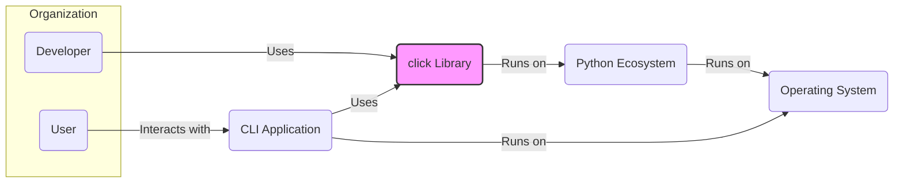
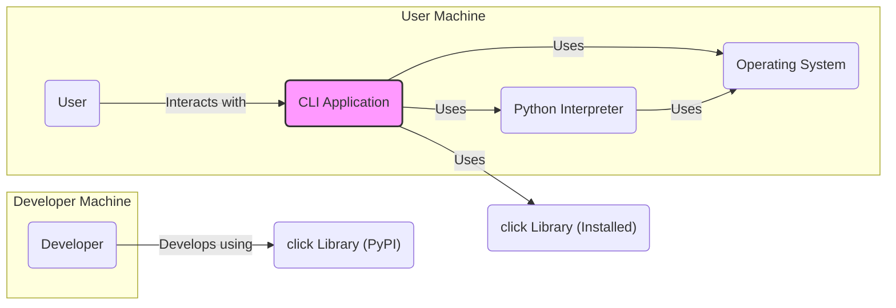
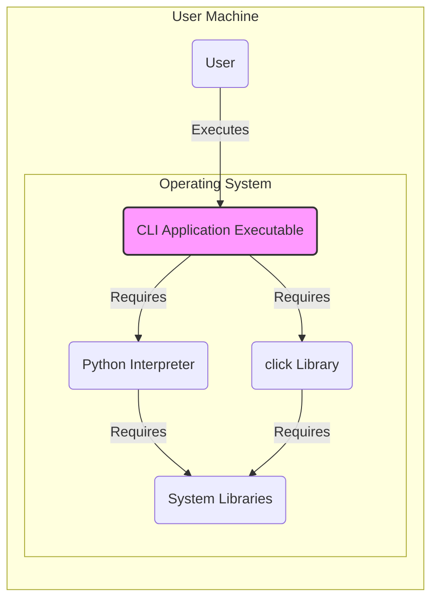
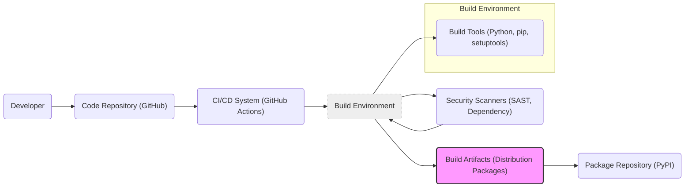

# BUSINESS POSTURE

This project is focused on providing a Python library named `click` that simplifies the process of building command-line interfaces (CLIs). The primary business priority is to empower developers to create user-friendly and robust CLIs with minimal effort. The goal is to enhance developer productivity and improve the user experience of command-line tools built with Python.

Most important business risks that need to be addressed:
- Risk of vulnerabilities in the `click` library itself that could be exploited by malicious actors in applications using `click`.
- Risk of developers misusing `click` and creating insecure CLIs, such as those vulnerable to command injection or insecure handling of user inputs.
- Risk of supply chain attacks targeting the `click` library distribution channels (e.g., PyPI).
- Risk of denial of service if `click` applications are not designed to handle unexpected or malicious inputs gracefully.

# SECURITY POSTURE

Existing security controls:
- security control: Code review process for contributions to the `click` library. Implemented as part of the GitHub pull request workflow.
- security control: Usage of standard Python security practices within the library's codebase. Implicit in the development process.
- security control: Dependency management using `pip` and `setuptools`. Described in project documentation for installation and development.
- accepted risk: Reliance on the security of the Python ecosystem and underlying operating systems. Inherited from the chosen technology stack.
- accepted risk: Security of applications built using `click` is the responsibility of the application developers. Implicit understanding of library usage.

Recommended security controls:
- security control: Implement automated security scanning (SAST/DAST) in the CI/CD pipeline for the `click` library.
- security control: Conduct regular security audits and penetration testing of the `click` library.
- security control: Provide security guidelines and best practices documentation for developers using `click` to build CLIs securely.
- security control: Implement dependency scanning to identify and address vulnerabilities in third-party libraries used by `click`.

Security requirements:
- Authentication: Not directly applicable to the `click` library itself. Authentication is typically handled by the applications built using `click`.
- Authorization: Not directly applicable to the `click` library itself. Authorization is typically handled by the applications built using `click`.
- Input validation: `click` should provide robust mechanisms for input validation to help developers build secure CLIs. This is partially implemented through parameter types and validation features.
- Cryptography: Not a core requirement for the `click` library itself. Cryptographic operations would be handled by applications using `click` if needed. However, `click` should not introduce vulnerabilities that could compromise cryptographic operations in user applications.

# DESIGN

## C4 CONTEXT

Elements of context diagram:
- - Name: Developer
  - Type: Person
  - Description: Software developers who use the `click` library to build command-line interface applications.
  - Responsibilities: Develop CLI applications using `click`.
  - Security controls: Secure development practices, code review, vulnerability scanning of developed applications.
- - Name: User
  - Type: Person
  - Description: End-users who interact with command-line interface applications built using `click`.
  - Responsibilities: Use CLI applications to perform tasks.
  - Security controls: User education on safe usage of CLI applications, system hardening on user machines.
- - Name: click Library
  - Type: Software System
  - Description: A Python library for building composable command-line interfaces. It provides a way to parse command-line arguments, handle options, and display help messages.
  - Responsibilities: Provide a framework for building CLIs, handle argument parsing, input validation, and output formatting.
  - Security controls: Input validation within the library, secure coding practices, automated security testing, dependency scanning.
- - Name: Python Ecosystem
  - Type: Software System
  - Description: The Python programming language environment, including the interpreter, standard libraries, and package manager (pip).
  - Responsibilities: Provide runtime environment for `click` and applications built with it, package management.
  - Security controls: Security updates for Python interpreter and standard libraries, PyPI security measures.
- - Name: Operating System
  - Type: Software System
  - Description: The underlying operating system (e.g., Linux, macOS, Windows) on which Python and `click` applications run.
  - Responsibilities: Provide system resources, manage processes, handle system calls.
  - Security controls: Operating system security hardening, security updates, access control mechanisms.
- - Name: CLI Application
  - Type: Software System
  - Description: Command-line interface applications built by developers using the `click` library.
  - Responsibilities: Implement specific functionalities exposed through the command-line interface, interact with users and other systems.
  - Security controls: Input validation, authorization, secure handling of sensitive data, protection against command injection and other vulnerabilities.

## C4 CONTAINER

Elements of container diagram:
- - Name: CLI Application
  - Type: Application
  - Description: The command-line interface application built using the `click` library. It's a Python script that utilizes `click` for argument parsing and command structure.
  - Responsibilities: Implement the specific functionality of the CLI tool, process user commands, interact with the operating system and other resources.
  - Security controls: Input validation using `click` features and custom validation logic, secure coding practices to prevent vulnerabilities like command injection, proper error handling, least privilege principle for application execution.
- - Name: Python Interpreter
  - Type: Container
  - Description: The Python runtime environment that executes the CLI application.
  - Responsibilities: Execute Python code, manage memory, provide access to standard libraries and installed packages.
  - Security controls: Security updates for the Python interpreter, configuration to restrict access to system resources if necessary, execution environment hardening.
- - Name: Operating System
  - Type: Container
  - Description: The operating system on the user's machine that provides the underlying platform for the Python interpreter and CLI application.
  - Responsibilities: Manage system resources, provide system services, enforce security policies.
  - Security controls: Operating system security hardening, access control lists, security monitoring, patching and updates.
- - Name: click Library (Installed)
  - Type: Library
  - Description: The `click` Python library installed within the Python environment on the user's machine. It's used by the CLI application at runtime.
  - Responsibilities: Provide CLI framework functionalities, argument parsing, command handling, help text generation.
  - Security controls: Security features of the `click` library itself (input validation), integrity checks during installation (via pip), dependency scanning.
- - Name: click Library (PyPI)
  - Type: Package Repository
  - Description: The Python Package Index (PyPI) where the `click` library is hosted and distributed.
  - Responsibilities: Host and distribute the `click` library package.
  - Security controls: PyPI security measures (package signing, malware scanning), HTTPS for package downloads.

## DEPLOYMENT

Deployment of the `click` library itself is primarily through PyPI. Applications built with `click` can be deployed in various ways depending on their purpose. For a general-purpose CLI tool, deployment might involve packaging it as a standalone executable or distributing it via package managers.

Here we will consider deployment of a CLI application built using `click` as a standalone executable on a user's machine.

Elements of deployment diagram:
- - Name: CLI Application Executable
  - Type: Executable File
  - Description: A standalone executable file containing the CLI application built with `click` and potentially bundled with the Python interpreter and necessary libraries.
  - Responsibilities: Execute the CLI application logic when run by the user.
  - Security controls: Code signing of the executable, integrity checks during distribution, protection against tampering, execution with least privileges.
- - Name: Python Interpreter
  - Type: Runtime Environment
  - Description: The Python interpreter required to run the CLI application. It might be bundled with the executable or assumed to be pre-installed on the user's system.
  - Responsibilities: Execute Python bytecode, manage dependencies, provide access to system resources.
  - Security controls: Security updates for the interpreter, controlled execution environment, restrictions on system calls if necessary.
- - Name: click Library
  - Type: Library Files
  - Description: The `click` library files that are required by the CLI application at runtime. These might be bundled with the executable or installed separately.
  - Responsibilities: Provide CLI framework functionalities to the application.
  - Security controls: Integrity checks of library files, protection against modification, dependency scanning.
- - Name: System Libraries
  - Type: Operating System Components
  - Description: System libraries required by the Python interpreter and potentially the `click` library or the CLI application itself.
  - Responsibilities: Provide low-level functionalities to the runtime environment and applications.
  - Security controls: Operating system security updates, library version management, protection against library injection attacks.
- - Name: Operating System
  - Type: Host Environment
  - Description: The user's operating system where the CLI application is deployed and executed.
  - Responsibilities: Provide the execution environment, manage resources, enforce security policies.
  - Security controls: Operating system hardening, access control, security monitoring, patching.

## BUILD

Build process description:
1. Developer writes code and commits it to the Code Repository (GitHub).
2. Changes to the repository trigger the CI/CD System (GitHub Actions).
3. CI/CD system sets up a Build Environment. This environment includes necessary Build Tools like Python, pip, and setuptools.
4. The Build Environment performs the build process, which includes:
    - Fetching dependencies.
    - Running linters and code formatters.
    - Running unit tests.
    - Building distribution packages (e.g., wheels, source archives).
5. Security Scanners (SAST, Dependency) are run in the Build Environment to identify potential vulnerabilities in the code and dependencies.
6. If security checks pass and the build is successful, Build Artifacts (distribution packages) are created.
7. Build Artifacts are published to the Package Repository (PyPI) for distribution.

Security controls in build process:
- security control: Source code hosted on GitHub, leveraging GitHub's security features for code protection and access control.
- security control: Automated build process using GitHub Actions, ensuring consistent and repeatable builds.
- security control: Security scanners (SAST) integrated into the CI/CD pipeline to detect potential code vulnerabilities before release.
- security control: Dependency scanning to identify and alert on vulnerabilities in third-party libraries used by `click`.
- security control: Code review process enforced through pull requests before merging code changes.
- security control: Signing of packages before publishing to PyPI (if implemented, should be recommended).
- security control: Use of a dedicated and isolated build environment to minimize the risk of build environment compromise.

# RISK ASSESSMENT

Critical business process we are trying to protect:
- Secure and reliable distribution of the `click` library to developers.
- Maintaining the integrity and availability of the `click` library to ensure developers can build CLIs effectively.
- Protecting applications built using `click` from vulnerabilities originating from the library itself.

Data we are trying to protect and their sensitivity:
- Source code of the `click` library: Sensitive, as its compromise could lead to injection of malicious code into the library and subsequently into applications using it.
- Build artifacts (distribution packages): Sensitive, as their compromise could lead to distribution of malicious versions of the library to developers.
- Developer accounts and credentials used to manage the `click` library repository and PyPI package: Highly sensitive, as their compromise could allow unauthorized modifications and releases.

Data sensitivity classification:
- Source code: Confidential, Integrity
- Build artifacts: Integrity, Availability
- Developer credentials: Confidentiality, Integrity, Availability

# QUESTIONS & ASSUMPTIONS

Questions:
- Are there any specific security incidents or concerns related to `click` in the past that should be considered?
- What is the current process for security vulnerability reporting and handling for `click`?
- Are there any existing security guidelines or best practices documentation for developers using `click`?
- Is there a process for signing the released packages of `click`?

Assumptions:
- The primary goal of `click` is to simplify CLI development and improve developer productivity.
- Security is a secondary but important consideration for the `click` project.
- Developers using `click` are responsible for the security of the applications they build.
- The `click` project benefits from the security measures provided by the Python ecosystem and GitHub platform.
- The target users of `click` are primarily Python developers.