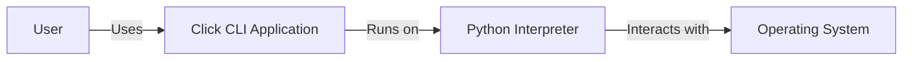
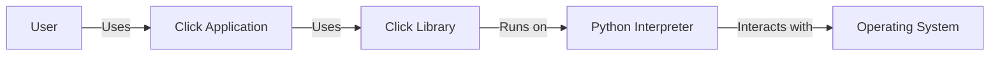
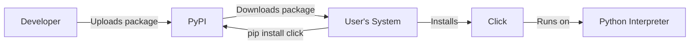
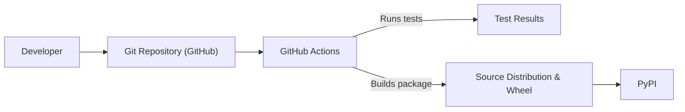

# BUSINESS POSTURE

Business Priorities and Goals:

*   Provide a Python package that allows developers to easily create command-line interfaces (CLIs) for their applications.
*   Offer a flexible and customizable solution for building CLIs, supporting various features like argument parsing, option handling, help message generation, and command nesting.
*   Maintain a well-documented and easy-to-use API, enabling developers to quickly integrate Click into their projects.
*   Ensure the package is stable, reliable, and well-tested, minimizing the risk of bugs and compatibility issues.
*   Foster a vibrant community around the project, encouraging contributions and providing support to users.

Business Risks:

*   Vulnerabilities in the Click library could be exploited by attackers to compromise applications that use it, potentially leading to arbitrary code execution or denial of service.
*   Incorrect usage of Click by developers could introduce security flaws in their applications, such as improper input validation or insecure handling of sensitive data.
*   Lack of maintenance or updates to the Click library could lead to compatibility issues with newer Python versions or other dependencies, hindering its adoption and usability.
*   Insufficient documentation or support could make it difficult for developers to use Click securely and effectively, increasing the risk of introducing vulnerabilities.

# SECURITY POSTURE

Existing Security Controls:

*   security control: The project uses GitHub for version control and issue tracking, which provides some level of access control and auditability.
*   security control: The project has a test suite, which helps to identify and prevent regressions, including potential security vulnerabilities. (Located in the `tests` directory).
*   security control: The project's documentation provides some guidance on how to use Click securely. (Located in the `docs` directory).

Accepted Risks:

*   accepted risk: The project relies on external dependencies, which could introduce vulnerabilities that are outside the control of the Click maintainers.
*   accepted risk: The project is developed and maintained by volunteers, which means that there may be limited resources for security reviews and incident response.

Recommended Security Controls:

*   security control: Implement a security policy that outlines the process for reporting and handling vulnerabilities.
*   security control: Conduct regular security reviews of the codebase, including static and dynamic analysis.
*   security control: Use a dependency management tool to track and update dependencies, and to identify known vulnerabilities.
*   security control: Provide more comprehensive security guidance in the documentation, including examples of secure coding practices.
*   security control: Consider implementing a bug bounty program to incentivize security researchers to find and report vulnerabilities.

Security Requirements:

*   Authentication:
    *   Not directly applicable to the Click library itself, as it is a tool for building CLIs, not for managing authentication. However, applications built with Click may need to implement authentication mechanisms.
*   Authorization:
    *   Not directly applicable to the Click library itself. However, applications built with Click may need to implement authorization mechanisms to control access to commands and resources.
*   Input Validation:
    *   Click provides some built-in input validation capabilities, such as type checking and range validation for command-line arguments and options.
    *   Developers should use these capabilities to ensure that user input is properly validated and sanitized before being processed by the application.
    *   Custom validation functions can be implemented for more complex validation requirements.
*   Cryptography:
    *   Click does not directly provide cryptographic functionality.
    *   Applications built with Click that require cryptography should use appropriate cryptographic libraries, such as `cryptography` or `PyCryptodome`.

# DESIGN

## C4 CONTEXT

Element Description:

*   Element:
    *   Name: User
    *   Type: Person
    *   Description: A person who interacts with the Click CLI application.
    *   Responsibilities: Provides input to the CLI application, receives output from the CLI application.
    *   Security controls: None (external to the system).

*   Element:
    *   Name: Click CLI Application
    *   Type: Software System
    *   Description: A command-line interface application built using the Click library.
    *   Responsibilities: Parses command-line arguments and options, executes commands, displays output to the user.
    *   Security controls: Input validation, error handling.

*   Element:
    *   Name: Operating System
    *   Type: Software System
    *   Description: The operating system on which the Python interpreter and Click CLI application run.
    *   Responsibilities: Provides resources and services to the Python interpreter and Click CLI application.
    *   Security controls: OS-level security controls (e.g., access controls, file permissions).

*   Element:
    *   Name: Python Interpreter
    *   Type: Software System
    *   Description: The Python interpreter that executes the Click CLI application code.
    *   Responsibilities: Executes Python code, manages memory, interacts with the operating system.
    *   Security controls: Python's built-in security features.

## C4 CONTAINER

Element Description:

*   Element:
    *   Name: User
    *   Type: Person
    *   Description: A person who interacts with the Click CLI application.
    *   Responsibilities: Provides input to the CLI application, receives output from the CLI application.
    *   Security controls: None (external to the system).

*   Element:
    *   Name: Click Application
    *   Type: Container: Python Application
    *   Description: The specific command-line application built using Click.
    *   Responsibilities: Implements the specific functionality of the CLI application, handles user input, and produces output.
    *   Security controls: Input validation, error handling, application-specific security logic.

*   Element:
    *   Name: Click Library
    *   Type: Container: Python Library
    *   Description: The Click library, providing the framework for building CLIs.
    *   Responsibilities: Provides decorators and functions for defining commands, options, and arguments, handles parsing of command-line input, generates help messages.
    *   Security controls: Input validation, error handling.

*   Element:
    *   Name: Python Interpreter
    *   Type: Container: Runtime Environment
    *   Description: The Python interpreter that executes the Click application and library code.
    *   Responsibilities: Executes Python code, manages memory, interacts with the operating system.
    *   Security controls: Python's built-in security features.

*   Element:
    *   Name: Operating System
    *   Type: Container: Operating System
    *   Description: The operating system on which the Python interpreter and Click application run.
    *   Responsibilities: Provides resources and services to the Python interpreter and Click application.
    *   Security controls: OS-level security controls (e.g., access controls, file permissions).

## DEPLOYMENT

Possible deployment solutions:

1.  Installation via pip (from PyPI or a source distribution).
2.  Packaging into a standalone executable (using tools like PyInstaller, Nuitka, or cx_Freeze).
3.  Deployment as part of a larger application or system.
4.  Containerization using Docker.

Chosen solution (Installation via pip):

Element Description:

*   Element:
    *   Name: Developer
    *   Type: Person
    *   Description: The developer of the Click library or a Click-based application.
    *   Responsibilities: Writes code, builds packages, uploads packages to PyPI.
    *   Security controls: Code signing (optional).

*   Element:
    *   Name: PyPI
    *   Type: Software System
    *   Description: The Python Package Index, a repository of Python packages.
    *   Responsibilities: Stores and distributes Python packages.
    *   Security controls: Access controls, package signing (optional).

*   Element:
    *   Name: User's System
    *   Type: System
    *   Description: The system on which the Click application will be installed and run.
    *   Responsibilities: Downloads and installs packages, provides the runtime environment.
    *   Security controls: OS-level security controls, package manager security features.

*   Element:
    *   Name: Python Interpreter
    *   Type: Software System
    *   Description: The Python interpreter.
    *   Responsibilities: Executes Python code.
    *   Security controls: Python's built-in security features.

*   Element:
    *   Name: Click
    *   Type: Software System
    *   Description: The installed Click library.
    *   Responsibilities: Provides CLI functionality.
    *   Security controls: Input validation, error handling.

## BUILD

Build Process Description:

1.  Developer commits code to the Git repository hosted on GitHub.
2.  GitHub Actions, the CI/CD system used by the Click project, is triggered by the commit.
3.  GitHub Actions runs the test suite to ensure code quality and prevent regressions.
4.  If the tests pass, GitHub Actions builds the Click package, creating a source distribution and a wheel.
5.  The built package can then be uploaded to PyPI (Python Package Index) for distribution.

Security Controls:

*   security control: Version control (Git) provides an audit trail of code changes.
*   security control: Automated testing (GitHub Actions) helps to identify and prevent vulnerabilities.
*   security control: Use of a well-defined build process (GitHub Actions) ensures consistency and reduces the risk of manual errors.
*   security control: Linting with Flake8 is used.
*   security control: Building and distributing wheels can help prevent certain types of supply chain attacks.

# RISK ASSESSMENT

Critical Business Processes:

*   The primary business process is providing a reliable and easy-to-use library for building command-line interfaces. Disruption of this process would impact developers who rely on Click for their projects.

Data Protection:

*   Click itself does not handle sensitive data directly. It is a framework for building CLIs. The applications built *using* Click might handle sensitive data, but that is the responsibility of the application developer, not the Click library itself.
*   Data Sensitivity:
    *   Click library code: Low sensitivity.
    *   Applications built with Click: Variable sensitivity, depending on the application's purpose and the data it handles.

# QUESTIONS & ASSUMPTIONS

Questions:

*   Are there any specific security certifications or compliance requirements that Click needs to adhere to?
*   What is the expected threat model for applications built using Click? (e.g., who are the potential attackers, and what are their motivations?)
*   What is the process for handling security vulnerabilities reported by external researchers?
*   Are there any plans to integrate with security scanning tools or services?

Assumptions:

*   BUSINESS POSTURE: The primary goal is to provide a functional and user-friendly library, with security being a secondary but important consideration.
*   SECURITY POSTURE: The project relies primarily on community contributions and best practices for security, rather than formal security audits or certifications.
*   DESIGN: The design is relatively simple and straightforward, with a focus on ease of use and flexibility. The main security concerns are related to input validation and potential vulnerabilities in the underlying Python interpreter or operating system.