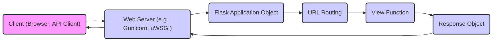

# Project Design Document: Flask Web Framework

**Version:** 1.1
**Date:** October 26, 2023
**Author:** AI Software Architect

## 1. Project Overview

Flask is a lightweight WSGI (Web Server Gateway Interface) web application framework written in Python. It is classified as a microframework because it does not require particular tools or libraries. It has no database abstraction layer, form validation, or other components where pre-existing third-party libraries provide common functions. However, Flask supports extensions that can add such functionality.

This document outlines the architectural design of the core Flask framework. It focuses on the key components, their interactions, and the data flow within the framework. This document will serve as the foundation for subsequent threat modeling activities.

## 2. Goals

* Provide a clear and concise overview of the Flask framework's architecture.
* Identify the key components and their responsibilities.
* Describe the flow of data within the framework during request processing.
* Highlight potential areas of interest for security analysis and threat modeling.

## 3. Target Audience

This document is intended for:

* Security engineers and architects performing threat modeling on Flask-based applications.
* Developers who want to understand the internal workings of Flask.
* DevOps engineers involved in deploying and managing Flask applications.

## 4. High-Level Architecture

Flask's architecture is centered around the concept of an application object and the handling of HTTP requests.

**Description:**

* A client (e.g., a web browser or an API client) sends an HTTP request.
* The web server (e.g., Gunicorn or uWSGI) receives the request.
* The web server passes the request to the Flask application object.
* Flask's URL routing mechanism determines which view function should handle the request based on the URL.
* The corresponding view function is executed.
* The view function generates a response object.
* The Flask application object returns the response to the web server.
* The web server sends the response back to the client.

## 5. Key Components

| Component Name             | Description