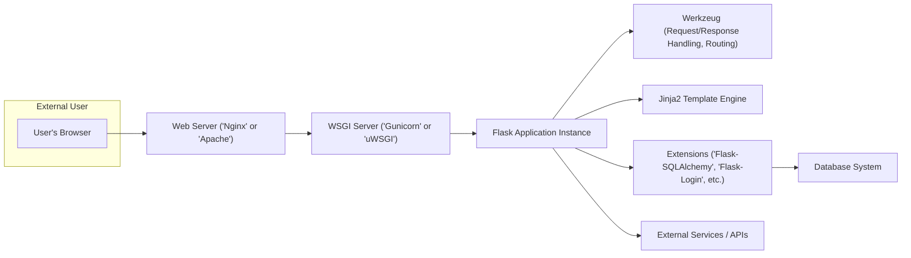

# Project Design Document: Flask Web Framework

**Version:** 1.1
**Date:** October 26, 2023
**Author:** Gemini (AI Language Model)
**Project Link:** https://github.com/pallets/flask

## 1. Introduction

This document provides an enhanced architectural design of the Flask web framework, focusing on aspects relevant to security and threat modeling. It details the core components, their interactions, and the overall structure, emphasizing potential areas of vulnerability. This document serves as a foundational resource for understanding the system's architecture from a security perspective and will be used as a primary input for subsequent threat modeling activities.

## 2. Project Overview

Flask is a lightweight and extensible WSGI (Web Server Gateway Interface) web application framework written in Python. Its microframework nature provides essential tools without imposing strict architectural decisions, allowing developers significant flexibility. Flask's reliance on the WSGI standard ensures compatibility across various web servers and deployment environments. While core Flask offers minimal built-in features, its extensive extension ecosystem enables integration with a wide range of functionalities.

**Key Characteristics:**

*   **Microframework Design:** Offers essential web development functionalities without being overly prescriptive, allowing for flexible application structures.
*   **WSGI Compliance:** Adheres strictly to the WSGI standard, ensuring interoperability with diverse web servers and deployment scenarios.
*   **Jinja2 Templating Engine:** Leverages the Jinja2 template engine for creating dynamic web pages, enabling the separation of presentation and logic.
*   **Werkzeug Foundation:** Built upon the Werkzeug WSGI toolkit, which provides robust utilities for handling requests, responses, and routing.
*   **Extensibility through Extensions:** Designed for easy expansion of functionality via a rich ecosystem of community-developed and official extensions.
*   **Simplicity and Flexibility in Routing:** Offers a straightforward and adaptable mechanism for defining URL routes and associating them with request handlers.

## 3. System Architecture

The following diagram illustrates the high-level architecture of a typical Flask application deployment, highlighting key components and their relationships:

**Component Descriptions:**

*   **User's Browser:** The client-side application, typically a web browser, used by end-users to interact with the Flask application by sending HTTP requests.
*   **Web Server ('Nginx' or 'Apache'):** The entry point for external requests. It receives incoming HTTP requests, handles static content serving, and forwards dynamic requests to the WSGI server. This layer is crucial for initial security measures like SSL/TLS termination.
*   **WSGI Server ('Gunicorn' or 'uWSGI'):** Acts as a bridge between the web server and the Flask application. It implements the WSGI specification, translating web server requests into a format understandable by the Python application and vice versa. This layer manages application processes and concurrency.
*   **Flask Application Instance:** The core of the application logic. It houses route definitions, view functions, application configurations, and interacts with other components to process requests and generate responses.
*   **Werkzeug ('Request/Response Handling, Routing'):** The underlying WSGI toolkit that Flask relies on. It provides functionalities for handling HTTP requests and responses, managing routing logic, and dealing with cookies and sessions.
*   **Jinja2 Template Engine:** Responsible for rendering dynamic HTML templates. It embeds Python code within HTML structures, enabling the generation of dynamic web content. Improper use can lead to Server-Side Template Injection (SSTI) vulnerabilities.
*   **Extensions ('Flask-SQLAlchemy', 'Flask-Login', etc.):**  Packages that extend Flask's core functionality. They can provide database integration, authentication mechanisms, form handling, and other features. Security vulnerabilities in extensions can directly impact the application.
*   **Database System:** A persistent storage system used by the application to store and retrieve data. Examples include PostgreSQL, MySQL, and SQLite. Secure database access and data handling are critical.
*   **External Services / APIs:**  Third-party services or APIs that the Flask application interacts with. These interactions introduce potential security risks related to data exchange and API vulnerabilities.

## 4. Key Components and Their Interactions (Detailed)

This section provides a more in-depth look at the key components and their interactions during a typical request-response lifecycle, with a focus on security implications.

*   **Flask Application Object:**
    *   **Responsibility:** Manages application state, configuration, and the routing mechanism. It dispatches incoming requests to the appropriate view functions.
    *   **Security Relevance:** Improper configuration or insecure handling of application secrets can lead to vulnerabilities. The routing mechanism, if not carefully defined, can expose unintended endpoints.
    *   **Interaction:** Receives requests from the WSGI server, uses Werkzeug's routing to determine the appropriate handler, and orchestrates the execution of view functions.

*   **Request Object (Werkzeug):**
    *   **Responsibility:** Represents an incoming HTTP request, providing access to request headers, parameters (query string, form data), cookies, and uploaded files.
    *   **Security Relevance:** The primary source of user-provided data, making it a critical point for input validation and sanitization to prevent XSS, SQL Injection, and other injection attacks.
    *   **Interaction:** Created by Werkzeug upon receiving a request from the WSGI server. Passed to view functions for processing.

*   **Response Object (Werkzeug):**
    *   **Responsibility:** Represents the HTTP response sent back to the client, including the body, status code, headers, and cookies.
    *   **Security Relevance:** Used to set security headers (e.g., Content-Security-Policy, X-Frame-Options). Improperly configured responses can expose sensitive information or leave the application vulnerable to attack.
    *   **Interaction:** Created by view functions or Flask itself. Passed back through the WSGI server and web server to the client.

*   **Routing (Werkzeug):**
    *   **Responsibility:** Maps incoming URLs to specific view functions based on defined patterns and HTTP methods.
    *   **Security Relevance:** Incorrectly configured routes can expose administrative interfaces or sensitive functionalities. Lack of proper authorization checks on routes can lead to unauthorized access.
    *   **Interaction:** Werkzeug's routing mechanism is used by the Flask application object to determine which view function should handle a given request.

*   **View Functions:**
    *   **Responsibility:** Contain the core application logic for handling specific requests. They process request data, interact with other components (databases, templates, external services), and generate responses.
    *   **Security Relevance:** View functions are where most business logic resides, making them prime targets for vulnerabilities if not implemented securely. They must perform input validation, authorization checks, and secure data handling.
    *   **Interaction:** Receive the request object, interact with models, templates, and external services, and return a response object or a value that can be converted into one.

*   **Jinja2 Templating:**
    *   **Responsibility:** Renders dynamic HTML content by embedding Python expressions and control structures within templates.
    *   **Security Relevance:** Susceptible to Server-Side Template Injection (SSTI) if user-provided data is directly embedded into templates without proper sanitization.
    *   **Interaction:** View functions pass data to the Jinja2 engine, which then processes the template and generates the final HTML output included in the response.

*   **Extensions:**
    *   **Responsibility:** Extend Flask's core functionalities, providing features like database integration, authentication, and form handling.
    *   **Security Relevance:** Vulnerabilities in extensions can directly impact the security of the application. It's crucial to use well-maintained and reputable extensions and keep them updated.
    *   **Interaction:** Extensions register themselves with the Flask application object and provide new functionalities that can be used within view functions and other parts of the application.

## 5. Data Flow (Security Focused)

The following list describes the typical data flow within a Flask application, highlighting potential security checkpoints and areas of concern:

1. **User initiates a request:** A user sends an HTTP request, potentially containing malicious data, to the web server.
2. **Web server receives the request:** The web server might perform initial security checks (e.g., SSL/TLS termination, basic request filtering).
3. **Request forwarded to WSGI server:** The WSGI server receives the request.
4. **WSGI server passes request to Flask application:** The request is passed to the Flask application instance.
5. **Routing and Dispatch:** Flask's routing mechanism matches the URL to a view function. **Potential vulnerability:** Improperly defined routes or lack of authorization checks.
6. **Request Object Creation (Werkzeug):** Werkzeug creates the request object, parsing headers and body. **Potential vulnerability:**  Exploitable parsing flaws.
7. **View function execution:** The associated view function is executed.
    *   **Input Validation:** The view function *should* validate and sanitize data from the request object. **Critical security checkpoint:** Failure to do so can lead to injection attacks.
    *   **Business Logic:** The core logic of the application is executed. **Potential vulnerabilities:** Business logic flaws can be exploited.
    *   **Database Interaction (via Extensions):** If the view function interacts with a database, secure database queries are essential to prevent SQL Injection.
    *   **Template Rendering (Jinja2):** If the view renders a template, data passed to the template must be sanitized to prevent SSTI.
    *   **Interaction with External Services:** If the view function interacts with external services, secure API communication and data handling are crucial.
8. **Response Generation:** The view function creates a response object. **Potential vulnerability:** Improperly set security headers or inclusion of sensitive data in the response.
9. **Response passed back through layers:** The response is passed back through the WSGI server and web server.
10. **Web server sends response to the user:** The web server sends the response to the user's browser.
11. **User's browser renders the response:** The browser interprets and renders the response. **Potential vulnerability:** Client-side vulnerabilities if the response contains malicious scripts (XSS).

## 6. Security Considerations (Detailed)

This section expands on the security considerations, providing more specific examples and categorizations of potential threats.

*   **Input Security:**
    *   **Cross-Site Scripting (XSS):** Ensure all user-provided data displayed in HTML is properly escaped to prevent injection of malicious scripts.
    *   **SQL Injection:** Use parameterized queries or ORM features correctly to prevent the injection of malicious SQL code.
    *   **Command Injection:** Avoid executing system commands based on user input without thorough sanitization.
    *   **Path Traversal:** Validate file paths provided by users to prevent access to unauthorized files.
    *   **Header Injection:** Sanitize user inputs that influence HTTP headers to prevent attacks like response splitting.

*   **Authentication and Authorization:**
    *   **Broken Authentication:** Implement strong password policies, multi-factor authentication, and secure session management.
    *   **Broken Authorization:** Ensure proper access controls are in place to restrict users to only the resources they are authorized to access.
    *   **Session Fixation:** Protect against session fixation attacks by regenerating session IDs upon login.
    *   **Insecure Direct Object References (IDOR):** Prevent users from accessing resources by directly manipulating object identifiers without proper authorization checks.

*   **Session Management:**
    *   **Session Hijacking:** Use secure cookies (HttpOnly, Secure) and protect against cross-site scripting to prevent session hijacking.
    *   **Insufficient Session Expiration:** Set appropriate session timeouts to limit the window of opportunity for attackers.

*   **Cross-Site Request Forgery (CSRF):** Implement CSRF protection mechanisms (e.g., CSRF tokens) for all state-changing requests.

*   **Security Headers:**
    *   **Content-Security-Policy (CSP):** Configure CSP headers to control the sources from which the browser is allowed to load resources, mitigating XSS attacks.
    *   **HTTP Strict Transport Security (HSTS):** Enforce HTTPS connections to prevent man-in-the-middle attacks.
    *   **X-Frame-Options:** Protect against clickjacking attacks by controlling whether the application can be framed.
    *   **X-Content-Type-Options:** Prevent MIME sniffing vulnerabilities.

*   **Dependency Management:** Regularly audit and update dependencies to patch known security vulnerabilities. Use tools to manage and track dependencies.

*   **Error Handling and Logging:**
    *   Implement robust error handling that does not expose sensitive information to users.
    *   Maintain comprehensive logs for security monitoring and incident response.

*   **Template Security (Jinja2):**
    *   Avoid directly embedding user-provided data into templates without proper escaping.
    *   Be aware of potential Server-Side Template Injection (SSTI) vulnerabilities.

*   **File Upload Security:**
    *   Validate file types and sizes.
    *   Sanitize file names.
    *   Store uploaded files in a secure location and prevent direct access.
    *   Scan uploaded files for malware.

## 7. Conclusion

This enhanced design document provides a more detailed and security-focused overview of the Flask web framework's architecture. By outlining the components, their interactions, and specific security considerations, this document serves as a robust foundation for conducting thorough threat modeling exercises. Understanding these architectural nuances and potential vulnerabilities is crucial for developing secure and resilient Flask applications. This document will be instrumental in identifying potential attack vectors and informing the implementation of appropriate security controls.
