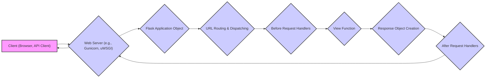
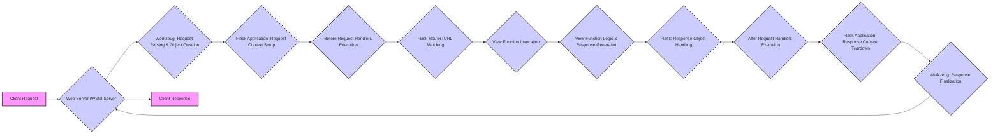

# Project Design Document: Flask Web Framework

**Version:** 1.1
**Date:** October 26, 2023
**Author:** AI Software Architect

## 1. Project Overview

Flask is a lightweight WSGI (Web Server Gateway Interface) web application framework written in Python. Distinguished as a microframework, Flask prioritizes a simple core, leaving decisions about database interactions, form handling, and other functionalities to the developer through the use of extensions. This design philosophy allows for greater flexibility and control over the application's architecture.

This document details the architectural design of the core Flask framework. It emphasizes the key components, their interactions during request processing, and the overall data flow. This document serves as a crucial resource for subsequent threat modeling activities, providing a clear understanding of the system's structure and potential attack surfaces.

## 2. Goals

* To provide a comprehensive and easily understandable overview of the Flask framework's internal architecture.
* To clearly identify the core components of Flask and delineate their specific responsibilities.
* To meticulously describe the flow of data within the framework as it processes incoming HTTP requests and generates responses.
* To highlight key areas within the framework that warrant focused security analysis and are potential targets for threat modeling exercises.

## 3. Target Audience

This document is primarily intended for:

* Security engineers and architects tasked with performing threat modeling and security assessments on applications built using the Flask framework.
* Software developers seeking a deeper understanding of Flask's internal mechanisms and how its components interact.
* DevOps engineers responsible for the deployment, configuration, and maintenance of Flask-based applications.

## 4. High-Level Architecture

Flask's architecture revolves around the central `Flask` application object, which orchestrates the handling of incoming HTTP requests. The framework follows a request-response cycle, delegating specific tasks to different components.

**Description:**

* A client initiates an interaction by sending an HTTP request to the application.
* The web server, acting as an intermediary, receives the incoming request. Common examples include Gunicorn or uWSGI.
* The web server forwards the request to the core `Flask` application object.
* Flask's URL routing mechanism analyzes the request URL and dispatches it to the appropriate view function.
* Before the view function is executed, any registered "before request" handlers are invoked. These can perform tasks like authentication or request modification.
* The designated view function is executed to process the request and generate the necessary data for the response.
* The view function creates or returns a response object, which encapsulates the data to be sent back to the client.
* After the view function completes, any registered "after request" handlers are executed. These can modify the response before it's sent.
* The Flask application object returns the finalized response to the web server.
* The web server transmits the response back to the originating client.

## 5. Key Components

* **Flask Application Object (`flask.Flask`):**
    * The foundational element of a Flask application.
    * Responsible for initializing the application, managing configuration settings, and coordinating request handling.
    * Serves as the central registry for routes, error handlers, and other application-level functionalities.
    * An instance of the `Flask` class is typically created in the application's entry point.

* **Request Object (`flask.request`):**
    * Represents the incoming HTTP request from the client.
    * Provides a structured interface to access all aspects of the request, including:
        * Headers: HTTP headers sent by the client.
        * Arguments: Query parameters in the URL.
        * Form Data: Data submitted in the request body (e.g., from HTML forms).
        * Files: Uploaded files.
        * Cookies: Cookies sent by the client.
    * Is a context-local object, meaning its data is specific to the current request.

* **Response Object (`flask.Response`):**
    * Encapsulates the HTTP response that will be sent back to the client.
    * Contains the following key components:
        * Body: The content of the response (e.g., HTML, JSON).
        * Status Code: The HTTP status code indicating the outcome of the request (e.g., 200 OK, 404 Not Found).
        * Headers: HTTP headers to be included in the response (e.g., `Content-Type`, `Set-Cookie`).
    * Can be created explicitly or implicitly by returning specific values from view functions.

* **URL Routing and Dispatching:**
    * The mechanism for mapping incoming request URLs to the appropriate view functions.
    * Defined using decorators like `@app.route('/path')` or the `app.add_url_rule()` method.
    * Supports dynamic URL segments using placeholders (e.g., `/user/<username>`).
    * Allows specifying allowed HTTP methods for each route (e.g., `GET`, `POST`).
    * The dispatcher analyzes the request URL and invokes the view function associated with the matching route.

* **View Functions:**
    * Python functions that are executed when a specific route is accessed.
    * Responsible for handling the logic associated with a particular URL.
    * Typically process the incoming request data, interact with other parts of the application (e.g., databases), and generate the response.
    * Can return a `Response` object, a string (which Flask converts to a response), a tuple containing the response body and status code, or a tuple containing the response body, status code, and headers.

* **Context Locals (`flask.g`, `flask.session`, `flask.request`, `flask.current_app`):**
    * Objects that are available only within the context of a specific request or application.
    * Provide a way to store and access data that is relevant to the current operation without explicitly passing it around.
    * `flask.g`: A namespace for developers to store arbitrary data during a request.
    * `flask.session`: Provides access to the client's session data, typically stored in a signed cookie.
    * `flask.request`: Provides access to the current request object.
    * `flask.current_app`: Provides access to the current Flask application instance.

* **Before and After Request Handlers:**
    * Functions that are executed before and after each request, respectively.
    * Decorated with `@app.before_request` and `@app.after_request`.
    * `before_request` handlers can be used for tasks like authentication, authorization, or setting up database connections.
    * `after_request` handlers can be used for tasks like modifying response headers or logging.

* **Error Handlers:**
    * Functions that are invoked when specific HTTP errors or exceptions occur during request processing.
    * Registered using decorators like `@app.errorhandler(404)` or `@app.errorhandler(Exception)`.
    * Allow for customizing the error responses sent to the client.

* **Extensions:**
    * Third-party packages that extend the functionality of Flask.
    * Address common web development needs such as:
        * Database integration (e.g., Flask-SQLAlchemy).
        * Form handling and validation (e.g., Flask-WTF).
        * Authentication (e.g., Flask-Login).
        * API development (e.g., Flask-RESTful).
    * Integrate with Flask through established patterns and often rely on the application context.

* **Jinja2 Templating Engine:**
    * A powerful and flexible templating language used to generate dynamic HTML content.
    * Integrated seamlessly with Flask, allowing developers to embed Python code and logic within HTML templates.
    * Helps separate presentation logic from application logic.

* **Werkzeug (WSGI Toolkit):**
    * The underlying WSGI utility library upon which Flask is built.
    * Handles the low-level details of HTTP request and response processing, including:
        * Parsing incoming requests.
        * Creating response objects.
        * Managing cookies and sessions.
        * Providing debugging tools.

## 6. Data Flow (Detailed Request Processing)

**Detailed Steps:**

1. **Client Request:** A client (e.g., web browser, API client) sends an HTTP request to the server.
2. **Web Server (WSGI Server):** The WSGI server (e.g., Gunicorn, uWSGI) receives the raw HTTP request.
3. **Werkzeug: Request Parsing & Object Creation:** Werkzeug parses the raw HTTP data and creates a `Request` object, populating it with headers, parameters, and other request information.
4. **Flask Application: Request Context Setup:** Flask sets up the request context, making context-local objects like `request`, `session`, and `g` available for the current request.
5. **Before Request Handlers Execution:** Any functions decorated with `@app.before_request` are executed in the order they were registered. These handlers can inspect or modify the request before it reaches the view function.
6. **Flask Router: URL Matching:** Flask's URL routing system matches the request URL against the defined routes. If a match is found, the corresponding view function is identified.
7. **View Function Invocation:** The identified view function is called. Flask passes any extracted URL parameters as arguments to the view function.
8. **View Function Logic & Response Generation:** The view function executes its logic, potentially interacting with databases, external APIs, or other services. It then generates a response, which can be a `Response` object, a string, a tuple, or a dictionary.
9. **Flask: Response Object Handling:** Flask ensures a proper `Response` object is created. If the view function returns a string or tuple, Flask converts it into a `Response` object.
10. **After Request Handlers Execution:** Functions decorated with `@app.after_request` are executed. These handlers receive the `Response` object and can modify it (e.g., adding headers) before it's sent to the client.
11. **Flask Application: Response Context Teardown:** Flask tears down the request context, cleaning up resources associated with the request.
12. **Werkzeug: Response Finalization:** Werkzeug takes the finalized `Response` object and converts it into a WSGI-compliant response that can be sent by the web server.
13. **Web Server:** The web server sends the HTTP response back to the client.
14. **Client Response:** The client receives and processes the HTTP response.

## 7. Security Considerations (Initial)

This section outlines potential security considerations within the core Flask framework. It's crucial to remember that application-specific vulnerabilities are the responsibility of the developer.

* **Session Security:**
    * Flask's default session management relies on cryptographically signed cookies.
    * **Threat:** If the `SECRET_KEY` is weak, predictable, or exposed, attackers can forge session cookies, leading to session hijacking and unauthorized access.
    * **Mitigation:** Use a strong, randomly generated, and securely stored `SECRET_KEY`. Consider using more secure session storage mechanisms for sensitive applications.

* **Cross-Site Scripting (XSS):**
    * Flask itself doesn't inherently prevent XSS vulnerabilities.
    * **Threat:** If user-provided data is rendered directly in templates without proper sanitization or escaping, attackers can inject malicious scripts that execute in other users' browsers.
    * **Mitigation:** Utilize Jinja2's autoescaping feature, which is enabled by default. Be mindful of contexts where autoescaping might be disabled and implement manual sanitization using libraries like `bleach`.

* **Cross-Site Request Forgery (CSRF):**
    * Flask does not provide built-in CSRF protection.
    * **Threat:** Attackers can craft malicious requests that are unknowingly executed by authenticated users, leading to unintended actions on the application.
    * **Mitigation:** Implement CSRF protection using extensions like Flask-WTF, which provides mechanisms for generating and validating CSRF tokens.

* **SQL Injection (When Database Interaction is Involved):**
    * Flask does not include a database abstraction layer.
    * **Threat:** If raw SQL queries are constructed using user-provided input without proper sanitization or parameterization, attackers can inject malicious SQL code to manipulate the database.
    * **Mitigation:** Always use parameterized queries or an Object-Relational Mapper (ORM) like SQLAlchemy to interact with databases. This prevents direct embedding of user input into SQL statements.

* **Denial of Service (DoS):**
    * Flask applications can be susceptible to DoS attacks.
    * **Threat:** Attackers can overwhelm the application with a large number of requests, consuming resources and making the application unavailable to legitimate users.
    * **Mitigation:** Implement rate limiting at the application or web server level. Consider using techniques like request queuing and resource management to handle high traffic loads.

* **Open Redirects:**
    * **Threat:** If the application uses user-provided data in redirect URLs without proper validation, attackers can craft malicious URLs that redirect users to phishing sites or other harmful locations.
    * **Mitigation:** Avoid using user input directly in redirect URLs. If necessary, maintain a whitelist of allowed redirect destinations and validate user input against this list.

* **Security of Extensions:**
    * **Threat:** Vulnerabilities in Flask extensions can introduce security risks to the application.
    * **Mitigation:** Use reputable and well-maintained extensions. Regularly update extensions to patch known vulnerabilities. Review the security practices of the extensions you use.

* **Configuration Security:**
    * **Threat:** Sensitive configuration values (e.g., database credentials, API keys) stored insecurely can be exploited.
    * **Mitigation:** Avoid hardcoding sensitive information in the application code. Utilize environment variables or secure configuration management tools to store and manage sensitive data.

## 8. Deployment Considerations

* Flask applications are typically deployed using WSGI servers such as Gunicorn or uWSGI, which provide a production-ready environment for handling web requests.
* Reverse proxies like Nginx or Apache are commonly placed in front of the WSGI server to handle tasks such as:
    * Serving static files efficiently.
    * SSL/TLS termination, encrypting communication between the client and the server.
    * Load balancing across multiple application instances.
* Cloud platforms like AWS, Google Cloud, and Azure offer various services for deploying and scaling Flask applications, including container orchestration (e.g., Kubernetes) and serverless functions.
* Containerization technologies like Docker are frequently used to package Flask applications and their dependencies into portable containers, simplifying deployment and ensuring consistency across different environments.

## 9. Dependencies

* **Werkzeug:** The foundational WSGI toolkit providing essential utilities for request and response handling.
* **Jinja2:** A flexible and powerful templating engine for generating dynamic web content.
* **ItsDangerous:** Used for securely signing data, particularly for managing session cookies.
* **Click:** A library for building command-line interfaces, often used for creating Flask application management scripts.

This document provides a detailed architectural overview of the Flask framework, serving as a valuable resource for understanding its inner workings and identifying potential areas of security concern for threat modeling activities. Further in-depth analysis should focus on specific application code, configurations, and the integration of extensions to comprehensively assess security risks.
