## Project Design Document: Flask Web Framework (Improved)

**1. Introduction**

This document provides an enhanced and more detailed design overview of the Flask web framework (as represented by the project at https://github.com/pallets/flask). This document is specifically crafted to serve as a robust foundation for threat modeling and comprehensive security analysis of both applications built using Flask and the framework itself. The goal is to provide a clear understanding of Flask's architecture and data flow to facilitate the identification of potential vulnerabilities.

**2. Project Overview**

Flask is a lightweight and extensible micro web framework written in Python. Its designation as a "microframework" stems from its deliberate omission of opinionated, built-in features like database abstraction layers or form validation. This design philosophy grants developers significant flexibility in choosing and integrating external libraries tailored to their specific project needs. Flask's core strength lies in providing the essential tools for building web applications without imposing unnecessary constraints.

Key characteristics of Flask include:

*   Integrated development server and interactive debugger for rapid development.
*   Robust support for secure cookies, enabling client-side session management.
*   Full Unicode support for handling diverse character sets.
*   Comprehensive and well-maintained documentation, facilitating ease of use and understanding.
*   Adherence to the WSGI 1.0 standard, ensuring compatibility with various web servers.
*   Foundation built upon the mature and reliable Werkzeug WSGI toolkit and the Jinja2 templating engine.
*   Extensibility through a rich ecosystem of extensions, allowing developers to add functionality as needed.

**3. Architectural Overview**

Flask's architecture prioritizes simplicity and flexibility, making it easier to understand and reason about. The framework's core relies heavily on the Werkzeug WSGI toolkit for low-level HTTP request and response handling, and leverages the Jinja2 templating engine for efficiently rendering dynamic HTML.

*   **Central Application Object (`Flask` Instance):** The `Flask` class instance serves as the heart of a Flask application. It acts as a central registry for configurations, URL routes, and manages the application's lifecycle, including request context management.
*   **WSGI Middleware:** Flask itself is a WSGI application. It sits as middleware, receiving requests from a WSGI server and producing responses.
*   **Request-Response Cycle:** Flask processes incoming HTTP requests through a defined lifecycle: receiving the request, matching it to a route, executing the associated view function, generating a response, and sending it back to the client.
*   **Routing Mechanism:** Flask employs decorators (`@app.route`) to establish mappings between URL paths and specific Python functions (known as view functions or request handlers). This declarative approach simplifies the definition of application endpoints.
*   **View Functions (Request Handlers):** These Python functions are the core logic units responsible for processing incoming requests. They receive request data, interact with application logic and data stores, and ultimately construct the response to be sent back to the client.
*   **Response Objects:** View functions return `Response` objects (or values that Flask can convert into `Response` objects). These objects encapsulate the HTTP response, including headers, body, and status code.
*   **Application Context and Request Context:** Flask manages application-level and request-specific data through context objects. The application context holds global application data, while the request context stores data relevant to the current request, ensuring thread safety and proper resource management.
*   **Modular Design and Extensions:** Flask's design encourages modularity. Extensions provide a clean way to integrate additional functionalities, such as database interaction, authentication, and form handling, without bloating the core framework.
*   **Templating with Jinja2:** Flask seamlessly integrates with the Jinja2 templating engine, enabling developers to create dynamic HTML content by embedding Python code and logic within template files.

**4. Key Components and Interactions**

*   **Werkzeug (WSGI Toolkit):**
    *   Provides fundamental utilities for parsing and handling incoming HTTP requests, encapsulating them in `Request` objects.
    *   Manages the low-level details of the Web Server Gateway Interface (WSGI), acting as the bridge between the web server and the Flask application.
    *   Performs initial routing and request dispatch before Flask's own routing takes over.
    *   Offers powerful debugging tools and utilities for development.
    *   Handles the construction and sending of HTTP responses.
*   **Jinja2 (Templating Engine):**
    *   A flexible and secure templating language used to generate dynamic HTML, XML, or other text-based formats.
    *   Allows embedding Python expressions, control flow structures (like loops and conditionals), and filters within template files.
    *   Supports template inheritance, allowing for the creation of reusable template structures.
    *   Provides auto-escaping of variables by default to mitigate Cross-Site Scripting (XSS) vulnerabilities.
*   **Flask Core (`flask` package):**
    *   The `Flask` class: Manages application configuration (loaded from config files or environment variables), defines URL routes using decorators, and orchestrates the request-response cycle.
    *   `Request` object (`flask.request`): Provides access to incoming request data, including headers, form data, query parameters, and files.
    *   `Response` object (`flask.Response`): Represents the HTTP response to be sent back to the client, allowing customization of headers, body, and status code.
    *   `Blueprint` objects (`flask.Blueprint`): A mechanism for organizing a Flask application into reusable components, encapsulating routes, templates, and static files.
    *   Session Management (`flask.session`): Implements client-side sessions using secure, signed cookies to store user-specific data between requests. The `SECRET_KEY` configuration is critical for session security.
    *   Application Context (`flask.current_app`): Provides access to the current application instance.
    *   Request Context (`flask.request`): Provides access to the current request object.
*   **Flask Extensions (Examples):**
    *   Flask-SQLAlchemy: Simplifies database interactions by providing an integration layer for the SQLAlchemy ORM.
    *   Flask-WTF: Offers utilities for handling web forms, including CSRF protection, data validation, and rendering.
    *   Flask-Login: Provides user session management, handling user login, logout, and "remember me" functionality.
    *   Flask-Mail: Facilitates sending emails from Flask applications.

**5. Data Flow (Detailed)**

```mermaid
graph LR
    subgraph "Client Browser"
        A("Client HTTP Request")
    end
    subgraph "Reverse Proxy (Optional, e.g., Nginx)"
        B("Receive Request")
        C("Forward to WSGI Server")
    end
    subgraph "WSGI Server (e.g., Gunicorn, uWSGI)"
        D("Receive Request from Proxy/Client")
        E("Pass Request to Flask Application")
    end
    subgraph "Flask Application"
        F("Werkzeug Handles Request")
        G("Application Context Setup")
        H("Request Context Setup")
        I("Routing: Match URL to View Function")
        J("Execute View Function")
        K("Process Data, Interact with Services/DB")
        L("Render Template (if applicable, Jinja2)")
        M("Create Response Object")
        N("Tear Down Request Context")
        O("Tear Down Application Context")
    end
    subgraph "Data Storage/External Services (Optional)"
        P("Database")
        Q("File System")
        R("Cache (e.g., Redis)")
        S("External API")
    end
    subgraph "WSGI Server (e.g., Gunicorn, uWSGI)"
        T("Receive Response from Flask")
        U("Send Response to Reverse Proxy/Client")
    end
    subgraph "Reverse Proxy (Optional, e.g., Nginx)"
        V("Receive Response")
        W("Send Response to Client")
    end
    subgraph "Client Browser"
        X("Receive and Render Response")
    end

    A --> B
    B --> C
    C --> D
    A --> D
    D --> E
    E --> F
    F --> G
    G --> H
    H --> I
    I --> J
    J --> K
    K --> P & Q & R & S
    J --> L
    L --> M
    M --> N
    N --> O
    O --> T
    T --> U
    U --> V
    T --> U
    U --> W
    W --> X
```

**Detailed Data Flow Steps:**

*   **Client Request:** A user's browser initiates an HTTP request (A).
*   **Reverse Proxy (Optional):** A reverse proxy (like Nginx) may receive the request (B) and forward it to the WSGI server (C).
*   **WSGI Server Receives Request:** The WSGI server (e.g., Gunicorn, uWSGI) receives the request (D).
*   **Pass to Flask:** The WSGI server passes the request information to the Flask application instance (E).
*   **Werkzeug Processing:** Werkzeug handles the initial processing of the request, parsing headers and body (F).
*   **Context Setup:** Flask sets up the application context (G) and the request context (H), making application-specific and request-specific data available.
*   **Routing:** Flask's routing mechanism matches the request URL against the defined routes to identify the appropriate view function (I).
*   **View Function Execution:** The corresponding view function is executed (J).
*   **Processing and Interaction:** The view function processes the request data, potentially interacting with databases (P), the file system (Q), caches (R), or external APIs (S) (K).
*   **Template Rendering (Optional):** If the response involves dynamic HTML, Jinja2 renders the appropriate template, combining data with the template structure (L).
*   **Response Creation:** The view function creates a `Response` object, containing the response body, headers, and status code (M).
*   **Context Teardown:** Flask tears down the request context (N) and the application context (O), cleaning up resources.
*   **Response to WSGI Server:** Flask (via Werkzeug) returns the `Response` object to the WSGI server (T).
*   **Response to Proxy/Client:** The WSGI server sends the response back to the reverse proxy (if present) (U) or directly to the client.
*   **Reverse Proxy Sends Response:** The reverse proxy (if used) forwards the response to the client's browser (W).
*   **Client Renders Response:** The client's browser receives and renders the HTTP response (X).

**6. External Dependencies**

*   **Python:** The fundamental programming language for Flask.
*   **Werkzeug:** The foundational WSGI toolkit providing request and response handling.
*   **Jinja2:** The templating engine used for generating dynamic content.
*   **Setuptools/Pip:** Standard tools for Python package management and installation.
*   **WSGI Server (e.g., Gunicorn, uWSGI):** Essential for production deployments to handle concurrent requests efficiently.
*   **Optional Dependencies (for extensions):** These vary based on the extensions used. Examples include database drivers (e.g., psycopg2 for PostgreSQL), Redis clients, and authentication libraries.

**7. Deployment Considerations (with Security Implications)**

Flask applications offer flexibility in deployment, each with its own security implications:

*   **Local Development Server (`flask run`):** Intended **solely for development**. It is **not secure** for production use due to its single-threaded nature and lack of robust security features.
*   **WSGI Servers (Gunicorn, uWSGI):** Recommended for production. These servers handle concurrency and process management. Security considerations include:
    *   **User Permissions:** Running the server under a non-privileged user account.
    *   **Process Isolation:** Employing techniques to isolate worker processes.
    *   **Configuration Hardening:** Securely configuring the WSGI server itself.
*   **Reverse Proxies (Nginx, Apache):** Commonly used in front of WSGI servers, providing benefits like:
    *   **SSL/TLS Termination:** Handling encryption, reducing the load on the application server. Proper configuration is crucial to avoid vulnerabilities.
    *   **Static File Serving:** Efficiently serving static assets, preventing direct exposure of the application server.
    *   **Load Balancing:** Distributing traffic across multiple application instances.
    *   **Security Headers:**  Easily adding security headers like HSTS and CSP. Misconfiguration can weaken security.
*   **Containerization (Docker):** Packaging Flask applications in Docker containers offers consistency and isolation. Security considerations include:
    *   **Base Image Security:** Using minimal and regularly updated base images.
    *   **Vulnerability Scanning:** Regularly scanning container images for vulnerabilities.
    *   **Secrets Management:** Securely managing API keys and other sensitive information.
*   **Platform as a Service (PaaS) (Heroku, AWS Elastic Beanstalk):** These platforms manage the underlying infrastructure. Security considerations involve understanding the platform's security model and configuring services appropriately.
*   **Serverless (AWS Lambda, Google Cloud Functions):** Flask applications can be adapted for serverless environments. Security considerations include:
    *   **IAM Roles and Permissions:** Carefully configuring permissions for the serverless functions.
    *   **Cold Starts:**  Potential security implications of initializing resources on demand.
    *   **Vendor Security:** Relying on the security of the serverless platform provider.

**8. Security Considerations (Detailed)**

This section expands on the initial security considerations, providing more context and examples relevant for threat modeling.

*   **Input Validation & Sanitization:**  Crucial for preventing injection attacks (SQL Injection, Command Injection, LDAP Injection, etc.) and Cross-Site Scripting (XSS).
    *   **Example:** Always sanitize user input before displaying it in templates to prevent XSS. Use parameterized queries or ORM features to prevent SQL Injection.
*   **Cross-Site Scripting (XSS):**  Occurs when malicious scripts are injected into web pages viewed by other users.
    *   **Mitigation:** Jinja2's auto-escaping is a primary defense. Be cautious when using `|safe` filter or disabling auto-escaping. Implement Content Security Policy (CSP) headers.
*   **Cross-Site Request Forgery (CSRF):** Enables attackers to induce users to perform unintended actions on a web application they are authenticated to.
    *   **Mitigation:** Utilize CSRF tokens in forms. Flask-WTF provides built-in CSRF protection. Ensure proper token generation and validation.
*   **Session Management Vulnerabilities:**  Weaknesses in how user sessions are handled can lead to unauthorized access.
    *   **Mitigation:**  Set a strong, unpredictable `SECRET_KEY`. Use `httponly` and `secure` flags for session cookies. Consider using a secure session store (e.g., Redis) for increased security and scalability. Implement session timeouts and consider mechanisms for invalidating sessions.
*   **SQL Injection:**  Arises when untrusted data is used to construct SQL queries.
    *   **Mitigation:**  Always use parameterized queries or an ORM (like SQLAlchemy) that handles query construction securely. Avoid string concatenation for building SQL queries.
*   **Dependency Vulnerabilities:**  Outdated or vulnerable third-party libraries can introduce security risks.
    *   **Mitigation:** Regularly update dependencies. Use tools like `safety` or `pip check` to identify known vulnerabilities. Employ a software bill of materials (SBOM).
*   **Security Headers:** HTTP headers that instruct the browser on how to behave, enhancing security.
    *   **Examples:** `Content-Security-Policy` (CSP), `Strict-Transport-Security` (HSTS), `X-Frame-Options`, `X-Content-Type-Options`, `Referrer-Policy`.
*   **Error Handling and Debugging Information Exposure:**  Detailed error messages can reveal sensitive information to attackers.
    *   **Mitigation:** Disable debug mode in production. Implement custom error pages that don't expose internal details. Log errors securely.
*   **File Handling Vulnerabilities:**  Improper handling of file uploads and downloads can lead to security issues.
    *   **Mitigation:** Validate file types and sizes. Sanitize file names. Store uploaded files outside the web root. Implement proper access controls for uploaded files.
*   **Authentication and Authorization Flaws:** Weaknesses in how users are authenticated and how access to resources is controlled.
    *   **Mitigation:** Use strong password hashing algorithms (e.g., bcrypt). Implement multi-factor authentication (MFA). Follow the principle of least privilege for authorization.
*   **Denial of Service (DoS) Attacks:**  Overwhelming the application with requests, making it unavailable to legitimate users.
    *   **Mitigation:** Implement rate limiting, request size limits, and consider using a Web Application Firewall (WAF).
*   **Information Disclosure:** Unintentional exposure of sensitive data.
    *   **Mitigation:**  Carefully review what data is being exposed in responses, logs, and error messages. Implement proper access controls.

This improved design document provides a more comprehensive and detailed overview of the Flask web framework, specifically tailored for use in threat modeling and security analysis. The added details and explicit security considerations will facilitate a more thorough and effective security assessment.