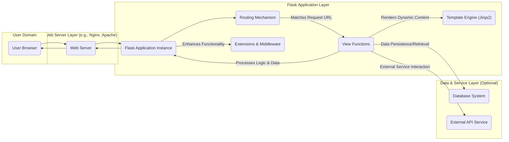
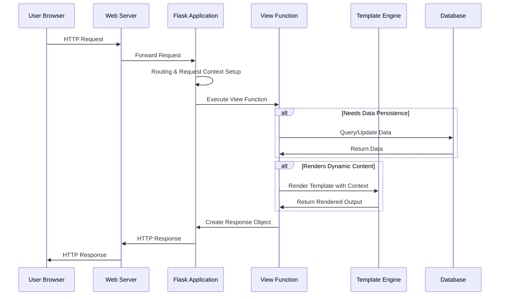

## Project Design Document: Flask Web Framework (Improved)

**1. Introduction**

This document provides an enhanced architectural design overview of the Flask web framework, focusing on aspects relevant to security and system behavior. It details the key components, data flow, and architectural decisions to facilitate a comprehensive understanding for threat modeling and security analysis.

**2. Project Overview**

Flask is a lightweight and extensible WSGI (Web Server Gateway Interface) web application framework written in Python. Distinguished as a microframework, it prioritizes a simple core without mandatory dependencies for features like database abstraction or form validation, empowering developers to select their preferred tools. Flask's design emphasizes flexibility and ease of use for building web applications and APIs.

**3. Goals and Objectives**

*   To offer a straightforward and intuitive platform for developing web applications in Python.
*   To provide a highly flexible and extensible architecture, allowing developers to integrate diverse libraries and tools.
*   To maintain a lean core framework with essential functionalities, promoting ease of understanding and minimal overhead.
*   To ensure seamless deployment and integration with various web servers and deployment environments.
*   To empower developers with fine-grained control over application components and structure.

**4. Target Audience**

*   Web developers creating small to medium-sized web applications, RESTful APIs, and microservices.
*   Developers who value a minimalist design and require precise control over their application's architecture.
*   Developers involved in rapid prototyping and experimentation with web technologies and concepts.
*   Educators and students learning about web development principles and Python web frameworks.

**5. High-Level Architecture**

The central function of Flask is to process HTTP requests and generate corresponding HTTP responses. It leverages the Werkzeug WSGI toolkit for managing the intricacies of the HTTP protocol.

**6. Key Components**

*   **Flask Application Instance:** The core object responsible for managing the application's configuration, defining routes, and orchestrating the request-response cycle. It acts as the central registry for application resources.
*   **Routing Mechanism:**  The system for mapping incoming URL paths to specific Python functions (view functions). Flask uses decorators (e.g., `@app.route('/path')`) to define these associations, providing a declarative way to define application endpoints.
*   **View Functions:** Python functions that contain the application's business logic for handling requests associated with specific routes. They process incoming data, interact with other parts of the system, and generate responses.
*   **Request Object:** An object encapsulating the incoming HTTP request, providing access to request headers, parameters (query string, form data), and the request body. It offers a structured way to interact with client-provided information.
*   **Response Object:** An object used to construct and customize the HTTP response sent back to the client. This includes setting the status code, headers (e.g., content type, cookies), and the response body (e.g., HTML, JSON).
*   **Template Engine (Jinja2):** A powerful and flexible template engine used to generate dynamic HTML, XML, or other text-based formats. It allows embedding Python code and logic within templates for dynamic content generation and presentation.
*   **Extensions & Middleware:** Packages that extend Flask's core functionality, providing features like database integration (e.g., Flask-SQLAlchemy), form handling (e.g., Flask-WTF), authentication (e.g., Flask-Login), and security enhancements. Middleware components can intercept and process requests and responses, enabling cross-cutting concerns like logging or authentication.
*   **Werkzeug:** A foundational WSGI toolkit that provides the underlying implementation for Flask's request and response handling, routing, and other low-level HTTP functionalities. Flask builds upon Werkzeug's robust and well-tested HTTP implementation.
*   **Session Management:** Flask provides a mechanism for creating and managing user sessions, typically implemented using signed cookies stored in the user's browser. This allows the application to maintain state between requests for individual users.
*   **Application Context & Request Context:** Flask utilizes context locals to make application-specific and request-specific data accessible within the current thread or greenlet. This avoids the need to pass objects explicitly through the application, simplifying code and improving readability.

**7. Data Flow**

The typical lifecycle of an HTTP request within a Flask application involves the following steps:

*   A user's web browser initiates an HTTP request targeting the application's domain.
*   The web server (e.g., Nginx, Apache with mod_wsgi or uWSGI) receives the incoming request.
*   The web server forwards the request to the designated Flask application instance.
*   Werkzeug, the underlying WSGI library, receives the request and constructs a `Request` object, encapsulating all request details.
*   Flask's routing mechanism analyzes the request URL and matches it to a registered view function based on the defined routes.
*   The matched view function is invoked, gaining access to the `Request` object and other relevant context.
*   Within the view function, the application logic is executed. This may involve:
    *   Processing data extracted from the `Request` object.
    *   Interacting with databases or external services to retrieve or manipulate data.
    *   Rendering a template using Jinja2, passing data to be dynamically incorporated into the output.
    *   Constructing a `Response` object, setting headers, status codes, and the response body.
*   Flask sends the constructed `Response` object back to the web server.
*   The web server transmits the HTTP response back to the user's web browser.

**8. Security Considerations (Detailed for Threat Modeling)**

*   **Input Validation and Sanitization:** Flask relies on developers to implement robust input validation and sanitization to prevent vulnerabilities. Failure to do so can lead to:
    *   **Cross-Site Scripting (XSS):** Malicious scripts injected into the application's output, potentially stealing user data or performing unauthorized actions. Mitigation involves proper output encoding and escaping, especially when rendering user-provided content in templates.
    *   **SQL Injection:**  Exploiting vulnerabilities in database queries by injecting malicious SQL code. Mitigation involves using parameterized queries or ORMs that handle escaping automatically.
    *   **Command Injection:**  Executing arbitrary commands on the server by injecting malicious input into system calls. Mitigation involves avoiding direct system calls with user input and using secure alternatives.
*   **Cross-Site Request Forgery (CSRF):**  Enabling malicious websites to perform actions on behalf of an authenticated user. Mitigation involves implementing CSRF protection mechanisms, such as synchronizer tokens (e.g., using Flask-WTF).
*   **Session Security:**  Compromised session cookies can lead to account takeover. Security measures include:
    *   Using a strong and unpredictable `SECRET_KEY` for signing session cookies.
    *   Setting the `HttpOnly` flag to prevent client-side JavaScript access to cookies.
    *   Setting the `Secure` flag to ensure cookies are only transmitted over HTTPS.
    *   Implementing session timeouts and regeneration.
*   **Dependency Vulnerabilities:**  Flask applications depend on various third-party libraries, which may contain security vulnerabilities. Regular dependency updates and security audits are crucial. Tools like `pip check` or vulnerability scanners can help identify vulnerable dependencies.
*   **Denial of Service (DoS):**  Attacks aimed at overwhelming the application with requests or consuming excessive resources. Mitigation strategies include:
    *   Implementing rate limiting to restrict the number of requests from a single source.
    *   Setting appropriate resource limits (e.g., request size limits).
    *   Using techniques like CAPTCHA to prevent automated abuse.
*   **Authentication and Authorization:**  Properly verifying user identities and controlling access to resources is essential. Considerations include:
    *   Using strong password hashing algorithms (e.g., bcrypt, Argon2).
    *   Implementing multi-factor authentication (MFA).
    *   Following the principle of least privilege when granting access.
*   **Configuration Security:**  Storing sensitive information securely is critical. Avoid hardcoding secrets in the application code. Utilize environment variables, secure configuration management tools (e.g., HashiCorp Vault), or encrypted configuration files.
*   **Error Handling and Debugging:**  Detailed error messages in production environments can expose sensitive information. Implement proper error handling and logging mechanisms that redact sensitive data. Disable debug mode in production.
*   **HTTP Header Security:**  Setting appropriate HTTP security headers can enhance application security. Examples include:
    *   `Strict-Transport-Security` (HSTS) to enforce HTTPS.
    *   `Content-Security-Policy` (CSP) to mitigate XSS attacks.
    *   `X-Frame-Options` to prevent clickjacking.
    *   `X-Content-Type-Options` to prevent MIME sniffing attacks.

**9. Deployment Considerations**

Deploying Flask applications typically involves using production-ready WSGI servers and often a reverse proxy for enhanced security and performance:

*   **WSGI Servers:**
    *   **Gunicorn:** A widely used Python WSGI HTTP server for production deployments.
    *   **uWSGI:** A fast and feature-rich application server supporting WSGI.
    *   **Waitress:** A pure-Python, production-quality WSGI server.
*   **Reverse Proxies:**
    *   **Nginx:** A popular and high-performance web server and reverse proxy.
    *   **Apache HTTP Server:** Another widely used web server that can act as a reverse proxy.

The reverse proxy often handles tasks such as SSL/TLS termination, load balancing, and serving static files, improving security and performance. Containerization technologies like Docker are also commonly used for packaging and deploying Flask applications.

**10. Technologies Used**

*   **Python:** The core programming language for Flask.
*   **Werkzeug:** The WSGI toolkit providing fundamental HTTP utilities.
*   **Jinja2:** The template engine for dynamic content generation.
*   **MarkupSafe:** A library for escaping strings for safe use in HTML and XML.
*   **ItsDangerous:** Used for securely signing data, particularly for session management.

**11. Future Considerations (Potential Enhancements)**

*   **Asynchronous Request Handling:** Exploring and integrating native asynchronous capabilities (e.g., using `asyncio`) to improve performance for I/O-bound operations and support more concurrent requests.
*   **Enhanced Type Hinting:**  Further adoption and enforcement of type hints to improve code maintainability, reduce errors, and facilitate static analysis.
*   **Standardized Extension Interfaces:**  Developing more standardized interfaces for common extension functionalities could improve interoperability and reduce fragmentation within the extension ecosystem.
*   **Improved Security Defaults:**  Exploring opportunities to introduce more secure defaults within the framework itself, reducing the burden on developers to implement common security measures.

This improved design document provides a more detailed and security-focused overview of the Flask web framework's architecture, serving as a robust foundation for subsequent threat modeling and security analysis activities.