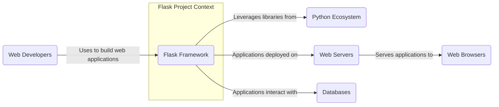
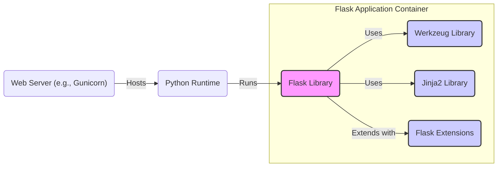
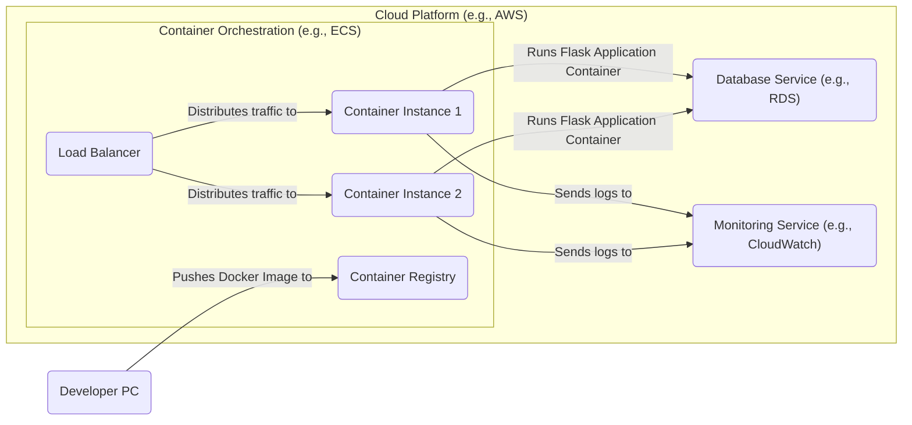
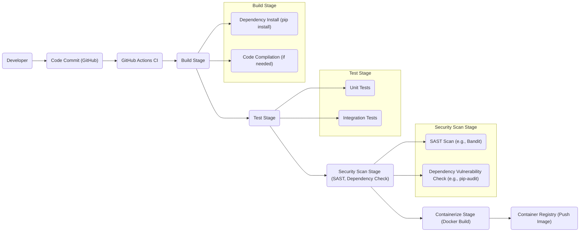

# BUSINESS POSTURE

- Business priorities and goals:
  - Provide a lightweight and flexible web framework for Python developers.
  - Enable rapid development of web applications and APIs.
  - Maintain a simple and extensible core with a focus on microframework principles.
  - Foster a vibrant and active community around the framework.
- Most important business risks:
  - Security vulnerabilities in the framework could impact a large number of applications built with Flask.
  - Lack of maintenance or slow security updates could lead to widespread security issues.
  - Breaking changes in the framework could disrupt existing applications and developer workflows.
  - Poor documentation or lack of community support could hinder adoption and developer productivity.

# SECURITY POSTURE

- Existing security controls:
  - security control: Code review process on GitHub for contributions (described in GitHub repository contribution guidelines).
  - security control: Security advisories and vulnerability reporting process (described in Flask documentation and security policy).
  - security control: Regular releases with bug fixes and security patches (visible in GitHub releases and changelog).
  - security control: Usage of Werkzeug, a robust WSGI library, for handling HTTP requests and responses (implicit in Flask architecture).
  - accepted risk: Reliance on developers to implement security best practices in their applications built with Flask.
  - accepted risk: Vulnerabilities in dependencies used by Flask or applications built with Flask.

- Recommended security controls:
  - security control: Automated security scanning (SAST/DAST) of Flask codebase in CI/CD pipeline.
  - security control: Dependency vulnerability scanning and management for Flask and its dependencies.
  - security control: Security focused documentation and examples for developers using Flask.
  - security control: Penetration testing or security audits of Flask framework on a regular basis.

- Security requirements:
  - Authentication:
    - Applications built with Flask should be able to implement various authentication mechanisms (e.g., session-based, token-based, OAuth).
    - Flask itself should not enforce any specific authentication method, providing flexibility to developers.
  - Authorization:
    - Applications built with Flask should be able to implement fine-grained authorization controls to manage access to resources.
    - Flask should provide tools and patterns to facilitate authorization implementation.
  - Input validation:
    - Applications built with Flask must validate all user inputs to prevent injection attacks (e.g., SQL injection, XSS).
    - Flask should provide guidance and mechanisms for input validation (e.g., request parsing, form handling).
  - Cryptography:
    - Applications built with Flask may need to use cryptography for various purposes (e.g., password hashing, data encryption, secure communication).
    - Flask should integrate well with Python cryptography libraries and provide secure defaults where applicable (e.g., session management).

# DESIGN

## C4 CONTEXT

- Elements of context diagram:
  - - Name: Flask Framework
    - Type: Software System
    - Description: A microframework for Python based on Werkzeug, Jinja 2 and good intentions. It aims to keep the core simple but extensible.
    - Responsibilities: Provides core functionalities for web application development, including routing, request handling, response generation, and template rendering.
    - Security controls: Code review, security advisories, regular releases, dependency management.
  - - Name: Web Developers
    - Type: Person
    - Description: Software engineers who use Flask to build web applications and APIs.
    - Responsibilities: Develop, deploy, and maintain web applications using Flask, implement security best practices in their applications.
    - Security controls: Secure coding practices, input validation, authentication, authorization in applications they build.
  - - Name: Python Ecosystem
    - Type: Software System
    - Description: Collection of Python libraries, packages, and tools that Flask and Flask applications rely on (e.g., Werkzeug, Jinja2, cryptography libraries).
    - Responsibilities: Provide reusable components and functionalities for Python development, including web development.
    - Security controls: Dependency vulnerability scanning, secure package management (pip, virtual environments).
  - - Name: Web Servers
    - Type: Software System
    - Description: Servers like Nginx, Apache, or WSGI servers (e.g., Gunicorn, uWSGI) that host and serve Flask applications.
    - Responsibilities: Handle HTTP requests, serve static files, manage application processes, and provide a runtime environment for Flask applications.
    - Security controls: Server hardening, TLS/SSL configuration, access control, web application firewall (WAF).
  - - Name: Databases
    - Type: Software System
    - Description: Database systems (e.g., PostgreSQL, MySQL, SQLite) used by Flask applications to store and retrieve data.
    - Responsibilities: Persist application data, provide data access and management capabilities.
    - Security controls: Database access control, encryption at rest and in transit, input sanitization to prevent SQL injection.
  - - Name: Web Browsers
    - Type: Software System
    - Description: Clients used by end-users to access web applications built with Flask.
    - Responsibilities: Render web pages, execute client-side scripts, interact with web applications.
    - Security controls: Browser security features (e.g., Content Security Policy, Same-Origin Policy), user awareness of phishing and malicious websites.

## C4 CONTAINER

- Elements of container diagram:
  - - Name: Flask Library
    - Type: Library
    - Description: The core Flask framework library, providing essential web framework functionalities.
    - Responsibilities: Routing, request and response handling, application context management, extension loading.
    - Security controls: Code review, security testing, input validation within framework components, secure session management.
  - - Name: Werkzeug Library
    - Type: Library
    - Description: A comprehensive WSGI web application library that Flask is built upon. Handles low-level details of HTTP and WSGI.
    - Responsibilities: HTTP request parsing, response building, WSGI server integration, cookie handling, security utilities.
    - Security controls: Security audits, input validation, protection against common web attacks (e.g., CSRF, XSS in utilities).
  - - Name: Jinja2 Library
    - Type: Library
    - Description: A modern and designer-friendly templating language for Python, used by Flask for rendering dynamic web pages.
    - Responsibilities: Template rendering, template inheritance, escaping output to prevent XSS, template security sandboxing.
    - Security controls: Auto-escaping of variables, template sandboxing (if enabled), security considerations in template design.
  - - Name: Flask Extensions
    - Type: Library
    - Description: Community-developed extensions that add functionalities to Flask, such as database integration, authentication, and API frameworks.
    - Responsibilities: Extend Flask's capabilities, provide reusable components for common web development tasks.
    - Security controls: Security depends on individual extensions; developers should choose and review extensions carefully.
  - - Name: Web Server (e.g., Gunicorn)
    - Type: Application Server
    - Description: A production-ready WSGI server used to host and serve Flask applications.
    - Responsibilities: Process management, handling concurrent requests, serving static files, integrating with load balancers and reverse proxies.
    - Security controls: Server hardening, process isolation, resource limits, TLS/SSL termination, security configurations.
  - - Name: Python Runtime
    - Type: Runtime Environment
    - Description: The Python interpreter and standard library required to run Flask and its applications.
    - Responsibilities: Execute Python code, manage memory, provide core functionalities for Python programs.
    - Security controls: Keeping Python runtime updated with security patches, secure Python installation and configuration.

## DEPLOYMENT

Deployment Solution: **Containerized Deployment on Cloud Platform (e.g., AWS ECS, Google Kubernetes Engine)**

- Elements of deployment diagram:
  - - Name: Developer PC
    - Type: Development Environment
    - Description: Developer's local machine used for writing code, building Docker images, and testing.
    - Responsibilities: Code development, local testing, building and pushing container images.
    - Security controls: Developer workstation security, code repository access control, secure development practices.
  - - Name: Container Registry
    - Type: Registry Service
    - Description: Service for storing and managing Docker container images (e.g., Docker Hub, AWS ECR, Google GCR).
    - Responsibilities: Securely store and distribute container images, manage image versions and access control.
    - Security controls: Access control, vulnerability scanning of container images, image signing and verification.
  - - Name: Load Balancer
    - Type: Network Load Balancer
    - Description: Distributes incoming traffic across multiple container instances running Flask applications.
    - Responsibilities: Traffic distribution, health checks, SSL termination, high availability.
    - Security controls: TLS/SSL configuration, DDoS protection, access control lists (ACLs), security groups.
  - - Name: Container Instance 1 & 2
    - Type: Compute Instance (e.g., EC2, VMs)
    - Description: Virtual machines or compute instances running container runtime (e.g., Docker, containerd) and hosting Flask application containers.
    - Responsibilities: Run Flask application containers, execute application code, handle requests, interact with database and other services.
    - Security controls: Instance hardening, security groups, container isolation, resource limits, runtime security (e.g., AppArmor, SELinux).
  - - Name: Database Service (e.g., RDS)
    - Type: Managed Database Service
    - Description: Managed database service provided by cloud platform, used by Flask applications for data persistence.
    - Responsibilities: Data storage, data management, database operations, backups, high availability.
    - Security controls: Database access control, encryption at rest and in transit, database monitoring, vulnerability management.
  - - Name: Monitoring Service (e.g., CloudWatch)
    - Type: Monitoring Service
    - Description: Cloud monitoring service used to collect logs, metrics, and monitor the health and performance of Flask applications and infrastructure.
    - Responsibilities: Log aggregation, metrics collection, alerting, performance monitoring, security monitoring.
    - Security controls: Access control to monitoring data, secure log storage, anomaly detection for security events.

## BUILD

- Elements of build diagram:
  - - Name: Developer
    - Type: Person
    - Description: Software developer writing and committing code changes.
    - Responsibilities: Writing code, running local tests, committing code to repository.
    - Security controls: Secure coding practices, code review, workstation security.
  - - Name: Code Commit (GitHub)
    - Type: Version Control System
    - Description: GitHub repository hosting Flask project code.
    - Responsibilities: Version control, code collaboration, triggering CI/CD pipelines.
    - Security controls: Access control, branch protection, commit signing, audit logs.
  - - Name: GitHub Actions CI
    - Type: CI/CD Platform
    - Description: GitHub's built-in CI/CD service used to automate build, test, and deployment processes.
    - Responsibilities: Automated build, test, security scanning, and containerization of Flask applications.
    - Security controls: Secure workflow definitions, secret management, access control, audit logs.
  - - Name: Build Stage
    - Type: CI Stage
    - Description: Stage in CI pipeline responsible for building the application.
    - Responsibilities: Installing dependencies, compiling code (if necessary), preparing build artifacts.
    - Security controls: Dependency vulnerability scanning during install, secure build environment, build artifact integrity checks.
  - - Name: Test Stage
    - Type: CI Stage
    - Description: Stage in CI pipeline responsible for running automated tests.
    - Responsibilities: Running unit tests, integration tests, ensuring code quality and functionality.
    - Security controls: Test environment isolation, secure test data management.
  - - Name: Security Scan Stage
    - Type: CI Stage
    - Description: Stage in CI pipeline responsible for performing security scans.
    - Responsibilities: Static Application Security Testing (SAST), dependency vulnerability scanning, identifying potential security issues.
    - Security controls: SAST tool configuration, dependency vulnerability database updates, fail-on-high-severity-findings policy.
  - - Name: Containerize Stage
    - Type: CI Stage
    - Description: Stage in CI pipeline responsible for building Docker container image.
    - Responsibilities: Building Docker image, tagging image, pushing image to container registry.
    - Security controls: Base image selection, minimal image layers, vulnerability scanning of base images, image signing.
  - - Name: Container Registry
    - Type: Registry Service
    - Description: Service for storing and managing Docker container images.
    - Responsibilities: Securely store and distribute container images.
    - Security controls: Access control, vulnerability scanning, image signing.

# RISK ASSESSMENT

- Critical business processes:
  - Development and maintenance of the Flask framework itself.
  - Usage of Flask framework by developers to build and deploy web applications.
  - Community contributions and ecosystem growth around Flask.
- Data we are trying to protect and their sensitivity:
  - Flask framework source code: High sensitivity - Integrity and availability are crucial to maintain trust and prevent malicious modifications. Confidentiality is less critical as it is open source.
  - Flask framework releases and packages: High sensitivity - Integrity is paramount to ensure users download and use genuine, untampered versions. Availability is also important for continuous usage.
  - Flask documentation and website: Medium sensitivity - Integrity and availability are important to provide accurate and reliable information to users.
  - User data in applications built with Flask: Sensitivity depends on the application. Flask itself does not handle user data, but applications built with it often do. Security of user data is the responsibility of application developers.

# QUESTIONS & ASSUMPTIONS

- Questions:
  - What is the target audience for this design document? Is it for Flask core developers, security auditors, or application developers using Flask?
  - What is the expected level of detail for threat modeling? Should it cover specific attack vectors and mitigation strategies?
  - Are there any specific compliance requirements or security standards that Flask project needs to adhere to?
  - What is the process for handling security vulnerabilities reported in Flask? Is there a public security policy or disclosure process?

- Assumptions:
  - BUSINESS POSTURE: The primary goal of Flask is to be a secure, reliable, and easy-to-use web framework for Python developers. Security is a high priority for the project.
  - SECURITY POSTURE: Flask project follows secure development practices, including code review and vulnerability management. Security is primarily the responsibility of application developers using Flask.
  - DESIGN: Flask is designed as a microframework with a modular architecture, relying on external libraries for many functionalities. Deployment is typically containerized or on cloud platforms. Build process is automated using CI/CD pipelines.