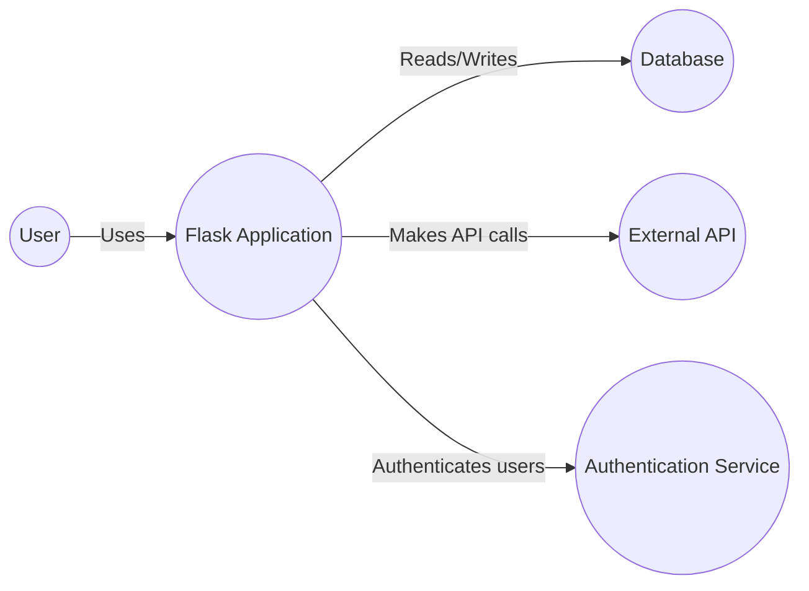
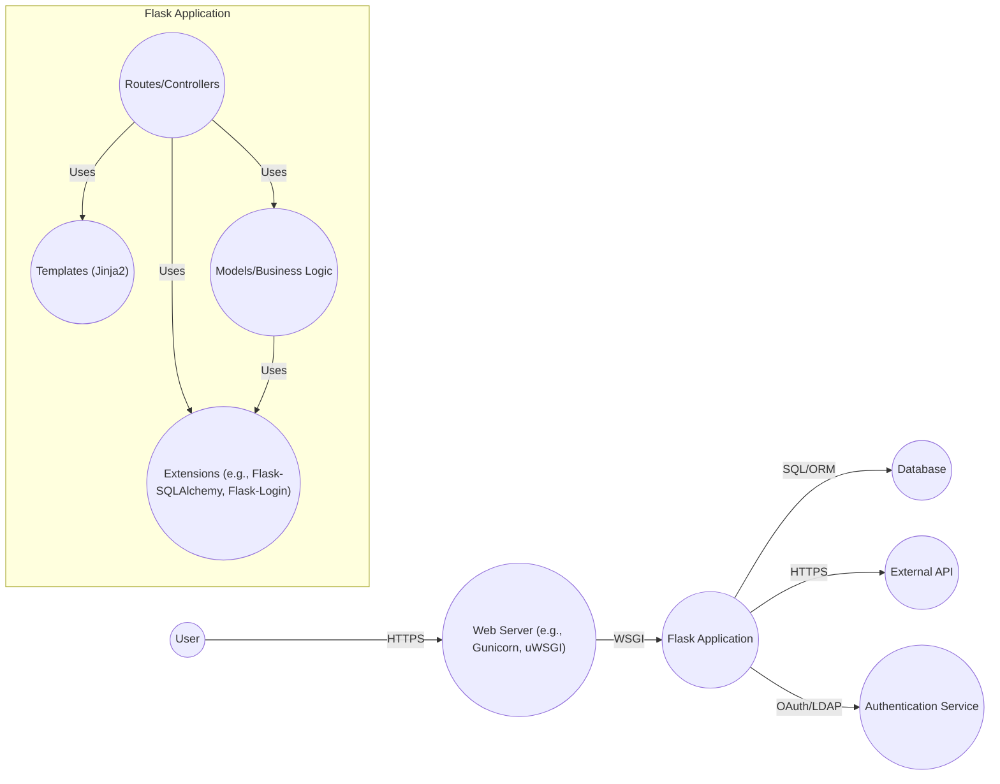
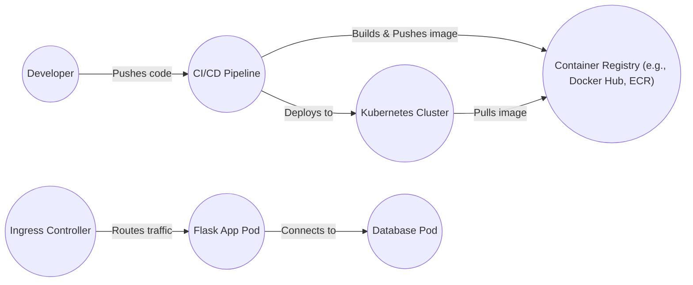
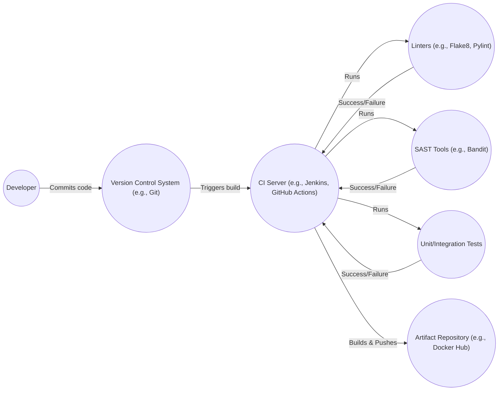

# BUSINESS POSTURE

Flask is a popular, lightweight, open-source web application framework written in Python. It's designed to make getting started quick and easy, with the ability to scale up to complex applications. It's used by a wide range of developers, from hobbyists building small personal projects to large organizations building complex web applications.

Business Priorities:

*   Enable rapid development of web applications.
*   Provide a flexible and extensible framework that can be adapted to various needs.
*   Maintain a low barrier to entry for new developers.
*   Ensure the framework is reliable and maintainable.
*   Foster a strong and active community.

Business Goals:

*   Provide a robust and versatile foundation for web application development.
*   Empower developers to build secure and scalable applications.
*   Minimize the overhead and complexity associated with web development.
*   Offer a customizable solution that can be tailored to specific project requirements.

Most Important Business Risks:

*   Security vulnerabilities in the framework could expose applications built with Flask to attacks.
*   Lack of maintainability or active development could lead to the framework becoming obsolete.
*   Insufficient documentation or community support could hinder adoption and usage.
*   Performance bottlenecks could limit the scalability of applications built with Flask.
*   Incompatibility with newer technologies or standards could reduce the framework's relevance.

# SECURITY POSTURE

Existing Security Controls:

*   security control: Werkzeug (a core dependency) provides utilities for handling HTTP requests and responses securely, including protection against some common web vulnerabilities. (Described in Werkzeug documentation)
*   security control: Jinja2 (the templating engine) auto-escapes output by default, mitigating Cross-Site Scripting (XSS) vulnerabilities. (Described in Jinja2 documentation)
*   security control: Flask encourages the use of secure coding practices through its documentation and examples. (Described in Flask documentation)
*   security control: Flask's extension ecosystem includes libraries for implementing various security features, such as authentication, authorization, and input validation. (Described in Flask documentation and individual extension documentation)
*   security control: Regular releases and updates address security vulnerabilities and bug fixes. (Described in Flask changelog and GitHub repository)

Accepted Risks:

*   accepted risk: Flask itself is a microframework and relies on extensions for many security features. The security of a Flask application depends heavily on the correct implementation and configuration of these extensions and the application code itself.
*   accepted risk: Developers are responsible for implementing appropriate security measures within their applications, such as input validation, output encoding, and secure configuration.
*   accepted risk: The framework's flexibility means that developers can choose to bypass or disable security features, potentially introducing vulnerabilities.

Recommended Security Controls:

*   security control: Implement a robust Content Security Policy (CSP) to mitigate XSS and data injection attacks.
*   security control: Use HTTPS for all communication to protect against man-in-the-middle attacks.
*   security control: Implement strong authentication and authorization mechanisms using well-vetted libraries like Flask-Login or Flask-Security-Too.
*   security control: Regularly update all dependencies, including Flask, Werkzeug, Jinja2, and any extensions, to patch security vulnerabilities.
*   security control: Use a Web Application Firewall (WAF) to protect against common web attacks.
*   security control: Implement rate limiting to prevent brute-force attacks and denial-of-service.
*   security control: Use a security linter and static analysis tools to identify potential security vulnerabilities in the codebase.

Security Requirements:

*   Authentication: Applications built with Flask should implement secure authentication mechanisms to verify user identities. This may involve using existing libraries or implementing custom solutions.
*   Authorization: Applications should enforce appropriate authorization controls to restrict access to resources based on user roles and permissions.
*   Input Validation: All user input should be strictly validated to prevent injection attacks and ensure data integrity.
*   Cryptography: Sensitive data, such as passwords and API keys, should be securely stored and transmitted using appropriate cryptographic techniques. Secrets management should be externalized from the codebase.
*   Session Management: Secure session management practices should be employed, including the use of secure cookies and appropriate session timeouts.

# DESIGN

## C4 CONTEXT

Element Descriptions:

*   Element:
    *   Name: User
    *   Type: Person
    *   Description: A person interacting with the Flask Application through a web browser or other client.
    *   Responsibilities: Accessing and interacting with the application's features.
    *   Security controls: Browser security settings, user-provided credentials.

*   Element:
    *   Name: Flask Application
    *   Type: Software System
    *   Description: The web application built using the Flask framework.
    *   Responsibilities: Handling user requests, processing data, interacting with other systems.
    *   Security controls: Input validation, output encoding, authentication, authorization, secure configuration, session management.

*   Element:
    *   Name: Database
    *   Type: Software System
    *   Description: A database system used to store application data.
    *   Responsibilities: Storing and retrieving data.
    *   Security controls: Access controls, encryption at rest, encryption in transit, auditing.

*   Element:
    *   Name: External API
    *   Type: Software System
    *   Description: An external API that the Flask application interacts with.
    *   Responsibilities: Providing specific services or data.
    *   Security controls: API keys, authentication, authorization, rate limiting, input validation.

*   Element:
    *   Name: Authentication Service
    *   Type: Software System
    *   Description: A service responsible for authenticating users (e.g., OAuth provider, LDAP).
    *   Responsibilities: Verifying user credentials and issuing tokens.
    *   Security controls: Secure authentication protocols, multi-factor authentication, account lockout policies.

## C4 CONTAINER

Element Descriptions:

*   Element:
    *   Name: User
    *   Type: Person
    *   Description: A person interacting with the Flask Application.
    *   Responsibilities: Accessing and interacting with the application.
    *   Security controls: Browser security settings, user-provided credentials.

*   Element:
    *   Name: Web Server (e.g., Gunicorn, uWSGI)
    *   Type: Container (Web Server)
    *   Description: A production-ready WSGI HTTP server that serves the Flask application.
    *   Responsibilities: Handling incoming HTTP requests and forwarding them to the Flask application.
    *   Security controls: HTTPS configuration, request filtering, rate limiting.

*   Element:
    *   Name: Flask Application
    *   Type: Container (Application)
    *   Description: The web application built using the Flask framework.
    *   Responsibilities: Handling user requests, processing data, interacting with other systems.
    *   Security controls: Input validation, output encoding, authentication, authorization, secure configuration, session management.

*   Element:
    *   Name: Database
    *   Type: Container (Database)
    *   Description: A database system used to store application data.
    *   Responsibilities: Storing and retrieving data.
    *   Security controls: Access controls, encryption at rest, encryption in transit, auditing.

*   Element:
    *   Name: External API
    *   Type: Container (External Service)
    *   Description: An external API that the Flask application interacts with.
    *   Responsibilities: Providing specific services or data.
    *   Security controls: API keys, authentication, authorization, rate limiting, input validation.

*   Element:
    *   Name: Authentication Service
    *   Type: Container (External Service)
    *   Description: A service responsible for authenticating users.
    *   Responsibilities: Verifying user credentials and issuing tokens.
    *   Security controls: Secure authentication protocols, multi-factor authentication, account lockout policies.

*   Element:
    *   Name: Routes/Controllers
    *   Type: Component
    *   Description: Handles incoming requests and returns responses.
    *   Responsibilities: Routing requests to the appropriate handlers, processing data, interacting with models and templates.
    *   Security controls: Input validation, authorization checks.

*   Element:
    *   Name: Templates (Jinja2)
    *   Type: Component
    *   Description: Renders dynamic HTML content.
    *   Responsibilities: Generating HTML pages based on data provided by the controllers.
    *   Security controls: Auto-escaping (to prevent XSS).

*   Element:
    *   Name: Models/Business Logic
    *   Type: Component
    *   Description: Represents the application's data and business rules.
    *   Responsibilities: Interacting with the database, performing data validation, implementing business logic.
    *   Security controls: Data validation, secure data handling.

*   Element:
    *   Name: Extensions (e.g., Flask-SQLAlchemy, Flask-Login)
    *   Type: Component
    *   Description: Provides additional functionality to the Flask application.
    *   Responsibilities: Extending Flask's capabilities, such as database integration, authentication, and more.
    *   Security controls: Dependent on the specific extension; should be reviewed individually.

## DEPLOYMENT

Possible Deployment Solutions:

1.  Cloud Platforms (AWS, Google Cloud, Azure, Heroku, DigitalOcean, etc.): Using services like AWS Elastic Beanstalk, Google App Engine, Azure App Service, or deploying to virtual machines.
2.  Container Orchestration (Kubernetes, Docker Swarm): Packaging the application and its dependencies into containers and deploying them using an orchestration platform.
3.  Traditional Server (Dedicated or VPS): Deploying directly to a physical or virtual server using tools like SSH, FTP, or configuration management tools.

Chosen Solution: Container Orchestration with Kubernetes

Element Descriptions:

*   Element:
    *   Name: Developer
    *   Type: Person
    *   Description: The developer writing and deploying the Flask application.
    *   Responsibilities: Writing code, committing changes, triggering deployments.
    *   Security controls: Code reviews, secure coding practices, access controls to the repository.

*   Element:
    *   Name: CI/CD Pipeline
    *   Type: System
    *   Description: A continuous integration and continuous deployment pipeline.
    *   Responsibilities: Building, testing, and deploying the application.
    *   Security controls: Automated security testing (SAST, DAST), vulnerability scanning, access controls.

*   Element:
    *   Name: Container Registry (e.g., Docker Hub, ECR)
    *   Type: System
    *   Description: A registry for storing container images.
    *   Responsibilities: Storing and serving container images.
    *   Security controls: Access controls, vulnerability scanning, image signing.

*   Element:
    *   Name: Kubernetes Cluster
    *   Type: System
    *   Description: A cluster of nodes managed by Kubernetes.
    *   Responsibilities: Orchestrating the deployment and management of containers.
    *   Security controls: Network policies, role-based access control (RBAC), pod security policies, secrets management.

*   Element:
    *   Name: Ingress Controller
    *   Type: Component
    *   Description: Manages external access to services in the cluster.
    *   Responsibilities: Routing external traffic to the appropriate pods.
    *   Security controls: TLS termination, request filtering, rate limiting.

*   Element:
    *   Name: Flask App Pod
    *   Type: Component
    *   Description: A pod running the Flask application container.
    *   Responsibilities: Running the Flask application.
    *   Security controls: Resource limits, security context, network policies.

*   Element:
    *   Name: Database Pod
    *   Type: Component
    *   Description: A pod running the database container.
    *   Responsibilities: Running the database.
    *   Security controls: Access controls, encryption at rest, encryption in transit, network policies.

## BUILD

Build Process Description:

1.  Developer commits code changes to a version control system (e.g., Git).
2.  The version control system triggers a build on the CI server (e.g., Jenkins, GitHub Actions).
3.  The CI server runs linters (e.g., Flake8, Pylint) to check for code style and potential errors.
4.  The CI server runs SAST tools (e.g., Bandit) to identify potential security vulnerabilities.
5.  The CI server runs unit and integration tests to ensure the code functions correctly.
6.  If all checks and tests pass, the CI server builds the application and packages it into a container image (e.g., Docker image).
7.  The CI server pushes the container image to an artifact repository (e.g., Docker Hub, private registry).

Security Controls:

*   security control: Linters (Flake8, Pylint) enforce coding standards and identify potential errors.
*   security control: SAST tools (Bandit) scan the codebase for security vulnerabilities.
*   security control: Unit and integration tests ensure code functionality and prevent regressions.
*   security control: CI/CD pipeline automates the build process, reducing manual errors and ensuring consistency.
*   security control: Artifact repository provides a secure and controlled environment for storing build artifacts.
*   security control: Dependency scanning tools can be integrated into the build process to identify vulnerable dependencies.
*   security control: Code signing can be used to ensure the integrity of the build artifacts.

# RISK ASSESSMENT

Critical Business Processes:

*   User authentication and authorization.
*   Data storage and retrieval.
*   API interactions with external services.
*   Serving web content to users.

Data Sensitivity:

*   User data (e.g., usernames, passwords, email addresses, personal information): High sensitivity.
*   Application data (depending on the specific application): Varies from low to high sensitivity.
*   API keys and secrets: High sensitivity.
*   Session tokens: High sensitivity.
*   Logs: Low to medium sensitivity (depending on what is logged).

# QUESTIONS & ASSUMPTIONS

Questions:

*   What specific database is being used?
*   What external APIs are being used?
*   What authentication service is being used?
*   What are the specific security requirements for the application?
*   What is the expected traffic volume and scaling requirements?
*   What is the deployment environment (cloud provider, on-premise, etc.)?
*   Are there any existing security policies or compliance requirements?
*   What level of logging and monitoring is required?
*   What is the process for handling security incidents?

Assumptions:

*   BUSINESS POSTURE: The Flask application is intended for general-purpose web development.
*   BUSINESS POSTURE: The developers have a basic understanding of web security principles.
*   SECURITY POSTURE: The application will use HTTPS for all communication.
*   SECURITY POSTURE: Basic authentication and authorization will be implemented.
*   SECURITY POSTURE: Input validation will be performed on all user inputs.
*   DESIGN: A relational database will be used.
*   DESIGN: At least one external API will be used.
*   DESIGN: A standard authentication service (e.g., OAuth provider) will be used.
*   DESIGN: The application will be deployed to a cloud environment using containers.
*   DESIGN: A CI/CD pipeline will be used for building and deploying the application.