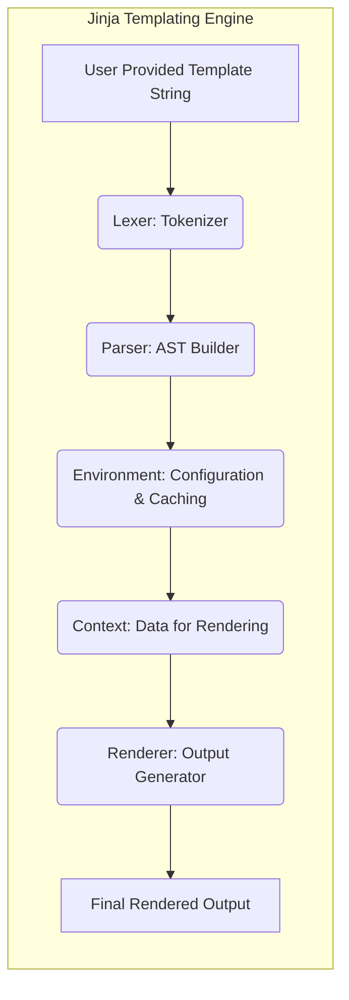

## Project Design Document: Jinja Templating Engine (Improved)

**1. Introduction**

This document provides an enhanced design overview of the Jinja templating engine, a flexible and powerful template language for Python. It aims to offer a more detailed understanding of the system's architecture, components, and data flow, specifically tailored for subsequent threat modeling activities. This document focuses on the core functionality of Jinja as a templating engine and deliberately excludes details of specific integrations with external libraries or web frameworks to maintain focus on the engine's inherent characteristics.

**2. Goals and Objectives**

The primary goals of the Jinja project are:

* **Clear Separation of Concerns:** To enable developers to effectively separate application logic from presentation logic, leading to more maintainable code.
* **Enhanced Readability and Maintainability:** To provide a template syntax that is intuitive and easy to understand, simplifying template maintenance and collaboration.
* **Robust Extensibility:** To allow developers to extend the template language with custom filters, tests, and global functions to meet specific application needs.
* **Strong Security Posture:** To provide built-in mechanisms and guidance to mitigate common security vulnerabilities associated with template rendering, such as Server-Side Template Injection (SSTI) and Cross-Site Scripting (XSS).
* **Efficient Performance:** To offer high-performance template rendering capabilities suitable for production environments.

**3. System Architecture**

The core of Jinja is composed of several interconnected components that work in concert to process template strings and generate the final output.

**3.1. High-Level Architecture**

**3.2. Component Description**

* **Lexer (Tokenizer):** This component receives the raw template string as input and breaks it down into a stream of individual tokens. Each token represents a distinct element of the template, such as variable delimiters, control flow keywords, literal text, or operators.
* **Parser (AST Builder):** The parser consumes the stream of tokens produced by the lexer and constructs an Abstract Syntax Tree (AST). The AST represents the hierarchical structure of the template and the relationships between its different elements, making it easier for the renderer to process.
* **Environment (Configuration & Caching):** The environment object serves as the central configuration point for Jinja. It manages settings such as template loaders (how templates are retrieved), filters, tests, global functions, and importantly, it caches compiled templates (the result of parsing) to improve performance on subsequent requests for the same template.
* **Context (Data for Rendering):** The context is a dictionary-like object that holds the data that will be injected into the template during the rendering process. This data is provided by the application and contains the variables and objects that the template will access.
* **Renderer (Output Generator):** The renderer is responsible for traversing the AST, evaluating expressions and control structures based on the data provided in the context, and generating the final output string. It substitutes variable placeholders with their corresponding values from the context and executes the logic defined by the template's control structures.

**4. Data Flow**

The process of rendering a Jinja template involves a distinct flow of data through the system's components:

1. **Template Acquisition:** The Jinja `Environment` utilizes a configured `TemplateLoader` to locate and retrieve the template string from a specified source.
    * Input: Template identifier (e.g., filename, string)
    * Output: Raw Template String
2. **Lexical Analysis (Lexing):** The `Lexer` processes the raw template string, breaking it down into a stream of tokens.
    * Input: Raw Template String
    * Output: Stream of Tokens (e.g., `variable_start`, `variable_name`, `string_literal`, `if_keyword`)
3. **Syntactic Analysis (Parsing):** The `Parser` consumes the stream of tokens and builds the Abstract Syntax Tree (AST), representing the template's structure.
    * Input: Stream of Tokens
    * Output: Abstract Syntax Tree (AST) - a hierarchical representation of the template.
4. **Compilation (Implicit):**  While not a separate, explicitly named component, the AST is often implicitly compiled into an internal representation (e.g., bytecode or Python code) within the `Environment` for efficient execution. This compiled form is typically cached.
    * Input: Abstract Syntax Tree (AST)
    * Output: Compiled Template (internal representation)
5. **Context Provision:** The application provides data, often in the form of Python dictionaries or objects, which is then organized into a `Context` object.
    * Input: Application Data
    * Output: Context Object (containing data accessible within the template)
6. **Rendering Execution:** The `Renderer` takes the compiled template and the `Context` as input. It traverses the compiled template, evaluating expressions, applying filters, and inserting data from the context to generate the final output string.
    * Input: Compiled Template, Context Object
    * Output: Final Rendered Output String

**5. Security Considerations**

Jinja incorporates several features and design choices that directly impact its security posture:

* **Sandboxed Execution Environment:** Jinja templates are executed within a sandboxed environment, which restricts access to potentially dangerous Python built-in functions and modules. This helps to mitigate the risk of arbitrary code execution through Server-Side Template Injection (SSTI).
* **Automatic HTML Escaping (Autoescaping):** Jinja offers configurable autoescaping, which automatically escapes HTML-sensitive characters in variables before they are inserted into the output. This is a crucial defense against Cross-Site Scripting (XSS) attacks when generating HTML output. The level of escaping can be configured globally or per-template.
* **Whitespace Control:** While primarily for formatting, Jinja's whitespace control features can indirectly impact security by preventing unintended characters from being included in the output.
* **Template Inheritance and Includes:** These features promote code reuse and consistency, which can indirectly improve security by reducing the likelihood of introducing vulnerabilities in repeated code sections. However, care must be taken to ensure that inherited or included templates are also secure.
* **Filters and Tests:** While providing powerful extensibility, custom filters and tests can introduce security vulnerabilities if not implemented carefully. Jinja provides a set of built-in, generally safe filters and tests, but developers must exercise caution when creating custom ones.
* **Limited Access to Global Namespace:** Jinja templates have limited access to the global Python namespace by default. This restricts the ability of attackers to access sensitive information or execute arbitrary code through global variables.
* **Contextual Escaping:** Jinja allows for different escaping strategies based on the output context (e.g., HTML, JavaScript, URL). This helps to ensure that data is properly escaped for the specific context in which it is being used, further mitigating XSS risks.
* **Potential for Server-Side Template Injection (SSTI):** Despite the sandboxing, if user-controlled input is directly embedded into a template string without proper sanitization, it can still lead to SSTI vulnerabilities. Developers must avoid constructing templates dynamically from untrusted user input.

**6. Assumptions and Constraints**

* **Python Runtime Environment:** Jinja is designed to operate within a standard Python runtime environment.
* **Adherence to Jinja Syntax:** Templates are expected to conform to the defined syntax of the Jinja templating language.
* **Trustworthiness of Context Data:** While Jinja provides output escaping, the security of the application also relies on the trustworthiness and appropriate handling of the data provided in the rendering context.
* **Configuration of Security Features:** The effectiveness of security features like autoescaping depends on their proper configuration and usage by the developer.
* **No Direct Execution of Arbitrary Python Code in Templates (by design):** Jinja's sandboxing aims to prevent the direct execution of arbitrary Python code within templates.

**7. Future Considerations (Potentially Impacting Security)**

While the core engine design is relatively stable, future developments could introduce new security considerations:

* **New or Enhanced Template Syntax:**  Changes to the template syntax could introduce new avenues for exploitation if not carefully designed and reviewed.
* **Changes to the Sandboxing Mechanism:** Modifications to the sandboxing implementation could inadvertently introduce vulnerabilities or weaken existing protections.
* **New Built-in Filters or Tests:** The addition of new built-in filters or tests requires careful security review to prevent the introduction of new attack vectors.
* **Integration with Emerging Technologies:** As Jinja is integrated with new technologies or frameworks, new security challenges and attack surfaces may emerge.

This improved design document provides a more detailed and security-focused overview of the Jinja templating engine. This information will serve as a more robust foundation for conducting a thorough threat modeling exercise to identify and mitigate potential security risks.
