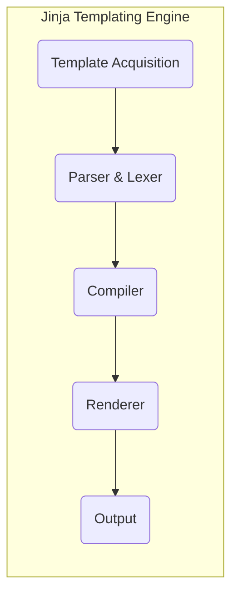
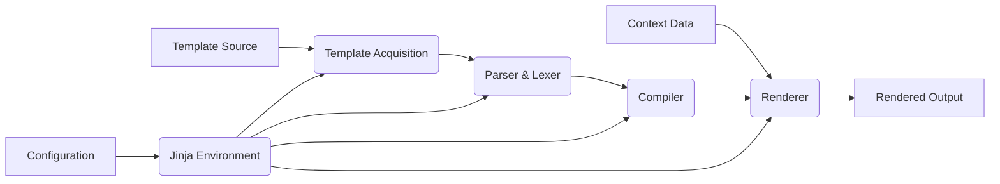

## Project Design Document: Jinja Templating Engine for Threat Modeling (Improved)

**1. Project Overview**

*   **Project Name:** Jinja
*   **Project Repository:** [https://github.com/pallets/jinja](https://github.com/pallets/jinja)
*   **Project Description:** Jinja is a widely used, fast, expressive, and extensible templating engine for Python. It enables developers to embed expressions and logic within text-based documents (e.g., HTML, XML, emails), which are then evaluated and rendered into dynamic output. Jinja is commonly integrated with web frameworks like Flask and Django but can also function independently.
*   **Purpose of this Document:** This document provides a detailed architectural overview of the Jinja templating engine, specifically tailored to facilitate comprehensive threat modeling. It outlines components, data flow, and key interactions, highlighting potential security implications at each stage.

**2. Architecture Overview**

Jinja's architecture involves a series of distinct stages to process and render templates:

*   **Template Acquisition:** The process of obtaining the template source, whether from the file system, a database, or a string.
*   **Parsing and Lexing:**  Breaking down the template source into tokens and then constructing an Abstract Syntax Tree (AST) representing the template's structure.
*   **Compilation to Bytecode:** Transforming the AST into executable Python bytecode for efficient rendering.
*   **Rendering with Context:** Executing the compiled bytecode, using provided data (the context) to generate the final output.

**3. Component Details**

This section elaborates on each component within Jinja's architecture, focusing on their functionalities and potential security vulnerabilities.

*   **Template Acquisition:**
    *   **Functionality:** Responsible for retrieving the raw template source. Jinja offers various loaders:
        *   `FileSystemLoader`: Loads templates from the local file system.
        *   `PackageLoader`: Loads templates from Python packages.
        *   `DictLoader`: Loads templates from a Python dictionary.
        *   `StringLoader`: Loads templates directly from strings.
        *   Custom loaders can be implemented.
    *   **Key Aspects for Threat Modeling:**
        *   **Path Traversal (FileSystemLoader):** If the template name is derived from user input without proper sanitization, attackers could access arbitrary files on the server.
        *   **Access Control:** Ensuring only authorized templates can be accessed.
        *   **Source Code Exposure:**  Vulnerabilities allowing attackers to read the raw template source code.
        *   **Dependency on External Systems:** If a custom loader interacts with external systems, their security becomes relevant.

*   **Parser & Lexer:**
    *   **Functionality:**
        *   **Lexer:** Breaks down the template source into a stream of tokens (e.g., variables, literals, operators, control flow keywords).
        *   **Parser:**  Consumes the token stream and builds an Abstract Syntax Tree (AST) representing the template's structure and logic.
    *   **Key Aspects for Threat Modeling:**
        *   **Template Injection:**  If user-provided data is embedded in templates without proper escaping *before* parsing, attackers can inject malicious template code that will be interpreted and executed.
        *   **Denial of Service (DoS):**  Crafted templates with deeply nested structures or excessive complexity could exhaust parsing resources.
        *   **Error Handling:** How the parser handles invalid or malformed template syntax. Poor error handling might reveal sensitive information or lead to unexpected behavior.
        *   **Bypass of Security Measures:**  Attackers might try to craft templates that bypass security checks implemented in later stages if the parser is not robust.

*   **Compiler:**
    *   **Functionality:** Transforms the AST into executable Python bytecode. This involves generating Python instructions to represent template logic, variable substitutions, and filter applications.
    *   **Key Aspects for Threat Modeling:**
        *   **Code Generation Flaws:**  Bugs in the compiler could lead to the generation of insecure Python code.
        *   **Exposure of Internal State:**  The compiled bytecode might inadvertently reveal internal information or logic.
        *   **Optimization vs. Security:** Compiler optimizations should not introduce security vulnerabilities.
        *   **Control Flow Manipulation:**  Potential for attackers to influence the generated bytecode through crafted templates.

*   **Renderer:**
    *   **Functionality:** Executes the compiled bytecode with the provided context data to produce the final output. This involves:
        *   **Variable Resolution:** Looking up variables in the provided context.
        *   **Expression Evaluation:** Evaluating expressions within the template.
        *   **Filter Application:** Applying filters to modify data before output.
        *   **Test Execution:** Evaluating conditions using built-in or custom tests.
        *   **Output Generation:**  Constructing the final output string.
    *   **Key Aspects for Threat Modeling:**
        *   **Cross-Site Scripting (XSS):** If user-provided data within the context is rendered without proper escaping for the target output format (e.g., HTML), it can lead to XSS vulnerabilities.
        *   **Server-Side Request Forgery (SSRF):**  If template expressions allow making external requests based on user-controlled data within the context, SSRF attacks are possible.
        *   **Information Disclosure:**  Improper handling of sensitive data within the context during rendering could lead to information leaks in the output.
        *   **Denial of Service (DoS):**  Execution of computationally expensive expressions or filters could lead to resource exhaustion.
        *   **Security of Filters and Tests:** The security of both built-in and custom filters and tests is crucial. Malicious filters or tests could introduce vulnerabilities.
        *   **Context Data Security:**  The security of the data provided in the rendering context is paramount, as Jinja will operate on this data.

**4. Data Flow**

The data flow within Jinja can be visualized as follows:

*   **Input:**
    *   **Template Source:** The raw template content (string, file content, etc.).
    *   **Context Data:** A dictionary or object containing data to be used within the template.
    *   **Configuration:** Settings that influence the behavior of Jinja (e.g., autoescape, template delimiters).
*   **Processing Stages:**
    *   The **Template Acquisition** component retrieves the template source.
    *   The **Parser & Lexer** analyze the source, generating the AST.
    *   The **Compiler** transforms the AST into Python bytecode.
    *   The **Renderer** executes the bytecode using the context data.
*   **Output:**
    *   The rendered output string, ready to be sent to the user or further processed.

**5. Key Interactions**

Jinja interacts with several external entities:

*   **Application Code:** The application using Jinja provides the template source, context data, and configuration. This is the primary point of interaction and a critical area for security considerations.
*   **File System (if using FileSystemLoader):** Jinja interacts with the file system to read template files. Security here depends on file permissions and access controls.
*   **Python Interpreter:** Jinja relies on the Python interpreter for parsing, compilation, and rendering. The security of the Python environment is therefore relevant.
*   **Third-party Libraries (for custom extensions):** If custom loaders, filters, or tests are used, their security is paramount.
*   **User Input (indirectly):** User input can influence the context data provided to Jinja, making proper sanitization and validation crucial *before* passing data to the rendering process.
*   **Caching Mechanisms:** Jinja can cache compiled templates. The security of the cache storage is a consideration.
*   **Logging Systems:** Jinja might interact with logging systems for error reporting. Sensitive information should not be logged.

**6. Security Considerations (Categorized)**

This section categorizes potential security vulnerabilities based on common attack vectors:

*   **Injection Attacks:**
    *   **Template Injection:** Exploiting the ability to inject malicious template code that gets executed during rendering.
    *   **Code Injection (via custom extensions):**  Vulnerabilities in custom filters, tests, or loaders that allow arbitrary code execution.
*   **Cross-Site Scripting (XSS):**
    *   **Output Escaping Failures:**  Rendering user-provided data without proper escaping for the output context (HTML, JavaScript, etc.).
*   **Path Traversal:**
    *   **Insecure Template Loaders:**  Exploiting vulnerabilities in template loaders (especially `FileSystemLoader`) to access unauthorized files.
*   **Server-Side Request Forgery (SSRF):**
    *   **Unsafe External Requests:**  Allowing template expressions to make arbitrary external requests based on user-controlled data.
*   **Information Disclosure:**
    *   **Exposure of Sensitive Data in Output:**  Accidentally rendering sensitive information present in the context data.
    *   **Source Code Exposure:**  Vulnerabilities allowing attackers to retrieve the raw template source code.
    *   **Error Handling Issues:**  Revealing sensitive information through verbose error messages.
*   **Denial of Service (DoS):**
    *   **Resource Exhaustion during Parsing:**  Crafting overly complex templates that consume excessive parsing resources.
    *   **Resource Exhaustion during Rendering:**  Using computationally expensive expressions or filters.
*   **Configuration Vulnerabilities:**
    *   **Insecure Default Settings:**  Relying on insecure default configurations.
    *   **Misconfiguration:** Incorrectly configuring Jinja, leading to vulnerabilities.
*   **Dependency Vulnerabilities:**
    *   **Vulnerabilities in Jinja's Dependencies:**  Security flaws in libraries that Jinja relies on.

**7. Diagrams**

The diagrams provided in the "Architecture Overview" and "Data Flow" sections offer visual representations of Jinja's structure and data processing. These diagrams are essential for understanding the system's components and their interactions, aiding in the identification of potential threat vectors.

This improved design document provides a more detailed and categorized overview of the Jinja templating engine, specifically tailored for threat modeling. It highlights potential security concerns at each stage of the template processing lifecycle, enabling a more thorough and effective security analysis.