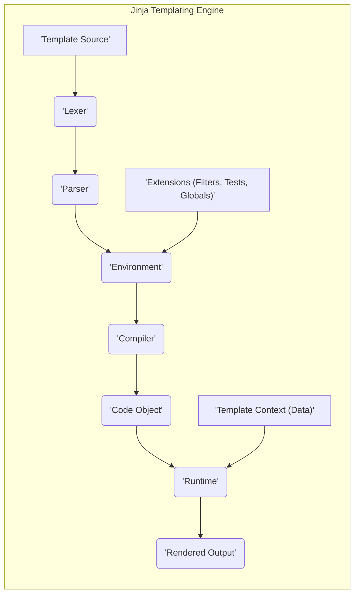
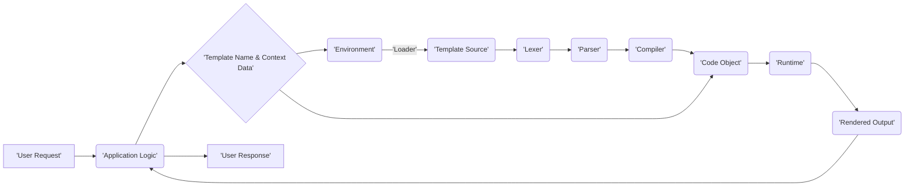

# Project Design Document: Jinja Templating Engine

**Version:** 1.1
**Date:** October 26, 2023
**Author:** Gemini (AI Language Model)

## 1. Introduction

This document provides an enhanced and more detailed design overview of the Jinja templating engine, based on the project repository found at [https://github.com/pallets/jinja](https://github.com/pallets/jinja). This document is specifically crafted to serve as a robust foundation for subsequent threat modeling activities by clearly outlining the architecture, data flow, and inherent security considerations.

## 2. Goals and Objectives

*   To deliver a highly detailed and unambiguous architectural representation of the Jinja templating engine.
*   To precisely identify the core components of Jinja and meticulously describe their interactions and responsibilities.
*   To thoroughly illustrate the data flow within the engine, highlighting critical transformation points.
*   To comprehensively enumerate potential security considerations, attack surfaces, and associated risks.
*   To function as a definitive resource for future threat modeling exercises, enabling a systematic and informed approach.

## 3. Scope

This document focuses on the intricate workings of the core Jinja templating engine, encompassing:

*   The complete lifecycle of template processing, from loading to rendering.
*   Detailed mechanisms for template loading, including various loader implementations.
*   The parsing process, including the generation of the Abstract Syntax Tree (AST).
*   The compilation stage, where templates are transformed into executable code.
*   The runtime environment and the execution of compiled templates with context data.
*   The extension system, covering the registration and utilization of custom filters, tests, and global variables.
*   The design and limitations of the sandboxing environment intended to restrict template execution.

This document explicitly excludes:

*   Implementation specifics of integrations with particular web frameworks such as Flask or Django.
*   A historical account of the project's development or granular details of specific version releases.
*   In-depth performance analysis, optimization techniques, or benchmarking data.
*   The specifics of Jinja's API usage within a host application.

## 4. High-Level Architecture

**Detailed Description of Components:**

*   **'Template Source':**  The raw input template, typically a text-based file containing a mixture of static content and Jinja-specific syntax for dynamic content insertion and logic. This is the initial point of interaction with the Jinja engine.
*   **'Lexer':**  This component performs lexical analysis on the 'Template Source'. It breaks down the raw text into a stream of tokens, identifying keywords, variables, operators, and static text segments. This process is crucial for understanding the structure of the template.
*   **'Parser':**  The 'Parser' takes the stream of tokens produced by the 'Lexer' and constructs an Abstract Syntax Tree (AST). The AST represents the hierarchical structure of the template and the relationships between its elements. This stage ensures the template adheres to the Jinja grammar.
*   **'Environment':**  A central registry and configuration manager for the Jinja engine. It holds settings such as template delimiters, autoescape configuration, and a collection of loaded extensions. The 'Environment' also manages the template loading process through configured 'Loader' instances.
*   **'Compiler':**  This component traverses the AST generated by the 'Parser' and translates it into executable code. In the case of Jinja, this typically involves generating Python bytecode that, when executed, will perform the template rendering.
*   **'Code Object':** The output of the 'Compiler', representing the compiled and executable form of the template. This object is ready to be executed by the 'Runtime'.
*   **'Runtime':**  The execution engine for the compiled 'Code Object'. It takes the 'Code Object' and the 'Template Context (Data)' as input and executes the template logic, substituting variables and applying filters to generate the final output.
*   **'Rendered Output':** The final result of the template rendering process, typically a string containing the dynamically generated content based on the template and the provided data.
*   **'Template Context (Data)':** A dictionary-like structure containing the data that will be used to populate the variables and expressions within the template during the rendering process. This data is provided by the application using Jinja.
*   **'Extensions (Filters, Tests, Globals)':**  External modules that augment the functionality of the Jinja engine. Filters modify data, tests perform conditional checks, and globals provide variables accessible within templates. These extensions are registered with the 'Environment'.

## 5. Component Details

### 5.1. Template Loading

*   **Purpose:** To retrieve the template source code from a specified location.
*   **Mechanism:**  Utilizes a `Loader` class instance (e.g., `FileSystemLoader` for loading from the file system, `PackageLoader` for loading from Python packages) configured within the `Environment`. The `Loader` defines the strategy for locating and accessing template files based on their names.
*   **Input:** The name or path of the template to be loaded.
*   **Output:** The template source code as a string.
*   **Security Considerations:**
    *   **Path Traversal Vulnerabilities:** If the `Loader` does not properly sanitize or validate template names, an attacker might be able to access files outside the intended template directory.
    *   **Exposure of Sensitive Information:**  If the `Loader` is misconfigured or has excessive permissions, it could potentially expose sensitive files or directories.
    *   **Template Injection via Loader:** In scenarios where the template name is derived from user input, insufficient validation could lead to template injection vulnerabilities even before the core rendering process.

### 5.2. Lexer

*   **Purpose:** To break down the raw template source code into a sequence of meaningful tokens.
*   **Mechanism:** Employs regular expressions and state machines to identify different elements of the Jinja syntax, such as variable delimiters (`{{ ... }}`), statement delimiters (``), comments (`{# ... #}`), and literal text.
*   **Input:** The template source code (string).
*   **Output:** A stream of tokens representing the lexical structure of the template.
*   **Security Considerations:**
    *   **Denial-of-Service (DoS):**  Extremely large or deeply nested templates could potentially overwhelm the lexer, leading to excessive resource consumption and a denial of service.
    *   **Exploiting Lexical Ambiguities:**  While less common, vulnerabilities could arise from ambiguities in the lexical grammar that could be exploited to bypass security checks in later stages.

### 5.3. Parser

*   **Purpose:** To analyze the stream of tokens and build an Abstract Syntax Tree (AST) that represents the grammatical structure of the template.
*   **Mechanism:**  Applies a set of grammar rules to the token stream, ensuring that the template syntax is valid and constructing a hierarchical representation of the template's logic and content.
*   **Input:** The stream of tokens from the `Lexer`.
*   **Output:** An Abstract Syntax Tree (AST).
*   **Security Considerations:**
    *   **Parser Exploits:**  Vulnerabilities in the parser could potentially allow attackers to craft malicious templates that cause unexpected behavior, errors, or even code execution during the parsing phase.
    *   **Bypassing Security Directives:**  A flawed parser might fail to correctly interpret security-related directives within the template, such as those related to sandboxing or autoescaping.

### 5.4. Environment

*   **Purpose:** To provide a central configuration point and factory for template-related objects.
*   **Mechanism:** Stores configuration settings like template syntax delimiters, autoescape behavior (controlling automatic escaping of HTML characters), and registered extensions. It also manages the `Loader` instance used for retrieving templates. The `Environment` provides methods for creating `Template` objects from source or loaded templates.
*   **Input:** Configuration parameters, a `Loader` instance, and registered extensions.
*   **Output:** `Template` objects.
*   **Security Considerations:**
    *   **Insecure Default Configurations:**  Default settings, such as disabling autoescaping, can significantly increase the risk of Cross-Site Scripting (XSS) vulnerabilities.
    *   **Unsafe Extension Management:**  If the process for registering or loading extensions is not secure, malicious actors could introduce harmful code into the templating process.
    *   **Exposure of Configuration Details:**  In certain scenarios, the `Environment` object itself might be accessible, potentially revealing sensitive configuration information.

### 5.5. Compiler

*   **Purpose:** To translate the Abstract Syntax Tree (AST) into executable code.
*   **Mechanism:**  Traverses the AST and generates Python bytecode that, when executed by the Python interpreter, will perform the template rendering logic. This involves generating code to handle variable substitution, control flow (loops, conditionals), and filter applications.
*   **Input:** The Abstract Syntax Tree (AST).
*   **Output:** A code object (typically Python bytecode).
*   **Security Considerations:**
    *   **Compiler Bugs Leading to Insecure Code:**  Errors or vulnerabilities in the compiler could result in the generation of bytecode that bypasses intended security restrictions or introduces new vulnerabilities.
    *   **Code Injection via Compiler Exploits:**  In highly unlikely scenarios, vulnerabilities in the compiler itself could potentially be exploited to inject arbitrary code into the generated bytecode.

### 5.6. Runtime

*   **Purpose:** To execute the compiled template code with the provided context data to produce the final rendered output.
*   **Mechanism:**  Interprets the bytecode generated by the `Compiler`, accesses data from the `Template Context`, applies filters and tests, and constructs the final output string. The runtime environment is where the actual dynamic content generation takes place.
*   **Input:** The compiled `Code Object` and the `Template Context (Data)`.
*   **Output:** The rendered output (string).
*   **Security Considerations:**
    *   **Server-Side Template Injection (SSTI):**  This is a primary security concern. If user-controlled input is directly embedded into templates without proper sanitization, attackers can inject malicious Jinja syntax that executes arbitrary code on the server.
    *   **Information Disclosure:**  If the `Template Context` contains sensitive information that is not intended for public display, vulnerabilities in the template logic or inadequate output escaping could lead to its exposure.
    *   **Resource Exhaustion:**  Maliciously crafted templates with complex logic or infinite loops could potentially consume excessive server resources during rendering, leading to a denial of service.

### 5.7. Extensions

*   **Purpose:** To provide a mechanism for extending the functionality of the Jinja templating engine with custom filters, tests, global variables, and sometimes even custom lexer or parser rules.
*   **Mechanism:**  Python modules that register custom functions or classes with the `Environment`. These extensions can then be used within templates.
*   **Input:**  Template context, data to be processed by filters or tests.
*   **Output:** Modified data (for filters) or boolean results (for tests).
*   **Security Considerations:**
    *   **Malicious Extensions:**  Using untrusted or poorly written extensions is a significant security risk. Malicious extensions could execute arbitrary code, access sensitive data, or introduce other vulnerabilities.
    *   **Unintended Side Effects:**  Even well-intentioned extensions might have unintended side effects or introduce subtle security flaws if not carefully designed and reviewed.
    *   **Namespace Collisions:**  Care must be taken to avoid naming conflicts between extensions or with built-in Jinja functionalities.

### 5.8. Sandboxing

*   **Purpose:** To restrict the capabilities of templates during rendering, preventing access to potentially dangerous functions, modules, or attributes. This aims to mitigate the risks associated with Server-Side Template Injection.
*   **Mechanism:** Jinja provides a sandboxed environment that limits the available built-in functions and attributes within templates. This is achieved by controlling the execution environment and restricting access to certain Python features.
*   **Input:** Compiled template code, template context.
*   **Output:** Rendered output (or an exception if a restricted operation is attempted).
*   **Security Considerations:**
    *   **Sandbox Escapes:**  A critical security concern. Attackers may discover vulnerabilities that allow them to bypass the sandbox restrictions and execute arbitrary code or access restricted resources. The effectiveness of the sandbox is paramount for security when dealing with untrusted template input.
    *   **Limitations of the Sandbox:**  The Jinja sandbox might not be able to prevent all potentially harmful actions, and its effectiveness can depend on the specific Python environment and available libraries.

## 6. Data Flow

**Detailed Description of Data Flow:**

1. **'User Request':** An initial request is initiated by a user interacting with the application (e.g., clicking a link, submitting a form).
2. **'Application Logic':** The application's backend logic processes the user request, determining the appropriate response and identifying the need to render a template.
3. **'Template Name & Context Data':** The application logic selects the specific Jinja template to be used and prepares the necessary data (the context) that will be passed to the template for rendering.
4. **'Environment':** The template name is passed to the Jinja `Environment`.
5. **'Loader':** The `Environment` utilizes the configured `Loader` to locate and retrieve the `'Template Source'` based on the provided template name.
6. **'Lexer':** The `'Template Source'` is passed to the `'Lexer'`, which tokenizes the template content.
7. **'Parser':** The stream of tokens from the `'Lexer'` is processed by the `'Parser'` to construct the Abstract Syntax Tree (AST).
8. **'Compiler':** The AST is then passed to the `'Compiler'`, which translates it into an executable `'Code Object'`.
9. **'Code Object'**: The compiled template, along with the `'Template Name & Context Data'`, is passed to the `'Runtime'`.
10. **'Runtime':** The `'Runtime'` executes the `'Code Object'`, using the provided context data to dynamically generate the `'Rendered Output'`.
11. **'Rendered Output':** The generated output is returned to the `'Application Logic'`.
12. **'User Response':** The application logic incorporates the rendered output into the final response that is sent back to the user.

## 7. Security Considerations

This section provides a more in-depth exploration of potential security considerations relevant to the Jinja templating engine, crucial for effective threat modeling.

*   **Server-Side Template Injection (SSTI):**  A critical vulnerability arising when user-controlled input is directly embedded into Jinja templates without proper sanitization or escaping. This allows attackers to inject malicious Jinja syntax, potentially leading to arbitrary code execution on the server, allowing them to read sensitive files, execute system commands, or compromise the entire application.
*   **Cross-Site Scripting (XSS):**  If autoescaping is disabled or not correctly applied, attackers can inject malicious JavaScript or HTML into templates. When these templates are rendered and displayed in a user's browser, the malicious scripts can execute, potentially stealing cookies, redirecting users, or performing other harmful actions within the user's session.
*   **Information Disclosure:**  Templates might inadvertently expose sensitive information present in the template context if not handled with care. This can occur through incorrect template logic, failure to sanitize output, or the presence of debugging information in production environments. Attackers could gain access to confidential data, API keys, or internal system details.
*   **Sandbox Escapes:**  Despite the presence of a sandboxed environment, vulnerabilities might exist that allow attackers to bypass these restrictions. Successful sandbox escapes can grant attackers the ability to execute arbitrary Python code, effectively negating the intended security measures.
*   **Malicious Extensions:**  The use of untrusted or poorly vetted Jinja extensions poses a significant security risk. Malicious extensions could contain backdoors, vulnerabilities, or code that compromises the security of the application or the server.
*   **Path Traversal:**  If the template loader is not securely configured, attackers might be able to manipulate template names to access files outside the intended template directory. This could lead to the disclosure of source code, configuration files, or other sensitive data.
*   **Denial of Service (DoS):**  Attackers can craft malicious templates designed to consume excessive server resources during parsing or rendering. This could involve deeply nested structures, computationally intensive operations, or attempts to allocate large amounts of memory, potentially leading to a denial of service for legitimate users.
*   **Configuration Errors:**  Incorrectly configured Jinja settings can introduce security vulnerabilities. For example, disabling autoescaping by default or using insecure template delimiters can create opportunities for attacks.
*   **Insecure Use of Filters and Tests:**  Custom filters or tests, if not carefully implemented, can introduce vulnerabilities. For instance, a filter that executes shell commands based on user input would be a severe security risk.
*   **Exposure of Source Code:**  If template files are accessible through the web server due to misconfiguration, attackers can directly view the template source code, potentially revealing sensitive logic or vulnerabilities.

## 8. Assumptions and Constraints

*   It is assumed that the core Jinja library is developed and maintained with a strong focus on security best practices.
*   The overall security of an application utilizing Jinja is heavily dependent on how the application integrates with the templating engine and handles user input.
*   This design document primarily focuses on the inherent security aspects of the Jinja engine itself and does not delve into the security of specific integration patterns or deployment environments.
*   The effectiveness of the Jinja sandbox is assumed to be a key factor in mitigating SSTI risks, but the possibility of sandbox escapes is acknowledged.

## 9. Future Considerations

*   Continuous monitoring of reported vulnerabilities and security updates for the Jinja library.
*   Further in-depth analysis of the Jinja sandbox implementation to identify potential escape vectors and limitations.
*   Detailed security audits of commonly used Jinja extensions to assess their potential risks.
*   Development and promotion of best practices and secure coding guidelines for using Jinja in web applications.
*   Exploration of more robust sandboxing techniques or Content Security Policy (CSP) integration to further mitigate XSS risks.
*   Consideration of static analysis tools to detect potential security vulnerabilities in Jinja templates.