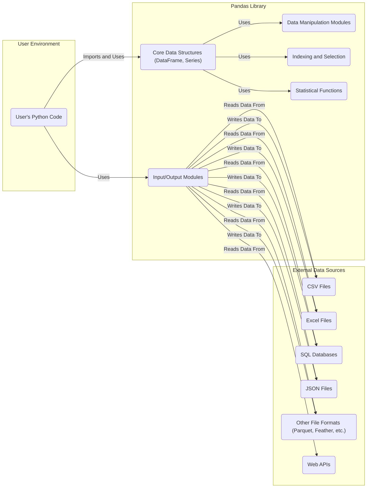

# Project Design Document: Pandas Library for Threat Modeling

**Version:** 1.1
**Date:** October 26, 2023
**Author:** AI Software Architect

## 1. Introduction

This document provides a detailed design overview of the Pandas library, a foundational data manipulation and analysis tool for Python. This document is specifically created to serve as a basis for subsequent threat modeling activities. It outlines the key components, data flows, and interactions within and around the Pandas library to identify potential security vulnerabilities.

## 2. Project Overview

*   **Project Name:** Pandas
*   **Project Repository:** [https://github.com/pandas-dev/pandas](https://github.com/pandas-dev/pandas)
*   **Project Description:** Pandas is a powerful and flexible open-source Python library that provides high-performance, easy-to-use data structures and data analysis tools. Its primary data structures are the DataFrame and the Series, which allow for efficient manipulation and analysis of structured data.
*   **Primary Functionality:**
    *   Data loading and saving from various file formats (CSV, Excel, SQL databases, etc.).
    *   Data cleaning and preprocessing (handling missing values, duplicates, etc.).
    *   Data transformation (filtering, sorting, grouping, merging, joining).
    *   Data aggregation and summarization.
    *   Time series analysis.
    *   Integration with other scientific Python libraries (NumPy, SciPy, Matplotlib).
*   **Intended Users:** Data scientists, data analysts, researchers, software developers working with data in Python.

## 3. System Architecture

The Pandas library is primarily a software library integrated into Python applications. Its architecture can be viewed from the perspective of how it interacts with the user's code and external data sources.

*   **User's Python Code:** This represents the environment where the Pandas library is utilized. Users write Python scripts or applications that import and interact with Pandas objects.
*   **Pandas Library:** This encompasses the core functionality of the Pandas library.
    *   **Core Data Structures (DataFrame, Series):** The fundamental building blocks for representing and manipulating tabular data.
    *   **Input/Output Modules:** Responsible for reading data from and writing data to various external sources.
    *   **Data Manipulation Modules:** Provide functions for cleaning, transforming, and reshaping data.
    *   **Indexing and Selection:** Mechanisms for accessing and manipulating specific subsets of data within DataFrames and Series.
    *   **Statistical Functions:** Offer tools for performing statistical analysis on the data.
*   **External Data Sources:** These are the various locations where data is stored and accessed by Pandas.

## 4. Data Flow

The typical data flow when using Pandas involves the following stages:

*   **Data Ingestion:**
    *   The user's Python code utilizes Pandas' input/output modules to read data from external sources.
    *   Pandas parses the data based on the specified format (e.g., CSV parsing, Excel reading, SQL query execution).
    *   The data is loaded into Pandas data structures (DataFrames or Series).
*   **Data Manipulation:**
    *   The user's code applies various Pandas functions to clean, transform, and analyze the data within the DataFrames or Series.
    *   This may involve operations like filtering rows, selecting columns, handling missing values, merging datasets, and performing calculations.
*   **Data Output:**
    *   The user's Python code utilizes Pandas' input/output modules to write the processed data to external destinations.
    *   Pandas formats the data according to the specified output format (e.g., writing to a CSV file, inserting into a database).

## 5. Key Components

*   `pandas.DataFrame`: A two-dimensional labeled data structure with columns of potentially different types. It's similar to a spreadsheet or SQL table.
*   `pandas.Series`: A one-dimensional labeled array capable of holding any data type.
*   Input/Output Functions (`pd.read_csv`, `pd.read_excel`, `pd.to_csv`, `pd.to_sql`, etc.): These functions handle the interaction with external data sources.
*   Data Cleaning Functions (`.dropna()`, `.fillna()`, `.duplicated()`, etc.): Functions for handling missing or inconsistent data.
*   Data Transformation Functions (`.groupby()`, `.merge()`, `.join()`, `.pivot_table()`, etc.): Functions for reshaping and combining data.
*   Indexing and Selection Methods (`.loc[]`, `.iloc[]`, `.at[]`, `.iat[]`): Methods for accessing and modifying specific data points or subsets.
*   Statistical Functions (`.mean()`, `.std()`, `.sum()`, `.describe()`, etc.): Functions for performing statistical calculations on the data.
*   Time Series Functionality: Features for working with time-indexed data.
*   Extension Array Interface: Allows integration with custom data types and array implementations.

## 6. Dependencies

Pandas relies on several other Python libraries:

*   NumPy: The fundamental package for numerical computation in Python. Pandas uses NumPy arrays as the underlying data structure for DataFrames and Series.
*   python-dateutil: Used for parsing dates from various string formats.
*   pytz: Provides timezone definitions for handling time zone conversions.
*   Excel I/O Libraries:
    *   openpyxl: For reading and writing Excel 2010+ xlsx/xlsm files.
    *   xlrd: For reading older Excel .xls files.
    *   xlsxwriter: For writing Excel .xlsx files.
    *   et_xmlfile: A dependency of openpyxl.
*   SQL I/O Libraries:
    *   SQLAlchemy: Provides a comprehensive set of tools for working with SQL databases.
    *   psycopg2: A popular PostgreSQL adapter.
    *   mysqlclient: A MySQL database connector.
    *   sqlite3: Python's built-in SQLite library.
*   Other File Format Libraries:
    *   fastparquet: For reading and writing Parquet files.
    *   pyarrow: Provides cross-language development platform for in-memory data. Used for Feather and Parquet.
    *   feather-format: For reading and writing Feather files.
*   Web Interaction:
    *   requests: For making HTTP requests when reading data from URLs.
*   Cloud Storage:
    *   gcsfs: For interacting with Google Cloud Storage.
    *   s3fs: For interacting with Amazon S3.

## 7. Security Considerations (Initial Thoughts for Threat Modeling)

This section outlines potential areas of security concern that should be explored during the threat modeling process.

*   **Data Injection through Input:**
    *   **CSV Injection:** If Pandas is used to process untrusted CSV files, malicious content within the CSV could be interpreted as commands by spreadsheet applications when opened.
    *   **SQL Injection:** If user-provided input is directly incorporated into SQL queries used by `pd.read_sql` or `pd.to_sql`, it could lead to SQL injection vulnerabilities. Care should be taken when constructing queries dynamically.
    *   **Code Injection through `eval()` or similar functions (primarily in user code):** While core Pandas avoids `eval()` for data processing, user-provided code interacting with Pandas data might use it, creating a vulnerability.
*   **Dependency Vulnerabilities:**
    *   Vulnerabilities in the underlying dependencies (NumPy, I/O libraries) could indirectly affect Pandas. Regular dependency updates and vulnerability scanning are crucial for projects using Pandas.
*   **Denial of Service (DoS):**
    *   Processing extremely large or malformed data files could potentially lead to excessive memory consumption or CPU usage, causing a denial of service. Input validation and resource limits are important.
    *   Specifically crafted input data could exploit algorithmic inefficiencies in Pandas operations, leading to performance degradation or crashes.
*   **Information Disclosure:**
    *   Error messages or logging might inadvertently reveal sensitive information about the data or the system. Proper error handling and logging practices are necessary.
    *   Improper handling of file permissions when reading or writing data could lead to unauthorized access. Ensure appropriate file system permissions are in place.
*   **Serialization/Deserialization Issues:**
    *   If Pandas objects are serialized and deserialized (e.g., using `pickle`), vulnerabilities in the serialization format could be exploited, potentially leading to arbitrary code execution. Avoid deserializing data from untrusted sources.
*   **Integer Overflow/Underflow:**
    *   While less common in high-level libraries like Pandas, potential vulnerabilities could exist in underlying numerical operations within NumPy if not handled carefully.
*   **Regular Expression Denial of Service (ReDoS):**
    *   If regular expressions are used for data cleaning or manipulation (e.g., with the `.str` accessor), poorly crafted regex patterns could lead to ReDoS attacks, consuming excessive CPU time.
*   **Supply Chain Security:**
    *   Ensuring the integrity of the Pandas package and its dependencies from the source (PyPI) is important to prevent supply chain attacks. Using tools like dependency pinning and software bill of materials (SBOMs) can help.

## 8. Conclusion

This document provides a foundational understanding of the Pandas library's architecture, data flow, and key components. It also highlights initial security considerations that will be further investigated during the threat modeling process. This document serves as a crucial input for identifying potential vulnerabilities and developing appropriate mitigation strategies to ensure the secure use of the Pandas library in various applications.