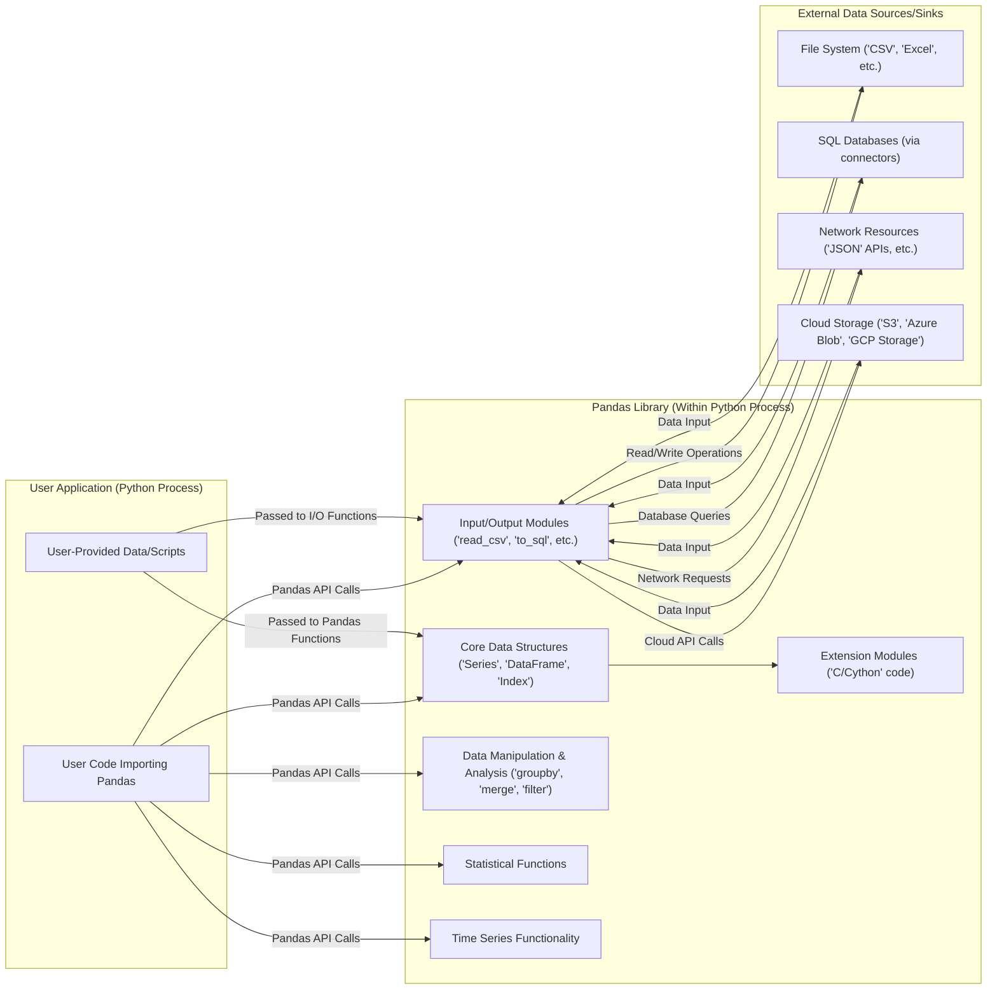
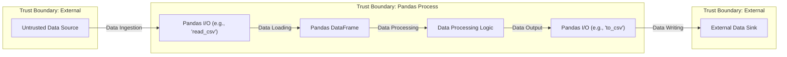

# Project Design Document: Pandas Library (Improved)

**Version:** 1.1
**Date:** October 26, 2023
**Author:** AI Software Architect

## 1. Introduction

This document provides an enhanced design overview of the Pandas library, an open-source data analysis and manipulation tool for Python. This version is specifically tailored to support thorough threat modeling activities. It elaborates on key components, data flow, interactions, and trust boundaries relevant to the security of systems utilizing the Pandas library.

## 2. Project Overview

* **Project Name:** Pandas
* **Project Repository:** [https://github.com/pandas-dev/pandas](https://github.com/pandas-dev/pandas)
* **Project Goal:** To provide robust, high-performance, and user-friendly data structures and data analysis tools within the Python ecosystem.
* **Target Users:** Data scientists, data analysts, software engineers, and researchers who require efficient manipulation and analysis of structured data in Python.
* **Key Functionalities:**
    * Creation and manipulation of tabular data structures (DataFrames and Series).
    * Data cleaning, transformation, and preprocessing capabilities.
    * Powerful data aggregation and grouping operations.
    * Time series analysis functionalities.
    * Flexible input/output operations supporting various data formats (CSV, Excel, SQL databases, JSON, etc.).
    * Seamless integration with other scientific Python libraries (NumPy, SciPy, Matplotlib, Scikit-learn).

## 3. System Architecture

Pandas operates as an embedded library within Python applications. Its architecture is defined by its internal modules and its interaction points with the host Python environment and external data sources. Understanding these interactions is crucial for identifying potential threat vectors.

* **User Application (Python Process):** This represents the user's Python application where the Pandas library is imported and used. This is the primary context in which Pandas operates. Crucially, it includes user-provided data and potentially scripts that interact with Pandas.
* **Pandas Library (Within Python Process):**  The core of the Pandas library, residing within the user's Python process:
    * **Core Data Structures ('Series', 'DataFrame', 'Index'):** The fundamental in-memory data containers.
    * **Input/Output Modules ('read_csv', 'to_sql', etc.):** Modules handling data import and export, acting as crucial interaction points with external systems.
    * **Data Manipulation & Analysis ('groupby', 'merge', 'filter'):** Functions for transforming and analyzing data within DataFrames.
    * **Statistical Functions:** Modules providing statistical analysis capabilities.
    * **Time Series Functionality:** Specialized tools for time-indexed data.
    * **Extension Modules ('C/Cython' code):** Performance-critical components often implemented in lower-level languages for efficiency.
* **External Data Sources/Sinks:** External systems or resources that Pandas interacts with for data input and output:
    * **File System ('CSV', 'Excel', etc.):** Local or network file systems.
    * **SQL Databases (via connectors):** Relational databases accessed through database connectors.
    * **Network Resources ('JSON' APIs, etc.):** External APIs accessed via network requests.
    * **Cloud Storage ('S3', 'Azure Blob', 'GCP Storage'):** Cloud-based object storage services.

## 4. Data Flow and Trust Boundaries

Understanding the flow of data and the associated trust boundaries is essential for threat modeling. Data entering the Pandas library from external sources should be considered untrusted.

* **Trust Boundary: External:** Represents systems or resources outside the direct control of the Pandas process. Data originating from these sources is considered potentially untrusted.
* **Untrusted Data Source:** Any external source providing data to Pandas (files, databases, network).
* **Trust Boundary: Pandas Process:** Encompasses the execution environment of the Pandas library within the user's Python application. Data within this boundary should be treated with caution if it originated from an untrusted source.
* **Pandas I/O (e.g., 'read_csv'):**  Functions responsible for reading data from external sources. These are critical points for input validation and sanitization.
* **Pandas DataFrame:** The in-memory representation of the data. Data within the DataFrame inherits the trust level of its source.
* **Data Processing Logic:** User-defined code and Pandas functions that manipulate the data. This logic should be designed to handle potentially malicious data.
* **Pandas I/O (e.g., 'to_csv'):** Functions responsible for writing data to external sinks. Output should be carefully managed to avoid propagating vulnerabilities.
* **External Data Sink:** The destination where Pandas writes processed data.
* **Data Ingestion:** The act of reading data into Pandas.
* **Data Loading:** Populating the Pandas DataFrame.
* **Data Processing:** Manipulation and analysis of data within Pandas.
* **Data Output:** Writing data from Pandas.
* **Data Writing:** The act of sending data to an external sink.

## 5. Key Components and Security Relevance

* **`pandas/_libs`:** Contains performance-critical, low-level implementations in C/Cython.
    * **Security Relevance:** Memory safety vulnerabilities (buffer overflows, etc.) are potential risks in these components due to manual memory management. Bugs here could have significant impact.
* **`pandas/core`:**  Implements the fundamental data structures (Series, DataFrame, Index) and core manipulation logic.
    * **Security Relevance:**  Logic errors in core data structure manipulation could lead to unexpected behavior or vulnerabilities if exploited with carefully crafted data.
* **`pandas/io`:** Handles reading and writing data in various formats.
    * **Security Relevance:** This is a primary attack surface. Vulnerabilities in parsing logic for different file formats (e.g., CSV injection, Excel formula injection, insecure deserialization of Pickle files) are significant concerns. Interaction with databases also introduces risks of SQL injection if user-provided data is not properly sanitized. Network interactions for JSON or other APIs could be vulnerable to injection attacks or data poisoning.
* **`pandas/tseries`:** Provides time series specific functionalities.
    * **Security Relevance:** While less direct, vulnerabilities in time series manipulation could be exploited in applications relying on this functionality.
* **`pandas/plotting`:** Integrates with Matplotlib for visualization.
    * **Security Relevance:**  While the plotting itself is less likely to be a direct vulnerability in Pandas, if data passed to plotting functions is malicious, it could potentially be exploited by vulnerabilities in Matplotlib.
* **Extension Mechanisms (e.g., custom `Styler` renderers):** Allow users to extend Pandas functionality.
    * **Security Relevance:** If users can introduce arbitrary code through extension mechanisms, this presents a significant security risk.

## 6. Security Considerations (Detailed)

* **Input Validation Vulnerabilities:**
    * **File Parsing:** Maliciously crafted CSV, Excel, or other data files could exploit vulnerabilities in Pandas' parsing logic, leading to arbitrary code execution or denial of service.
    * **SQL Injection:** When reading from or writing to SQL databases, insufficient sanitization of user-provided data within queries could lead to SQL injection attacks.
    * **Insecure Deserialization:** Reading data from formats like Pickle can be dangerous if the data source is untrusted, potentially allowing arbitrary code execution.
    * **Network Data Poisoning:** When reading data from network sources (e.g., JSON APIs), the library could be susceptible to data poisoning if the source is compromised or the connection is insecure.
* **Dependency Vulnerabilities:** Pandas relies on other Python packages. Vulnerabilities in these dependencies (e.g., NumPy, openpyxl, SQLAlchemy) could indirectly affect Pandas' security.
* **Memory Safety Issues:**  Bugs in the C/Cython extensions could lead to memory corruption vulnerabilities, potentially exploitable for arbitrary code execution.
* **Denial of Service (DoS):** Processing extremely large or specially crafted datasets could consume excessive resources (CPU, memory), leading to a denial of service.
* **Information Disclosure:** Errors or vulnerabilities could inadvertently expose sensitive information contained within DataFrames.
* **Code Injection (Indirect):** While Pandas doesn't directly execute arbitrary code from user input, vulnerabilities in how it processes or outputs data could be leveraged in a larger application to achieve code injection (e.g., through CSV injection leading to spreadsheet command execution).

## 7. Assumptions and Out of Scope (Security Focused)

* **Assumptions:**
    * The underlying Python interpreter and operating system are reasonably secure and patched against known vulnerabilities.
    * Users are responsible for validating and sanitizing data *before* passing it to Pandas, especially when the data originates from untrusted sources.
    * When interacting with external systems (databases, APIs), secure connection methods and authentication are used outside of the Pandas library itself.
    * Users understand the risks associated with deserializing data from untrusted sources (e.g., Pickle files).
* **Out of Scope:**
    * Security of the network infrastructure where data is transmitted.
    * Security of external databases or APIs themselves (beyond Pandas' interaction points).
    * Security of user applications that *use* Pandas (the focus is on the library's inherent security properties).
    * Authentication and authorization mechanisms for accessing external data sources (this is assumed to be handled by the user application or underlying libraries).

## 8. Future Considerations for Security

* ** নিয়মিত Security Audits:** Conducting regular security audits and penetration testing of the Pandas codebase, especially around I/O operations and C/Cython extensions.
* **Dependency Management:** Implementing robust dependency management practices, including vulnerability scanning and timely updates.
* **Input Sanitization Guidance:** Providing clearer guidance and potentially built-in mechanisms for users to sanitize data when reading from untrusted sources.
* **Secure Defaults:**  Considering secure defaults for potentially risky operations (e.g., disabling Pickle loading by default or providing warnings).
* **Fuzzing:** Utilizing fuzzing techniques to identify potential vulnerabilities in parsing and data handling logic.
* **Community Engagement:** Encouraging security researchers to report vulnerabilities through a responsible disclosure process.

This improved design document provides a more detailed and security-focused overview of the Pandas library, better equipping security professionals to perform thorough threat modeling and identify potential vulnerabilities. The explicit delineation of trust boundaries and the detailed security considerations are crucial for this purpose.