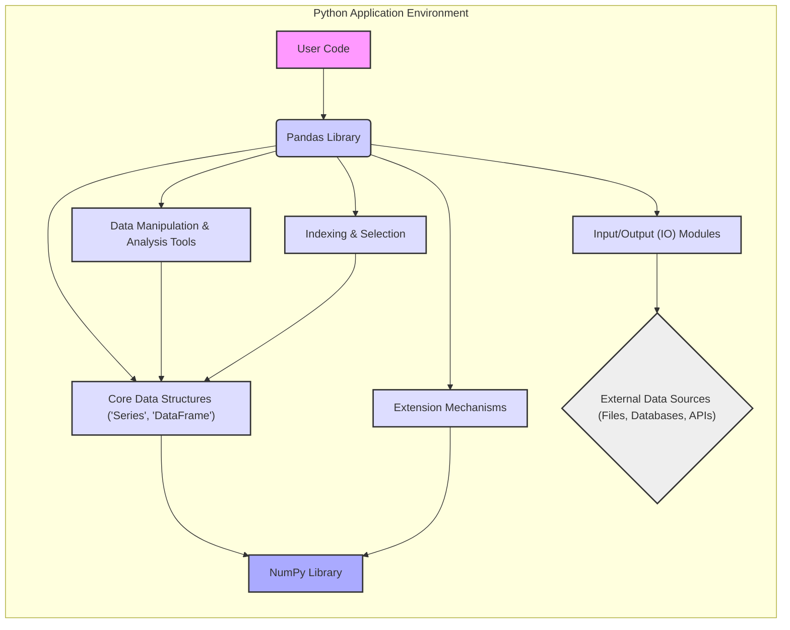
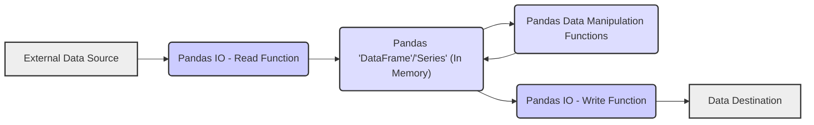

# Project Design Document: Pandas Library (Improved)

**Version:** 1.1
**Date:** October 26, 2023
**Prepared By:** AI Software Architect

## 1. Project Overview

This document provides an enhanced design overview of the Pandas library, a cornerstone of the Python data science ecosystem. Pandas facilitates efficient data manipulation and analysis through its core data structures, the DataFrame and Series. This document is specifically tailored to support comprehensive threat modeling activities, focusing on potential vulnerabilities and attack vectors within and around the library's usage.

## 2. Goals and Objectives

* **Primary Goal:** To provide a detailed architectural understanding of Pandas for effective threat identification and mitigation.
* **Key Objectives:**
    * Clearly articulate the internal structure and external interactions of the Pandas library.
    * Highlight key components and data flows relevant to security considerations.
    * Provide concrete examples of potential security risks associated with different functionalities.
    * Serve as a foundational document for subsequent threat modeling sessions and security assessments.

## 3. Target Audience

This document is intended for individuals and teams involved in securing applications that utilize the Pandas library:

* Security engineers and architects responsible for threat modeling and security assessments.
* Software developers contributing to the Pandas project or building applications with it.
* DevOps engineers managing infrastructure where Pandas-based applications are deployed.
* Security researchers investigating potential vulnerabilities in data science tools.

## 4. System Architecture

Pandas operates as a library embedded within Python applications. Its architecture is defined by its internal components and how it interacts with the surrounding Python environment and external data sources. Understanding this context is crucial for identifying potential attack surfaces.

* **Core Data Structures:** The fundamental building blocks for data representation.
    * **Series:** A labeled one-dimensional array capable of holding diverse data types. Potential vulnerabilities could arise from unexpected data types or sizes leading to errors or crashes in consuming applications.
    * **DataFrame:** A labeled two-dimensional structure with columns of potentially different types. Similar to Series, issues can occur with unexpected data or schema mismatches.
* **Input/Output (IO) Modules:** These modules handle the crucial task of data ingress and egress. They represent significant potential attack vectors.
    * **CSV and Text Files:** Parsing logic vulnerabilities could be exploited with maliciously crafted files (e.g., excessively long lines, unexpected delimiters).
    * **Excel Files:**  Parsing complex binary formats introduces risks, including potential vulnerabilities in underlying libraries or the possibility of embedded malicious content (though Pandas itself doesn't execute macros).
    * **JSON Files:**  Vulnerabilities in JSON parsing libraries could be exploited with crafted JSON payloads.
    * **HTML:**  Parsing HTML can be complex and might be susceptible to injection attacks if used to process untrusted web content.
    * **SQL Databases:** While Pandas typically uses parameterized queries, improper construction of queries or insufficient input sanitization in the calling application can lead to SQL injection.
    * **HDF5 Format:**  Parsing binary formats can have vulnerabilities; access control to HDF5 files is also a consideration.
    * **Pickle Serialization:** Deserializing data from untrusted sources is a well-known security risk, potentially leading to arbitrary code execution.
    * **Other Formats (Feather, Parquet, ORC):**  Security depends on the robustness of the parsing libraries for these formats.
* **Data Manipulation and Analysis Tools:** The core functionality for transforming and analyzing data.
    * **Filtering, Sorting, Grouping:**  Potential for denial-of-service if operations on extremely large or crafted datasets consume excessive resources.
    * **Merging and Joining:**  Issues could arise if join keys or data types are manipulated to cause unexpected behavior or performance problems.
    * **Aggregation Functions:**  Care must be taken with custom aggregation functions to prevent unintended code execution or information disclosure.
* **Indexing and Selection:** Mechanisms for accessing and modifying data subsets.
    * **Label-based and Integer-based Indexing:**  Potential for out-of-bounds access or unexpected modifications if indices are manipulated.
* **Extension Mechanisms:** Allow for extending Pandas functionality, introducing potential security considerations.
    * **User-Defined Functions (UDFs) with `apply()`:**  The security of UDFs is entirely dependent on their implementation. Malicious UDFs can execute arbitrary code.
    * **Integration with NumPy:**  Pandas relies heavily on NumPy. Vulnerabilities in NumPy could indirectly impact Pandas.
    * **Cython Integration:**  While offering performance benefits, custom Cython code can introduce memory safety issues if not carefully developed.

**Architectural Diagram (Conceptual):**

## 5. Data Flow

Understanding how data moves through a Pandas-based application is crucial for identifying potential interception or manipulation points.

* **Data Ingestion Phase:** Data enters the Pandas environment from external sources.
    * Reading from files:  Data is parsed and loaded into DataFrames/Series. Threats include malicious file content designed to exploit parsing vulnerabilities.
    * Reading from databases: Data is retrieved via SQL queries. SQL injection is a primary concern if queries are not properly parameterized in the application code.
    * Reading from APIs: Data is fetched over a network. Man-in-the-middle attacks or compromised APIs could provide malicious data.
* **Data Processing Phase:** Data is transformed and analyzed within Pandas.
    * Manipulation operations:  Vulnerabilities in custom functions or unexpected data types could lead to errors or security issues.
    * Analysis operations:  Resource exhaustion is a potential concern with very large or crafted datasets.
* **Data Output Phase:** Processed data is written to external destinations.
    * Writing to files:  Care must be taken to prevent writing sensitive data to insecure locations or with insecure permissions.
    * Writing to databases:  Similar to reading, SQL injection is a risk if data is not properly sanitized before being written.
    * Sending to APIs:  Data transmitted over the network needs to be protected (e.g., using HTTPS).

**Data Flow Diagram:**

## 6. Key Components for Threat Modeling (Detailed)

This section expands on the key components, providing more specific examples of potential threats.

* **Input/Output (IO) Modules:** These are primary attack surfaces due to interaction with external, potentially untrusted data.
    * **CSV Parsing:**
        * **Threat:**  CSV injection attacks where formulas are embedded in CSV cells, potentially leading to command execution when opened in spreadsheet software.
        * **Threat:**  Denial-of-service through excessively large files or files with a very large number of columns, exhausting memory.
    * **Excel Parsing:**
        * **Threat:**  Exploiting vulnerabilities in the underlying libraries used for parsing Excel files.
        * **Threat:**  Exposure to vulnerabilities if the parsing library attempts to interpret or execute embedded content (though Pandas itself aims to avoid this).
    * **SQL Integration:**
        * **Threat:**  SQL injection if user-provided input is used to construct SQL queries without proper parameterization in the application using Pandas.
    * **File Handling (General):**
        * **Threat:**  Path traversal vulnerabilities if file paths are constructed using unsanitized user input, allowing access to arbitrary files.
        * **Threat:**  Writing sensitive data to world-readable locations due to incorrect file permissions.
    * **Pickle Deserialization:**
        * **Threat:**  Arbitrary code execution by loading a maliciously crafted pickle file. This is a critical vulnerability and should be avoided with untrusted data.
* **Extension Mechanisms:**  Introduce risks if custom code is not secure.
    * **User-Defined Functions (UDFs):**
        * **Threat:**  Execution of arbitrary code if a malicious UDF is provided or if a legitimate UDF has unintended security flaws.
    * **Cython Integration:**
        * **Threat:**  Memory corruption vulnerabilities (e.g., buffer overflows) if the Cython code is not carefully written and tested.
* **Dependency on NumPy:**
    * **Threat:**  If NumPy has vulnerabilities, Pandas applications could be indirectly affected. Keeping dependencies updated is crucial.
* **Core Data Structures (Series, DataFrame):**
    * **Threat:**  While less common, vulnerabilities in the underlying implementation of these structures could lead to crashes or unexpected behavior if manipulated in specific ways.
* **Memory Management:**
    * **Threat:**  Processing very large or specially crafted datasets could lead to excessive memory consumption, resulting in denial-of-service.

## 7. Security Considerations (Actionable)

This section provides more actionable security considerations for developers and security teams.

* **Input Validation and Sanitization:**  Always validate and sanitize data read from external sources before processing it with Pandas. This is crucial to prevent injection attacks and other data-related vulnerabilities.
* **Dependency Management:**  Keep Pandas and its dependencies (especially NumPy) updated to the latest stable versions to patch known security vulnerabilities. Use dependency management tools and regularly audit dependencies.
* **Avoid Deserializing Untrusted Pickle Files:**  Never load pickle files from untrusted or unverified sources. Use safer serialization formats like JSON or CSV when exchanging data with external systems.
* **Securely Construct SQL Queries:**  When using Pandas to interact with databases, always use parameterized queries to prevent SQL injection vulnerabilities. Avoid constructing SQL queries using string concatenation with user-provided input.
* **Secure Handling of File Paths:**  When reading or writing files, avoid constructing file paths using unsanitized user input to prevent path traversal vulnerabilities.
* **Review User-Defined Functions:**  Carefully review the code of any user-defined functions used with Pandas, especially if they process sensitive data or interact with external systems.
* **Resource Limits:**  Consider implementing resource limits (e.g., memory limits) to mitigate potential denial-of-service attacks caused by processing excessively large datasets.
* **Principle of Least Privilege:**  Ensure that the application running Pandas has only the necessary permissions to access data and resources.
* **Security Audits and Testing:**  Regularly conduct security audits and penetration testing of applications that use Pandas to identify potential vulnerabilities.

## 8. Assumptions and Constraints

* This document assumes a basic understanding of software security principles.
* The focus is on potential security vulnerabilities related to the Pandas library itself and its common usage patterns. Security of the underlying operating system and hardware is outside the scope.
* Threat modeling activities will require further context about the specific application using Pandas, its data sources, and its deployment environment.
* The security landscape is constantly evolving, so this document should be reviewed and updated periodically.

## 9. Future Considerations

* Develop specific threat scenarios based on the identified vulnerabilities and attack vectors.
* Create security testing guidelines for Pandas-based applications.
* Explore potential security enhancements within the Pandas library itself, such as built-in input validation or safer serialization options.
* Investigate the security implications of using Pandas with other data science and machine learning libraries.