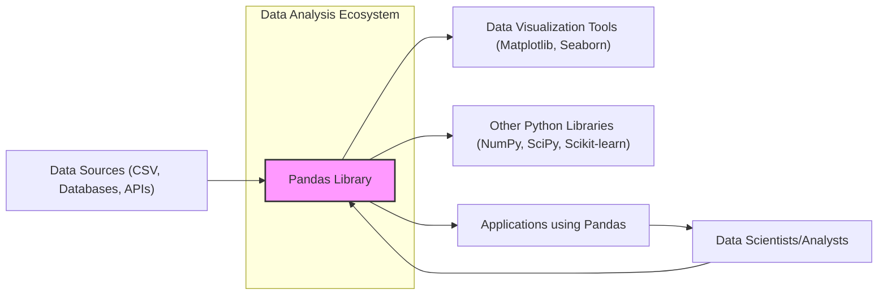
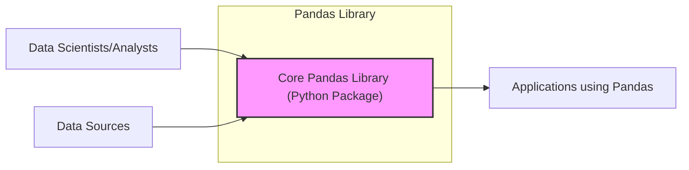
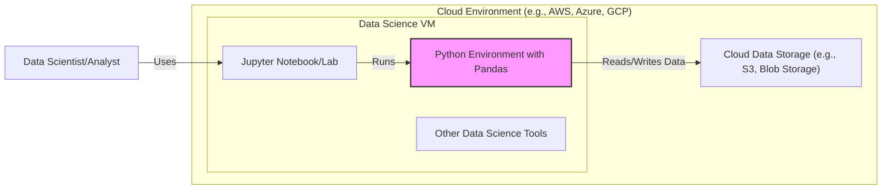

# BUSINESS POSTURE

- Business Priorities and Goals:
 - Pandas is a foundational library for data analysis and manipulation in Python.
 - The primary goal is to provide efficient and flexible data structures and tools for working with structured data.
 - Business priorities for organizations using pandas include:
  - Enabling data-driven decision making.
  - Improving efficiency in data processing and analysis workflows.
  - Facilitating data exploration and understanding.
  - Supporting development of data science and machine learning applications.
 - For the pandas project itself, priorities include:
  - Maintaining a stable and reliable library.
  - Continuously improving performance and features.
  - Growing and supporting the user community.

- Business Risks:
 - Data integrity risks: Errors in pandas could lead to incorrect data analysis and flawed business decisions.
 - Operational disruption risks: Bugs or vulnerabilities in pandas could cause application failures or performance degradation, impacting business operations that rely on it.
 - Security risks (indirect): While pandas itself is not directly exposed to external threats as a library, vulnerabilities in pandas or its dependencies could be exploited in applications that use it, potentially leading to data breaches or unauthorized access if those applications are not properly secured.
 - Supply chain risks: Compromise of the pandas project infrastructure or dependencies could lead to distribution of malicious versions of the library, affecting a wide range of users.
 - Reputational risks: Security incidents or data integrity issues related to pandas usage could damage the reputation of organizations relying on it.

# SECURITY POSTURE

- Existing Security Controls:
 - security control: Code reviews are conducted by maintainers as part of the pull request process. (Implemented in: GitHub pull request workflow)
 - security control: Automated testing framework to ensure code quality and prevent regressions. (Implemented in: GitHub Actions CI)
 - security control: Dependency management using standard Python packaging tools (pip, setuptools). (Implemented in: setup.py, requirements.txt)
 - accepted risk: Reliance on community contributions for identifying and reporting security vulnerabilities.
 - accepted risk: Potential vulnerabilities in third-party dependencies.
 - accepted risk: Open-source nature means vulnerability information is publicly available, potentially increasing the risk of exploitation if patches are not applied promptly.

- Recommended Security Controls:
 - recommended security control: Implement automated security scanning tools (SAST, DAST, dependency scanning) in the CI/CD pipeline to proactively identify vulnerabilities.
 - recommended security control: Establish a clear vulnerability disclosure and response policy to handle security issues effectively.
 - recommended security control: Regularly update dependencies to patch known vulnerabilities.
 - recommended security control: Consider signing releases to ensure integrity and prevent tampering.
 - recommended security control: Promote security awareness training for contributors and maintainers.

- Security Requirements:
 - Authentication: Not directly applicable to pandas library itself, as it does not handle user authentication. Authentication is the responsibility of applications using pandas.
 - Authorization: Not directly applicable to pandas library itself. Authorization is the responsibility of applications using pandas to control access to data and pandas functionalities based on user roles and permissions.
 - Input Validation:
  - security requirement: Pandas should robustly handle various input data formats and types to prevent unexpected behavior or crashes.
  - security requirement: When reading data from external sources (files, databases, network), pandas should perform input validation to prevent injection attacks (e.g., CSV injection) and handle malformed data gracefully.
 - Cryptography:
  - security requirement: If pandas is used to process or store sensitive data that requires encryption, the applications using pandas are responsible for implementing encryption mechanisms. Pandas itself does not provide built-in cryptographic functionalities, but should be compatible with encrypted data formats and libraries.

# DESIGN

## C4 CONTEXT

- Context Diagram Elements:
 - - Name: Pandas Library
  - Type: Software System
  - Description: Core data analysis and manipulation library for Python, providing DataFrames and Series data structures.
  - Responsibilities:
   - Data loading and cleaning.
   - Data manipulation and transformation.
   - Data analysis and aggregation.
   - Data output and export.
  - Security controls:
   - security control: Input validation when reading data from external sources (implemented in: pandas data loading functions).
   - security control: Memory safety through underlying libraries like NumPy (implemented in: NumPy library).

 - - Name: Data Scientists/Analysts
  - Type: Person
  - Description: Users who utilize pandas for data analysis, reporting, and building data-driven applications.
  - Responsibilities:
   - Using pandas to analyze data and derive insights.
   - Developing data analysis workflows and scripts.
   - Interpreting analysis results and making decisions.
  - Security controls:
   - security control: Secure coding practices when using pandas in applications (responsibility of users).
   - security control: Access control to data sources and analysis environments (responsibility of user organizations).

 - - Name: Data Sources (CSV, Databases, APIs)
  - Type: External System
  - Description: Various sources from which pandas reads data, including local files, databases, and external APIs.
  - Responsibilities:
   - Providing data to pandas for analysis.
   - Ensuring data integrity and availability.
   - Managing access control to data.
  - Security controls:
   - security control: Access control mechanisms (e.g., database authentication, API keys) (implemented in: Data source systems).
   - security control: Data encryption at rest and in transit (implemented in: Data source systems and network infrastructure).

 - - Name: Data Visualization Tools (Matplotlib, Seaborn)
  - Type: External System
  - Description: Libraries used in conjunction with pandas to visualize data analysis results.
  - Responsibilities:
   - Visualizing data from pandas DataFrames and Series.
   - Presenting analysis results in graphical formats.
  - Security controls:
   - security control: Input validation of data received from pandas (implemented in: Data visualization tools).
   - security control: Protection against rendering vulnerabilities in visualization libraries (implemented in: Data visualization tools).

 - - Name: Other Python Libraries (NumPy, SciPy, Scikit-learn)
  - Type: External System
  - Description: Other Python libraries that pandas depends on or is often used with for numerical computation, scientific computing, and machine learning.
  - Responsibilities:
   - Providing underlying numerical and scientific functionalities.
   - Extending pandas capabilities for advanced analysis.
  - Security controls:
   - security control: Dependency vulnerability scanning and management (responsibility of pandas project and users).
   - security control: Security of these libraries is maintained by their respective projects.

 - - Name: Applications using Pandas
  - Type: Software System
  - Description: Custom applications, scripts, or services built using pandas for specific data analysis or processing tasks.
  - Responsibilities:
   - Implementing specific business logic using pandas.
   - Integrating pandas into larger systems.
   - Managing data flow and security within the application.
  - Security controls:
   - security control: Secure coding practices in application development (responsibility of application developers).
   - security control: Authentication and authorization for application users (implemented in: Applications using pandas).
   - security control: Input validation and output encoding within applications (implemented in: Applications using pandas).

## C4 CONTAINER

- Container Diagram Elements:
 - - Name: Core Pandas Library (Python Package)
  - Type: Container (Python Package)
  - Description: The pandas Python package, distributed via PyPI, containing all the modules and functionalities of the pandas library.
  - Responsibilities:
   - Providing data structures (DataFrame, Series).
   - Implementing data manipulation and analysis algorithms.
   - Exposing API for users and applications.
  - Security controls:
   - security control: Code reviews and testing (implemented in: pandas development process).
   - security control: Dependency management (implemented in: pandas build and release process).
   - security control: Vulnerability scanning (recommended security control).

 - - Name: Data Scientists/Analysts
  - Type: Person
  - Description: Users who interact directly with the pandas library through Python code or interactive environments.
  - Responsibilities:
   - Writing Python code to use pandas functionalities.
   - Installing and managing pandas package.
   - Reporting issues and contributing to the project.
  - Security controls:
   - security control: Secure development environment (responsibility of users).
   - security control: Awareness of secure coding practices when using pandas (responsibility of users).

 - - Name: Data Sources
  - Type: External System
  - Description: Represents various external data sources that pandas interacts with.
  - Responsibilities:
   - Providing data to pandas library.
   - Managing data access and security.
  - Security controls:
   - security control: Data source security controls (as described in Context Diagram).

 - - Name: Applications using Pandas
  - Type: Software System
  - Description: Applications that import and utilize the pandas library to perform data processing and analysis tasks.
  - Responsibilities:
   - Integrating pandas into application logic.
   - Managing application security and data handling.
  - Security controls:
   - security control: Application-level security controls (as described in Context Diagram).

## DEPLOYMENT

Pandas itself is a library and is not deployed as a standalone application. It is deployed as part of applications that use it. Deployment scenarios vary widely depending on how pandas is used. Here we consider a common scenario: a data science environment in the cloud.

- Deployment Diagram Elements:
 - - Name: Cloud Environment (e.g., AWS, Azure, GCP)
  - Type: Infrastructure Environment
  - Description: Cloud platform providing infrastructure for data science workloads.
  - Responsibilities:
   - Providing compute, storage, and networking resources.
   - Managing infrastructure security and availability.
  - Security controls:
   - security control: Cloud provider security controls (e.g., IAM, network security groups, encryption at rest and in transit) (implemented in: Cloud platform).

 - - Name: Data Science VM
  - Type: Compute Instance (Virtual Machine)
  - Description: Virtual machine configured for data science tasks, including Python environment and data science tools.
  - Responsibilities:
   - Running data science workloads.
   - Hosting Python environment and pandas library.
  - Security controls:
   - security control: Operating system security hardening (implemented in: VM configuration).
   - security control: Access control to VM (implemented in: Cloud provider IAM and VM access controls).
   - security control: Security updates and patching (responsibility of VM administrator).

 - - Name: Python Environment with Pandas
  - Type: Software Environment
  - Description: Python environment with pandas and other necessary libraries installed.
  - Responsibilities:
   - Providing runtime environment for pandas.
   - Executing Python code that uses pandas.
  - Security controls:
   - security control: Package management and dependency security (implemented in: Python package manager and environment configuration).
   - security control: Regular updates of Python packages (responsibility of environment administrator).

 - - Name: Jupyter Notebook/Lab
  - Type: Application
  - Description: Interactive web-based environment for data analysis and visualization, often used with pandas.
  - Responsibilities:
   - Providing user interface for data analysis.
   - Executing Python code interactively.
  - Security controls:
   - security control: Authentication and authorization for Jupyter access (implemented in: Jupyter configuration and authentication mechanisms).
   - security control: Secure configuration of Jupyter server (responsibility of environment administrator).

 - - Name: Other Data Science Tools
  - Type: Applications
  - Description: Other data science tools installed on the VM, such as IDEs, visualization libraries, etc.
  - Responsibilities:
   - Supporting data science workflows.
  - Security controls:
   - security control: Security controls specific to each tool (implemented in: Individual tool configurations).

 - - Name: Cloud Data Storage (e.g., S3, Blob Storage)
  - Type: Data Storage Service
  - Description: Cloud-based object storage service used to store data files accessed by pandas.
  - Responsibilities:
   - Storing data securely and reliably.
   - Providing access to data for pandas applications.
  - Security controls:
   - security control: Access control policies (IAM) (implemented in: Cloud data storage service).
   - security control: Data encryption at rest and in transit (implemented in: Cloud data storage service).
   - security control: Data backup and recovery (implemented in: Cloud data storage service).

## BUILD

```mermaid
flowchart LR
    developer["Developer"] --> code_changes["Code Changes (GitHub)"]
    code_changes --> github_actions["GitHub Actions CI/CD"]
    github_actions --> build_process["Build Process (Testing, Packaging)"]
    build_process --> security_checks["Security Checks (Linters, SAST)"]
    security_checks --> build_artifacts["Build Artifacts (Packages, Distributions)"]
    build_artifacts --> pypi["PyPI (Package Registry)"]

    style github_actions fill:#f9f,stroke:#333,stroke-width:2px
```

- Build Process Elements:
 - - Name: Developer
  - Type: Person
  - Description: Developers contributing code to the pandas project.
  - Responsibilities:
   - Writing and testing code.
   - Submitting code changes via pull requests.
  - Security controls:
   - security control: Secure development practices (responsibility of developers).
   - security control: Code review participation (implemented in: GitHub pull request workflow).

 - - Name: Code Changes (GitHub)
  - Type: Version Control System
  - Description: Code changes submitted to the pandas GitHub repository.
  - Responsibilities:
   - Storing and managing code changes.
   - Facilitating code collaboration.
  - Security controls:
   - security control: Access control to GitHub repository (implemented in: GitHub permissions).
   - security control: Audit logging of code changes (implemented in: GitHub audit logs).

 - - Name: GitHub Actions CI/CD
  - Type: CI/CD System
  - Description: GitHub Actions workflows used for automated build, test, and release processes.
  - Responsibilities:
   - Automating build and test processes.
   - Running security checks.
   - Publishing build artifacts.
  - Security controls:
   - security control: Secure configuration of GitHub Actions workflows (responsibility of maintainers).
   - security control: Secret management for credentials used in CI/CD (implemented in: GitHub Secrets).
   - security control: Isolation of build environments (implemented in: GitHub Actions runners).

 - - Name: Build Process (Testing, Packaging)
  - Type: Automated Process
  - Description: Steps in the CI/CD pipeline to compile, test, and package the pandas library.
  - Responsibilities:
   - Compiling code (if necessary).
   - Running unit and integration tests.
   - Creating distribution packages (e.g., wheels, source distributions).
  - Security controls:
   - security control: Automated testing to ensure code quality (implemented in: GitHub Actions workflows).
   - security control: Reproducible builds (goal of build process).

 - - Name: Security Checks (Linters, SAST)
  - Type: Automated Security Tools
  - Description: Automated tools integrated into the CI/CD pipeline to perform static analysis and security checks.
  - Responsibilities:
   - Identifying potential code quality issues and security vulnerabilities.
   - Enforcing coding standards.
  - Security controls:
   - security control: Static Application Security Testing (SAST) (recommended security control to be integrated).
   - security control: Code linters and formatters (implemented in: GitHub Actions workflows).
   - security control: Dependency vulnerability scanning (recommended security control to be integrated).

 - - Name: Build Artifacts (Packages, Distributions)
  - Type: Software Packages
  - Description: Output of the build process, including Python packages (wheels, source distributions).
  - Responsibilities:
   - Packaging the pandas library for distribution.
   - Ensuring integrity of build artifacts.
  - Security controls:
   - security control: Signing of releases (recommended security control).
   - security control: Storage of build artifacts in secure repositories (implemented in: GitHub Releases, PyPI).

 - - Name: PyPI (Package Registry)
  - Type: Package Repository
  - Description: Python Package Index, the public repository for Python packages, where pandas packages are published.
  - Responsibilities:
   - Hosting and distributing pandas packages.
   - Providing package download and installation services.
  - Security controls:
   - security control: PyPI security controls (e.g., package integrity checks, malware scanning) (implemented in: PyPI infrastructure).
   - security control: Package signing (recommended security control to be implemented by pandas project).

# RISK ASSESSMENT

- Critical Business Processes to Protect:
 - For the pandas project itself: Maintaining the integrity and availability of the pandas library to support the global data science community.
 - For organizations using pandas: Data analysis, reporting, data-driven decision making, and applications built on pandas. Disruption or compromise of pandas could impact these processes.

- Data to Protect and Sensitivity:
 - Pandas itself does not store data persistently. It processes data provided to it.
 - The data processed by pandas can vary widely in sensitivity, from public datasets to highly confidential business data, personal data, financial data, or health records, depending on the application context.
 - Sensitivity is determined by the applications and organizations using pandas, not by pandas itself.
 - Risks related to data processed by pandas are primarily associated with the applications and systems that use pandas, and how they handle data security and privacy.

# QUESTIONS & ASSUMPTIONS

- Questions:
 - What are the specific applications or use cases where pandas is being used in the context of this design document? (Assumption: General data analysis and manipulation library usage).
 - What type of data is being processed using pandas in these applications? (Assumption: Data sensitivity varies, consider potential handling of sensitive data).
 - What are the compliance requirements for applications using pandas (e.g., GDPR, HIPAA, PCI DSS)? (Assumption: Compliance requirements depend on the application context and data being processed).
 - What is the risk appetite of the organization using pandas? (Assumption: Moderate to high, given the widespread use and importance of pandas).

- Assumptions:
 - BUSINESS POSTURE:
  - Pandas is critical for data analysis workflows in many organizations.
  - Business priorities include data-driven decision making and efficient data processing.
  - Business risks include data integrity issues and operational disruptions.
 - SECURITY POSTURE:
  - Pandas project follows standard open-source security practices.
  - Security relies on community contributions and maintainer efforts.
  - Security controls include code reviews and automated testing.
  - Recommended security controls include automated security scanning and vulnerability management.
  - Security requirements focus on input validation and compatibility with secure data handling practices in applications using pandas.
 - DESIGN:
  - Pandas is primarily a library, not a standalone application.
  - Deployment context is within applications that use pandas, varying from local environments to cloud deployments.
  - Build process uses GitHub Actions for CI/CD.
  - Security in build process can be enhanced with SAST and dependency scanning.