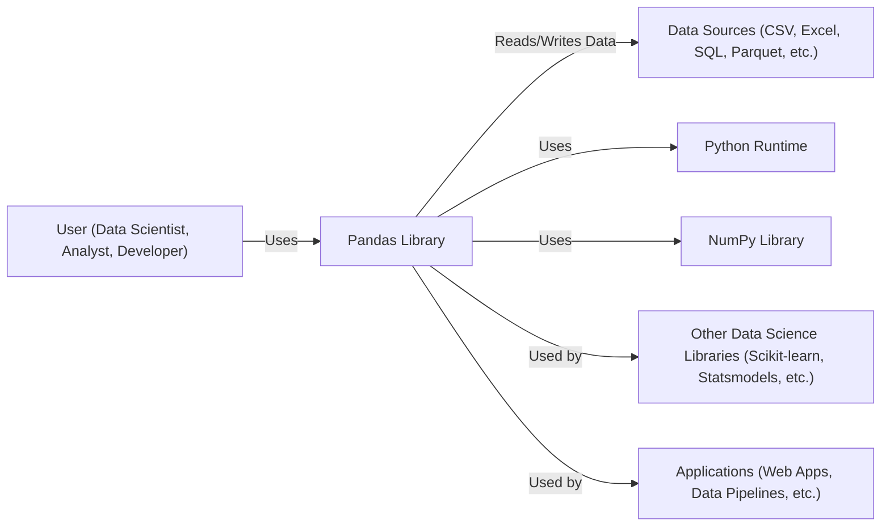
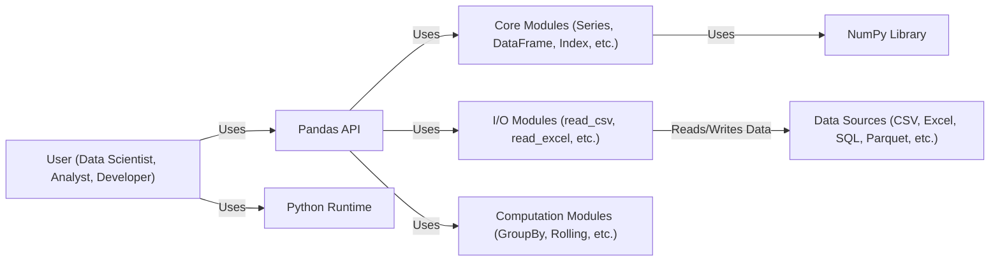
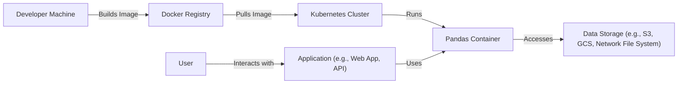
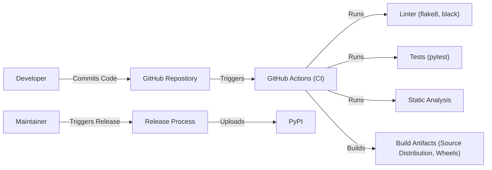

Okay, let's craft a design document for the Pandas project, keeping in mind its purpose and potential security considerations.  I'll follow the structure you've outlined.

# BUSINESS POSTURE

Pandas is a cornerstone of the Python data science ecosystem.  Its primary business goals are:

*   Provide a fast, flexible, and expressive data analysis and manipulation tool.
*   Maintain a large and active user and contributor community.
*   Ensure compatibility with a wide range of data sources and formats.
*   Remain a reliable and stable foundation for other data science libraries and applications.
*   Offer high performance for data operations, even with large datasets.

Business priorities:

*   Usability and ease of adoption for new users.
*   Performance and scalability for handling large datasets.
*   Reliability and stability to ensure consistent results.
*   Extensibility to allow for new features and integrations.
*   Community engagement and contribution.

Most important business risks:

*   Data corruption or loss due to bugs or vulnerabilities.
*   Performance degradation impacting user workflows.
*   Incompatibility with other key libraries in the Python data science ecosystem.
*   Loss of community trust due to security incidents or unaddressed issues.
*   Inability to adapt to evolving data formats and analysis techniques.

# SECURITY POSTURE

Pandas, as a library, relies heavily on the security of the underlying Python environment and any external libraries it interacts with.  It's primarily used in a trusted environment (e.g., a data scientist's local machine, a secure cloud-based notebook environment, or a controlled data processing pipeline).  However, the increasing use of Pandas in web applications and cloud services introduces new security considerations.

Existing security controls:

*   security control: Extensive test suite: Pandas has a comprehensive test suite that helps ensure the correctness and stability of the code. This includes unit tests, integration tests, and performance benchmarks. Described in: `/pandas/tests/`.
*   security control: Code reviews: All contributions to Pandas go through a code review process, where other developers examine the code for potential bugs, security vulnerabilities, and style issues. Described in: GitHub pull request process.
*   security control: Continuous Integration (CI): Pandas uses CI pipelines (GitHub Actions) to automatically run tests and checks on every code change. This helps catch issues early in the development process. Described in: `.github/workflows/`.
*   security control: Use of static analysis tools: Some static analysis tools are used to identify potential code quality and security issues. Described in: CI configuration and pre-commit hooks.
*   security control: Dependency management: Dependencies are carefully managed and tracked to minimize the risk of introducing vulnerabilities through third-party libraries. Described in: `pyproject.toml`, `requirements/*.txt`.

Accepted risks:

*   accepted risk: Reliance on user-provided data: Pandas operates on data provided by the user, and it's the user's responsibility to ensure the data is safe and doesn't contain malicious content.
*   accepted risk: Limited built-in security features: Pandas itself doesn't have extensive built-in security features like authentication or authorization, as it's primarily a data manipulation library.
*   accepted risk: Potential for vulnerabilities in third-party libraries: Pandas depends on other libraries, and vulnerabilities in those libraries could impact Pandas' security.
*   accepted risk: Execution of user-provided code (e.g., through `eval` or custom functions): Certain Pandas functions allow the execution of user-provided code, which can be a security risk if not handled carefully.

Recommended security controls:

*   security control: Integrate more comprehensive static analysis (SAST) and dynamic analysis (DAST) tools into the CI pipeline.
*   security control: Implement Software Composition Analysis (SCA) to identify and track vulnerabilities in dependencies.
*   security control: Develop security guidelines and best practices for Pandas users, especially those using it in web applications or cloud environments.
*   security control: Consider adding optional security features, such as data validation or sanitization, for users who need them.
*   security control: Regularly conduct security audits and penetration testing.

Security requirements:

*   Authentication: Not directly applicable to Pandas as a library, but relevant when Pandas is used within a larger system that requires authentication.
*   Authorization: Not directly applicable to Pandas, but relevant in the context of a larger system.
*   Input validation: Pandas should provide clear documentation and examples on how to validate and sanitize user-provided data before processing it.  This is crucial to prevent issues like code injection or denial-of-service attacks.
*   Cryptography: Pandas may interact with encrypted data, so it should support standard cryptographic libraries and formats.  It should not implement its own cryptographic algorithms.

# DESIGN

## C4 CONTEXT

Context diagram element list:

*   Element:
    *   Name: User
    *   Type: Person
    *   Description: A person who uses Pandas for data analysis, manipulation, and other tasks.
    *   Responsibilities: Provides data to Pandas, writes code using Pandas API, interprets results.
    *   Security controls: Responsible for securing their own environment and data.

*   Element:
    *   Name: Pandas
    *   Type: Software System
    *   Description: The Pandas library itself.
    *   Responsibilities: Provides data structures and functions for data analysis and manipulation.
    *   Security controls: Code reviews, CI, testing, dependency management.

*   Element:
    *   Name: Data Sources
    *   Type: External System
    *   Description: Various sources from which Pandas reads and to which it writes data.
    *   Responsibilities: Storing and providing data.
    *   Security controls: Dependent on the specific data source (e.g., database security, file system permissions).

*   Element:
    *   Name: Python
    *   Type: External System
    *   Description: The Python runtime environment.
    *   Responsibilities: Executes Pandas code.
    *   Security controls: Python security best practices, secure configuration.

*   Element:
    *   Name: NumPy
    *   Type: External System
    *   Description: A fundamental library for numerical computing in Python, which Pandas uses extensively.
    *   Responsibilities: Provides underlying numerical operations.
    *   Security controls: NumPy's own security measures, code reviews, testing.

*   Element:
    *   Name: Other Libraries
    *   Type: External System
    *   Description: Other libraries in the data science ecosystem that may use Pandas.
    *   Responsibilities: Perform specific data science tasks.
    *   Security controls: Dependent on the specific library.

*   Element:
    *   Name: Applications
    *   Type: External System
    *   Description: Applications that integrate Pandas for data processing.
    *   Responsibilities: Utilize Pandas for specific application logic.
    *   Security controls: Application-level security measures.

## C4 CONTAINER

In the case of Pandas, the container diagram is very similar to the context diagram, as Pandas is primarily a single library.  The "containers" are essentially the different modules and components *within* Pandas.

Container diagram element list:

*   Element:
    *   Name: User
    *   Type: Person
    *   Description: A person who uses Pandas for data analysis.
    *   Responsibilities: Provides data, writes code, interprets results.
    *   Security controls: Responsible for securing their environment.

*   Element:
    *   Name: Pandas API
    *   Type: Container
    *   Description: The public-facing API of the Pandas library.
    *   Responsibilities: Provides a consistent interface for users to interact with Pandas.
    *   Security controls: Input validation (to the extent possible within a library), documentation on secure usage.

*   Element:
    *   Name: Core
    *   Type: Container
    *   Description: The core data structures and fundamental operations of Pandas.
    *   Responsibilities: Implements the core logic of Series, DataFrame, Index, etc.
    *   Security controls: Extensive testing, code reviews.

*   Element:
    *   Name: IO
    *   Type: Container
    *   Description: Modules for reading and writing data from various formats.
    *   Responsibilities: Handles data input and output.
    *   Security controls: Input validation, secure parsing of file formats.

*   Element:
    *   Name: Computation
    *   Type: Container
    *   Description: Modules for performing computations on data (e.g., grouping, rolling window operations).
    *   Responsibilities: Implements various data analysis algorithms.
    *   Security controls: Testing, code reviews, performance optimization.

*   Element:
    *   Name: NumPy
    *   Type: External System
    *   Description: Underlying numerical computing library.
    *   Responsibilities: Provides numerical operations.
    *   Security controls: NumPy's own security measures.

*   Element:
    *   Name: Data Sources
    *   Type: External System
    *   Description: Various data sources.
    *   Responsibilities: Storing and providing data.
    *   Security controls: Dependent on the specific data source.

* Element:
    *   Name: Python
    *   Type: External System
    *   Description: The Python runtime environment.
    *   Responsibilities: Executes Pandas code.
    *   Security controls: Python security best practices, secure configuration.

## DEPLOYMENT

Pandas is typically deployed as a library within a Python environment.  There are several common deployment scenarios:

1.  **Local Development Environment:**  Installed via `pip` or `conda` on a developer's machine.
2.  **Cloud-Based Notebook Environments:**  Pre-installed or installed via `pip` or `conda` in environments like Jupyter Notebooks, Google Colab, or Amazon SageMaker Studio.
3.  **Server Environments:** Installed as part of a Python application deployment (e.g., a web application using Flask or Django that uses Pandas for data processing).
4.  **Containerized Environments:** Included in a Docker container image along with the application code and other dependencies.
5.  **Data Processing Pipelines:**  Installed on virtual machines or within containerized environments (e.g., Kubernetes) as part of a larger data pipeline.

We'll describe the **Containerized Environments** deployment in detail, as it offers good security and reproducibility.

Deployment diagram element list:

*   Element:
    *   Name: Developer Machine
    *   Type: Node
    *   Description: The machine where the Docker image is built.
    *   Responsibilities: Building the Docker image.
    *   Security controls: Secure coding practices, access controls.

*   Element:
    *   Name: Docker Registry
    *   Type: Node
    *   Description: A registry for storing Docker images (e.g., Docker Hub, AWS ECR, Google Container Registry).
    *   Responsibilities: Storing and distributing Docker images.
    *   Security controls: Access controls, image scanning.

*   Element:
    *   Name: Kubernetes Cluster
    *   Type: Node
    *   Description: A cluster of machines managed by Kubernetes.
    *   Responsibilities: Orchestrating and running containers.
    *   Security controls: Kubernetes security best practices, network policies, RBAC.

*   Element:
    *   Name: Pandas Container
    *   Type: Container Instance
    *   Description: A running instance of the Docker image containing Pandas and the application code.
    *   Responsibilities: Running the Pandas-based application.
    *   Security controls: Container security best practices, minimal base image, least privilege.

*   Element:
    *   Name: Data Storage
    *   Type: Node
    *   Description: Persistent storage for data used by the application.
    *   Responsibilities: Storing and providing data.
    *   Security controls: Data encryption at rest and in transit, access controls.

*   Element:
    *   Name: User
    *   Type: Person
    *   Description: A person interacting with the application.
    *   Responsibilities: Using the application.
    *   Security controls: User authentication and authorization.

*   Element:
    *   Name: Application
    *   Type: Software System
    *   Description: The application that uses Pandas.
    *   Responsibilities: Providing functionality to the user.
    *   Security controls: Application-level security measures.

## BUILD

Pandas uses a combination of tools and processes for building and publishing the library:

1.  **Source Code Management:** GitHub is used for source code management and version control.
2.  **Continuous Integration (CI):** GitHub Actions are used for CI.  This automates the following steps:
    *   **Linting:** Code style checks using tools like `flake8` and `black`.
    *   **Testing:** Running the extensive test suite using `pytest`.
    *   **Building:** Creating source distributions and wheels.
    *   **Static Analysis:** Basic static analysis is performed.
3.  **Release Process:**  Releases are manually triggered by maintainers.  The process involves:
    *   Creating a release branch.
    *   Updating version numbers.
    *   Generating release notes.
    *   Building and uploading distributions to PyPI (Python Package Index).

Build process security controls:

*   security control: Code reviews on GitHub.
*   security control: CI pipeline with automated tests and linting.
*   security control: Use of signed commits (optional, but recommended).
*   security control: Two-factor authentication for maintainers with PyPI access.
*   security control: Dependency management to minimize vulnerabilities.

# RISK ASSESSMENT

*   **Critical Business Processes:** Data analysis and manipulation, model training, data-driven decision making.
*   **Data Sensitivity:** Pandas processes data of varying sensitivity levels, from publicly available datasets to highly confidential business data. The sensitivity depends entirely on the user and the context in which Pandas is used.
    *   **High Sensitivity:** Personally Identifiable Information (PII), financial data, health records, proprietary business data.
    *   **Medium Sensitivity:** Aggregated data, anonymized data, internal business metrics.
    *   **Low Sensitivity:** Publicly available datasets, synthetic data.

# QUESTIONS & ASSUMPTIONS

*   **Questions:**
    *   Are there any specific compliance requirements (e.g., GDPR, HIPAA) that need to be considered when using Pandas?
    *   What are the typical data sizes and performance requirements for users of Pandas?
    *   What are the most common deployment environments for Pandas users?
    *   What level of security expertise is expected from Pandas users?
    *   Are there plans to integrate Pandas with any specific security tools or frameworks?

*   **Assumptions:**
    *   BUSINESS POSTURE: The primary goal is to provide a reliable and performant data analysis tool.
    *   SECURITY POSTURE: Users are responsible for securing their own data and environment. Pandas is primarily used in trusted environments.
    *   DESIGN: Pandas will continue to be primarily a library, with limited built-in security features. The focus is on providing tools and documentation to help users use Pandas securely.
    *   The user has a basic understanding of Python and data analysis concepts.
    *   The user is responsible for managing their own dependencies and ensuring they are up-to-date.
    *   The user is responsible for validating and sanitizing any input data before processing it with Pandas.