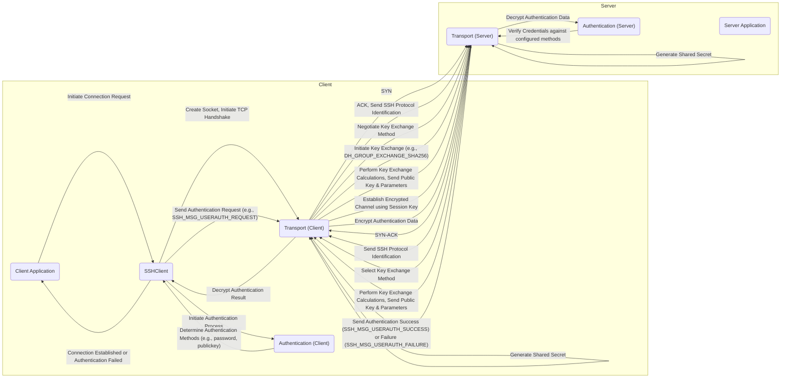
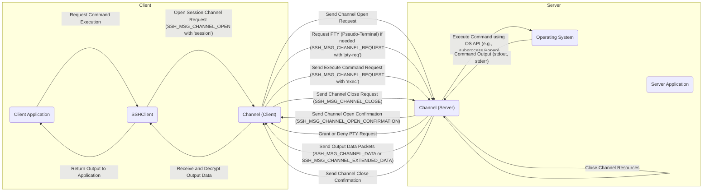
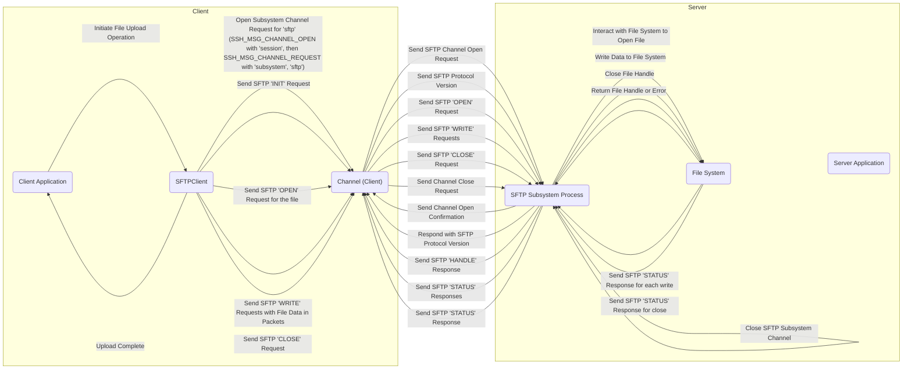

# Project Design Document: Paramiko Library

**Version:** 1.1
**Date:** October 26, 2023
**Author:** Gemini (AI Language Model)

## 1. Introduction

This document provides a detailed design overview of the Paramiko library, a pure-Python implementation of the SSHv2 protocol, providing both client and server functionality. This document is intended to serve as a foundation for subsequent threat modeling activities. It outlines the key architectural components, data flow, and security-relevant aspects of the library. This revision aims to provide more granular detail and clarity based on initial feedback.

## 2. Goals and Objectives

The primary goal of this document is to provide a comprehensive architectural understanding of Paramiko for security analysis and threat modeling. Specific objectives include:

*   Identifying key components and their specific responsibilities and interactions.
*   Mapping the flow of data and control within the library with greater detail on the steps involved.
*   Highlighting security-sensitive areas and functionalities, providing more concrete examples of potential risks.
*   Providing a clear and concise representation of the system's design, suitable for security professionals.

## 3. Scope

This document focuses on the core architectural elements of the Paramiko library relevant to its SSH client and server functionalities. It covers:

*   Key modules and classes involved in establishing and maintaining SSH connections, including the specifics of handshake and key exchange.
*   Authentication mechanisms supported by the library, detailing the processes for each method.
*   Data encryption and decryption processes, including the role of cryptographic libraries.
*   Channel management for command execution, file transfer (SFTP), and port forwarding, outlining the request/response flow.
*   Interaction with underlying operating system functionalities, particularly concerning socket management and process execution.

This document does not cover:

*   Specific implementation details of individual functions or methods beyond their architectural significance.
*   Performance optimization strategies unless they have direct security implications.
*   Detailed error handling mechanisms beyond their potential impact on security state.
*   The intricacies of the SSH protocol itself (assumed knowledge), focusing instead on Paramiko's implementation of it.

## 4. Architectural Overview

Paramiko is structured around the SSHv2 protocol, providing a high-level abstraction for developers. It can be broadly categorized into client-side and server-side functionalities, though many core components are shared and reused.

### 4.1. High-Level Components

*   **Transport:**  The foundation of the SSH connection. It handles the initial TCP connection, negotiates SSH protocol versions, performs key exchange to establish a shared secret, and manages the encryption and decryption of all subsequent communication. This component is crucial for ensuring confidentiality and integrity.
*   **Authentication:** Responsible for verifying the identity of the client to the server (and potentially vice-versa). It supports various methods, each with its own security implications and implementation details. This component is critical for access control.
*   **Channel:** Provides a secure, multiplexed communication channel over the established SSH connection. Multiple channels can exist within a single SSH connection, allowing for concurrent operations like command execution and file transfer. This component manages the logical separation of different activities.
*   **SFTP (Secure File Transfer Protocol):** Implements the SFTP protocol as a subsystem over an SSH channel. It provides secure file transfer capabilities, including uploading, downloading, and file management operations.
*   **Forwarding (Port Forwarding):** Enables secure tunneling of network traffic through the encrypted SSH connection. This can be used to access services on private networks or to create secure tunnels for other protocols.
*   **Agent (SSH Agent Forwarding):** Allows the client to delegate authentication to a local SSH agent. This avoids storing private keys directly on the machine where Paramiko is running but introduces risks if the agent is compromised.

### 4.2. Client-Side Architecture

The client-side of Paramiko is used to initiate and manage SSH connections to remote servers.

*   **`SSHClient`:** The primary user-facing class for client-side operations. It encapsulates the entire SSH client lifecycle, from establishing a connection to managing authentication and channels. It provides a high-level API for common SSH tasks.
*   **`Transport` (Client-side):**  Initiates the TCP connection to the server, handles the SSH handshake, negotiates cryptographic algorithms, performs key exchange (e.g., Diffie-Hellman), and establishes the encrypted communication channel.
*   **`Authentication` (Client-side):** Implements various client-side authentication methods, such as password authentication, public key authentication (using keys from files or SSH agents), and GSSAPI authentication. It interacts with the `Transport` to send the necessary credentials securely.
*   **`Channel` (Client-side):**  Provides methods for opening different types of channels (e.g., session channels for command execution, subsystem channels for SFTP), sending requests to the server, and receiving responses.
*   **`SFTPClient`:** A higher-level, user-friendly interface built on top of a `Channel`. It simplifies file transfer operations by providing methods for common SFTP actions like `put`, `get`, `mkdir`, etc.

### 4.3. Server-Side Architecture

The server-side of Paramiko allows applications to act as SSH servers, accepting incoming connections.

*   **`ServerInterface`:** An abstract base class that defines the interface for handling incoming SSH connections and requests. Custom server implementations must inherit from this class and implement methods for authentication, channel requests, etc.
*   **`Transport` (Server-side):** Listens for incoming TCP connections on a specified port, handles the initial SSH handshake with the client, negotiates cryptographic parameters, and establishes the secure communication channel.
*   **`Authentication` (Server-side):**  Handles incoming authentication requests from clients. It verifies the provided credentials against configured authentication mechanisms (e.g., checking passwords against a database, verifying public key signatures).
*   **`Channel` (Server-side):** Manages incoming channel requests from clients. When a client requests a new channel (e.g., for command execution or SFTP), the server-side `Channel` implementation handles the request and dispatches it to the appropriate handler.
*   **`Server` (Example Implementation):** A concrete implementation of `ServerInterface` provided by Paramiko, offering basic server functionality. Developers can extend or replace this with custom server logic.

## 5. Data Flow

The following diagrams illustrate the typical data flow for common operations, providing more detail on the steps involved.

### 5.1. Client Connection Establishment and Authentication

### 5.2. Client Command Execution

### 5.3. Client SFTP File Transfer (Upload)

## 6. Security Considerations

Paramiko, while implementing the secure SSH protocol, presents several areas where vulnerabilities could arise or be exploited:

*   **Cryptographic Algorithm Negotiation Vulnerabilities:** If the negotiation process is flawed or allows for downgrade attacks, weaker cryptographic algorithms might be chosen, making the connection susceptible to eavesdropping or manipulation. For example, older versions might still support weaker ciphers.
*   **Authentication Bypass Vulnerabilities:** Flaws in the implementation of authentication methods (e.g., incorrect handling of password checks, vulnerabilities in public key signature verification) could allow unauthorized access.
*   **Man-in-the-Middle (MITM) Attacks during Key Exchange:** While SSH's key exchange aims to prevent MITM, weaknesses in the implementation of specific key exchange algorithms or failure to properly verify host keys can leave connections vulnerable.
*   **Vulnerabilities in Dependencies:** Paramiko relies heavily on the `cryptography` library for its core cryptographic functions. Any vulnerabilities in `cryptography` directly impact Paramiko's security. Similarly, issues in `bcrypt` (for password hashing) could be exploited.
*   **Channel Security Issues:**  Bugs in channel management or data handling could lead to information leaks or the ability for malicious actors to interfere with other channels within the same SSH connection.
*   **Forwarding Security Misconfigurations:** Improperly configured port forwarding can create unintended network access points, potentially exposing internal services to external threats.
*   **SSH Agent Forwarding Risks:** If the client machine is compromised, an attacker could potentially use the forwarded SSH agent to authenticate to other servers, gaining unauthorized access.
*   **Denial of Service (DoS) Vulnerabilities:**  Attackers might try to exhaust server resources by sending a large number of connection requests or by exploiting vulnerabilities in channel handling, leading to a denial of service.
*   **Side-Channel Attacks:** Although less likely in a high-level library, vulnerabilities in the underlying cryptographic implementations could potentially be exploited through side-channel attacks (e.g., timing attacks).
*   **Improper Handling of Host Key Verification:** If the client application does not properly verify the server's host key, it could be connecting to a malicious server impersonating the legitimate one.

## 7. Dependencies

Paramiko's security posture is intrinsically linked to the security of its dependencies:

*   **`cryptography`:** This is a critical dependency, providing the core cryptographic primitives used for encryption, decryption, hashing, and key generation. Vulnerabilities in `cryptography` would have a direct and significant impact on Paramiko's security. Regular updates to `cryptography` are essential.
*   **`bcrypt`:** Used for securely hashing passwords when implementing SSH servers. A vulnerability in `bcrypt`'s hashing algorithm or its implementation could weaken password-based authentication.
*   **`pynacl` (optional):**  Provides alternative cryptographic implementations based on the Networking and Cryptography (NaCl) library. If used, its security is also relevant.
*   **Standard Python Libraries:** While generally considered secure, vulnerabilities in standard libraries like `socket` could potentially be exploited.

## 8. Deployment Considerations

The security of Paramiko deployments depends on how it is used and configured:

*   **Client-side:** Ensure that applications using Paramiko properly handle host key verification to prevent connecting to rogue servers. Securely manage private keys used for public key authentication. Keep Paramiko and its dependencies updated.
*   **Server-side:**  Carefully configure authentication mechanisms, ensuring strong password policies or robust public key infrastructure. Regularly audit server configurations and monitor for suspicious activity. Keep Paramiko and its dependencies updated. Consider the security implications of allowing port forwarding or agent forwarding.

## 9. Future Considerations

*   **Enhanced Cryptographic Agility and Algorithm Selection:**  Providing more fine-grained control over the selection of cryptographic algorithms and making it easier to adapt to evolving security standards.
*   **Improved Security Auditing and Logging Capabilities:**  Adding more comprehensive logging of security-relevant events to aid in intrusion detection and forensic analysis.
*   **Formal Security Reviews and Penetration Testing:**  Regularly subjecting the library to external security assessments to identify and address potential vulnerabilities proactively.
*   **Strengthening Host Key Management:**  Providing more robust and user-friendly mechanisms for managing and verifying host keys.
*   **Exploring Memory Safety and Type Hinting:**  Investigating techniques to improve the robustness and security of the codebase.

This document provides a more detailed architectural understanding of Paramiko, intended to facilitate thorough threat modeling. The added granularity in component descriptions and data flow, along with more specific security considerations, should provide a stronger foundation for identifying potential vulnerabilities.