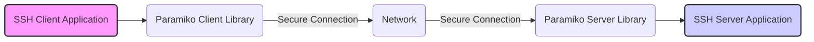
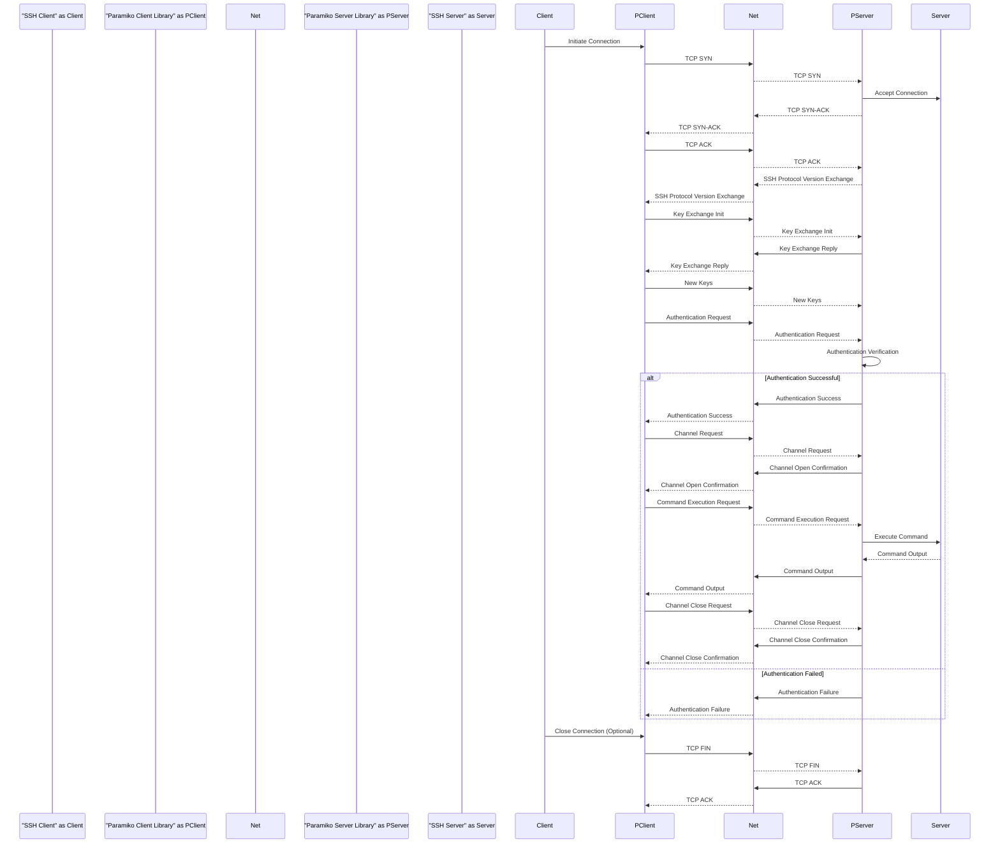

# Project Design Document: Paramiko - Secure Shell (SSH) Implementation

**Version:** 1.1
**Date:** October 26, 2023
**Author:** AI Software Architect

## 1. Introduction

This document provides a detailed design overview of the Paramiko project, a pure-Python implementation of the SSHv2 protocol. Paramiko offers both client and server functionalities, enabling secure communication over a network. This document is specifically crafted to facilitate threat modeling by clearly outlining the architecture, components, and data flow within the project.

## 2. Goals and Objectives

The core objectives of Paramiko are:

* **Pure Python SSHv2 Implementation:** To provide an SSHv2 protocol implementation without relying on external native libraries.
* **Dual Client and Server Functionality:** To empower Python applications to act as both SSH clients and servers.
* **Robust Security:** To implement cryptographic primitives and protocol mechanisms in a secure manner, adhering to best practices.
* **Developer-Friendly API:** To offer an intuitive and easy-to-use API for seamless integration of SSH capabilities into Python applications.
* **Cross-Platform Compatibility:** To ensure operability across various operating systems supported by Python.

## 3. Target Audience

This document is intended for:

* **Security Architects and Engineers:** To analyze the system's architecture for potential security vulnerabilities and design threat mitigation strategies.
* **Software Developers:** To understand the internal structure and interactions of Paramiko's components for development and debugging purposes.
* **Quality Assurance and Testing Teams:** To gain insights into the system's functionalities and boundaries for effective testing.
* **System Administrators and DevOps Engineers:** To understand the deployment considerations and security implications when using Paramiko.
* **Project Maintainers:** To serve as a comprehensive reference for the project's design and evolution.

## 4. High-Level Overview

Paramiko enables secure, encrypted communication between a client and a server over a network using the SSH protocol. It manages the intricate details of the SSH handshake, user authentication, data encryption, and channel management.



The typical interaction involves an SSH client application utilizing the Paramiko client library to establish a secure connection with an SSH server application, which may be using the Paramiko server library or another SSH server implementation. All communication between the client and server is encrypted and authenticated.

## 5. Detailed Design

Paramiko's architecture is modular, comprising several key layers and components:

* **Transport Layer:**
    * **Purpose:** Establishes and maintains the foundational secure, encrypted connection.
    * **Key Functions:**
        * Protocol version exchange and negotiation.
        * Key exchange process (e.g., "diffie-hellman-group-exchange-sha256", "curve25519-sha256").
        * Negotiation and application of symmetric encryption algorithms (e.g., "aes256-ctr", "chacha20-poly1305@openssh.com").
        * Negotiation and application of Message Authentication Codes (MACs) (e.g., "hmac-sha2-256", "umac-128@openssh.com").
        * Optional negotiation and application of compression algorithms (e.g., "zlib", "none").
        * Implementation of countermeasures against replay attacks using sequence numbers.
* **User Authentication Layer:**
    * **Purpose:** Verifies the identity of the client to the server (and potentially the server to the client).
    * **Supported Methods:**
        * "password": Traditional password-based authentication.
        * "publickey": Authentication using asymmetric key pairs (e.g., RSA, DSA, ECDSA, EdDSA).
        * "keyboard-interactive":  A challenge-response mechanism allowing for multi-factor authentication.
        * "gssapi-with-mic": Authentication using Kerberos/GSSAPI.
        * "none":  (Rarely used and generally insecure).
    * **Process:** Involves the exchange of credentials and cryptographic verification steps based on the chosen method.
* **Connection Layer (Channel Layer):**
    * **Purpose:** Provides multiplexed, logical channels over the established secure connection for various tasks.
    * **Channel Types:**
        * **"session":**  Used for executing commands, running interactive shell sessions, and setting up port forwarding.
        * **"direct-tcpip":** Facilitates the client initiating a TCP connection to a destination reachable from the server.
        * **"forwarded-tcpip":** Allows the server to initiate a TCP connection back to a destination reachable from the client.
        * **"x11":** Enables secure forwarding of X11 graphical application displays.
        * **"auth-agent@openssh.com":** Used for SSH agent forwarding.
    * **Functionality:** Manages the flow of data within each channel, including flow control mechanisms.
* **Cryptographic Primitives:**
    * **Implementation:** Paramiko leverages external cryptographic libraries (primarily `cryptography`) for core cryptographic operations.
    * **Key Operations:**
        * Symmetric encryption and decryption (e.g., AES, ChaCha20).
        * Asymmetric encryption and decryption (e.g., RSA, Elliptic Curve Cryptography).
        * Hashing algorithms (e.g., SHA-256, SHA-512).
        * Digital signatures (e.g., RSA-SHA2, ECDSA-SHA2).
        * Key derivation functions (KDFs) for session key generation.
* **Client API:**
    * **Purpose:** Provides a high-level, user-friendly interface for Python applications to act as SSH clients.
    * **Key Classes and Functions:**
        * `SSHClient`:  The primary class for establishing and managing SSH connections.
        * `exec_command()`:  Executes commands on the remote server.
        * `open_sftp()`:  Opens an SFTP client session for file transfers.
        * `forward_local_port()`, `forward_remote_port()`:  Sets up port forwarding tunnels.
        * Integration with `paramiko.Agent`: For managing SSH agent connections.
* **Server API:**
    * **Purpose:** Provides a framework for building custom SSH servers in Python.
    * **Key Components:**
        * `ServerInterface`:  Abstract base class for implementing SSH server logic.
        * Mechanisms for handling authentication requests and channel requests.
        * Subsystem implementations (e.g., a custom SFTP server).
* **SFTP (Secure File Transfer Protocol) Implementation:**
    * **Foundation:** Built upon the channel layer, providing secure file transfer capabilities.
    * **Components:**
        * `SFTPClient`:  Client-side implementation for interacting with SFTP servers.
        * `SFTPServerInterface`: Server-side interface for handling SFTP requests.
    * **Operations:** Supports standard file operations like uploading, downloading, creating directories, and managing file attributes.
* **Forwarding Capabilities:**
    * **Types:** Implements both local and remote port forwarding (tunneling).
    * **Function:** Enables secure redirection of network traffic through the SSH connection.
* **Agent Forwarding:**
    * **Mechanism:** Allows the client to forward its SSH agent connection to the server.
    * **Benefit:** Enables seamless authentication on the server using the client's private keys managed by the agent.

```mermaid
graph LR
    subgraph "Paramiko Client"
        A["SSH Client Application"] --> B("Client API");
        B --> C("Transport Layer (Client)");
        C --> D("Authentication Layer (Client)");
        D --> E("Channel Layer (Client)");
        E --> F("SFTP Client");
        E --> G("Forwarding (Client)");
        E --> H("Agent Forwarding (Client)");
    end
    subgraph "Network"
        I("Network");
    end
    subgraph "Paramiko Server"
        J("Transport Layer (Server)") --> K("Authentication Layer (Server)");
        K --> L("Channel Layer (Server)");
        L --> M("SFTP Server");
        L --> N("Forwarding (Server)");
        L --> O("Agent Forwarding (Server)");
        P("Server API") --> L;
        Q["SSH Server Application"] <-- P;
    end
    C -- "Encrypted Communication" --> I;
    I -- "Encrypted Communication" --> J;
    style A fill:#f9f,stroke:#333,stroke-width:2px
    style Q fill:#ccf,stroke:#333,stroke-width:2px
```

## 6. Data Flow

A typical SSH connection establishment and command execution involves the following data flow:

1. **Client Initiates Connection:** The client application utilizes the Paramiko client API to initiate a TCP connection to the SSH server.
2. **Transport Layer Negotiation:**
    * Client and server exchange SSH protocol version identification strings.
    * They negotiate and agree upon key exchange, encryption, MAC, and compression algorithms.
    * The key exchange process (e.g., Diffie-Hellman) is performed to establish a shared secret key.
3. **Key Exchange Completion:**  Both sides confirm the establishment of new encryption keys. All subsequent communication is encrypted.
4. **User Authentication:**
    * The client attempts to authenticate to the server using a chosen method (e.g., password, public key).
    * This involves the exchange of authentication requests and responses, potentially involving cryptographic signatures or password hashes.
5. **Channel Request:** Upon successful authentication, the client requests a specific type of channel (e.g., a "session" channel for command execution).
6. **Channel Opening:** The server processes the channel request and, if permitted, opens the requested channel.
7. **Command Execution (Example):**
    * The client sends a request to execute a command on the remote server over the established session channel.
    * The server executes the command within the requested session.
    * The server sends the command's output (standard output and standard error) back to the client over the same channel.
8. **Channel Closure:** Either the client or the server can initiate the closure of the channel.
9. **Connection Closure:**  Either side can initiate the termination of the underlying secure connection.



## 7. Security Considerations for Threat Modeling

This section highlights key security aspects relevant for threat modeling Paramiko:

* **Cryptographic Algorithm Negotiation:** The negotiation process must be robust against downgrade attacks, where an attacker might try to force the use of weaker cryptographic algorithms.
* **Key Exchange Vulnerabilities:** Implementations of key exchange algorithms (like Diffie-Hellman) need to be protected against known vulnerabilities. Ephemeral key exchange methods offer better forward secrecy.
* **Authentication Bypass:**  Vulnerabilities in the authentication logic could allow attackers to bypass authentication mechanisms. Secure handling of credentials and proper implementation of authentication protocols are crucial.
* **Man-in-the-Middle (MITM) Attacks:**  The initial key exchange is the primary defense against MITM attacks. Strict host key checking on the client side is essential to verify the server's identity.
* **Replay Attacks:**  The transport layer's sequence numbers should effectively prevent replay attacks. Incorrect implementation could lead to vulnerabilities.
* **Channel Security:** Data transmitted within channels must be encrypted and authenticated to maintain confidentiality and integrity.
* **SFTP Vulnerabilities:**  The SFTP implementation needs to be secure against path traversal attacks, symlink attacks, and other file system-related vulnerabilities.
* **Forwarding Risks:**  Improperly configured port forwarding can introduce security risks by exposing internal services.
* **Agent Forwarding Risks:** While convenient, agent forwarding can be risky if the server is compromised, potentially exposing the client's private keys.
* **Dependency Vulnerabilities:**  Paramiko's security relies on the security of its dependencies (like `cryptography`). Regular updates and vulnerability scanning are necessary.
* **Denial of Service (DoS) Attacks:**  The system should be resilient against DoS attacks targeting connection establishment, authentication, or resource consumption.
* **Input Validation:**  Paramiko must properly validate all input data to prevent injection attacks or unexpected behavior.
* **Memory Safety:** While Python offers some memory safety, vulnerabilities in underlying C libraries or incorrect handling of resources could lead to memory-related issues.

## 8. Deployment Considerations

Deploying applications using Paramiko requires careful consideration of the following:

* **Secure Key Management:**  Implementing secure methods for generating, storing, and distributing SSH keys is paramount.
* **Firewall Configuration:**  Appropriate firewall rules must be in place to allow SSH traffic on the necessary ports (typically port 22) while restricting unauthorized access.
* **Authentication Method Selection:**  Choosing strong authentication methods (like public-key authentication) over password-based authentication is recommended for enhanced security.
* **Resource Allocation:**  Ensure sufficient system resources (CPU, memory, network bandwidth) are available to handle the anticipated number of concurrent SSH connections.
* **Regular Security Updates:**  Keeping Paramiko and its dependencies updated with the latest security patches is crucial.
* **Logging and Monitoring:**  Implementing robust logging and monitoring mechanisms to detect and respond to suspicious activity.

## 9. Future Considerations

Potential future enhancements for Paramiko include:

* **Performance Optimization:**  Further optimizing cryptographic operations and network handling for improved efficiency.
* **Support for Emerging SSH Protocol Extensions:**  Implementing features from newer SSH specifications to enhance functionality and security.
* **Enhanced Security Features:**  Incorporating new security mechanisms and mitigations against evolving threats.
* **Improved Algorithm Agility:**  Providing more flexible control over the selection and prioritization of cryptographic algorithms.
* **Refined API for Specific Use Cases:**  Potentially offering specialized APIs for common tasks to simplify development.
* **Community Contributions and Audits:** Encouraging community involvement through contributions and security audits to enhance the project's robustness.

This revised document provides a more detailed and structured overview of the Paramiko project, with a stronger emphasis on aspects relevant to threat modeling. The expanded descriptions of components, data flow, and security considerations aim to provide a solid foundation for security analysis and risk assessment.