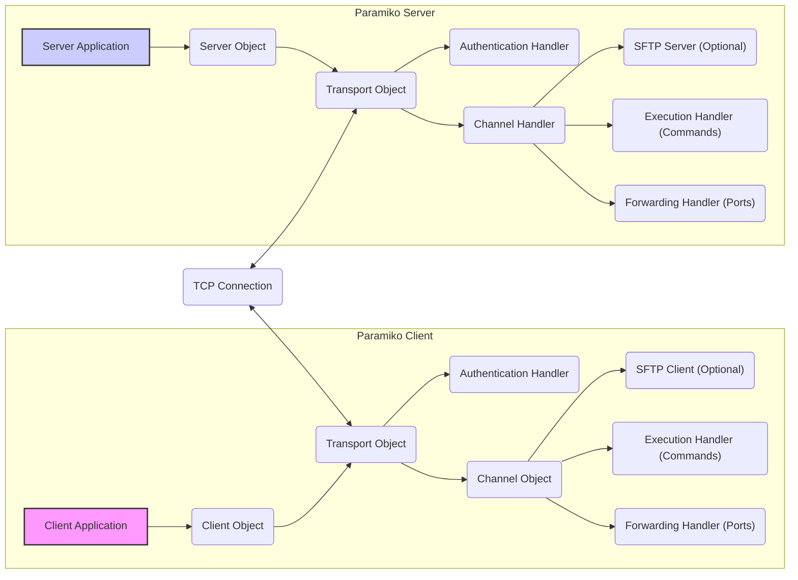
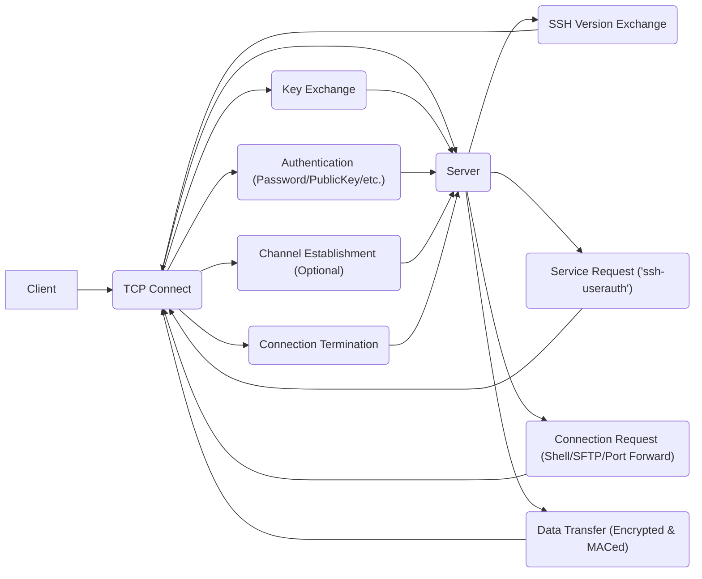

# Project Design Document: Paramiko

**Version:** 1.1
**Date:** October 26, 2023
**Author:** AI Software Architect

## 1. Introduction

This document provides an enhanced and detailed design overview of the Paramiko project, a pure-Python implementation of the SSHv2 protocol suite. This document is specifically crafted to serve as a robust foundation for subsequent threat modeling activities. It meticulously outlines the key components, architectural nuances, data flow intricacies, and critical security considerations inherent in Paramiko.

## 2. Project Overview

*   **Project Name:** Paramiko
*   **Project Repository:** [https://github.com/paramiko/paramiko](https://github.com/paramiko/paramiko)
*   **Project Description:** Paramiko is a comprehensive, pure-Python implementation of the SSHv2 protocol. It offers both client and server functionalities, empowering Python programs to establish secure, encrypted connections with remote servers, execute commands remotely, facilitate secure file transfers, and effectively manage SSH keys. Its pure-Python nature ensures platform independence.
*   **Key Features:**
    *   Robust SSH client capabilities for connecting to and interacting with remote SSH servers.
    *   Flexible SSH server capabilities, enabling Python applications to function as SSH servers, accepting incoming secure connections.
    *   Extensive support for diverse authentication methods, including password-based authentication and public key-based authentication with various key types.
    *   Integrated SFTP client and server functionalities for secure and reliable file transfer operations.
    *   Versatile port forwarding (tunneling) capabilities, allowing for the creation of secure tunnels for other network traffic.
    *   Mechanism for executing commands on remote servers and retrieving their output.
    *   Comprehensive management of SSH keys, including generation, loading, and saving.
    *   Pure Python implementation, ensuring broad compatibility across different operating systems and environments without external dependencies (beyond standard Python libraries and explicitly listed dependencies).

## 3. Architectural Design

Paramiko's architecture is modular and layered, facilitating a clear separation of concerns. The core components interact to implement the full SSHv2 protocol.

*   **Transport Layer:** Forms the bedrock of the SSH connection, managing the underlying TCP socket and orchestrating the initial SSH handshake. This layer handles crucial aspects like encryption algorithm negotiation, data compression, and message framing according to the SSH protocol specification.
*   **Authentication Layer:**  Responsible for securely verifying the identity of the connecting client. It implements various authentication methods, negotiating the preferred method with the remote peer and handling the specific protocol exchanges for each method.
*   **Connection Layer:** Established after successful authentication, this layer provides the framework for creating and managing channels. These channels are multiplexed over the single SSH connection and used for different types of operations.
*   **Subsystems:** Represent specific functionalities built upon the connection layer. Examples include the SFTP subsystem for file transfer and the agent forwarding subsystem for leveraging local SSH agents.
*   **Utilities:** A collection of helper functions, classes, and modules that provide supporting functionalities, such as SSH key manipulation, data encoding/decoding, and exception handling.

### 3.1. Component Breakdown

*   **`transport.py`:**
    *   Core implementation of the SSH transport protocol as defined in RFC 4253.
    *   Manages the lifecycle of the underlying TCP socket connection, including establishment and closure.
    *   Implements encryption and decryption of SSH packets using cryptographic primitives provided by libraries like `cryptography`. Supports negotiation of various cipher algorithms.
    *   Handles the key exchange process, including negotiation of key exchange algorithms (e.g., Diffie-Hellman group exchange, elliptic-curve Diffie-Hellman) and the secure generation of shared secrets.
    *   Manages SSH message framing and parsing, ensuring adherence to the SSH protocol structure.
    *   Provides methods for sending and receiving raw SSH messages over the encrypted channel.
*   **`auth_handler.py`:**
    *   Orchestrates the client and server-side authentication processes as defined in RFC 4252.
    *   Implements various authentication methods:
        *   Password authentication: Handles the exchange of password credentials and verification.
        *   Public key authentication: Supports authentication using SSH keys (RSA, DSA, ECDSA, EdDSA), including signature verification.
        *   GSSAPI authentication (if the `paramiko[gssapi]` extra is installed): Integrates with the Generic Security Services Application Program Interface for Kerberos-based authentication.
    *   Interacts closely with the `Transport` layer to send and receive authentication-related SSH messages.
    *   Manages the state of the authentication process, including handling multiple authentication attempts.
*   **`channel.py`:**
    *   Manages the creation, lifecycle, and operation of SSH channels as specified in RFC 4254.
    *   Provides mechanisms for opening new channels, assigning channel IDs, and managing channel state.
    *   Handles the flow of data within a channel, including segmentation and reassembly of data packets.
    *   Supports different channel types, each designed for a specific purpose:
        *   `session`: Used for interactive shell sessions and remote command execution.
        *   `direct-tcpip`: Used for client-initiated port forwarding.
        *   `forwarded-tcpip`: Used for server-initiated port forwarding.
    *   Implements flow control mechanisms to prevent buffer overflows.
*   **`client.py`:**
    *   Provides the primary high-level interface for interacting with SSH servers as a client.
    *   Simplifies the process of establishing SSH connections, handling the underlying transport and authentication complexities.
    *   Offers methods for authenticating with various credentials (passwords, private keys).
    *   Provides methods for creating and managing channels for different operations.
    *   Includes convenience methods for executing remote commands, transferring files using the `sftp_client.py` module, and setting up port forwards.
*   **`server.py`:**
    *   Provides the core functionality for implementing an SSH server in Python.
    *   Handles incoming TCP connections on the designated port (default 22).
    *   Manages the initial SSH handshake and negotiates protocol parameters.
    *   Orchestrates the authentication process for connecting clients.
    *   Dispatches requests for different services (e.g., shell access, SFTP) to appropriate handlers.
    *   Allows for customization of server behavior through callbacks and subclassing.
*   **`sftp_client.py`:**
    *   Implements the client-side of the SSH File Transfer Protocol (SFTP) as defined in the relevant IETF drafts.
    *   Provides a file-like interface for interacting with remote file systems over an established SSH channel.
    *   Offers methods for common file operations: uploading, downloading, listing directories, creating directories, deleting files, renaming files, etc.
    *   Handles SFTP protocol messages and data transfer.
*   **`sftp_server.py`:**
    *   Implements the server-side of the SFTP protocol.
    *   Handles file transfer requests received from SFTP clients over an SSH channel.
    *   Manages access to the local file system based on the authenticated user's permissions.
    *   Implements the SFTP protocol logic for various file operations.
*   **`ssh_exception.py`:**
    *   Defines a hierarchy of custom exception classes specific to Paramiko, used to signal errors and exceptional conditions within the library. This allows for more specific error handling.
*   **`message.py`:**
    *   Provides classes and functions for representing and manipulating SSH protocol messages.
    *   Handles the serialization (packing) of Python data structures into SSH message formats and the deserialization (unpacking) of SSH messages into Python objects.
    *   Ensures correct encoding and decoding of data according to the SSH protocol specification.
*   **`pkey.py`:**
    *   Provides classes for representing and managing SSH public and private keys.
    *   Supports various key formats, including RSA, DSA, ECDSA, and EdDSA.
    *   Offers methods for loading keys from files, generating new keys, saving keys to files, and performing cryptographic operations with keys (e.g., signing, verification).
*   **`agent.py`:**
    *   Implements the client-side logic for interacting with an SSH agent (like `ssh-agent`).
    *   Allows Paramiko to use keys managed by the local SSH agent for authentication, avoiding the need to store private keys directly within the application.
    *   Supports agent forwarding, allowing the remote server to also use the client's local SSH agent for further authentication.

### 3.2. Architectural Diagram

## 4. Data Flow

The data flow within a Paramiko SSH connection follows a well-defined sequence of steps, ensuring secure communication.

1. **Connection Establishment:**
    *   The Paramiko client initiates a TCP connection to the target server on the standard SSH port 22 (or a specified alternative).
    *   The client and server exchange SSH version identification strings to establish protocol compatibility.
2. **Key Exchange:**
    *   The client and server negotiate a mutually supported key exchange algorithm.
    *   They execute the chosen key exchange protocol (e.g., Diffie-Hellman group exchange) to securely establish shared secret keys without transmitting the secret itself.
    *   Symmetric session keys for encryption and Message Authentication Codes (MACs) are derived from the shared secrets.
3. **Service Request:**
    *   The client sends a service request message, typically indicating the desired service, such as `ssh-userauth` to initiate the authentication process.
4. **Authentication:**
    *   The client attempts to authenticate to the server using a negotiated or preferred method. This can involve:
        *   **Password Authentication:** The client sends the username and password (encrypted). The server verifies the credentials against its user database.
        *   **Public Key Authentication:** The client presents a public key and a digital signature proving ownership of the corresponding private key. The server verifies the signature against the stored public key for the user.
        *   **Other methods:** GSSAPI, keyboard-interactive, etc.
    *   The server verifies the provided credentials.
    *   Upon successful authentication, the authentication phase concludes. Failure may result in retries or connection termination.
5. **Connection Request:**
    *   After successful authentication, the client sends a connection request specifying the desired operation or service. Examples include:
        *   Requesting a shell session for interactive command execution.
        *   Initiating an SFTP session for file transfer.
        *   Requesting port forwarding to tunnel network traffic.
6. **Channel Establishment (if needed):**
    *   For operations like command execution or SFTP, an SSH channel is opened.
    *   The client and server negotiate a unique channel identifier for this specific session.
    *   Channel-specific parameters and resources are allocated.
7. **Data Transfer:**
    *   Once a channel is established (or for connection-level requests), data is exchanged between the client and server.
    *   All data transmitted is encrypted using the negotiated symmetric encryption algorithm and protected against tampering using MACs.
    *   For command execution, the client sends commands as data within the channel, and the server sends back the command's output (stdout, stderr) and the exit status.
    *   For SFTP, file transfer commands and the actual file data are exchanged over the channel according to the SFTP protocol.
    *   For port forwarding, data received on the forwarded port is encapsulated and transmitted through the SSH channel.
8. **Connection Termination:**
    *   Either the client or the server can initiate the closure of the connection or specific channels.
    *   Appropriate SSH messages are exchanged to signal termination.
    *   Finally, the underlying TCP connection is closed.

## 5. Key Security Considerations

*   **Cryptographic Algorithm Strength:** Paramiko's security is heavily reliant on the strength of the negotiated cryptographic algorithms. Weak or outdated algorithms can be vulnerable to attacks. The library's reliance on `cryptography` means staying updated with its recommendations is crucial.
*   **Authentication Vulnerabilities:** Weak password policies on the server-side or vulnerabilities in Paramiko's authentication handling (e.g., timing attacks, bypass vulnerabilities) can lead to unauthorized access. Secure key generation and management practices are also vital.
*   **SSH Key Management Security:** The security of SSH private keys is paramount. Compromised private keys allow attackers to impersonate legitimate users. Secure storage, access control, and handling of private keys are essential.
*   **Input Validation and Injection Attacks:**  Improper validation of input data, especially when executing remote commands or handling filenames in SFTP, can lead to command injection or path traversal vulnerabilities.
*   **Vulnerability Management and Patching:** Regularly updating Paramiko and its dependencies is crucial to address known security vulnerabilities. Staying informed about security advisories is important.
*   **Transport Layer Security Weaknesses:**  While SSH provides strong encryption, misconfigurations or the use of deprecated cryptographic algorithms during the initial handshake can weaken the security of the connection.
*   **Channel Security and Data Integrity:** Ensuring the confidentiality and integrity of data transmitted over SSH channels is critical. Vulnerabilities in the channel handling logic could potentially expose data.
*   **SSH Agent Forwarding Risks:** While convenient, SSH agent forwarding introduces a trust relationship with the remote server. A compromised remote server could potentially use the forwarded agent to authenticate to other systems.
*   **Dependency Chain Security:**  Vulnerabilities in Paramiko's dependencies (e.g., `cryptography`, `bcrypt`) can indirectly impact Paramiko's security. Maintaining up-to-date dependencies is crucial.
*   **Denial of Service (DoS) Attacks:**  Paramiko implementations (both client and server) need to be resilient against DoS attacks that could exhaust resources or disrupt service. This includes handling malformed packets or excessive connection attempts.

## 6. Deployment Scenarios

Paramiko's versatility makes it suitable for a wide range of applications:

*   **Automated System Administration and DevOps:**  Used extensively in scripts and tools for automating tasks like remote server configuration, software deployment, log collection, and system monitoring. Examples include Ansible, Fabric, and custom automation scripts.
*   **Secure File Transfer Solutions:**  Powers secure file transfer mechanisms in applications, enabling secure uploads and downloads between systems using SFTP. This is common in backup solutions, content management systems, and data synchronization tools.
*   **Network Automation and Management:**  Used to interact with network devices (routers, switches, firewalls) via SSH for configuration management, monitoring, and troubleshooting. Libraries like Netmiko build upon Paramiko for this purpose.
*   **Secure Data Pipelines and ETL Processes:**  Facilitates secure data transfer between different stages of data pipelines, ensuring data confidentiality and integrity during transit.
*   **Testing and Development Environments:**  Used by developers and testers to interact with remote servers for deploying code, running tests, and accessing development resources securely.
*   **Building Custom SSH Clients and Servers:**  Provides the foundational building blocks for developing specialized SSH client or server applications with tailored functionalities.
*   **Secure Remote Access Gateways:** Can be used as part of solutions that provide secure access to internal resources from external networks.

## 7. Dependencies

Paramiko relies on the following key external libraries for its functionality:

*   **`cryptography`:** A powerful and widely used library providing essential cryptographic primitives, including symmetric and asymmetric encryption, hashing algorithms, and digital signature capabilities. Paramiko leverages `cryptography` for core SSH encryption and key exchange operations.
*   **`bcrypt`:** Specifically used for secure password hashing when handling password-based authentication. `bcrypt` is a computationally intensive hashing algorithm designed to resist brute-force attacks.
*   **`pynacl`:**  A Python binding to the Networking and Cryptography (NaCl) library. While `cryptography` is the primary cryptographic backend, `pynacl` might be used for specific cryptographic operations or when certain features of NaCl are desired.
*   **`pyasn1`:**  A pure-Python implementation of ASN.1 (Abstract Syntax Notation One) data structures. This is used for encoding and decoding data structures used in some cryptographic operations and key formats.
*   **`idna`:**  Used for handling Internationalized Domain Names (IDNs), ensuring compatibility with domain names containing non-ASCII characters.

## 8. Threat Modeling Focus Areas

For effective threat modeling of systems utilizing Paramiko, consider the following key areas:

*   **Authentication Protocol Analysis:**  Scrutinize the implementation of password and public key authentication mechanisms for potential vulnerabilities like brute-force susceptibility, timing attacks, or logic flaws.
*   **Cryptographic Implementation Review:**  Thoroughly evaluate the usage of cryptographic algorithms for encryption, decryption, and hashing. Assess the risk of using weak or outdated algorithms and potential implementation errors.
*   **SSH Key Management Vulnerabilities:**  Analyze the processes for generating, storing, and handling SSH keys, focusing on potential weaknesses such as insecure key storage, insufficient access controls, or vulnerabilities in key generation algorithms.
*   **Input Validation Weaknesses:**  Identify all points where user-provided input is processed (e.g., remote commands, filenames, paths) and assess the risk of injection attacks (command injection, path traversal) due to inadequate input validation.
*   **Transport Layer Attack Surface:**  Examine the security of the initial SSH handshake and the negotiation of cryptographic algorithms. Consider the potential for man-in-the-middle attacks or downgrade attacks targeting weaker algorithms.
*   **Channel Security and Data Integrity Threats:**  Evaluate the mechanisms ensuring the confidentiality and integrity of data transmitted over SSH channels. Consider potential vulnerabilities in channel handling or encryption.
*   **Dependency Vulnerability Assessment:**  Regularly assess the security posture of Paramiko's dependencies and the potential impact of known vulnerabilities in those libraries.
*   **SSH Agent Forwarding Risks:**  Carefully analyze the security implications of using SSH agent forwarding, particularly the trust relationship established with remote servers and the potential for compromised servers to leverage the forwarded agent.
*   **Server-Side Vulnerabilities (if applicable):**  If Paramiko is used to implement an SSH server, conduct a thorough security assessment of the server implementation, including handling of incoming connections, authentication procedures, resource management, and protection against denial-of-service attacks.
*   **Error Handling and Information Disclosure:** Analyze how Paramiko handles errors and exceptions. Ensure that error messages do not inadvertently disclose sensitive information that could be exploited by attackers.

This enhanced design document provides a more in-depth understanding of the Paramiko project, facilitating a more comprehensive and effective threat modeling process. By carefully considering the architecture, data flow, and security considerations outlined here, potential vulnerabilities can be proactively identified and mitigated, leading to more secure systems.