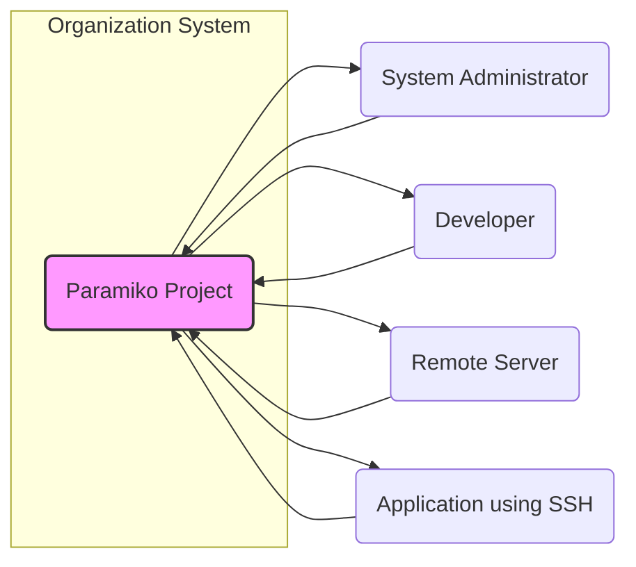
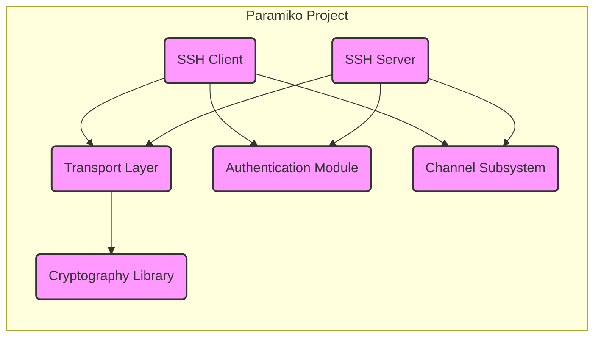
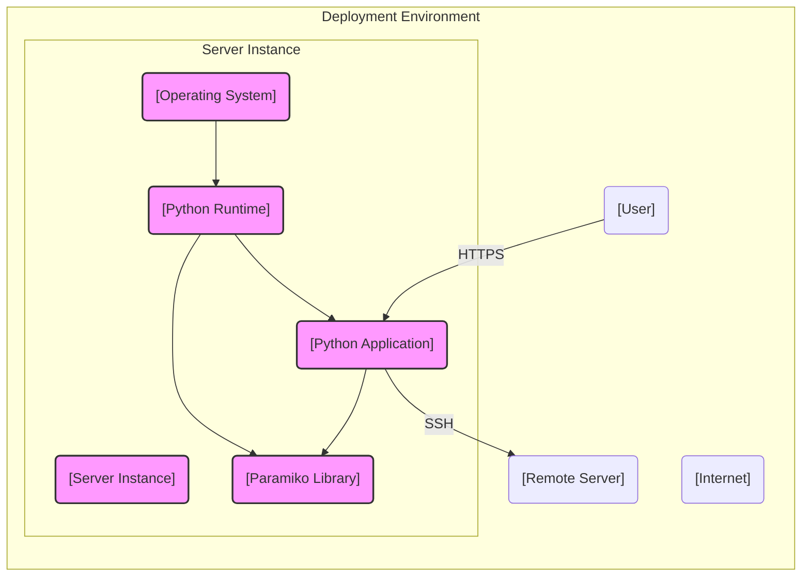
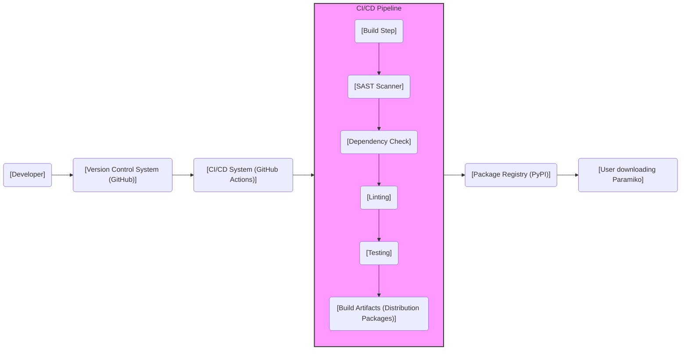

# BUSINESS POSTURE

Paramiko is a Python implementation of the SSHv2 protocol, providing both client and server functionality. It enables secure communication between systems, primarily used for remote access, file transfer, and automation tasks.

- Business priorities and goals:
  - Enable secure remote system administration and management.
  - Facilitate secure data transfer between systems.
  - Provide a robust and reliable SSH library for Python applications.
  - Support automation workflows requiring secure remote execution.
  - Offer an open-source and community-driven solution for SSH in Python.

- Most important business risks:
  - Vulnerabilities in Paramiko could lead to unauthorized access to systems relying on it.
  - Compromise of Paramiko could result in data breaches and loss of confidentiality, integrity, and availability.
  - Bugs or instability in Paramiko could disrupt critical business operations that depend on SSH for remote management or data transfer.
  - Supply chain attacks targeting Paramiko's dependencies or build process could introduce malicious code.
  - Lack of timely security updates and patches could leave systems vulnerable to known exploits.

# SECURITY POSTURE

- Security controls:
  - security control: Usage of SSHv2 protocol, inherently providing encryption and authentication for communication. (Implemented by design of Paramiko library)
  - security control: Publicly available source code on GitHub, allowing for community review and vulnerability identification. (Described in GitHub repository)
  - security control: Active community and maintainers addressing reported issues and security vulnerabilities. (Observed in GitHub repository issue tracker and commit history)
  - security control: Use of cryptography libraries for secure key exchange, encryption, and hashing. (Implemented within Paramiko library, details in source code)
  - security control: Input validation and sanitization to prevent command injection and other input-based vulnerabilities. (Implemented within Paramiko library, details in source code)

- Accepted risks:
  - accepted risk: Reliance on external cryptography libraries, which may have their own vulnerabilities.
  - accepted risk: Potential for vulnerabilities to be discovered in Paramiko code despite community review.
  - accepted risk: Users may misconfigure or misuse Paramiko, leading to security weaknesses in their applications.
  - accepted risk:  Delay between vulnerability disclosure and user adoption of patched versions.

- Recommended security controls:
  - security control: Implement automated Static Application Security Testing (SAST) in the CI/CD pipeline to identify potential vulnerabilities in code changes.
  - security control: Integrate Dependency Check tools to identify known vulnerabilities in third-party libraries used by Paramiko.
  - security control: Perform regular security audits and penetration testing to proactively identify and address security weaknesses.
  - security control: Provide security guidelines and best practices documentation for users to ensure secure integration and usage of Paramiko.
  - security control: Implement a clear vulnerability disclosure and response process.

- Security requirements:
  - Authentication:
    - Requirement: Support for various SSH authentication methods, including password-based, public key-based, and keyboard-interactive authentication.
    - Requirement: Secure handling and storage of private keys and passwords (within user applications using Paramiko, as Paramiko itself does not store credentials).
    - Requirement: Protection against brute-force attacks on authentication mechanisms.
  - Authorization:
    - Requirement:  Paramiko itself does not handle authorization directly, but should provide mechanisms for users to implement authorization checks within their applications using Paramiko (e.g., based on successful authentication and user roles).
    - Requirement:  Ensure that users of Paramiko can restrict access to resources based on authentication and authorization policies.
  - Input validation:
    - Requirement:  Strict validation of all input data received from remote systems to prevent command injection, path traversal, and other input-based attacks.
    - Requirement:  Sanitization of input data before processing or using it in commands or file operations.
  - Cryptography:
    - Requirement:  Use strong and up-to-date cryptographic algorithms and libraries for encryption, key exchange, and hashing.
    - Requirement:  Proper handling of cryptographic keys, ensuring secure generation, storage, and usage.
    - Requirement:  Protection against cryptographic attacks, such as man-in-the-middle attacks and replay attacks.
    - Requirement:  Regularly review and update cryptographic algorithms and libraries to address known vulnerabilities and maintain security best practices.

# DESIGN

## C4 CONTEXT

- Context Diagram Elements:
  - Element:
    - Name: Paramiko Project
    - Type: Software System
    - Description: Python implementation of the SSHv2 protocol, providing client and server functionalities for secure remote communication.
    - Responsibilities:
      - Implementing SSH protocol functionalities (client and server).
      - Providing API for Python developers to use SSH in their applications.
      - Handling secure communication, including encryption, authentication, and key exchange.
    - Security controls:
      - security control: Implementation of SSHv2 protocol security features.
      - security control: Input validation and sanitization within the library.
      - security control: Use of secure cryptography libraries.

  - Element:
    - Name: System Administrator
    - Type: User
    - Description: Individuals responsible for managing and maintaining remote systems.
    - Responsibilities:
      - Using Paramiko (directly or indirectly through tools) to remotely access and manage servers.
      - Configuring and securing remote systems.
      - Monitoring system health and performance.
    - Security controls:
      - security control: Strong password management or SSH key management.
      - security control: Multi-factor authentication where applicable.
      - security control: Access control lists on remote servers.

  - Element:
    - Name: Developer
    - Type: User
    - Description: Software developers who integrate Paramiko into their Python applications.
    - Responsibilities:
      - Using Paramiko library to implement secure communication features in applications.
      - Following secure coding practices when using Paramiko API.
      - Testing and debugging applications using Paramiko.
    - Security controls:
      - security control: Secure coding practices.
      - security control: Input validation in applications using Paramiko.
      - security control: Regular security testing of applications.

  - Element:
    - Name: Remote Server
    - Type: External System
    - Description: Servers that are remotely accessed and managed using SSH via Paramiko.
    - Responsibilities:
      - Running SSH server software (e.g., OpenSSH).
      - Providing access to system resources and services.
      - Enforcing access control policies.
    - Security controls:
      - security control: SSH server configuration (e.g., disabling password authentication, using strong ciphers).
      - security control: Firewall rules to restrict SSH access.
      - security control: Intrusion detection and prevention systems.

  - Element:
    - Name: Application using SSH
    - Type: External System
    - Description: Other software applications that utilize Paramiko library to establish secure SSH connections for various purposes (e.g., automation, data transfer).
    - Responsibilities:
      - Utilizing Paramiko library for secure communication.
      - Implementing application-specific logic using SSH connections.
      - Handling data exchanged over SSH connections.
    - Security controls:
      - security control: Secure coding practices in the application.
      - security control: Input validation and output encoding in the application.
      - security control: Application-level authentication and authorization.

## C4 CONTAINER

- Container Diagram Elements:
  - Element:
    - Name: SSH Client
    - Type: Software Container
    - Description: Component responsible for implementing SSH client functionality, allowing users and applications to connect to remote SSH servers.
    - Responsibilities:
      - Establishing SSH connections to remote servers.
      - Handling client-side authentication.
      - Managing SSH channels for data transfer and command execution.
    - Security controls:
      - security control: Secure implementation of SSH client protocol.
      - security control: Input validation of server responses.
      - security control: Secure handling of private keys.

  - Element:
    - Name: SSH Server
    - Type: Software Container
    - Description: Component responsible for implementing SSH server functionality, allowing Paramiko to act as an SSH server and accept incoming connections.
    - Responsibilities:
      - Listening for incoming SSH connection requests.
      - Handling server-side authentication.
      - Managing SSH channels for data transfer and command execution.
    - Security controls:
      - security control: Secure implementation of SSH server protocol.
      - security control: Input validation of client requests.
      - security control: Access control mechanisms for server resources.

  - Element:
    - Name: Cryptography Library
    - Type: Software Container
    - Description:  Underlying cryptography library (e.g., cryptography, PyCryptodome) used by Paramiko for cryptographic operations.
    - Responsibilities:
      - Providing cryptographic algorithms for encryption, decryption, hashing, and key exchange.
      - Ensuring secure and efficient cryptographic operations.
    - Security controls:
      - security control: Usage of well-vetted and regularly updated cryptography library.
      - security control: Secure configuration and usage of cryptographic algorithms.

  - Element:
    - Name: Transport Layer
    - Type: Software Container
    - Description: Component responsible for managing the secure transport layer of the SSH protocol, including connection establishment, encryption, and data integrity.
    - Responsibilities:
      - Establishing and maintaining secure connections.
      - Encrypting and decrypting data transmitted over SSH connections.
      - Ensuring data integrity and confidentiality.
    - Security controls:
      - security control: Implementation of secure key exchange algorithms.
      - security control: Usage of strong encryption ciphers.
      - security control: Protection against man-in-the-middle attacks.

  - Element:
    - Name: Authentication Module
    - Type: Software Container
    - Description: Component responsible for handling user authentication in both client and server roles.
    - Responsibilities:
      - Implementing various authentication methods (password, public key, keyboard-interactive).
      - Verifying user credentials.
      - Managing authentication sessions.
    - Security controls:
      - security control: Secure implementation of authentication protocols.
      - security control: Protection against brute-force attacks.
      - security control: Secure handling of authentication credentials.

  - Element:
    - Name: Channel Subsystem
    - Type: Software Container
    - Description: Component responsible for managing SSH channels, which provide multiplexed communication streams within a single SSH connection for different purposes (e.g., shell, file transfer, port forwarding).
    - Responsibilities:
      - Multiplexing and demultiplexing data streams over SSH channels.
      - Managing channel lifecycle.
      - Providing APIs for channel operations (e.g., executing commands, transferring files).
    - Security controls:
      - security control: Isolation between different SSH channels.
      - security control: Access control for channel operations.
      - security control: Prevention of channel hijacking.

## DEPLOYMENT

Paramiko is primarily a library, so its deployment is dependent on how it's used. Here are a few deployment scenarios:

- Scenario 1: Paramiko as a library in a Python application (most common).
- Scenario 2: Paramiko used in automation scripts executed on a system.
- Scenario 3: Paramiko server used to provide SSH access to a system (less common, but possible).

Let's focus on Scenario 1: Paramiko as a library in a Python application deployed on a server.

- Deployment Diagram Elements:
  - Element:
    - Name: Server Instance
    - Type: Infrastructure
    - Description: A virtual or physical server where the Python application and Paramiko library are deployed.
    - Responsibilities:
      - Providing the execution environment for the application.
      - Hosting the operating system, Python runtime, and application code.
      - Providing network connectivity.
    - Security controls:
      - security control: Server hardening (OS patching, firewall configuration).
      - security control: Intrusion detection and prevention systems.
      - security control: Regular security monitoring and logging.

  - Element:
    - Name: Operating System
    - Type: Software
    - Description: The operating system running on the server instance (e.g., Linux, Windows).
    - Responsibilities:
      - Managing system resources.
      - Providing system services.
      - Enforcing operating system-level security controls.
    - Security controls:
      - security control: OS security updates and patching.
      - security control: Access control lists and user permissions.
      - security control: Security auditing and logging.

  - Element:
    - Name: Python Runtime
    - Type: Software
    - Description: The Python interpreter and standard libraries required to run the Python application and Paramiko.
    - Responsibilities:
      - Executing Python code.
      - Providing necessary libraries and modules.
    - Security controls:
      - security control: Keeping Python runtime updated with security patches.
      - security control: Secure configuration of Python environment.

  - Element:
    - Name: Python Application
    - Type: Software
    - Description: The custom Python application that utilizes the Paramiko library for SSH functionality.
    - Responsibilities:
      - Implementing application-specific logic.
      - Using Paramiko API to establish and manage SSH connections.
      - Handling application data and user interactions.
    - Security controls:
      - security control: Secure coding practices in the application.
      - security control: Input validation and output encoding.
      - security control: Application-level authentication and authorization.

  - Element:
    - Name: Paramiko Library
    - Type: Software
    - Description: The Paramiko library itself, deployed as a dependency of the Python application.
    - Responsibilities:
      - Providing SSH client functionality to the application.
      - Handling secure SSH communication.
    - Security controls:
      - security control: Security controls inherent in Paramiko library (as described in previous sections).
      - security control: Keeping Paramiko library updated to the latest version with security patches.

  - Element:
    - Name: Internet
    - Type: Network
    - Description: The public internet, representing the external network through which users access the application and the application connects to remote servers.
    - Responsibilities:
      - Providing network connectivity.
    - Security controls:
      - security control: Network firewalls.
      - security control: Intrusion detection and prevention systems at network level.

  - Element:
    - Name: User
    - Type: User
    - Description: End-users who interact with the Python application, potentially triggering SSH connections via Paramiko indirectly.
    - Responsibilities:
      - Using the application.
      - Providing input to the application.
    - Security controls:
      - security control: User authentication to the application.
      - security control: User authorization within the application.

  - Element:
    - Name: Remote Server
    - Type: External System
    - Description: Remote servers that the Python application connects to using SSH via Paramiko.
    - Responsibilities:
      - Running SSH server software.
      - Providing services and resources to the application.
    - Security controls:
      - security control: Security controls on remote servers (as described in C4 Context section).

## BUILD

- Build Diagram Elements:
  - Element:
    - Name: Developer
    - Type: Actor
    - Description: Software developers contributing code to the Paramiko project.
    - Responsibilities:
      - Writing and committing code changes.
      - Performing local testing.
      - Addressing code review feedback.
    - Security controls:
      - security control: Developer workstations security (OS hardening, antivirus).
      - security control: Secure coding training for developers.
      - security control: Code review process.

  - Element:
    - Name: Version Control System (GitHub)
    - Type: Tool
    - Description: GitHub repository hosting the Paramiko source code and managing version control.
    - Responsibilities:
      - Storing source code and commit history.
      - Managing branches and pull requests.
      - Triggering CI/CD pipelines on code changes.
    - Security controls:
      - security control: Access control to the repository.
      - security control: Audit logging of repository activities.
      - security control: Branch protection rules.

  - Element:
    - Name: CI/CD System (GitHub Actions)
    - Type: Tool
    - Description: GitHub Actions used for automating the build, test, and release process of Paramiko.
    - Responsibilities:
      - Automating the build pipeline.
      - Running security scans and tests.
      - Publishing build artifacts.
    - Security controls:
      - security control: Secure configuration of CI/CD pipelines.
      - security control: Access control to CI/CD workflows and secrets.
      - security control: Audit logging of CI/CD activities.

  - Element:
    - Name: Build Step
    - Type: Process
    - Description: Initial step in the CI/CD pipeline, responsible for compiling code, packaging, and preparing for further checks.
    - Responsibilities:
      - Compiling Python code (if necessary, though Python is interpreted).
      - Packaging the library into distribution packages (e.g., wheels, source distributions).
    - Security controls:
      - security control: Use of trusted build environments.
      - security control: Verification of build dependencies.

  - Element:
    - Name: SAST Scanner
    - Type: Tool
    - Description: Static Application Security Testing tool integrated into the CI/CD pipeline to automatically scan the source code for potential vulnerabilities.
    - Responsibilities:
      - Identifying potential security flaws in the code without executing it.
      - Reporting identified vulnerabilities.
    - Security controls:
      - security control: Regularly updated SAST rules and vulnerability database.
      - security control: Configuration of SAST scanner to cover relevant vulnerability types.

  - Element:
    - Name: Dependency Check
    - Type: Tool
    - Description: Tool used to scan project dependencies for known vulnerabilities.
    - Responsibilities:
      - Identifying vulnerable dependencies.
      - Reporting identified vulnerabilities.
    - Security controls:
      - security control: Regularly updated vulnerability database for dependency check.
      - security control: Automated alerts for new dependency vulnerabilities.

  - Element:
    - Name: Linting
    - Type: Tool
    - Description: Code linting tools used to enforce code style and identify potential code quality issues.
    - Responsibilities:
      - Enforcing coding standards.
      - Identifying potential bugs and code smells.
    - Security controls:
      - security control: Configuration of linters to include security-related checks.

  - Element:
    - Name: Testing
    - Type: Process
    - Description: Automated testing process including unit tests, integration tests, and potentially security-specific tests.
    - Responsibilities:
      - Verifying code functionality and correctness.
      - Ensuring code quality and stability.
      - Detecting regressions.
    - Security controls:
      - security control: Inclusion of security-focused test cases.
      - security control: Regular execution of tests in CI/CD pipeline.

  - Element:
    - Name: Build Artifacts (Distribution Packages)
    - Type: Artifact
    - Description: The packaged versions of the Paramiko library (e.g., wheels, source distributions) produced by the build process.
    - Responsibilities:
      - Representing the distributable versions of Paramiko.
    - Security controls:
      - security control: Signing of build artifacts to ensure integrity and authenticity (if implemented).
      - security control: Secure storage of build artifacts before publishing.

  - Element:
    - Name: Package Registry (PyPI)
    - Type: Service
    - Description: Python Package Index (PyPI) where Paramiko distribution packages are published for public download.
    - Responsibilities:
      - Hosting and distributing Python packages.
      - Providing package download services.
    - Security controls:
      - security control: PyPI security measures (e.g., HTTPS, account security).
      - security control: Package integrity checks by users downloading from PyPI.

  - Element:
    - Name: User downloading Paramiko
    - Type: Actor
    - Description: Developers and users who download and use Paramiko library from PyPI.
    - Responsibilities:
      - Downloading and installing Paramiko.
      - Using Paramiko in their projects.
    - Security controls:
      - security control: Verification of package integrity (e.g., using checksums).
      - security control: Keeping Paramiko library updated to the latest version.

# RISK ASSESSMENT

- Critical business processes we are trying to protect:
  - Secure remote access to systems and infrastructure.
  - Secure data transfer between systems.
  - Automation workflows relying on secure remote execution.
  - Integrity and confidentiality of data transmitted via SSH.
  - Availability of systems managed by SSH.

- Data we are trying to protect and their sensitivity:
  - Authentication credentials (passwords, private keys) - Highly sensitive, compromise leads to unauthorized access.
  - Data transmitted over SSH connections - Sensitivity depends on the application, can range from low to highly sensitive (e.g., configuration data, personal data, financial data).
  - System configuration data - Sensitive, compromise can lead to system instability or vulnerabilities.
  - Logs and audit trails - Moderately sensitive, important for security monitoring and incident response.

# QUESTIONS & ASSUMPTIONS

- Questions:
  - What is the intended deployment environment for applications using Paramiko? (e.g., cloud, on-premises, specific OS)
  - Are there any specific compliance requirements that applications using Paramiko must adhere to? (e.g., PCI DSS, HIPAA, GDPR)
  - What is the expected volume of SSH connections and data transfer using Paramiko in typical use cases?
  - Are there any specific performance requirements for Paramiko in its intended use cases?
  - What is the process for users to report security vulnerabilities in Paramiko?

- Assumptions:
  - Assumption: Paramiko is primarily used as a client library, although server functionality exists.
  - Assumption: Users of Paramiko are expected to implement their own application-level security controls in addition to relying on Paramiko's security features.
  - Assumption: Security updates and patches for Paramiko are released in a timely manner by the maintainers.
  - Assumption: Users are responsible for keeping their Paramiko library updated to the latest version.
  - Assumption: The primary deployment environment is general-purpose servers running common operating systems like Linux.