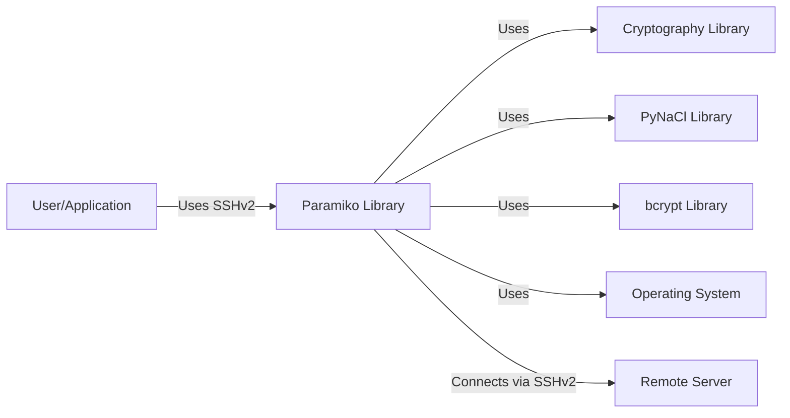
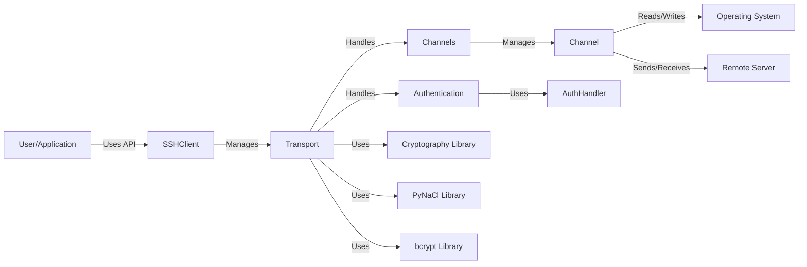

# BUSINESS POSTURE

Business Priorities and Goals:

*   Provide a stable, well-maintained, and secure Python implementation of the SSHv2 protocol for a wide range of users and applications.
*   Maintain compatibility with a variety of operating systems and Python versions.
*   Offer a user-friendly API that simplifies secure remote interactions.
*   Ensure the library is performant and reliable for use in production environments.
*   Foster a community-driven development model with contributions from external developers.

Most Important Business Risks:

*   Security vulnerabilities in the library could lead to unauthorized access to systems using Paramiko, potentially causing significant damage to users and their data.
*   Compatibility issues with different platforms or Python versions could limit the library's adoption and usefulness.
*   Performance bottlenecks could hinder the library's ability to handle large-scale deployments or high-frequency operations.
*   Lack of maintenance or slow response to bug reports could damage the library's reputation and user trust.
*   Failure to comply with relevant security standards and best practices could expose users to legal and compliance risks.

# SECURITY POSTURE

Existing Security Controls:

*   security control: Cryptographic primitives are used for secure communication (encryption, key exchange, message authentication). Implemented using cryptography library and own implementations.
*   security control: Authentication mechanisms are implemented to verify user identities (passwords, public keys). Implemented in `paramiko.auth_handler`.
*   security control: Host key verification is performed to prevent man-in-the-middle attacks. Implemented in `paramiko.client.SSHClient`.
*   security control: Regular security audits and code reviews are conducted (as evidenced by the project's history and community involvement).
*   security control: Use of linters and static analysis tools (e.g., flake8, as seen in the `.github/workflows` directory).
*   security control: Automated testing suite to identify and prevent regressions (as seen in the `tests` directory).

Accepted Risks:

*   accepted risk: Reliance on external dependencies (e.g., `cryptography`, `bcrypt`, `pynacl`) introduces potential supply chain risks.
*   accepted risk: Some older or less common cryptographic algorithms may be supported for compatibility reasons, which could pose a risk if used improperly.
*   accepted risk: The library's complexity and the nature of SSH itself mean that undiscovered vulnerabilities may exist.

Recommended Security Controls:

*   security control: Implement a formal vulnerability disclosure program to encourage responsible reporting of security issues.
*   security control: Integrate Software Composition Analysis (SCA) tools to actively monitor and manage vulnerabilities in third-party dependencies.
*   security control: Consider implementing fuzz testing to identify potential vulnerabilities in input handling.
*   security control: Provide clear documentation and guidance on secure configuration and usage of the library.

Security Requirements:

*   Authentication:
    *   Support for strong password-based authentication with appropriate hashing and salting.
    *   Support for public key authentication using various key types (RSA, ECDSA, Ed25519).
    *   Protection against brute-force attacks (e.g., rate limiting, account lockout).
    *   Secure storage and handling of private keys.
*   Authorization:
    *   Mechanisms to control access to specific commands and resources on the remote system (e.g., through server-side configuration).
    *   Integration with existing authorization systems (e.g., PAM, LDAP) where applicable.
*   Input Validation:
    *   Strict validation of all user-provided input to prevent injection attacks and other vulnerabilities.
    *   Careful handling of escape sequences and special characters.
*   Cryptography:
    *   Use of strong, well-vetted cryptographic algorithms and libraries.
    *   Secure key exchange mechanisms (e.g., Diffie-Hellman group exchange).
    *   Proper implementation of encryption and message authentication to ensure confidentiality and integrity.
    *   Regular review and updates of cryptographic implementations to address new threats and vulnerabilities.
    *   Support for modern cryptographic standards and best practices.

# DESIGN

## C4 CONTEXT

Element Descriptions:

*   Element:
    *   Name: User/Application
    *   Type: User/External System
    *   Description: Represents a user or an application that utilizes the Paramiko library to establish SSH connections.
    *   Responsibilities: Initiates SSH connections, authenticates with the remote server, executes commands, transfers files, etc.
    *   Security controls: Secure storage of credentials, proper handling of sensitive data.

*   Element:
    *   Name: Paramiko Library
    *   Type: Software System
    *   Description: The Paramiko library itself, providing a Python implementation of the SSHv2 protocol.
    *   Responsibilities: Handles SSH protocol details, manages connections, provides API for user interaction.
    *   Security controls: Host key verification, encryption, authentication mechanisms, input validation.

*   Element:
    *   Name: Cryptography Library
    *   Type: External Library
    *   Description: A library providing cryptographic primitives (e.g., `cryptography`).
    *   Responsibilities: Provides encryption, decryption, key generation, and other cryptographic functions.
    *   Security controls: Relies on the security of the underlying cryptographic library.

*   Element:
    *   Name: PyNaCl Library
    *   Type: External Library
    *   Description: Python binding to libsodium, a cryptography library.
    *   Responsibilities: Provides cryptographic primitives, particularly for Ed25519 signatures.
    *   Security controls: Relies on the security of the underlying cryptographic library (libsodium).

*   Element:
    *   Name: bcrypt Library
    *   Type: External Library
    *   Description: Library for password hashing using the bcrypt algorithm.
    *   Responsibilities: Securely hashes passwords for storage and verification.
    *   Security controls: Relies on the security of the bcrypt algorithm and its implementation.

*   Element:
    *   Name: OS
    *   Type: Operating System
    *   Description: The underlying operating system on which Paramiko runs.
    *   Responsibilities: Provides network sockets, file system access, and other system resources.
    *   Security controls: OS-level security features (firewall, user permissions, etc.).

*   Element:
    *   Name: Remote Server
    *   Type: External System
    *   Description: The remote server to which Paramiko connects via SSH.
    *   Responsibilities: Runs an SSH server, authenticates clients, executes commands, manages resources.
    *   Security controls: SSH server configuration, user authentication, access controls, firewall.

## C4 CONTAINER

Element Descriptions:

*   Element:
    *   Name: User/Application
    *   Type: User/External System
    *   Description: Represents a user or an application that utilizes the Paramiko library.
    *   Responsibilities: Initiates SSH connections, interacts with the `SSHClient`.
    *   Security controls: Secure storage of credentials, proper handling of sensitive data.

*   Element:
    *   Name: SSHClient
    *   Type: Container (Class)
    *   Description: High-level interface for interacting with an SSH server.
    *   Responsibilities: Provides methods for connecting, authenticating, executing commands, transferring files.
    *   Security controls: Host key verification, configuration of security parameters.

*   Element:
    *   Name: Transport
    *   Type: Container (Class)
    *   Description: Represents an SSH transport connection.
    *   Responsibilities: Manages the underlying SSH connection, encryption, key exchange, packet handling.
    *   Security controls: Encryption, key exchange, MAC (Message Authentication Code).

*   Element:
    *   Name: Authentication
    *   Type: Container (Module)
    *   Description: Handles user authentication.
    *   Responsibilities: Manages authentication methods (password, public key), interacts with `AuthHandler`.
    *   Security controls: Secure handling of credentials, protection against brute-force attacks.

*   Element:
    *   Name: AuthHandler
    *   Type: Container (Class)
    *   Description: Processes authentication requests.
    *   Responsibilities: Implements specific authentication methods.
    *   Security controls: Secure implementation of authentication protocols.

*   Element:
    *   Name: Channels
    *   Type: Container (Module)
    *   Description: Manages SSH channels.
    *   Responsibilities: Provides an interface for interacting with different channel types (session, direct-tcpip, etc.).
    *   Security controls: Channel isolation, proper handling of channel requests.

*   Element:
    *   Name: Channel
    *   Type: Container (Class)
    *   Description: Represents a single SSH channel.
    *   Responsibilities: Handles communication with the remote server over a specific channel.
    *   Security controls: Input validation, proper handling of data received from the remote server.

*   Element:
    *   Name: Cryptography Library
    *   Type: External Library
    *   Description: A library providing cryptographic primitives.
    *   Responsibilities: Provides encryption, decryption, key generation, and other cryptographic functions.
    *   Security controls: Relies on the security of the underlying cryptographic library.

*   Element:
    *   Name: PyNaCl Library
    *   Type: External Library
    *   Description: Python binding to libsodium, a cryptography library.
    *   Responsibilities: Provides cryptographic primitives, particularly for Ed25519 signatures.
    *   Security controls: Relies on the security of the underlying cryptographic library (libsodium).

*   Element:
    *   Name: bcrypt Library
    *   Type: External Library
    *   Description: Library for password hashing using the bcrypt algorithm.
    *   Responsibilities: Securely hashes passwords for storage and verification.
    *   Security controls: Relies on the security of the bcrypt algorithm and its implementation.

*   Element:
    *   Name: OS
    *   Type: Operating System
    *   Description: The underlying operating system.
    *   Responsibilities: Provides network sockets, file system access.
    *   Security controls: OS-level security features.

*   Element:
    *   Name: Remote Server
    *   Type: External System
    *   Description: The remote server to which Paramiko connects.
    *   Responsibilities: Runs an SSH server, authenticates clients, executes commands.
    *   Security controls: SSH server configuration, user authentication, access controls.

## DEPLOYMENT

Possible Deployment Solutions:

1.  Installation via `pip` (most common).
2.  Manual installation from source.
3.  Bundling within a larger application.
4.  Deployment as part of a containerized environment (e.g., Docker).

Chosen Solution (Detailed Description): Installation via `pip`

```mermaid
graph LR
    Developer["Developer"] -- "Commits code" --> GitHub["GitHub Repository"]
    GitHub -- "Triggers" --> CI["CI/CD Pipeline"]
    CI -- "Builds package" --> Artifacts["Build Artifacts (Wheel/Source Distribution)"]
    Artifacts -- "Published to" --> PyPI["PyPI (Python Package Index)"]
    UserSystem["User System"] -- "pip install paramiko" --> PyPI
    PyPI -- "Downloads package" --> UserSystem
    UserSystem -- "Installs" --> PythonEnvironment["Python Environment"]

```

Element Descriptions:

*   Element:
    *   Name: Developer
    *   Type: Person
    *   Description: A developer working on the Paramiko library.
    *   Responsibilities: Writes code, tests, documentation.
    *   Security controls: Code reviews, secure coding practices.

*   Element:
    *   Name: GitHub Repository
    *   Type: Source Code Repository
    *   Description: The Git repository hosted on GitHub.
    *   Responsibilities: Stores the source code, tracks changes, manages releases.
    *   Security controls: Access controls, branch protection rules.

*   Element:
    *   Name: CI/CD Pipeline
    *   Type: Automated Process
    *   Description: Continuous Integration and Continuous Delivery pipeline (e.g., GitHub Actions).
    *   Responsibilities: Runs tests, builds packages, publishes releases.
    *   Security controls: Secure configuration of the CI/CD pipeline, use of secrets management.

*   Element:
    *   Name: Build Artifacts (Wheel/Source Distribution)
    *   Type: Software Artifact
    *   Description: The packaged Paramiko library ready for distribution.
    *   Responsibilities: Contains the compiled code and necessary metadata.
    *   Security controls: Code signing (optional), integrity checks.

*   Element:
    *   Name: PyPI (Python Package Index)
    *   Type: Package Repository
    *   Description: The central repository for Python packages.
    *   Responsibilities: Stores and distributes Python packages.
    *   Security controls: PyPI security measures, package signing (optional).

*   Element:
    *   Name: User System
    *   Type: User Environment
    *   Description: The system where Paramiko will be installed.
    *   Responsibilities: Runs the `pip install` command.
    *   Security controls: User permissions, secure network connection.

*   Element:
    *   Name: Python Environment
    *   Type: Runtime Environment
    *   Description: The Python environment where Paramiko will be used.
    *   Responsibilities: Executes the Paramiko code.
    *   Security controls: Virtual environment isolation (optional).

## BUILD

```mermaid
graph LR
    Developer["Developer"] -- "Commits code" --> GitHub["GitHub Repository"]
    GitHub -- "Push event" --> GitHubActions["GitHub Actions"]
    GitHubActions -- "Checkout code" --> Checkout["Checkout Code"]
    Checkout -- "Next" --> SetupPython["Setup Python"]
    SetupPython -- "Next" --> InstallDeps["Install Dependencies"]
    InstallDeps -- "Next" --> Lint["Lint (flake8)"]
    Lint -- "Next" --> Test["Run Tests (pytest)"]
    Test -- "Next" --> Build["Build Package (wheel, sdist)"]
    Build -- "Next" --> Publish["Publish to PyPI (on tag)"]

```

Build Process Description:

1.  **Code Commit:** A developer commits code changes to the Paramiko repository on GitHub.
2.  **GitHub Actions Trigger:** A push event to the repository triggers the GitHub Actions workflow.
3.  **Checkout Code:** The workflow checks out the latest code from the repository.
4.  **Setup Python:** The workflow sets up the appropriate Python environment.
5.  **Install Dependencies:** The workflow installs the necessary dependencies for building and testing Paramiko (specified in `requirements.txt`, `setup.py`, etc.).
6.  **Lint:** The workflow runs a linter (flake8) to check for code style and potential errors.  This is a security control.
7.  **Test:** The workflow runs the test suite (using pytest) to ensure that the code functions correctly and that no regressions have been introduced. This is a security control.
8.  **Build Package:** If the tests pass, the workflow builds the Paramiko package into a wheel and source distribution.
9.  **Publish to PyPI:** If the build is triggered by a tag (indicating a new release), the workflow publishes the package to PyPI.

Security Controls in Build Process:

*   **Linters (flake8):** Enforce code style and identify potential errors, reducing the risk of vulnerabilities.
*   **Automated Testing (pytest):** Ensures code quality and helps prevent regressions, reducing the likelihood of introducing new vulnerabilities.
*   **Dependency Management:** Dependencies are explicitly defined, allowing for tracking and auditing.  SCA tools should be used to monitor these.
*   **GitHub Actions:** Provides a controlled and auditable build environment.
*   **PyPI Publishing:** Requires authentication and authorization, preventing unauthorized releases.

# RISK ASSESSMENT

Critical Business Processes to Protect:

*   Secure remote access to systems: Paramiko is used to access and manage remote systems, so ensuring its security is critical to preventing unauthorized access.
*   Automated tasks and workflows: Many users rely on Paramiko for automating tasks, so its reliability and stability are essential.
*   Data transfer: Paramiko is used for transferring files securely, so protecting the confidentiality and integrity of this data is important.

Data to Protect and Sensitivity:

*   **Credentials (passwords, private keys):** Highly sensitive. Must be protected at rest and in transit. Compromise could lead to unauthorized access to systems.
*   **Host keys:** Moderately sensitive. Used to verify the identity of remote servers. Compromise could lead to man-in-the-middle attacks.
*   **Data transmitted over SSH:** Sensitivity varies depending on the specific data being transferred. Could range from non-sensitive to highly confidential.
*   **Configuration data:** Moderately sensitive. Could reveal information about the system and its security configuration.
*   **Source code:** Moderately sensitive. Could contain vulnerabilities that could be exploited.

# QUESTIONS & ASSUMPTIONS

Questions:

*   Are there any specific compliance requirements (e.g., FIPS 140-2) that Paramiko needs to meet?
*   What is the expected scale of usage (number of users, connections, etc.)?
*   Are there any specific performance requirements or constraints?
*   What are the specific threat models or attack scenarios that are of greatest concern?
*   What level of support is provided for older versions of Python and operating systems?
*   What is the process for handling security vulnerabilities reported by external researchers?
*   Is there a code signing process in place for releases?

Assumptions:

*   BUSINESS POSTURE: The primary goal is to provide a secure and reliable SSH library for Python.
*   BUSINESS POSTURE: The project prioritizes security and stability over adding new features.
*   SECURITY POSTURE: Users are responsible for securely managing their own credentials.
*   SECURITY POSTURE: Users are expected to follow best practices for secure SSH configuration.
*   SECURITY POSTURE: The project relies on the security of its external dependencies.
*   DESIGN: The library is primarily used in environments where Python is already installed.
*   DESIGN: The most common deployment method is via `pip`.
*   DESIGN: The build process is automated using GitHub Actions.