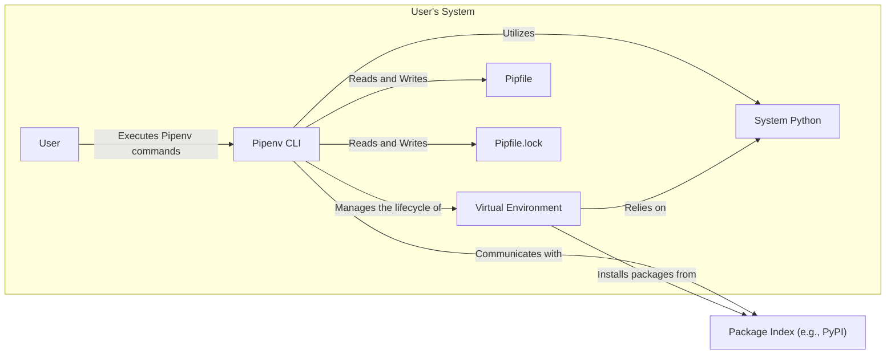

## Project Design Document: Pipenv (Improved)

**1. Introduction**

This document provides an enhanced architectural overview of the Pipenv project, a widely used Python packaging tool. It is designed to serve as a robust foundation for subsequent threat modeling exercises by offering a clear and detailed description of the system's components, data flows, and interactions. The focus remains on core functionalities and architectural elements that are pertinent to security considerations.

**2. Goals and Objectives**

The primary goals of Pipenv are to:

*   Significantly simplify the process of managing Python project dependencies.
*   Automate the creation and management of isolated virtual environments for projects.
*   Promote reproducible software builds through the utilization of `Pipfile` and `Pipfile.lock`.
*   Offer a user-friendly command-line interface (CLI) for common packaging-related tasks.
*   Enhance the security posture of Python projects by encouraging the use of locked dependency versions.

**3. System Architecture**

Pipenv functions as a command-line interface that interacts with various resources within the user's system and external services. The fundamental components and their interactions are visually represented below:

**3.1. Detailed Component Descriptions:**

*   **User:** The individual who interacts with the Pipenv tool through the command-line interface to manage project dependencies and environments.
*   **Pipenv CLI:** The core executable (`pipenv`) that interprets user commands, orchestrates various packaging operations, and manages the interaction between different components.
*   **Virtual Environment:** An isolated and self-contained Python environment, typically created and managed using tools like `virtualenv` or Python's built-in `venv` module. This isolation prevents dependency conflicts between projects.
*   **System Python:** The base Python installation present on the user's operating system. Pipenv leverages this installation to create and manage virtual environments.
*   **Pipfile:** A TOML-formatted file that explicitly declares the project's direct dependencies, categorized as either default or development dependencies. It also allows for specifying Python version requirements and source repositories.
*   **Pipfile.lock:** A JSON-formatted file that contains a snapshot of the exact versions of all dependencies (including transitive dependencies) installed in the virtual environment, along with their cryptographic hashes. This ensures reproducible builds across different environments.
*   **Package Index (e.g., PyPI):** A remote repository (by default, the Python Package Index - PyPI) that hosts Python packages available for download and installation. Pipenv interacts with this index to resolve and retrieve project dependencies.

**4. Data Flow and Interactions (Detailed)**

The following outlines the data flow for common Pipenv operations, providing a more granular view:

*   **Initializing a New Project:**
    *   The User executes a command like `pipenv install`.
    *   The Pipenv CLI checks for the existence of a `Pipfile` in the project directory.
        *   If a `Pipfile` is not found, Pipenv creates a new one with basic structure.
    *   Pipenv then attempts to locate or create a virtual environment for the project.
        *   If a virtual environment doesn't exist, Pipenv creates one, typically within the project directory or a designated location.
    *   If specific packages are included in the `pipenv install` command, Pipenv proceeds to resolve these dependencies.
        *   Dependency resolution involves querying the configured Package Index to find the specified packages and their dependencies.
        *   Resolved packages are downloaded from the Package Index.
        *   Downloaded packages are installed into the newly created or existing virtual environment.
    *   Finally, Pipenv generates or updates the `Pipfile.lock` file.
        *   This involves recording the exact versions and cryptographic hashes of all installed packages and their dependencies.

*   **Installing New Dependencies:**
    *   The User executes a command such as `pipenv install <package_name>`.
    *   The Pipenv CLI updates the `Pipfile` by adding the newly specified dependency to the appropriate section (default or development).
    *   Pipenv initiates the dependency resolution process.
        *   It queries the configured Package Index to find the specified package and its transitive dependencies, respecting any version constraints.
        *   Resolved packages are downloaded from the Package Index.
        *   Downloaded packages are installed into the active virtual environment.
    *   The `Pipfile.lock` file is then updated to reflect the newly installed packages and their exact versions and hashes.

*   **Synchronizing the Environment from `Pipfile.lock`:**
    *   The User executes the `pipenv sync` command.
    *   The Pipenv CLI reads the contents of the `Pipfile.lock` file.
    *   Pipenv proceeds to install the exact versions of packages specified in the `Pipfile.lock` file into the virtual environment.
        *   It verifies the integrity of downloaded packages using the cryptographic hashes stored in `Pipfile.lock`.
        *   This ensures that the environment is precisely the same as the one described in the lock file, promoting reproducibility.

*   **Executing Commands within the Virtual Environment:**
    *   The User executes a command using the `pipenv run <command>` syntax.
    *   The Pipenv CLI activates the project's virtual environment.
    *   The specified `<command>` is then executed within the context of the activated virtual environment, ensuring that it uses the project's dependencies.

*   **Updating Existing Dependencies:**
    *   The User executes a command like `pipenv update <package_name>`.
    *   The Pipenv CLI attempts to update the specified package to the latest compatible version, while respecting any version specifiers defined in the `Pipfile`.
    *   Pipenv performs dependency resolution to find compatible versions of the package and its dependencies.
    *   The updated packages are downloaded and installed into the virtual environment.
    *   The `Pipfile.lock` file is updated to reflect the new versions and hashes of the updated packages and their dependencies.

**5. Security Considerations (Enhanced)**

The following security aspects are critical to consider when analyzing Pipenv's design and operation for potential threats:

*   **Dependency Resolution and Supply Chain Risks:**
    *   Pipenv's reliance on external package indexes like PyPI introduces inherent supply chain risks.
        *   **Threat:** Malicious actors could upload packages containing malware to PyPI, potentially with names similar to legitimate packages (typosquatting).
        *   **Threat:** Attackers could compromise legitimate packages on PyPI by injecting malicious code.
        *   **Mitigation:** `Pipfile.lock` significantly reduces the window of opportunity for installing compromised packages by pinning exact versions and providing cryptographic hashes for verification.
        *   **Mitigation:** Users should be cautious about installing packages from untrusted sources or with suspicious activity.
        *   **Mitigation:** Consider using tools that perform security scanning of dependencies for known vulnerabilities.
    *   **Dependency Confusion Attacks:**
        *   **Threat:** Attackers could publish packages with the same name as internal, private packages, potentially leading to the unintentional installation of the malicious public package.
        *   **Mitigation:** Configuring Pipenv to prioritize private package indexes or using namespace packages can help mitigate this risk.

*   **Virtual Environment Security:**
    *   While virtual environments provide isolation, they are not a security sandbox.
        *   **Threat:** Vulnerabilities within packages installed in the virtual environment could still be exploited if the application running within the environment has access to sensitive resources.
        *   **Mitigation:** Regularly update dependencies to patch known vulnerabilities.
        *   **Mitigation:** Follow security best practices within the application code itself.

*   **Integrity of `Pipfile` and `Pipfile.lock`:**
    *   These files are crucial for maintaining a consistent and secure environment.
        *   **Threat:** If an attacker gains write access to the project repository, they could modify `Pipfile` or `Pipfile.lock` to introduce malicious dependencies.
        *   **Mitigation:** Secure storage and version control (e.g., using Git) of these files are essential. Code review processes should also scrutinize changes to these files.

*   **User Permissions and Privilege Escalation:**
    *   Pipenv operations often involve creating directories and installing software.
        *   **Threat:** Running Pipenv commands with excessive privileges (e.g., `sudo`) could lead to unintended system-wide changes or security vulnerabilities if a malicious package executes code during installation.
        *   **Mitigation:** Avoid running Pipenv with elevated privileges unless absolutely necessary.

*   **Configuration and Trust in Package Indexes:**
    *   Pipenv allows users to configure alternative package indexes.
        *   **Threat:** Using untrusted or compromised package indexes significantly increases the risk of installing malicious packages.
        *   **Mitigation:** Stick to trusted and well-maintained package indexes like the official PyPI. If using private indexes, ensure their security.

*   **Security of Executed Commands (`pipenv run`):**
    *   The `pipenv run` command executes arbitrary commands within the virtual environment.
        *   **Threat:** If the command being executed is derived from untrusted input or is itself malicious, it could compromise the virtual environment or the system.
        *   **Mitigation:** Exercise caution when using `pipenv run` with commands from untrusted sources.

**6. Deployment and Usage Patterns**

Pipenv is typically installed using `pip` or package managers like `brew` (on macOS). Its primary usage involves command-line interaction within a project directory.

*   **Installation:** `pip install pipenv`
*   **Initializing a Project:** Navigating to the project directory and executing `pipenv install`.
*   **Managing Dependencies:** Utilizing commands such as `pipenv install <package>`, `pipenv uninstall <package>`, and `pipenv update`.
*   **Executing Project Code:** Running scripts and applications within the virtual environment using `pipenv run python <script.py>`.

**7. Operational Considerations**

*   **Regular Updates:** Keeping Pipenv itself updated is crucial to benefit from bug fixes, performance improvements, and security patches in the tool itself.
*   **Dependency Maintenance:** Regularly reviewing and updating project dependencies is a vital security practice to address known vulnerabilities in the packages your project relies on.
*   **Logging and Error Handling:** Understanding Pipenv's logging mechanisms and error messages is important for diagnosing issues, including potential security-related problems.

**8. Future Considerations and Potential Security Enhancements**

*   **Direct Integration with Vulnerability Scanning Tools:** Future versions of Pipenv could potentially offer seamless integration with vulnerability scanning tools, allowing developers to proactively identify and address known vulnerabilities in their project's dependencies during the development process.
*   **Enhanced Package Integrity Verification:** Strengthening the mechanisms for verifying the authenticity and integrity of downloaded packages beyond basic hash checking, potentially incorporating signature verification or other advanced techniques.
*   **Improved Security-Focused Error Reporting:** Providing more explicit and actionable feedback to users when Pipenv detects potential security risks, such as attempts to install packages with known vulnerabilities or from untrusted sources.
*   **Support for Software Bills of Materials (SBOMs):** Generating SBOMs to provide a comprehensive inventory of project dependencies, aiding in vulnerability management and supply chain security analysis.

This improved document provides a more detailed and nuanced understanding of the Pipenv project's architecture and functionalities, with a strong emphasis on security considerations. It serves as a more robust foundation for conducting thorough threat modeling activities.
