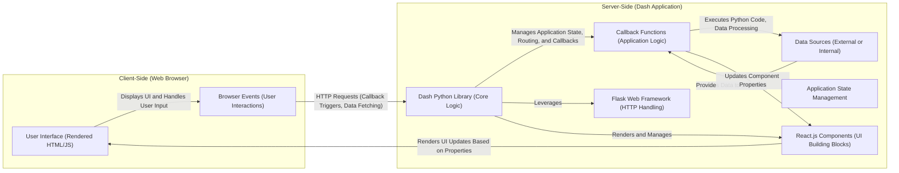

# Project Design Document: Dash by Plotly (Improved)

**1. Introduction**

This document provides an enhanced design overview of Dash, an open-source Python library for creating interactive web applications. It delves into the architectural components, data flow mechanisms, and crucial security considerations necessary for effective threat modeling. The aim is to offer a precise and comprehensive understanding of Dash's structure and functionality from a security-conscious perspective.

**2. Goals and Objectives**

*   Deliver a refined and more detailed architectural blueprint of the Dash framework.
*   Provide in-depth descriptions of the key components within a Dash application and their intricate interactions.
*   Illustrate the data flow within a Dash application with greater clarity and precision.
*   Emphasize potential security vulnerabilities and attack vectors relevant for thorough threat modeling.
*   Serve as a robust and informative foundation for subsequent threat modeling exercises.

**3. Architectural Overview**

Dash applications operate through a combination of client-side (browser-based) and server-side (application logic) elements. The fundamental architecture can be visualized as follows:

**4. Detailed Component Description**

*   **Client-Side (Web Browser):**
    *   **User Interface (Rendered HTML/JS):** This is the visual representation of the Dash application within the user's web browser, constructed from HTML, CSS, and JavaScript. It's dynamically updated based on server-side logic.
    *   **Browser Events (User Interactions):**  Represents user actions within the browser, such as clicks, form submissions, keyboard input, and mouse movements. These events trigger actions within the Dash application.

*   **Server-Side (Dash Application):**
    *   **Dash Python Library (Core Logic):**  The central component providing the high-level Python API for building Dash applications. It orchestrates communication, manages application state, handles routing, and executes callbacks.
    *   **Flask Web Framework (HTTP Handling):** Dash relies on Flask to manage HTTP requests and responses. Flask provides the underlying web server infrastructure for the application.
    *   **React.js Components (UI Building Blocks):**  Dash utilizes React.js for rendering and managing the user interface components. Dash components are Python wrappers around React components, allowing UI definition in Python.
    *   **Callback Functions (Application Logic):**  Python functions that define the interactive behavior of the application. They are triggered by changes in specific component properties (inputs) and execute server-side code to update other component properties (outputs).
    *   **Application State Management:** Dash manages the application's state, which represents the current data and configuration of the UI. This state is typically held on the server and synchronized with the client.
    *   **Data Sources (External or Internal):** Dash applications can connect to various data sources, including databases, APIs, files, or in-memory data structures, to retrieve and display information.

**5. Data Flow (Detailed)**

The data flow within a Dash application involves a series of interactions between the client and server:

1. **User Initiates Interaction:** A user interacts with a UI component in the browser (e.g., types in an input field, selects an item from a dropdown).
2. **Browser Event Triggered:** The user interaction triggers a corresponding event in the web browser.
3. **HTTP Request Sent to Server:** The Dash front-end (JavaScript) sends an HTTP request to the Dash server. This request typically targets a specific endpoint associated with a callback and includes information about the triggering event and the current state of relevant components.
4. **Request Routing and Callback Identification:** The Flask web framework routes the incoming request. The Dash Python library identifies the appropriate callback function to execute based on the input and output dependencies defined in the application's layout.
5. **Callback Function Execution:** The identified Python callback function is executed on the server. This function can perform actions such as:
    *   Accessing and processing data from data sources.
    *   Performing calculations or transformations.
    *   Updating the application's state.
6. **Component Property Updates Determined:** The callback function returns values that correspond to the properties of one or more output components.
7. **HTTP Response Sent to Client:** The Dash server sends an HTTP response back to the client's browser. This response contains the updated component property values, typically in JSON format.
8. **UI Update on Client-Side:** The Dash front-end (React.js) receives the HTTP response and updates the properties of the corresponding UI components in the browser.
9. **Browser Renders Updated UI:** The browser re-renders the affected UI components based on the new property values, reflecting the changes to the user.

**6. Key Components and Their Interactions (Expanded)**

*   **Dash Layout (HTML-like Structure):** Defines the initial structure and composition of the application's user interface using a hierarchical tree of Dash components. This layout is typically defined in Python code.
*   **Dash Core Components (Interactive UI Elements):** A library of pre-built, interactive UI components like buttons, dropdowns, sliders, graphs, and tables. These components encapsulate both the front-end rendering and the back-end interaction logic.
*   **Dash HTML Components (Direct HTML Elements):** Allows developers to incorporate standard HTML elements directly into the Dash layout, providing flexibility for customization and integration with existing HTML structures.
*   **Callbacks (Wiring Interactivity):** The core mechanism for defining the dynamic behavior of the application. Callbacks establish reactive relationships between component properties:
    *   **Inputs:** Specify which component properties trigger the callback function when their values change.
    *   **State (Non-Triggering Inputs):**  Optional component properties whose current values are passed to the callback function but do not trigger its execution.
    *   **Outputs:** Define which component properties will be updated by the return value of the callback function.
*   **Dash Server (Flask Application Instance):** The underlying Flask application that hosts the Dash application, handles incoming HTTP requests, manages routing, and executes callbacks.
*   **Component Properties (Data Binding):** Attributes of Dash components that define their appearance, behavior, and data. These properties serve as the primary communication channel between the client-side UI and the server-side logic.

**7. Security Considerations for Threat Modeling (Enhanced)**

When conducting threat modeling for a Dash application, consider these specific vulnerabilities and attack vectors:

*   **Client-Side Vulnerabilities:**
    *   **Cross-Site Scripting (XSS):**  Improper sanitization of user inputs or data retrieved from external sources before rendering in the UI can allow attackers to inject malicious scripts that execute in other users' browsers. *Example: Displaying unsanitized user comments containing `<script>` tags.*
    *   **Client-Side Data Manipulation:** Attackers might attempt to modify component properties or data directly in the browser's developer tools or by intercepting network requests, potentially bypassing server-side validation. *Example: Changing the value of a hidden input field to gain unauthorized access.*
    *   **Dependency Vulnerabilities:**  Outdated or vulnerable JavaScript libraries used by Dash or custom components can be exploited by attackers. *Example: A known security flaw in a specific version of a charting library.*

*   **Server-Side Vulnerabilities:**
    *   **Callback Injection:** Maliciously crafted input data sent to callback functions could exploit vulnerabilities in the server-side code. *Example: Sending specially formatted data to a callback that performs database queries without proper input validation, leading to SQL injection.*
    *   **Authentication and Authorization Flaws:** Weak or missing authentication mechanisms can allow unauthorized users to access the application. Inadequate authorization controls can permit authenticated users to access resources or perform actions they shouldn't. *Example: Lack of multi-factor authentication or relying solely on client-side checks for authorization.*
    *   **State Management Security Issues:** If application state is not securely managed (e.g., storing sensitive data in client-side storage or using predictable session identifiers), attackers might be able to manipulate it for malicious purposes. *Example: Tampering with session cookies to impersonate other users.*
    *   **Data Source Security Weaknesses:** Vulnerabilities in the connection to or handling of data sources can be exploited. This includes SQL injection, NoSQL injection, and insecure API interactions. *Example: Using unsanitized user input in a database query.*
    *   **Denial of Service (DoS) Attacks:** Attackers might attempt to overload the server with a large number of requests, making the application unavailable to legitimate users. *Example: Sending a flood of requests to callback endpoints.*
    *   **Cross-Site Request Forgery (CSRF):**  Lack of CSRF protection can allow attackers to trick authenticated users into making unintended requests on the application. *Example: Embedding a malicious link in an email that, when clicked by an authenticated user, performs an unauthorized action.*
    *   **Secrets Management Failures:** Improper storage or handling of sensitive information like API keys, database credentials, and encryption keys can lead to their exposure. *Example: Hardcoding API keys directly in the application code.*
    *   **Server-Side Dependency Vulnerabilities:**  Vulnerabilities in the Python libraries used by the Dash application (including Dash itself, Flask, and other dependencies) can be exploited. *Example: A known security vulnerability in a specific version of the Flask framework.*

*   **Communication Channel Security:**
    *   **Lack of HTTPS:**  If communication between the client and server is not encrypted using HTTPS, sensitive data transmitted between them can be intercepted by attackers. *Example: User credentials or personal information being sent over an unencrypted connection.*

**8. Deployment Considerations (Security Focused)**

The security of a Dash application is significantly influenced by its deployment environment. Consider these security aspects:

*   **Deployment Platform Security:**  The security features and configurations of the chosen deployment platform (e.g., AWS, Azure, GCP, Heroku) are crucial. This includes access control, network security groups, and vulnerability scanning.
*   **Web Server Configuration Hardening:**  Properly configuring the underlying web server (e.g., Gunicorn, uWSGI) with security best practices is essential. This includes setting appropriate timeouts, limiting request sizes, and disabling unnecessary features.
*   **Network Security Measures:** Implementing firewalls, intrusion detection/prevention systems, and network segmentation can help protect the application from unauthorized access and attacks.
*   **Secure Secrets Management in Deployment:**  Utilizing secure methods for managing secrets (e.g., environment variables, dedicated secrets management services like HashiCorp Vault) is critical to prevent exposure of sensitive credentials.
*   **Regular Security Audits and Penetration Testing:**  Conducting periodic security audits and penetration tests can help identify vulnerabilities in the deployed application and infrastructure.
*   **Monitoring and Logging for Security Events:** Implementing robust monitoring and logging mechanisms is essential for detecting and responding to security incidents. Logs should include relevant security events, such as authentication attempts, authorization failures, and suspicious activity.
*   **Container Security (if using containers):**  If deploying with containers (e.g., Docker), ensure that container images are built securely, regularly scanned for vulnerabilities, and properly configured.

**9. Future Considerations (Security Implications)**

As Dash continues to evolve, new features and functionalities may introduce novel security challenges. Future threat modeling efforts should consider:

*   **Security Implications of New Component Types:**  The introduction of new Dash components might introduce new attack surfaces or require specific security considerations.
*   **Security of Advanced Callback Patterns:**  More complex callback mechanisms or patterns could potentially introduce new vulnerabilities if not designed and implemented securely.
*   **Security Considerations for Integrations:**  Integrating Dash with other frameworks, libraries, or external services might introduce new security dependencies and potential attack vectors.
*   **Impact of Client-Side Rendering Enhancements:** Changes in how Dash handles client-side rendering might introduce new XSS risks or other client-side vulnerabilities.

This enhanced design document provides a more detailed and security-focused understanding of the Dash architecture, serving as a valuable resource for comprehensive threat modeling activities. By carefully considering the components, data flow, and potential vulnerabilities outlined here, developers and security professionals can build and maintain more secure Dash applications.
