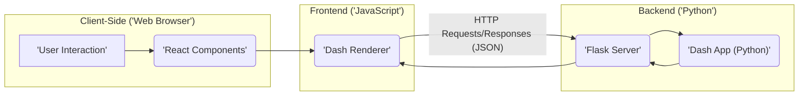
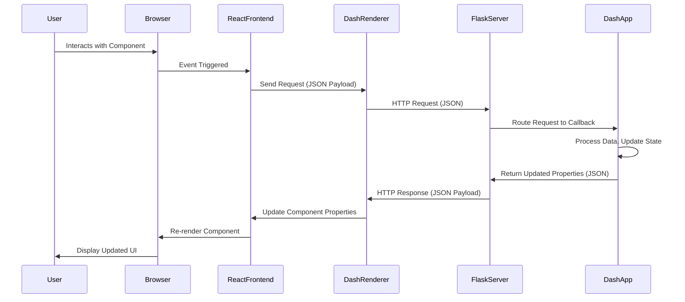

# Project Design Document: Plotly Dash

**Version:** 1.1
**Date:** October 26, 2023
**Author:** AI Software Architect

## 1. Introduction

This document provides an enhanced architectural design of the Plotly Dash framework, building upon the previous version. It offers a more detailed exploration of the key components, their interactions, data flow, and deployment considerations, with a stronger emphasis on security aspects relevant for threat modeling.

## 2. Goals and Objectives

The primary goal remains to provide a clear and comprehensive architectural overview of the Plotly Dash framework, specifically tailored for threat modeling. The enhanced objectives are to:

*   Provide a more granular description of the core components of the Dash framework and their sub-components.
*   Elaborate on the interactions and data flow between these components, including data formats and protocols.
*   Detail common deployment architectures for Dash applications, highlighting security implications for each.
*   Identify key areas relevant for security considerations and threat modeling with more specific examples and context.

## 3. High-Level Architecture

Dash applications maintain a client-server architecture. The core components and their interactions are visualized below:

## 4. Detailed Component Breakdown

### 4.1. Dash App (Python)

*   **Description:** The central part of a Dash application, developed in Python. It defines the application's structure, behavior, and data handling.
*   **Key Responsibilities:**
    *   **Layout Definition:** Structuring the application's UI using Dash Core Components (DCC), HTML components, and potentially custom React components.
    *   **Callback Implementation:** Defining functions that react to user interactions or component property changes, updating the application's state.
    *   **Data Handling:** Fetching, processing, and transforming data from various sources (databases, APIs, files, in-memory data structures).
    *   **State Management (Implicit):** While Dash's state management is largely implicit through callback outputs, the Python code manages the server-side aspect of this state.
*   **Security Considerations:**
    *   **Injection Vulnerabilities:** Susceptible to injection attacks (e.g., SQL injection, command injection) if data fetching or processing logic doesn't properly sanitize inputs or outputs.
    *   **Sensitive Data Exposure:** Potential for accidentally exposing sensitive information within the application code (e.g., API keys, database credentials).
    *   **Insecure Deserialization:** If the application handles serialized data, vulnerabilities related to insecure deserialization could arise.
    *   **Callback Logic Flaws:**  Improperly implemented callback logic can lead to security vulnerabilities, such as allowing unauthorized data access or manipulation.

### 4.2. Flask Server

*   **Description:** Dash relies on Flask, a Python micro web framework, to provide the underlying web server functionality.
*   **Key Responsibilities:**
    *   **Request Handling:** Receiving and processing HTTP requests from the Dash Renderer.
    *   **Routing:** Directing incoming requests to the appropriate Dash application logic based on defined routes.
    *   **Response Generation:** Constructing and sending HTTP responses back to the client, typically in JSON format.
    *   **Static Asset Serving:** Serving static files like CSS, JavaScript, and images.
    *   **Session Management (Optional):**  Can be configured to manage user sessions using Flask's session management capabilities.
*   **Security Considerations:**
    *   **Standard Web Vulnerabilities:** Inherits common web server vulnerabilities like Cross-Site Scripting (XSS) if responses aren't properly sanitized, and Cross-Site Request Forgery (CSRF) if not protected.
    *   **Flask Configuration Issues:** Misconfigurations in the Flask server can introduce security risks.
    *   **Dependency Vulnerabilities:** Vulnerabilities in Flask itself or its dependencies can be exploited.
    *   **Session Hijacking:** If session management is enabled, vulnerabilities related to session fixation or session hijacking need to be considered.

### 4.3. React.js Frontend

*   **Description:** The user interface of Dash applications is built using React components, providing a dynamic and interactive user experience.
*   **Key Responsibilities:**
    *   **UI Rendering:** Rendering the application's visual elements based on data received from the backend.
    *   **User Interaction Handling:** Capturing and processing user interactions (e.g., clicks, form submissions, input changes).
    *   **Request Initiation:** Sending requests to the backend via the Dash Renderer in response to user actions or component lifecycle events.
    *   **Client-Side State Management (Limited):** While most state is managed on the server, some client-side state might exist for UI-specific interactions.
*   **Security Considerations:**
    *   **DOM-based XSS:** Vulnerable to DOM-based XSS if data received from the backend is not properly sanitized before being used to manipulate the DOM.
    *   **Exposure of Client-Side Logic:** While not a direct vulnerability, sensitive logic implemented in the frontend can be inspected by users.
    *   **Third-Party Component Vulnerabilities:**  Security vulnerabilities in third-party React component libraries used in the application.

### 4.4. Dash Renderer

*   **Description:** A JavaScript library that acts as the communication bridge between the React frontend and the Flask backend.
*   **Key Responsibilities:**
    *   **Request Construction:** Building and sending HTTP requests (typically AJAX calls) to the Flask server, including necessary data about user interactions or component updates.
    *   **Response Processing:** Receiving and parsing responses from the server, usually in JSON format.
    *   **Component Update:** Updating the properties of React components based on the data received from the server, triggering re-renders.
    *   **Client-Side State Management (Coordination):**  Plays a role in coordinating the client-side representation of the application's state with the server-side state.
*   **Security Considerations:**
    *   **Request Tampering:** Potential for malicious actors to intercept and modify requests sent to the server.
    *   **Response Manipulation:** Although harder to achieve, vulnerabilities in the Dash Renderer itself could potentially allow manipulation of server responses before they reach the React components.
    *   **Information Disclosure:**  If not handled carefully, the Dash Renderer could potentially expose internal application state or sensitive information on the client-side.

### 4.5. Web Browser

*   **Description:** The client-side environment where the user interacts with the Dash application.
*   **Key Responsibilities:**
    *   **Rendering:** Interpreting and displaying HTML, CSS, and JavaScript code.
    *   **JavaScript Execution:** Running the JavaScript code of the React frontend and the Dash Renderer.
    *   **HTTP Communication:** Sending HTTP requests to the server and receiving responses.
*   **Security Considerations:**
    *   **Browser Vulnerabilities:**  Inherent security vulnerabilities in the user's web browser.
    *   **Exposure to Malicious Scripts:** If the Dash application is vulnerable to XSS, the browser can execute malicious scripts injected into the page.

## 5. Data Flow

The data flow in a Dash application typically follows these steps, with data often exchanged in JSON format:

1. **User Interaction:** A user interacts with a UI element in the web browser (e.g., clicks a button, enters text).
2. **Frontend Event Handling:** The corresponding React component captures the user interaction event.
3. **Request Initiation (Dash Renderer):** The Dash Renderer constructs an HTTP request, packaging relevant information (e.g., the ID of the component that triggered the interaction, the new value of a property) into the request body (usually as JSON).
4. **HTTP Request to Backend:** The Dash Renderer sends the HTTP request to the Flask server.
5. **Request Routing (Flask):** The Flask server receives the request and routes it to the appropriate callback function defined in the Dash App based on the request's URL and data.
6. **Callback Execution (Dash App):** The designated callback function in the Dash App executes. This might involve:
    *   Accessing and processing data.
    *   Performing calculations or logic.
    *   Updating the application's state (implicitly by returning new property values).
7. **Response Generation (Dash App & Flask):** The callback function returns updated component properties. The Flask server packages these updates into an HTTP response, typically in JSON format.
8. **HTTP Response to Frontend:** The Flask server sends the HTTP response back to the Dash Renderer.
9. **Response Processing (Dash Renderer):** The Dash Renderer receives the response and parses the JSON data containing the updated component properties.
10. **Component Update (React):** The Dash Renderer updates the properties of the corresponding React components with the new values.
11. **UI Re-rendering (React & Browser):** The React components re-render based on the updated properties, and the browser displays the updated UI to the user.

## 6. Deployment Architecture

Dash applications can be deployed in various configurations, each with its own security implications:

*   **Standalone Deployment (Single Server):**
    *   **Components:** A single server instance running the Flask application (often using a WSGI server like Gunicorn or uWSGI).
    *   **Security Considerations:**  Crucial to harden the server operating system and the WSGI server. Securely configure TLS/SSL. Vulnerable if the single point of failure is compromised.
*   **Deployment with a Reverse Proxy (e.g., Nginx, Apache):**
    *   **Components:** A reverse proxy server handling incoming requests and forwarding them to one or more backend servers running the Dash application.
    *   **Security Considerations:** The reverse proxy can provide benefits like TLS termination, request filtering, and protection against some types of attacks (e.g., DDoS). Secure configuration of the reverse proxy is essential.
*   **Containerized Deployment (e.g., Docker, Kubernetes):**
    *   **Components:** Dash application packaged in containers, orchestrated by a platform like Kubernetes.
    *   **Security Considerations:**  Focus on container security (image scanning, vulnerability management), secure orchestration platform configuration (RBAC, network policies), and secure communication between containers.
*   **Cloud Platform Deployment (e.g., AWS, Google Cloud, Azure):**
    *   **Components:** Utilizing cloud services like virtual machines, containers, serverless functions, and load balancers.
    *   **Security Considerations:** Leverage cloud provider security features (firewalls, IAM, security groups). Securely configure cloud services and manage access controls. Adhere to cloud security best practices.

## 7. Security Considerations (Detailed)

This section expands on the initial security considerations, providing more context and examples:

*   **Input Validation and Sanitization:**
    *   **Backend:**  Thoroughly validate and sanitize all user inputs received by callback functions to prevent injection attacks (e.g., use parameterized queries for database interactions, escape HTML entities to prevent XSS).
    *   **Frontend:** While backend validation is primary, implement client-side validation for a better user experience and to catch simple errors. However, never rely solely on client-side validation for security.
*   **Authentication and Authorization:**
    *   Implement robust authentication mechanisms to verify user identities (e.g., username/password, OAuth 2.0).
    *   Enforce authorization policies to control access to specific features and data based on user roles or permissions. Dash integrates well with Flask's authentication extensions.
*   **Cross-Site Scripting (XSS) Prevention:**
    *   **Output Encoding:**  Ensure that data rendered in the React frontend is properly encoded to prevent the execution of malicious scripts. Dash's component rendering helps with this, but developers need to be mindful when rendering raw HTML.
    *   **Content Security Policy (CSP):** Implement a strong CSP to control the sources from which the browser is allowed to load resources, mitigating the impact of XSS attacks.
*   **Cross-Site Request Forgery (CSRF) Protection:**
    *   Utilize CSRF protection mechanisms provided by Flask (e.g., using `flask-wtf` and generating CSRF tokens) to prevent malicious requests originating from other websites.
*   **Data Security (In Transit and At Rest):**
    *   **HTTPS:** Enforce HTTPS to encrypt communication between the client and the server, protecting data in transit.
    *   **Encryption at Rest:** Encrypt sensitive data stored in databases or files.
*   **Session Management Security:**
    *   Use secure session cookies with the `HttpOnly` and `Secure` flags set.
    *   Implement session timeouts and consider mechanisms for invalidating sessions.
*   **Dependency Management:**
    *   Regularly update all dependencies (Python packages, JavaScript libraries) to patch known security vulnerabilities. Use tools like `pipenv check` or `npm audit`.
*   **Error Handling and Logging:**
    *   Implement secure error handling to avoid exposing sensitive information in error messages.
    *   Log relevant security events (authentication attempts, authorization failures, suspicious activity) for monitoring and auditing. Ensure logs are stored securely.
*   **Rate Limiting and DoS Protection:**
    *   Implement rate limiting to prevent abuse and denial-of-service attacks. This can be done at the reverse proxy or application level.
*   **API Security (If Applicable):**
    *   If the Dash application interacts with external APIs, ensure secure API key management, proper authentication and authorization for API calls, and validation of API responses.

## 8. Assumptions and Constraints

*   This document assumes a standard implementation of a Dash application without significant modifications to the core framework's architecture.
*   Specific security implementations will vary based on the application's specific requirements, data sensitivity, and deployment environment.
*   The focus is on providing an architectural overview for threat modeling, not on providing specific code-level security solutions.

## 9. Future Considerations

*   Detailed threat modeling exercises based on this design document to identify specific vulnerabilities and attack vectors.
*   Evaluation of specific security tools and techniques that can be integrated with Dash applications.
*   Consideration of performance implications of implemented security measures.
*   Regular review and updates to this design document to reflect changes in the application's architecture or security landscape.