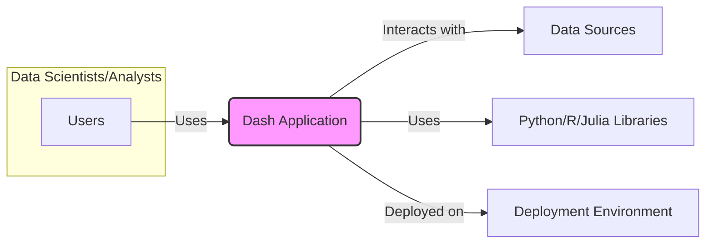

# BUSINESS POSTURE

- Business Priorities and Goals:
 - Enable data scientists and analysts to easily build and deploy interactive web applications for data visualization and analysis without extensive web development expertise.
 - Provide a framework that supports multiple programming languages (Python, R, Julia, Javascript) to cater to a broad range of data professionals.
 - Foster a vibrant community and ecosystem around Dash, encouraging contributions and extensions.
 - Offer a flexible and customizable platform that can be adapted to various data analysis and presentation needs.
 - Streamline the process of sharing data insights and analytical results through web-based dashboards.

- Most Important Business Risks:
 - Security vulnerabilities in Dash components or user-developed applications could lead to data breaches or unauthorized access to sensitive information.
 - Lack of scalability could hinder adoption by larger organizations or for applications with high user traffic.
 - Dependence on open-source components introduces supply chain risks and potential vulnerabilities.
 - Complexity in deployment and maintenance could increase operational costs and reduce user adoption.
 - Incompatibility issues between different Dash components or versions could disrupt application functionality and user experience.

# SECURITY POSTURE

- Existing Security Controls:
 - security control: Secure Software Development Lifecycle (SSDLC) - assumed to be in place for Dash development, including code reviews and testing, although specific details are not provided in the repository.
 - security control: Dependency Management - using `requirements.txt` and similar files to manage project dependencies, which allows for tracking and potentially auditing dependencies.
 - security control: Input Validation - Dash framework likely incorporates some level of default input validation to prevent common web vulnerabilities, although the extent and configurability are not explicitly documented in the repository.
 - security control: HTTPS support - Dash applications are typically deployed over HTTPS, ensuring encryption of data in transit.
 - accepted risk: Reliance on user-developed application security - Dash framework provides the building blocks, but the security of the final application heavily depends on the developer's practices and implementation.
 - accepted risk: Open-source nature - vulnerabilities might be publicly disclosed before patches are available, requiring users to be proactive in updating.

- Recommended Security Controls:
 - security control: Implement automated security scanning (SAST/DAST) in the CI/CD pipeline for Dash framework development to identify and address vulnerabilities early.
 - security control: Conduct regular penetration testing and security audits of the Dash framework and example applications to proactively discover and remediate security weaknesses.
 - security control: Provide comprehensive security documentation and best practices for Dash application developers, covering topics like authentication, authorization, input validation, and secure coding practices.
 - security control: Establish a clear vulnerability disclosure and response process for the Dash framework to handle security issues effectively and transparently.
 - security control: Implement dependency scanning and vulnerability monitoring for all third-party libraries used by Dash to mitigate supply chain risks.

- Security Requirements:
 - Authentication:
  - Requirement: Dash applications should support various authentication mechanisms to verify user identities, such as username/password, OAuth 2.0, or SAML.
  - Requirement: Authentication mechanisms should be configurable and adaptable to different organizational security policies.
 - Authorization:
  - Requirement: Dash applications should implement fine-grained authorization controls to manage user access to specific data, features, and functionalities based on roles or permissions.
  - Requirement: Authorization policies should be clearly defined, easily manageable, and auditable.
 - Input Validation:
  - Requirement: Dash framework must provide robust input validation mechanisms to prevent injection attacks (e.g., SQL injection, cross-site scripting) and ensure data integrity.
  - Requirement: Input validation should be applied to all user inputs, including form data, URL parameters, and API requests.
 - Cryptography:
  - Requirement: Dash framework should support the use of cryptography for protecting sensitive data at rest and in transit.
  - Requirement: Secure storage and handling of cryptographic keys and secrets should be ensured.
  - Requirement: Dash applications should encourage and facilitate the use of HTTPS for all communication.

# DESIGN

## C4 CONTEXT



- Elements of Context Diagram:
 - - Name: Users
   - Type: Person
   - Description: Data scientists, analysts, and other professionals who use Dash applications to visualize and analyze data.
   - Responsibilities: Interact with Dash applications to explore data, generate insights, and create reports.
   - Security controls: Authentication to access Dash applications, authorization to access specific data and functionalities within applications, secure access to user devices.
 - - Name: Dash Application
   - Type: Software System
   - Description: Web applications built using the Dash framework for data visualization and analysis.
   - Responsibilities: Provide interactive dashboards and visualizations, process user requests, retrieve data from data sources, and present results to users.
   - Security controls: Input validation, authorization, session management, secure communication (HTTPS), protection against common web vulnerabilities, logging and monitoring.
 - - Name: Data Sources
   - Type: External System
   - Description: Databases, APIs, files, or other systems where the data used by Dash applications is stored.
   - Responsibilities: Store and provide data to Dash applications upon request.
   - Security controls: Access control lists (ACLs), database authentication, API authentication, encryption at rest and in transit, data loss prevention (DLP).
 - - Name: Python/R/Julia Libraries
   - Type: External System
   - Description: Libraries and packages in Python, R, and Julia ecosystems used by Dash framework and Dash applications for data processing, visualization, and other functionalities.
   - Responsibilities: Provide functionalities for data manipulation, visualization, and application development.
   - Security controls: Dependency scanning, vulnerability monitoring, secure supply chain management for library dependencies.
 - - Name: Deployment Environment
   - Type: Infrastructure
   - Description: Cloud platforms, on-premises servers, or other infrastructure where Dash applications are deployed and run.
   - Responsibilities: Host and execute Dash applications, provide necessary resources (compute, storage, network).
   - Security controls: Infrastructure security controls (firewalls, intrusion detection/prevention systems), operating system hardening, access management, security monitoring, patching and updates.

## C4 CONTAINER

```mermaid
graph LR
    subgraph "Dash Application"
        subgraph "Backend (Python/R/Julia)"
            C[Dash Core Components]
            D[Dash HTML Components]
            E[Dash DataTable]
            F[User Application Logic]
            G[Web Framework (Flask/R Shiny)]
        end
        subgraph "Frontend (Javascript)"
            H[Dash Renderer]
            I[React Components]
            J[Browser]
        end
        G -- "Serves API endpoints" --> H
        H -- "Renders UI" --> J
        F -- "Uses" --> C
        F -- "Uses" --> D
        F -- "Uses" --> E
        F -- "Runs on" --> G
        H -- "Uses" --> I
        C -- "Provides components to" --> F
        D -- "Provides components to" --> F
        E -- "Provides components to" --> F
    end
    style C fill:#ccf,stroke:#333,stroke-width:1px
    style D fill:#ccf,stroke:#333,stroke-width:1px
    style E fill:#ccf,stroke:#333,stroke-width:1px
    style F fill:#ccf,stroke:#333,stroke-width:1px
    style G fill:#ccf,stroke:#333,stroke-width:1px
    style H fill:#ccf,stroke:#333,stroke-width:1px
    style I fill:#ccf,stroke:#333,stroke-width:1px
    style J fill:#ccf,stroke:#333,stroke-width:1px
```

- Elements of Container Diagram:
 - - Name: Dash Core Components
   - Type: Library
   - Description: Python/R/Julia library providing a set of reusable UI components (graphs, dropdowns, sliders, etc.) for building Dash applications.
   - Responsibilities: Provide pre-built UI components, handle component interactions, and manage component state.
   - Security controls: Input validation within components, secure component rendering, protection against XSS vulnerabilities in component logic.
 - - Name: Dash HTML Components
   - Type: Library
   - Description: Python/R/Julia library providing Python/R/Julia classes that correspond to HTML tags, allowing developers to structure Dash application layouts using Python/R/Julia code.
   - Responsibilities: Generate HTML structure for Dash applications, enable programmatic HTML layout creation.
   - Security controls: Output encoding to prevent XSS vulnerabilities when rendering HTML, secure handling of user-provided HTML attributes (if allowed).
 - - Name: Dash DataTable
   - Type: Library
   - Description: Python/R/Julia library providing interactive table components for displaying and manipulating tabular data in Dash applications.
   - Responsibilities: Render interactive data tables, handle table interactions (sorting, filtering, editing), and manage table data.
   - Security controls: Input validation for table data, output encoding to prevent XSS in table rendering, authorization controls for data access and manipulation within tables.
 - - Name: User Application Logic
   - Type: Code
   - Description: Python/R/Julia code written by Dash application developers that defines the application's functionality, data processing, layout, and interactions.
   - Responsibilities: Implement application-specific logic, handle user requests, interact with data sources, and define application behavior.
   - Security controls: Secure coding practices, input validation, authorization logic, secure data handling, protection against application-specific vulnerabilities.
 - - Name: Web Framework (Flask/R Shiny)
   - Type: Application Server
   - Description: Underlying web framework (typically Flask for Python, R Shiny for R) that Dash uses to handle HTTP requests, routing, and application lifecycle management.
   - Responsibilities: Serve Dash application, manage HTTP requests and responses, provide API endpoints for frontend communication, handle application deployment and execution.
   - Security controls: Web server security configuration, HTTPS enforcement, protection against common web server vulnerabilities, session management, rate limiting, security updates and patching.
 - - Name: Dash Renderer
   - Type: Javascript Library
   - Description: Javascript library running in the user's browser that renders the UI of Dash applications based on instructions from the backend.
   - Responsibilities: Render UI components, handle user interactions in the browser, communicate with the backend API, manage frontend application state.
   - Security controls: Protection against client-side vulnerabilities (XSS), secure handling of user input in the browser, secure communication with the backend (HTTPS).
 - - Name: React Components
   - Type: Javascript Library
   - Description: React components used by Dash Renderer to build the user interface.
   - Responsibilities: Provide reusable UI components for the frontend, handle component rendering and interactions.
   - Security controls: React's built-in security features (e.g., protection against XSS), secure component development practices.
 - - Name: Browser
   - Type: Application
   - Description: User's web browser used to access and interact with Dash applications.
   - Responsibilities: Render Dash application UI, execute Javascript code, send requests to the backend, display application content to the user.
   - Security controls: Browser security features (e.g., sandboxing, content security policy), user awareness of browser security settings, secure browser configuration.

## DEPLOYMENT

- Possible Deployment Solutions:
 - Cloud Platforms (AWS, Azure, GCP): Deploy Dash applications on cloud platforms using services like EC2, Azure VMs, Google Compute Engine, or container orchestration services like ECS, AKS, GKE.
 - Platform as a Service (PaaS) (Heroku, Render, PythonAnywhere): Deploy Dash applications on PaaS platforms that simplify deployment and management.
 - On-Premises Servers: Deploy Dash applications on company-managed servers in a traditional data center environment.
 - Containerized Deployment (Docker, Kubernetes): Package Dash applications in Docker containers and deploy them using container orchestration platforms like Kubernetes.

- Detailed Deployment Solution (Example: Cloud Platform - AWS ECS):

```mermaid
graph LR
    subgraph "AWS Cloud"
        subgraph "ECS Cluster"
            A[Load Balancer] -- "Forwards requests to" --> B[ECS Service]
            B -- "Runs" --> C[Dash Application Container]
            C -- "Accesses" --> D[Data Sources (e.g., RDS, S3)]
        end
        E[Internet] -- "HTTPS Requests" --> A
    end
    style A fill:#aaf,stroke:#333,stroke-width:1px
    style B fill:#aaf,stroke:#333,stroke-width:1px
    style C fill:#aaf,stroke:#333,stroke-width:1px
    style D fill:#aaf,stroke:#333,stroke-width:1px
```

- Elements of Deployment Diagram (AWS ECS Example):
 - - Name: Internet
   - Type: Network
   - Description: Public internet network through which users access the Dash application.
   - Responsibilities: Provide network connectivity for users to reach the application.
   - Security controls: DDoS protection, network firewalls at the edge.
 - - Name: Load Balancer (AWS ELB)
   - Type: Network Component
   - Description: AWS Elastic Load Balancer distributing incoming HTTPS requests across multiple Dash application containers.
   - Responsibilities: Load balancing, SSL termination, traffic routing, health checks.
   - Security controls: HTTPS enforcement, SSL/TLS configuration, security groups, access logs, DDoS protection.
 - - Name: ECS Service
   - Type: Container Orchestration Service
   - Description: AWS ECS service managing the deployment and scaling of Dash application containers.
   - Responsibilities: Container orchestration, scaling, health monitoring, service discovery.
   - Security controls: IAM roles for container access, security groups, container image security scanning, vulnerability management.
 - - Name: Dash Application Container
   - Type: Container
   - Description: Docker container running the Dash application (backend and frontend components).
   - Responsibilities: Execute Dash application code, serve API endpoints, render UI, interact with data sources.
   - Security controls: Container image security, application-level security controls (input validation, authorization), secure configuration, logging and monitoring within the container.
 - - Name: Data Sources (AWS RDS, S3)
   - Type: Data Storage Service
   - Description: AWS RDS (Relational Database Service) or S3 (Simple Storage Service) used as data sources for the Dash application.
   - Responsibilities: Store and provide data to the Dash application.
   - Security controls: Database authentication, access control lists (ACLs), encryption at rest and in transit, security groups, IAM roles for access control, data backups.

## BUILD

```mermaid
graph LR
    A[Developer] -- "Code Changes" --> B[Version Control (GitHub)]
    B -- "Push" --> C[CI/CD Pipeline (GitHub Actions)]
    C -- "Build & Test" --> D[Build Artifacts (Container Image, Packages)]
    D -- "Security Scans (SAST, Dependency Check)" --> D
    D -- "Publish" --> E[Artifact Registry (Docker Hub, PyPI)]
    E -- "Deploy" --> F[Deployment Environment]
    style C fill:#ccf,stroke:#333,stroke-width:1px
    style D fill:#ccf,stroke:#333,stroke-width:1px
    style E fill:#ccf,stroke:#333,stroke-width:1px
```

- Elements of Build Diagram:
 - - Name: Developer
   - Type: Person
   - Description: Software developer writing and modifying Dash framework or Dash application code.
   - Responsibilities: Write secure code, perform local testing, commit code changes to version control.
   - Security controls: Secure development environment, code review practices, security training.
 - - Name: Version Control (GitHub)
   - Type: Software System
   - Description: GitHub repository used for managing Dash framework or Dash application source code.
   - Responsibilities: Source code management, version control, collaboration, code review workflows.
   - Security controls: Access control, branch protection, audit logs, two-factor authentication for developers.
 - - Name: CI/CD Pipeline (GitHub Actions)
   - Type: Automation System
   - Description: GitHub Actions workflows automating the build, test, security scanning, and deployment processes.
   - Responsibilities: Automated build, testing, security checks, artifact creation, deployment orchestration.
   - Security controls: Secure pipeline configuration, access control to pipeline definitions, secret management for credentials, audit logs, security scanning tools integration.
 - - Name: Build Artifacts (Container Image, Packages)
   - Type: Digital Asset
   - Description: Output of the build process, such as Docker container images, Python packages (wheels, eggs), or Javascript bundles.
   - Responsibilities: Package application code and dependencies for deployment.
   - Security controls: Artifact signing, integrity checks, vulnerability scanning of artifacts, secure storage of artifacts.
 - - Name: Security Scans (SAST, Dependency Check)
   - Type: Security Tool
   - Description: Static Application Security Testing (SAST) tools and dependency vulnerability scanners integrated into the CI/CD pipeline.
   - Responsibilities: Identify potential security vulnerabilities in code and dependencies during the build process.
   - Security controls: Tool configuration, vulnerability reporting, integration with CI/CD pipeline for automated checks.
 - - Name: Artifact Registry (Docker Hub, PyPI)
   - Type: Software System
   - Description: Registry for storing and distributing build artifacts, such as Docker Hub for container images or PyPI for Python packages.
   - Responsibilities: Secure storage and distribution of build artifacts.
   - Security controls: Access control, vulnerability scanning of stored artifacts, secure artifact storage, audit logs.
 - - Name: Deployment Environment
   - Type: Infrastructure
   - Description: Target environment where Dash applications are deployed and run (e.g., AWS ECS, Heroku).
   - Responsibilities: Host and execute Dash applications using the built artifacts.
   - Security controls: Deployment environment security controls as described in the Deployment section.

# RISK ASSESSMENT

- Critical Business Processes:
 - Data Visualization and Reporting: Dash enables users to create interactive dashboards and reports to visualize and understand data, which is crucial for data-driven decision-making.
 - Data Analysis and Exploration: Dash facilitates data exploration and analysis by providing interactive tools and visualizations, supporting critical analytical workflows.
 - Sharing Data Insights: Dash applications are used to share data insights and analytical results with stakeholders, enabling communication and collaboration based on data.

- Data Sensitivity:
 - Data handled by Dash applications can vary widely in sensitivity depending on the use case.
 - Potentially sensitive data types include:
  - Business-critical data: Financial data, sales data, customer data, operational metrics.
  - Personally Identifiable Information (PII): User data, customer details, employee information.
  - Confidential research data: Proprietary algorithms, research findings, intellectual property.
  - Healthcare data: Patient records, medical information (if used in healthcare applications).
 - Sensitivity level depends on the context of the Dash application and the data it processes. Applications handling PII or confidential business data require higher security measures.

# QUESTIONS & ASSUMPTIONS

- Questions:
 - What specific authentication and authorization mechanisms are commonly used or recommended for Dash applications?
 - Are there built-in security features within Dash framework to address common web vulnerabilities like XSS and CSRF?
 - What are the best practices for securing Dash applications in different deployment environments (cloud, on-premises)?
 - Are there any official security guidelines or documentation provided by the Dash project?
 - What is the typical data flow and data processing pipeline within a Dash application?

- Assumptions:
 - BUSINESS POSTURE: The primary business goal is to empower data professionals to build and share data insights effectively and securely. Security is a significant concern due to the potential handling of sensitive data.
 - SECURITY POSTURE: While Dash framework likely incorporates some basic security measures, comprehensive security requires proactive implementation of security controls by Dash developers and application developers. Secure Software Development Lifecycle (SSDLC) is assumed to be a desired practice.
 - DESIGN: Dash applications follow a client-server architecture with Python/R/Julia backend and Javascript frontend. Deployment is flexible and can be adapted to various environments. Build process involves standard CI/CD practices with potential for security scanning integration.