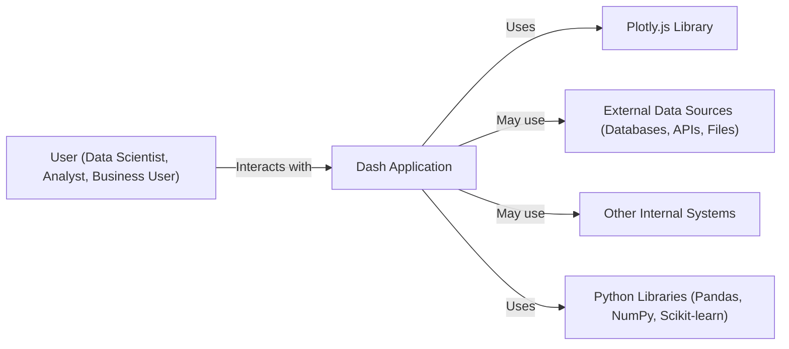
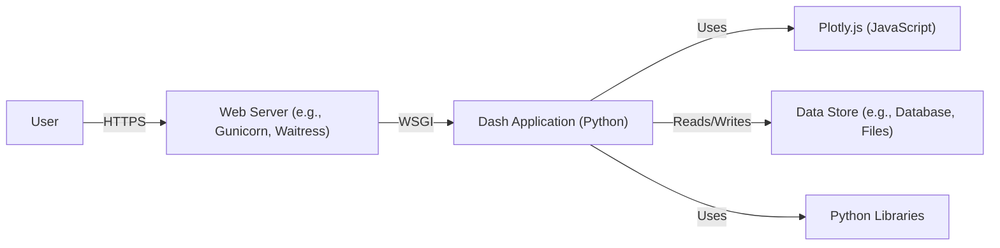
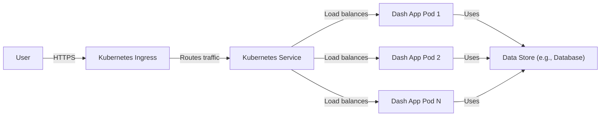
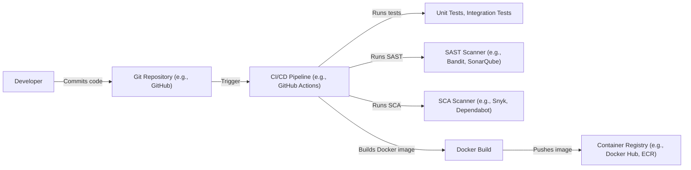

Okay, let's create a design document for the Plotly Dash project, focusing on aspects relevant for threat modeling.

# BUSINESS POSTURE

Plotly Dash is a framework for building analytical web applications without requiring advanced web development knowledge. It abstracts away much of the underlying complexity, allowing users (often data scientists or analysts) to focus on the data and the application logic.

Priorities:

*   Enable rapid development and deployment of data-driven web applications.
*   Provide a user-friendly and intuitive framework for non-web developers.
*   Offer flexibility and customization options for more advanced users.
*   Maintain a robust and reliable platform for serving applications.
*   Ensure the security of user data and applications.

Goals:

*   Become a leading framework for building analytical web applications.
*   Grow a large and active community of users and contributors.
*   Expand the capabilities of the framework to support a wider range of use cases.
*   Integrate seamlessly with other data science tools and platforms.

Business Risks:

*   Security vulnerabilities in the framework could expose user data or allow malicious actors to compromise applications.
*   Performance issues or scalability limitations could hinder the adoption of the framework for large-scale applications.
*   Lack of features or flexibility could limit the appeal of the framework to certain users.
*   Competition from other frameworks could erode market share.
*   Inadequate documentation or support could frustrate users and hinder adoption.
*   Vulnerabilities in dependencies.

# SECURITY POSTURE

Existing Security Controls:

*   security control: Dash uses Flask as its web framework, inheriting some of Flask's security features (e.g., session management, request handling). Where: Flask documentation.
*   security control: Dash encourages the use of HTTPS for secure communication. Where: Deployment documentation.
*   security control: Dash provides mechanisms for handling user authentication and authorization (e.g., through Dash Enterprise or third-party libraries). Where: Dash Enterprise documentation, community forums.
*   security control: Input validation is partially addressed through component properties, but developers are ultimately responsible for sanitizing user inputs. Where: Dash component documentation.
*   security control: Dash applications are often deployed behind reverse proxies (e.g., Nginx, Apache) that provide additional security features (e.g., SSL termination, rate limiting). Where: Deployment documentation.
*   security control: Some level of Cross-Site Scripting (XSS) protection is provided by the underlying React framework used for rendering components. Where: React documentation.

Accepted Risks:

*   accepted risk: Developers are responsible for implementing proper input validation and output encoding to prevent XSS and other injection attacks.
*   accepted risk: The security of Dash applications heavily relies on the security of the underlying dependencies (e.g., Flask, React, and other Python libraries).
*   accepted risk: The framework itself does not provide built-in protection against all types of web application vulnerabilities (e.g., CSRF, SQL injection). Developers must implement these protections themselves or use additional libraries.

Recommended Security Controls:

*   security control: Implement comprehensive input validation and output encoding for all user-supplied data.
*   security control: Use a Content Security Policy (CSP) to mitigate the risk of XSS attacks.
*   security control: Implement CSRF protection using a library like Flask-WTF or by manually generating and validating CSRF tokens.
*   security control: Regularly update all dependencies to patch known vulnerabilities.
*   security control: Use a web application firewall (WAF) to protect against common web attacks.
*   security control: Conduct regular security audits and penetration testing of Dash applications.
*   security control: Implement robust logging and monitoring to detect and respond to security incidents.
*   security control: Follow secure coding practices and guidelines (e.g., OWASP).

Security Requirements:

*   Authentication:
    *   Applications should support secure user authentication mechanisms (e.g., multi-factor authentication, strong password policies).
    *   Session management should be secure, using appropriate timeouts and protection against session hijacking.
*   Authorization:
    *   Applications should implement role-based access control (RBAC) or other appropriate authorization mechanisms to restrict access to sensitive data and functionality.
    *   Authorization checks should be performed on the server-side, not solely relying on client-side logic.
*   Input Validation:
    *   All user inputs should be validated on the server-side to ensure they conform to expected data types, formats, and lengths.
    *   Input validation should be whitelist-based, allowing only known good input rather than trying to block known bad input.
*   Cryptography:
    *   Sensitive data (e.g., passwords, API keys) should be stored securely using strong encryption algorithms.
    *   HTTPS should be used for all communication between the client and the server.
    *   Cryptographic keys should be managed securely, following best practices for key generation, storage, and rotation.
*   Output Encoding:
    *   All data rendered in the user interface should be properly encoded to prevent XSS attacks.
    *   Encoding should be context-specific, depending on where the data is being displayed (e.g., HTML, JavaScript, CSS).

# DESIGN

## C4 CONTEXT

*   Elements:
    *   Name: User
        *   Type: Person
        *   Description: A person who interacts with the Dash application through a web browser.
        *   Responsibilities: Views visualizations, interacts with controls, provides input data.
        *   Security controls: Authentication, Authorization (if implemented in the Dash app).
    *   Name: Dash Application
        *   Type: Software System
        *   Description: The web application built using the Dash framework.
        *   Responsibilities: Processes user input, generates visualizations, interacts with data sources, manages application logic.
        *   Security controls: Input validation, output encoding, authentication, authorization, session management, CSRF protection (if implemented).
    *   Name: Plotly.js Library
        *   Type: External System
        *   Description: The JavaScript library used by Dash for creating interactive visualizations.
        *   Responsibilities: Rendering charts and graphs in the web browser.
        *   Security controls: Relies on browser's security mechanisms and proper sanitization of data passed to it.
    *   Name: External Data Sources
        *   Type: External System
        *   Description: Databases, APIs, or files that provide data to the Dash application.
        *   Responsibilities: Storing and providing data.
        *   Security controls: Authentication, authorization, encryption (depending on the specific data source).
    *   Name: Other Internal Systems
        *   Type: External System
        *   Description: Other systems within the organization that the Dash application may interact with.
        *   Responsibilities: Varies depending on the specific system.
        *   Security controls: Authentication, authorization, encryption (depending on the specific system).
    *   Name: Python Libraries
        *   Type: External System
        *   Description: Python libraries used by the Dash application for data manipulation, analysis, and machine learning.
        *   Responsibilities: Providing data processing and analysis capabilities.
        *   Security controls: Relies on the security of the libraries themselves and proper handling of data within the Dash application.

## C4 CONTAINER

*   Elements:
    *   Name: User
        *   Type: Person
        *   Description: A person who interacts with the Dash application.
        *   Responsibilities: Views visualizations, interacts with controls, provides input data.
        *   Security controls: Authentication, Authorization (if implemented in the Dash app).
    *   Name: Web Server
        *   Type: Container (Web Server)
        *   Description: A web server (e.g., Gunicorn, Waitress) that hosts the Dash application.
        *   Responsibilities: Receives HTTP requests from users, forwards requests to the Dash application, serves static assets.
        *   Security controls: HTTPS configuration, request filtering, rate limiting (if configured).
    *   Name: Dash Application
        *   Type: Container (Python Application)
        *   Description: The Dash application code, written in Python.
        *   Responsibilities: Processes user input, generates visualizations, interacts with data sources, manages application logic.
        *   Security controls: Input validation, output encoding, authentication, authorization, session management, CSRF protection (if implemented).
    *   Name: Plotly.js
        *   Type: Container (JavaScript Library)
        *   Description: The Plotly.js library, running in the user's web browser.
        *   Responsibilities: Rendering charts and graphs.
        *   Security controls: Relies on browser's security mechanisms and proper sanitization of data passed to it.
    *   Name: Data Store
        *   Type: Container (Database, Files)
        *   Description: The data store used by the Dash application (e.g., a database, CSV files, cloud storage).
        *   Responsibilities: Storing and providing data.
        *   Security controls: Authentication, authorization, encryption (depending on the specific data store).
    *   Name: Python Libraries
        *   Type: Container (Libraries)
        *   Description: Python libraries used by the Dash application.
        *   Responsibilities: Providing data processing and analysis capabilities.
        *   Security controls: Relies on the security of the libraries themselves and proper handling of data.

## DEPLOYMENT

Possible deployment solutions:

1.  Cloud Platforms (AWS, Google Cloud, Azure): Using services like AWS Elastic Beanstalk, Google App Engine, or Azure App Service.
2.  Container Orchestration (Kubernetes, Docker Swarm): Deploying the Dash application as a Docker container.
3.  Virtual Machines: Deploying the application on a virtual machine (e.g., AWS EC2, Google Compute Engine, Azure Virtual Machines).
4.  On-Premise Servers: Deploying the application on a physical or virtual server within the organization's own infrastructure.

Chosen solution (for detailed description): Container Orchestration with Kubernetes.

*   Elements:
    *   Name: User
        *   Type: Person
        *   Description: A person who interacts with the Dash application.
        *   Responsibilities: Views visualizations, interacts with controls, provides input data.
        *   Security controls: Authentication, Authorization (if implemented in the Dash app).
    *   Name: Kubernetes Ingress
        *   Type: Infrastructure Node
        *   Description: An API object that manages external access to the services in a Kubernetes cluster, typically HTTP.
        *   Responsibilities: Exposes the Dash application to the outside world, handles TLS termination, routes traffic to the appropriate service.
        *   Security controls: TLS configuration, access control rules (if configured).
    *   Name: Kubernetes Service
        *   Type: Infrastructure Node
        *   Description: An abstraction which defines a logical set of Pods and a policy by which to access them.
        *   Responsibilities: Provides a stable endpoint for accessing the Dash application pods, load balances traffic across the pods.
        *   Security controls: Network policies (if configured).
    *   Name: Dash App Pod (1, 2, N)
        *   Type: Infrastructure Node
        *   Description: A Kubernetes Pod running the Dash application container.
        *   Responsibilities: Running the Dash application code.
        *   Security controls: Container security context, resource limits, network policies (if configured).
    *   Name: Data Store
        *   Type: Infrastructure Node
        *   Description: The data store used by the Dash application.
        *   Responsibilities: Storing and providing data.
        *   Security controls: Authentication, authorization, encryption (depending on the specific data store).

## BUILD

*   Process:
    1.  Developer commits code to a Git repository (e.g., GitHub).
    2.  A CI/CD pipeline (e.g., GitHub Actions, Jenkins) is triggered by the commit.
    3.  The pipeline runs unit and integration tests.
    4.  The pipeline runs a SAST (Static Application Security Testing) scanner (e.g., Bandit, SonarQube) to identify potential security vulnerabilities in the code.
    5.  The pipeline runs a SCA (Software Composition Analysis) scanner (e.g., Snyk, Dependabot) to identify vulnerabilities in dependencies.
    6.  If all tests and scans pass, the pipeline builds a Docker image for the Dash application.
    7.  The Docker image is pushed to a container registry (e.g., Docker Hub, Amazon ECR).

*   Security Controls:
    *   security control: Git repository access control: Restricting access to the code repository to authorized developers.
    *   security control: CI/CD pipeline security: Securing the CI/CD pipeline itself, ensuring that only authorized users can modify it.
    *   security control: SAST scanning: Identifying potential security vulnerabilities in the code.
    *   security control: SCA scanning: Identifying vulnerabilities in dependencies.
    *   security control: Container registry security: Authenticating and authorizing access to the container registry.
    *   security control: Image signing: Digitally signing the Docker image to ensure its integrity and authenticity.

# RISK ASSESSMENT

*   Critical Business Processes:
    *   Data visualization and analysis: The core functionality of Dash is to enable users to create and interact with data visualizations. Protecting this process is crucial.
    *   Application deployment and management: The ability to easily deploy and manage Dash applications is a key feature. Disruptions to this process could impact users.
    *   Data access and integration: Dash applications often connect to various data sources. Ensuring the security and integrity of these connections is vital.

*   Data Sensitivity:
    *   User-provided data: This can range from non-sensitive public data to highly sensitive personal or proprietary information. The sensitivity depends on the specific application.
    *   Application code: The code itself may contain sensitive information, such as API keys or database credentials.
    *   Configuration data: Configuration files may also contain sensitive information.
    *   Authentication credentials: Usernames, passwords, and other authentication tokens are highly sensitive.

# QUESTIONS & ASSUMPTIONS

*   Questions:
    *   What specific types of data will be used in Dash applications built with this framework?
    *   What are the specific security requirements of the organizations that will be using Dash?
    *   What level of security expertise can be expected from the developers who will be building Dash applications?
    *   What deployment environments will be used for Dash applications?
    *   Are there any existing security policies or guidelines that need to be followed?
    *   What are the specific authentication and authorization requirements for Dash applications?
    *   What are the regulatory compliance requirements (e.g., GDPR, HIPAA)?

*   Assumptions:
    *   Developers have a basic understanding of web application security principles.
    *   Dash applications will be deployed in a reasonably secure environment (e.g., not on a publicly accessible server without any security measures).
    *   Users will be responsible for managing their own authentication credentials securely.
    *   The underlying operating system and infrastructure will be properly secured.
    *   Regular security updates will be applied to the framework and its dependencies.
    *   Developers will follow secure coding practices.
    *   The primary use case is for internal data analysis and visualization, not for handling highly sensitive data like credit card numbers or medical records without additional, specific security measures.