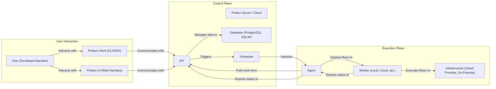
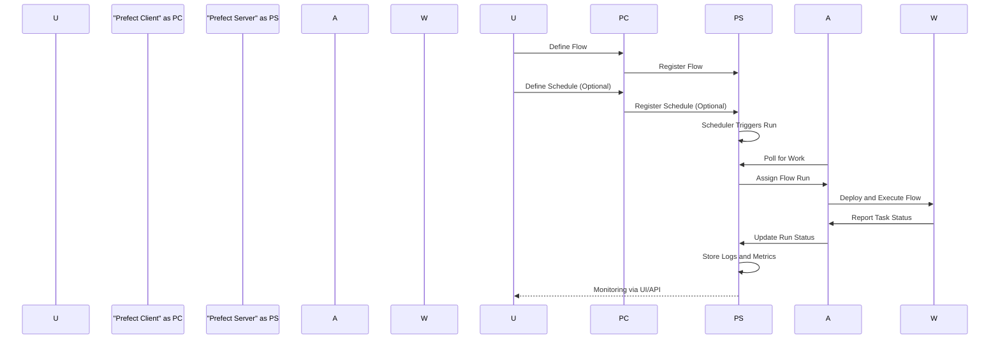

# Project Design Document: Prefect Workflow Orchestration Platform

**Version:** 1.1
**Date:** October 26, 2023
**Author:** AI Software Architect

## 1. Introduction

This document provides a detailed design overview of the Prefect workflow orchestration platform, based on the project repository found at [https://github.com/PrefectHQ/prefect](https://github.com/PrefectHQ/prefect). This document aims to clearly outline the system's architecture, components, and data flows, making it suitable for subsequent threat modeling activities. This revision incorporates minor clarifications and formatting improvements.

## 2. Goals and Objectives

The primary goals of the Prefect platform are to:

*   **Define and manage workflows (flows) as code:** Empower users to define complex, reusable workflows using Python's expressive syntax.
*   **Schedule and trigger workflow executions:** Provide flexible and reliable mechanisms to automate the execution of workflows based on time-based schedules, external events, or API calls.
*   **Monitor and observe workflow runs:** Offer comprehensive, real-time insights into the status, progress, performance, and logs of running workflows, facilitating debugging and optimization.
*   **Provide a robust and reliable execution environment:** Ensure workflows are executed reliably and idempotently, even in the face of transient failures or infrastructure issues, with built-in retry mechanisms and error handling.
*   **Offer scalability and flexibility:** Support a wide range of execution environments, from local machines to cloud-based infrastructure, and scale to handle increasing workloads and complex workflow dependencies.

## 3. High-Level Architecture

The Prefect platform employs a distributed architecture, separating the control plane from the execution plane. This separation allows for scalability and resilience.

## 4. Component Details

This section provides a more detailed breakdown of the key components within the Prefect platform and their respective functionalities.

### 4.1. User Interaction Components

*   **Prefect Client (CLI/SDK):**
    *   A command-line interface (CLI) tool and a Python Software Development Kit (SDK) that enables users to interact programmatically with the Prefect platform.
    *   Used for core operations such as defining flows as Python code, registering these flows with the Prefect Server/Cloud, triggering ad-hoc flow runs, and inspecting the status and logs of past and ongoing runs.
    *   Communicates with the Prefect Server/Cloud via its API, typically using HTTP requests.
*   **Prefect UI (Web Interface):**
    *   A graphical user interface accessible through a web browser, providing a visual way to manage and monitor workflows.
    *   Allows users to browse registered flows, schedule recurring runs, inspect detailed run information (including task statuses and logs), manage infrastructure configurations (like Agents and Workers), and view system-level metrics.
    *   Interacts with the Prefect Server/Cloud API to fetch and display data and to execute user actions.

### 4.2. Control Plane Components

*   **Prefect Server / Cloud:**
    *   The central nervous system of the Prefect platform, responsible for coordinating and managing all aspects of workflow orchestration.
    *   Stores persistent data about flows, runs, schedules, and infrastructure configurations.
    *   Manages the scheduling and triggering of flow executions based on defined schedules or external events.
    *   Provides a comprehensive API for communication with the Client, UI, and Agents.
    *   Exists in two primary forms: a self-hosted open-source version (Prefect Server) and a fully managed cloud offering (Prefect Cloud).
*   **Database (PostgreSQL, SQLite):**
    *   The persistent data store for the Prefect Server/Cloud.
    *   Holds critical information including flow definitions (code and metadata), historical run states and details, task run information, defined schedules, and infrastructure configurations (e.g., Agent details).
    *   PostgreSQL is recommended for production environments due to its robustness and scalability, while SQLite is suitable for development or smaller deployments.
*   **Scheduler:**
    *   A component within the Prefect Server/Cloud responsible for monitoring defined schedules and triggering flow runs when their execution time arrives.
    *   Evaluates schedules based on cron expressions or other scheduling mechanisms and instructs registered Agents to initiate the corresponding flow runs.
*   **API:**
    *   A well-defined Application Programming Interface that allows different components of the Prefect ecosystem to communicate with each other.
    *   Typically implemented as a RESTful API using HTTP, enabling standard communication protocols.
    *   Provides endpoints for registering flows, triggering runs, fetching run status, managing Agents, and other core functionalities.

### 4.3. Execution Plane Components

*   **Agent:**
    *   A lightweight, long-running process that acts as a bridge between the Prefect Server/Cloud and the user's execution infrastructure.
    *   Continuously polls the Prefect Server/Cloud for newly scheduled or triggered flow runs that it is eligible to execute.
    *   Upon receiving a flow run assignment, the Agent retrieves the necessary flow code and deploys it to a configured Worker for execution.
    *   Reports the status and logs of the flow run back to the Prefect Server/Cloud.
    *   Various Agent types exist to support different execution environments, such as Local Agents (executing on the same machine), Docker Agents (executing in Docker containers), and Kubernetes Agents (executing within Kubernetes clusters).
*   **Worker (Local, Cloud, etc.):**
    *   The environment where the actual Python code of the workflow (flow) is executed.
    *   Can be a local development machine, a virtual machine in a cloud provider (e.g., AWS EC2, Azure VM), a container within a Docker environment, a serverless function (e.g., AWS Lambda), or other compute resources.
    *   Receives the flow code and execution instructions from the Agent.
    *   Executes the individual tasks defined within the flow, potentially interacting with external systems, databases, or APIs.
    *   The specific type of Worker is often determined by the Agent being used and the user's infrastructure setup.
*   **Infrastructure (Cloud Provider, On-Premise):**
    *   The underlying physical or virtual infrastructure that hosts the Workers and Agents.
    *   Can be a public cloud provider (e.g., AWS, Azure, GCP), an on-premise data center, or a hybrid environment.
    *   Provides the necessary compute, storage, networking, and other resources required for the execution plane components to operate.

## 5. Data Flow

The following describes the typical sequence of data flow during a standard workflow execution within the Prefect platform.

1. **Flow Definition:** A developer uses the Prefect SDK to define a workflow as a Python function, specifying the tasks and their dependencies.
2. **Flow Registration:** The developer uses the Prefect Client to register the defined flow with the Prefect Server/Cloud. The flow's code and metadata are stored in the database.
3. **Scheduling (Optional):** The developer may define a schedule for the flow, specifying when and how often it should run. This schedule is registered with the Prefect Server/Cloud.
4. **Triggering:** When the scheduled time arrives, or an external event triggers the flow, the Scheduler within the Prefect Server/Cloud identifies the flow run to be executed.
5. **Agent Polling:** An active Agent periodically queries the Prefect Server/Cloud API to check for any pending flow runs that match its configuration (e.g., work queues).
6. **Work Assignment:** The Prefect Server/Cloud assigns the triggered flow run to an appropriate Agent based on availability and configuration.
7. **Flow Deployment and Execution:** The Agent retrieves the flow definition and any necessary execution parameters. It then deploys the flow to a configured Worker environment and initiates its execution.
8. **Task Execution and Status Updates:** The Worker executes the individual tasks within the flow. As each task progresses, the Worker reports its status (e.g., running, completed, failed) back to the Agent. The Agent, in turn, relays these updates to the Prefect Server/Cloud.
9. **Logging and Monitoring:** Throughout the flow execution, logs and metrics generated by the Worker are captured and sent back to the Prefect Server/Cloud, where they are stored and made accessible for monitoring and debugging through the UI and API.
10. **Run Completion:** Once all tasks in the flow have been executed (either successfully or with failures), the final state of the flow run is recorded in the Prefect Server/Cloud database.

## 6. Security Considerations

This section highlights key security considerations relevant to the Prefect platform. These points will serve as a foundation for subsequent threat modeling exercises.

*   **Authentication and Authorization:**
    *   **User Authentication:** How are users authenticated when accessing the Prefect UI and API? Are standard authentication mechanisms like username/password, API keys, or integration with identity providers (e.g., OAuth 2.0, SAML) supported?
    *   **Authorization:** How is access to different resources and functionalities within the platform controlled? Are there role-based access controls (RBAC) to manage permissions for viewing, creating, and managing flows, runs, and infrastructure?
    *   **Agent Authentication:** How are Agents authenticated when connecting to the Prefect Server/Cloud? Is there a mechanism to ensure only authorized Agents can pull work?
*   **Data Encryption:**
    *   **Data at Rest:** Is sensitive data stored in the Prefect Server/Cloud database encrypted? What encryption algorithms are used, and how are encryption keys managed?
    *   **Data in Transit:** Is communication between different components (e.g., Client to Server, Agent to Server, Worker to Agent) encrypted using secure protocols like TLS/HTTPS?
    *   **Secrets Management:** How are sensitive secrets (e.g., API keys, database credentials) required by flows managed and protected? Does Prefect integrate with secure secret storage solutions (e.g., HashiCorp Vault, AWS Secrets Manager)?
*   **Input Validation:**
    *   **API Input Validation:** Are inputs received through the Prefect API thoroughly validated to prevent injection attacks (e.g., SQL injection, command injection)?
    *   **Flow Definition Validation:** How are flow definitions and configurations validated to prevent malicious code or configurations from being registered and executed?
*   **Secrets Management:**
    *   **Secure Storage:** Does Prefect provide mechanisms for securely storing and retrieving secrets required by flow runs, preventing them from being hardcoded in flow definitions?
    *   **Access Control for Secrets:** Are there controls to restrict which flows or users can access specific secrets?
*   **Network Security:**
    *   **Network Segmentation:** Is the Prefect Server/Cloud infrastructure segmented from other networks to limit the impact of potential breaches?
    *   **Firewall Rules:** Are appropriate firewall rules in place to restrict network access to the Prefect Server/Cloud and database?
    *   **Agent Network Security:** How is the network security of the environment where Agents are running managed?
*   **Logging and Auditing:**
    *   **Security Event Logging:** Are security-related events (e.g., authentication attempts, authorization failures, access to sensitive data) logged and auditable?
    *   **Audit Trails:** Can actions performed within the Prefect platform be tracked back to specific users or components?
*   **Dependency Management:**
    *   **Dependency Vulnerabilities:** How are dependencies used by Prefect components and flow executions managed to mitigate the risk of using vulnerable libraries?
    *   **Supply Chain Security:** Are there measures in place to ensure the integrity and security of the software supply chain for Prefect components?
*   **Agent Security:**
    *   **Agent Integrity:** How is the integrity of Agent binaries and configurations ensured?
    *   **Resource Access Control:** Are there mechanisms to restrict the resources (e.g., network access, file system access) that Agents can access on the infrastructure where they are running?
*   **Worker Security:**
    *   **Worker Isolation:** Are there isolation mechanisms in place to prevent different flow executions from interfering with each other or accessing sensitive data from other runs?
    *   **Worker Environment Security:** How is the security of the underlying environment where Workers are executed managed and maintained?

## 7. Deployment Considerations

The security posture of a Prefect deployment can be significantly influenced by the chosen deployment model.

*   **Prefect Cloud (Managed Service):** Prefect handles the security of the control plane infrastructure, including the Server and Database. Users are primarily responsible for securing their Agents and Worker environments. This model benefits from Prefect's security expertise for the core components but requires careful configuration and management of the execution plane.
*   **Self-Hosted Prefect Server:** The user assumes full responsibility for the security of all components, including the Server, Database, Agents, and Workers. This model offers greater control but requires significant security expertise and ongoing maintenance.
*   **Hybrid Deployments:** A combination of the above, where some components (e.g., the Server) might be managed by Prefect Cloud, while others (e.g., Agents and Workers) are self-hosted. This model requires a clear understanding of the shared responsibility model for security.

## 8. Future Considerations

The Prefect platform is continuously evolving, and future developments may include:

*   **Enhanced Security Features:** Implementation of more advanced security features, such as fine-grained access control policies, improved secrets management capabilities, and integration with more security information and event management (SIEM) systems.
*   **Federated Identity Management:** Deeper integration with federated identity providers for streamlined user authentication and authorization.
*   **Improved Observability and Auditability:** Enhanced logging and auditing capabilities to provide better visibility into system activity and potential security incidents.
*   **Strengthened Supply Chain Security:** Further measures to ensure the security and integrity of dependencies and the software build process.

This document will be periodically reviewed and updated to reflect changes in the Prefect platform and evolving security best practices.