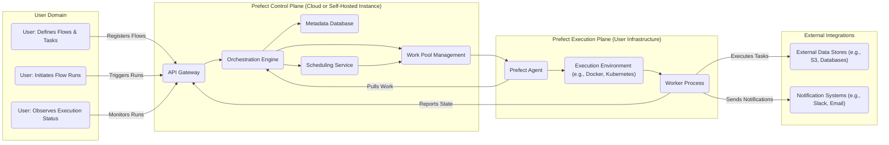
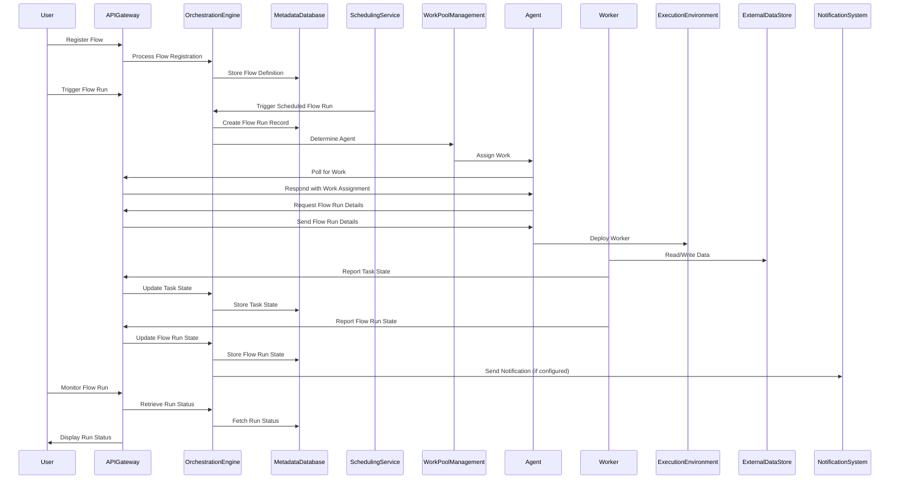

# Project Design Document: Prefect - Improved

**Version:** 1.1
**Date:** October 26, 2023
**Author:** Gemini (AI Language Model)

## 1. Introduction

This document provides an enhanced architectural design of the Prefect project, an open-source workflow orchestration platform. This improved design document aims to provide greater clarity and detail, specifically for use in subsequent threat modeling activities. It clearly outlines the key components, their interactions, data flows, and critical security considerations. This document is intended for security engineers, developers, and architects involved in the security analysis of Prefect.

## 2. Goals and Non-Goals

**Goals:**

* Present a clear and detailed architectural overview of the Prefect platform.
* Accurately identify and describe the core components and their functionalities within Prefect.
* Illustrate the key data flows and interactions between components.
* Explicitly highlight significant security considerations relevant to each component and interaction.
* Serve as a precise and comprehensive foundation for conducting thorough threat modeling exercises.

**Non-Goals:**

* Provide a line-by-line code review or detailed implementation specifics.
* Document every possible configuration parameter or edge case scenario.
* Offer exhaustive details on all potential deployment environments or infrastructure setups.
* Include performance metrics, scalability benchmarks, or capacity planning information.

## 3. Architectural Overview

Prefect employs a distributed architecture, separating the control plane responsible for orchestration from the execution plane where workflows are actually run. This separation allows for flexibility and scalability. The central control plane manages workflow definitions, scheduling, and monitoring, while distributed agents and workers handle the execution of tasks within those workflows.

## 4. Component Description

This section provides a detailed description of each key component within the Prefect architecture, focusing on their functionality and security-relevant aspects.

* **User:** Interacts with Prefect through various interfaces (UI, CLI, SDK) to define workflows, trigger executions, and monitor progress. User authentication and authorization are critical here.
* **Prefect Control Plane:** The central management hub, responsible for orchestrating and monitoring workflows. This can be either Prefect Cloud (SaaS) or a self-hosted instance.
    * **API Gateway:** The entry point for all external and internal communication with the control plane. Handles authentication, authorization, and request routing.
    * **Orchestration Engine:** The core logic responsible for managing flow run lifecycles, state transitions, and task dependencies. It interacts with the database and scheduler.
    * **Metadata Database:** Stores persistent information about flows, tasks, runs, schedules, users, and infrastructure. Data encryption at rest and in transit is crucial. Typically a PostgreSQL database.
    * **Scheduling Service:** Triggers flow runs based on defined schedules or external events. Securely manages schedule definitions and access.
    * **Work Pool Management:** Manages the available work pools and assigns flow runs to appropriate agents based on labels and configuration. Access control to work pool configurations is important.
* **Prefect Execution Plane:** The infrastructure where the actual workflow tasks are executed. Managed by the user.
    * **Prefect Agent:** A lightweight process deployed in the user's infrastructure. It polls the control plane for new work assigned to its work pool and manages the execution of flow runs. Secure communication with the control plane is essential.
    * **Worker Process:**  Responsible for executing the individual tasks within a flow run. Workers are typically spawned by the Agent. Different worker types (e.g., `SubprocessWorker`, `DockerWorker`, `KubernetesWorker`) have different security implications.
    * **Execution Environment:** The underlying infrastructure where workers operate (e.g., virtual machines, containers, serverless functions). Security of this environment is the user's responsibility.
* **External Integrations:** Services that Prefect interacts with during workflow execution.
    * **External Data Stores:**  Repositories where data is read from and written to by tasks (e.g., cloud object storage, databases, data lakes). Secure access credentials and permissions management are vital.
    * **Notification Systems:** Services used to send alerts and notifications about flow run status (e.g., Slack, email, PagerDuty). Secure configuration and authentication are necessary.

## 5. Data Flow

This section details the typical flow of data within the Prefect system during a workflow execution.

1. **Flow Registration:** A user defines a flow using the Prefect SDK and registers it with the Control Plane via the API Gateway. The flow definition (code and metadata) is stored in the Metadata Database.
2. **Flow Run Initiation:** A flow run is triggered either manually by a user via the API Gateway or automatically by the Scheduling Service.
3. **Work Assignment:** The Orchestration Engine, guided by the Work Pool Management component, determines the appropriate Agent for the flow run based on work pool configurations.
4. **Agent Polling:** The Prefect Agent periodically polls the Control Plane's API Gateway for new work assigned to its work pool. This communication should be secured (e.g., using API keys or mutual TLS).
5. **Flow Run Retrieval:** Upon receiving a work assignment, the Agent retrieves the flow run details and necessary metadata from the Control Plane's API Gateway.
6. **Worker Deployment:** The Agent deploys a Worker process within the designated Execution Environment. The method of deployment depends on the worker type (e.g., spawning a subprocess, creating a Docker container).
7. **Task Execution & Data Access:** The Worker executes the tasks defined in the flow. Tasks may involve reading data from and writing data to External Data Stores. Secure credentials management within the worker is crucial.
8. **State Reporting:** The Worker reports the state of each task and the overall flow run back to the Control Plane's API Gateway. This communication needs to be secure and authenticated.
9. **Notification Delivery:** Upon certain state transitions (e.g., flow failure, success), the Orchestration Engine may trigger notifications to be sent via configured Notification Systems.
10. **Monitoring and Observation:** Users can observe the real-time status and logs of flow runs through the API Gateway, accessing data from the Metadata Database. Authorization controls are necessary to restrict access to sensitive information.

## 6. Security Considerations

This section details critical security considerations for the Prefect project, categorized for clarity.

* **Authentication and Authorization:**
    * **User Authentication:** Securely verifying the identity of users accessing the control plane. Implement strong password policies, multi-factor authentication (MFA), and consider integration with identity providers (IdP) via protocols like OAuth 2.0 or SAML.
    * **Agent Authentication:** Agents must securely authenticate with the control plane to prevent unauthorized access and control. Utilize strong API keys, mutual TLS (mTLS), or other secure authentication mechanisms. Rotate API keys regularly.
    * **Authorization (RBAC):** Implement granular role-based access control (RBAC) to restrict user and agent access to specific resources and actions within the control plane (e.g., viewing, creating, updating, deleting flows, deployments, work pools).
    * **Worker Authentication (if applicable):** If workers need to authenticate with external resources or the control plane directly, ensure secure credential management and authentication mechanisms are in place.

* **Data Security:**
    * **Data at Rest Encryption:** Encrypt sensitive data stored in the Metadata Database using encryption at rest features provided by the database (e.g., Transparent Data Encryption - TDE).
    * **Data in Transit Encryption:** Enforce encryption for all communication channels between components using TLS/HTTPS. This includes communication between users and the API Gateway, agents and the API Gateway, and internal communication within the control plane.
    * **Secrets Management:** Securely manage and store sensitive credentials (API keys, database passwords, cloud provider credentials) used by flows and agents. Integrate with dedicated secrets management solutions (e.g., HashiCorp Vault, AWS Secrets Manager, Azure Key Vault). Avoid storing secrets directly in flow code or environment variables.
    * **Input Validation:** Implement robust input validation on all data received by the control plane and agents to prevent injection attacks (e.g., SQL injection, command injection). Sanitize user-provided data and flow definitions.

* **Network Security:**
    * **Network Segmentation:** Isolate the control plane and execution plane networks to limit the blast radius of potential security breaches. Use firewalls and network policies to restrict communication between segments.
    * **Firewall Rules:** Configure firewalls to allow only necessary network traffic to and from the control plane and agents. Restrict access to management ports and services.
    * **Secure Communication Channels:** Ensure all communication channels between components are encrypted using TLS/HTTPS. Consider using VPNs or private network connections for communication between the control plane and user-managed infrastructure.

* **Agent and Worker Security:**
    * **Secure Agent Deployment:** Follow security best practices when deploying agents in user infrastructure. Minimize the agent's attack surface and ensure it runs with the least necessary privileges. Regularly update agent software.
    * **Worker Isolation:** Isolate worker processes from each other and the host system to prevent cross-contamination and privilege escalation. Utilize containerization or other isolation techniques.
    * **Secure Execution Environments:** Ensure the underlying infrastructure where workers run is secure and properly configured, including patching, vulnerability management, and access controls.

* **Logging and Auditing:**
    * **Comprehensive Logging:** Implement comprehensive logging of all significant events and actions within the control plane and agents, including authentication attempts, authorization decisions, API requests, and flow run events.
    * **Security Auditing:** Regularly review logs for suspicious activity and potential security incidents. Implement alerting mechanisms for critical security events.
    * **Audit Trail Integrity:** Ensure the integrity of audit logs to prevent tampering or unauthorized modification.

* **Supply Chain Security:**
    * **Dependency Management:**  Carefully manage and audit dependencies used by Prefect components to identify and mitigate potential vulnerabilities. Utilize dependency scanning tools.
    * **Secure Software Development Practices:** Follow secure coding practices during the development of Prefect components. Conduct regular security code reviews and penetration testing.

* **Rate Limiting and Abuse Prevention:** Implement rate limiting on API endpoints to prevent denial-of-service attacks and abuse. Monitor API usage for suspicious patterns.

## 7. Deployment Considerations

Security considerations are heavily influenced by the chosen deployment model:

* **Prefect Cloud:** Security is a shared responsibility. Prefect manages the security of the control plane infrastructure, while users are responsible for the security of their agents, workers, and execution environments. Understand the security controls and compliance certifications offered by Prefect Cloud.
* **Self-Hosted Prefect Server:**  The user is responsible for the security of the entire infrastructure, including the control plane components (API Gateway, database, etc.). Implement robust security measures for each component, including network security, access controls, and data protection.
* **Hybrid Deployment:**  Requires careful consideration of the security boundaries and communication channels between the Prefect Cloud control plane and the user's infrastructure. Securely manage agent authentication and network connectivity.

## 8. Future Considerations

Future development efforts should continue to prioritize security enhancements:

* **Enhanced Secrets Management Integrations:** Deeper and more seamless integration with a wider range of secrets management providers.
* **Improved RBAC Capabilities:** More fine-grained control over permissions and access to resources, potentially including attribute-based access control (ABAC).
* **Automated Security Scanning and Vulnerability Management:** Integration of automated tools for identifying and managing security vulnerabilities in Prefect components and dependencies.
* **Enhanced Audit Logging and Monitoring:** More detailed and customizable audit logs with improved filtering and alerting capabilities.
* **Strengthened Agent Security Features:** Explore options for further securing agent deployments and communication.

This improved design document provides a more detailed and security-focused view of the Prefect architecture, making it a more effective tool for threat modeling and security analysis.