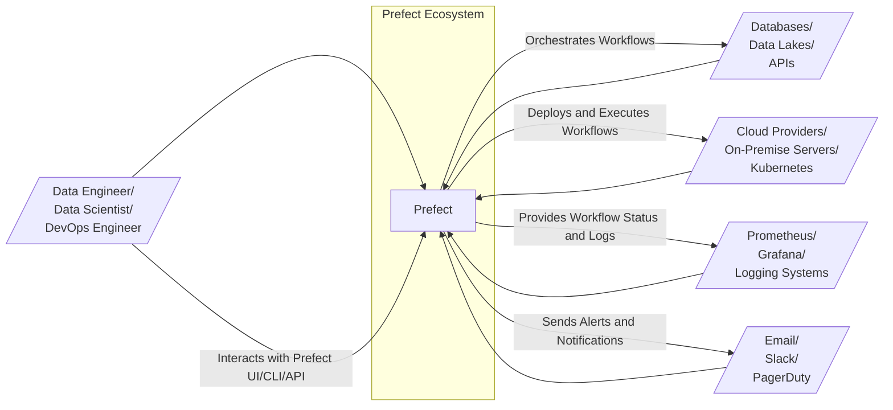
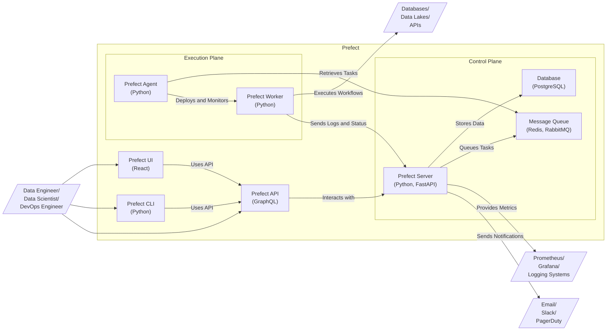
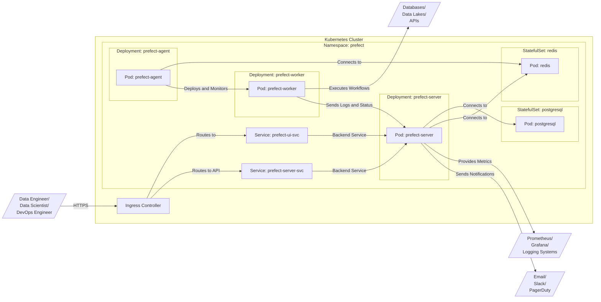
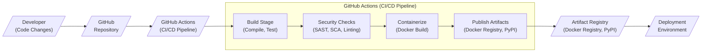

# BUSINESS POSTURE

Prefect is an open-source workflow orchestration platform designed to build, observe, and react to data pipelines. Its primary business priority is to provide a reliable, scalable, and user-friendly solution for managing complex workflows, especially in data-intensive applications. The goal is to empower data engineers, data scientists, and DevOps teams to automate and monitor their workflows effectively, reducing operational overhead and improving data pipeline reliability.

Most important business risks that need to be addressed:
- Risk of data pipeline failures impacting business operations due to unreliable workflow orchestration.
- Risk of inefficient resource utilization leading to increased infrastructure costs.
- Risk of lack of visibility into workflow execution, hindering monitoring and troubleshooting.
- Risk of complex workflow management leading to increased development and maintenance time.
- Risk of vendor lock-in if the platform is not sufficiently open and extensible.

# SECURITY POSTURE

Existing security controls:
- security control: Open-source project with community review and contributions. (Implemented: GitHub repository and community forums)
- security control: Code reviews as part of the contribution process. (Implemented: GitHub pull request review process)
- security control: Dependency scanning for known vulnerabilities in open-source dependencies. (Implemented: Likely through standard GitHub Dependabot or similar tools, but needs confirmation)
- security control: Software Composition Analysis (SCA) tools usage to manage open source components. (Implemented: Likely, but needs confirmation)
- security control: Standard GitHub security features like branch protection and vulnerability reporting. (Implemented: GitHub repository settings)
- security control: Documentation on security best practices for users. (Implemented: Prefect documentation website)

Accepted risks:
- accepted risk: Reliance on community security contributions and response times for vulnerability patching.
- accepted risk: Potential vulnerabilities in open-source dependencies that might not be immediately identified and fixed.
- accepted risk: Security of user-deployed infrastructure where Prefect is hosted and workflows are executed.
- accepted risk: Security configurations and practices adopted by individual users of Prefect.

Recommended security controls:
- security control: Implement automated security scanning in CI/CD pipelines, including SAST and DAST tools.
- security control: Establish a clear vulnerability disclosure and response process.
- security control: Provide security hardening guides and best practices for deploying and configuring Prefect.
- security control: Conduct regular penetration testing or security audits of the core platform.
- security control: Implement and enforce strong authentication and authorization mechanisms within Prefect.
- security control: Provide features for secure storage and handling of sensitive data and secrets within workflows.

Security requirements:
- Authentication:
    - requirement: Secure authentication mechanisms for accessing the Prefect UI, API, and CLI.
    - requirement: Support for various authentication methods, including local user accounts, SSO (Single Sign-On), and API keys.
    - requirement: Multi-factor authentication (MFA) support for enhanced security.
- Authorization:
    - requirement: Role-Based Access Control (RBAC) to manage user permissions and access to resources within Prefect.
    - requirement: Granular authorization policies to control access to workflows, deployments, and other entities.
    - requirement: Audit logging of authorization decisions and access attempts.
- Input Validation:
    - requirement: Robust input validation for all user-provided inputs to prevent injection attacks (e.g., SQL injection, command injection).
    - requirement: Input sanitization and encoding to mitigate cross-site scripting (XSS) vulnerabilities.
    - requirement: Validation of workflow definitions and configurations to prevent malicious or unexpected behavior.
- Cryptography:
    - requirement: Secure storage of sensitive data, such as API keys, credentials, and secrets, using encryption at rest.
    - requirement: Encryption in transit for communication between Prefect components and external systems using TLS/HTTPS.
    - requirement: Support for secure secret management solutions for workflows to access credentials and sensitive information.

# DESIGN

## C4 CONTEXT

Context Diagram Elements:

- Element:
    - Name: User
    - Type: Person
    - Description: Data engineers, data scientists, and DevOps engineers who use Prefect to define, manage, and monitor data workflows.
    - Responsibilities: Define workflows, deploy workflows, monitor workflow execution, troubleshoot issues, manage Prefect infrastructure.
    - Security controls: Role-Based Access Control (RBAC) within Prefect, strong authentication (MFA), audit logging of user actions.

- Element:
    - Name: Prefect
    - Type: Software System
    - Description: Workflow orchestration platform for building, observing, and reacting to data pipelines.
    - Responsibilities: Workflow definition and management, workflow scheduling and execution, state management, logging and monitoring, alerting and notifications, API and UI for user interaction.
    - Security controls: Authentication and authorization, input validation, secure secret management, encryption in transit and at rest, security scanning in CI/CD, vulnerability management process.

- Element:
    - Name: DataSources
    - Type: External System
    - Description: External systems that provide data for workflows, such as databases, data lakes, APIs, and message queues.
    - Responsibilities: Provide data to workflows, receive data from workflows, authenticate and authorize access to data.
    - Security controls: Data source specific security controls (e.g., database access controls, API authentication), network security controls, data encryption.

- Element:
    - Name: Infrastructure
    - Type: External System
    - Description: Underlying infrastructure where Prefect and workflows are deployed and executed, including cloud providers, on-premise servers, and Kubernetes clusters.
    - Responsibilities: Provide compute, storage, and networking resources for Prefect and workflows, ensure infrastructure security and availability.
    - Security controls: Infrastructure security controls provided by cloud providers or on-premise infrastructure teams, network security controls, access management, security monitoring.

- Element:
    - Name: Notifications
    - Type: External System
    - Description: Notification services used by Prefect to send alerts and notifications about workflow status, such as email, Slack, and PagerDuty.
    - Responsibilities: Receive and deliver notifications from Prefect, manage notification channels and subscriptions.
    - Security controls: Authentication and authorization for accessing notification services, secure communication channels (e.g., HTTPS for webhooks).

- Element:
    - Name: MonitoringTools
    - Type: External System
    - Description: Monitoring and logging systems used to observe Prefect and workflow execution, such as Prometheus, Grafana, and logging platforms.
    - Responsibilities: Collect and visualize metrics and logs from Prefect and workflows, provide dashboards and alerting capabilities.
    - Security controls: Authentication and authorization for accessing monitoring tools, secure data transmission, data retention policies.

## C4 CONTAINER

Container Diagram Elements:

- Element:
    - Name: Prefect Server
    - Type: Container - Application
    - Description: Core application server responsible for managing workflow definitions, deployments, scheduling, state management, and API access. Built using Python and FastAPI.
    - Responsibilities: Workflow management, scheduling, state management, API endpoint, user authentication and authorization, data persistence.
    - Security controls: Input validation, authorization checks for API requests, secure database connection, encryption of sensitive data at rest, logging and auditing.

- Element:
    - Name: Database
    - Type: Container - Database
    - Description: Persistent storage for Prefect server data, including workflow definitions, run history, state information, and user metadata. Typically PostgreSQL.
    - Responsibilities: Data persistence, data integrity, data availability, secure data storage.
    - Security controls: Database access controls, encryption at rest, regular backups, database hardening, vulnerability scanning.

- Element:
    - Name: Message Queue
    - Type: Container - Message Queue
    - Description: Asynchronous message queue used for communication between Prefect Server and Agents, enabling task queuing and distribution. Can be Redis or RabbitMQ.
    - Responsibilities: Task queuing, message delivery, decoupling of components.
    - Security controls: Access controls for the message queue, secure communication channels (e.g., TLS), message encryption if needed.

- Element:
    - Name: Prefect Agent
    - Type: Container - Application
    - Description: Lightweight process responsible for polling the Prefect Server for scheduled workflow runs and deploying them to execution environments (Workers). Built using Python.
    - Responsibilities: Task retrieval from queue, workflow deployment, monitoring worker status, reporting status back to server.
    - Security controls: Secure communication with Prefect Server (authentication, authorization, encryption), secure handling of credentials for workflow execution, logging and monitoring.

- Element:
    - Name: Prefect Worker
    - Type: Container - Application
    - Description: Executes the actual workflow tasks in a defined execution environment. Workers are typically ephemeral and can run in various environments (local, Docker, Kubernetes, etc.). Built using Python.
    - Responsibilities: Workflow execution, task execution, logging task output, reporting task status back to Agent and Server.
    - Security controls: Secure execution environment (containerization, isolation), secure access to data sources, input validation within workflows, secure handling of secrets and credentials, logging and monitoring.

- Element:
    - Name: Prefect UI
    - Type: Container - Web Application
    - Description: Web-based user interface for interacting with Prefect, visualizing workflows, monitoring runs, and managing deployments. Built using React.
    - Responsibilities: User interface for Prefect, workflow visualization, monitoring dashboards, user management.
    - Security controls: Authentication and authorization, input validation, protection against XSS and CSRF attacks, secure communication with Prefect API (HTTPS).

- Element:
    - Name: Prefect CLI
    - Type: Container - Command Line Interface
    - Description: Command-line interface for interacting with Prefect, automating tasks, and managing workflows. Built using Python.
    - Responsibilities: Command-line access to Prefect functionalities, automation scripting.
    - Security controls: Authentication and authorization, secure handling of credentials, input validation.

- Element:
    - Name: Prefect API
    - Type: Container - API
    - Description: GraphQL API exposed by Prefect Server for programmatic access to Prefect functionalities.
    - Responsibilities: API endpoint for UI, CLI, and external integrations, data access and manipulation.
    - Security controls: Authentication and authorization (API keys, OAuth 2.0), input validation, rate limiting, API security best practices.

## DEPLOYMENT

Deployment Architecture Options:
1. Local Deployment (for development and testing): All components (Server, Agent, Worker, Database, Queue) run on a single machine.
2. Containerized Deployment (Docker Compose): Components are containerized and orchestrated using Docker Compose, suitable for development and small-scale deployments.
3. Kubernetes Deployment: Components are deployed and managed on a Kubernetes cluster, providing scalability, resilience, and manageability for production environments.
4. Prefect Cloud: Managed cloud service provided by Prefect, abstracting away infrastructure management.

Detailed Deployment Architecture (Kubernetes Deployment):

Deployment Diagram Elements (Kubernetes Deployment):

- Element:
    - Name: Kubernetes Cluster
    - Type: Infrastructure - Cluster
    - Description: Managed Kubernetes cluster providing the runtime environment for Prefect components.
    - Responsibilities: Container orchestration, resource management, scalability, high availability.
    - Security controls: Kubernetes RBAC, network policies, pod security policies/admission controllers, cluster security hardening, regular security updates.

- Element:
    - Name: Namespace: prefect
    - Type: Kubernetes Namespace
    - Description: Dedicated Kubernetes namespace for deploying all Prefect related resources, providing isolation and resource management.
    - Responsibilities: Resource isolation, access control within the namespace.
    - Security controls: Kubernetes RBAC for namespace access, network policies to restrict traffic within and outside the namespace.

- Element:
    - Name: Deployment: prefect-server
    - Type: Kubernetes Deployment
    - Description: Kubernetes Deployment managing the Prefect Server pods, ensuring desired replica count and rolling updates.
    - Responsibilities: Server pod management, scaling, rolling updates, health checks.
    - Security controls: Pod security context, resource limits, security probes.

- Element:
    - Name: Deployment: prefect-agent
    - Type: Kubernetes Deployment
    - Description: Kubernetes Deployment managing the Prefect Agent pods.
    - Responsibilities: Agent pod management, scaling, rolling updates, health checks.
    - Security controls: Pod security context, resource limits, security probes, secure communication with Server.

- Element:
    - Name: Deployment: prefect-worker
    - Type: Kubernetes Deployment
    - Description: Kubernetes Deployment managing the Prefect Worker pods.
    - Responsibilities: Worker pod management, scaling, rolling updates, health checks, workflow execution environment.
    - Security controls: Pod security context, resource limits, security probes, secure access to data sources, isolation of worker pods.

- Element:
    - Name: StatefulSet: postgresql
    - Type: Kubernetes StatefulSet
    - Description: Kubernetes StatefulSet managing the PostgreSQL database pods, ensuring persistent storage and ordered deployment.
    - Responsibilities: Database pod management, persistent storage, data replication, backups.
    - Security controls: Persistent volume security, database access controls, encryption at rest, regular backups, database hardening.

- Element:
    - Name: StatefulSet: redis
    - Type: Kubernetes StatefulSet
    - Description: Kubernetes StatefulSet managing the Redis message queue pods.
    - Responsibilities: Message queue pod management, data persistence (optional), high availability.
    - Security controls: Access controls for Redis, secure communication channels (e.g., TLS), data persistence security.

- Element:
    - Name: Service: prefect-server-svc
    - Type: Kubernetes Service
    - Description: Kubernetes Service exposing the Prefect Server pods within the cluster.
    - Responsibilities: Internal service discovery for Prefect Server.
    - Security controls: Network policies to restrict access to the service.

- Element:
    - Name: Service: prefect-ui-svc
    - Type: Kubernetes Service
    - Description: Kubernetes Service exposing the Prefect UI pods within the cluster.
    - Responsibilities: Internal service discovery for Prefect UI.
    - Security controls: Network policies to restrict access to the service.

- Element:
    - Name: Ingress Controller
    - Type: Kubernetes Ingress
    - Description: Kubernetes Ingress controller providing external access to Prefect UI and API via HTTPS.
    - Responsibilities: External access point, TLS termination, routing to services.
    - Security controls: TLS configuration, ingress controller security hardening, rate limiting, WAF (Web Application Firewall) integration.

## BUILD

Build Process Description:

1. Developer makes code changes and commits them to the GitHub repository.
2. GitHub Actions CI/CD pipeline is triggered upon code changes (e.g., pull requests, merges to main branch).
3. Build Stage: Code is compiled, unit tests and integration tests are executed to ensure code quality and functionality.
4. Security Checks Stage: Automated security checks are performed:
    - SAST (Static Application Security Testing): Scans source code for potential security vulnerabilities.
    - SCA (Software Composition Analysis): Analyzes dependencies for known vulnerabilities.
    - Linting: Code linters are used to enforce code style and identify potential code quality issues.
5. Containerize Stage: Docker images are built for Prefect components (Server, Agent, Worker, UI) using Dockerfiles.
6. Publish Stage: Build artifacts (Docker images, Python packages) are published to artifact registries:
    - Docker images are pushed to a Docker registry (e.g., Docker Hub, GitHub Container Registry).
    - Python packages are published to PyPI (Python Package Index).
7. Artifacts from the registry are then used for deployment in various environments (development, staging, production).

Build Diagram Elements:

- Element:
    - Name: Developer
    - Type: Person
    - Description: Software developers contributing code to the Prefect project.
    - Responsibilities: Writing code, committing changes, creating pull requests, code reviews.
    - Security controls: Secure development practices, code review process, access control to development environment.

- Element:
    - Name: GitHub Repository
    - Type: Code Repository
    - Description: GitHub repository hosting the Prefect source code and development history.
    - Responsibilities: Version control, code storage, collaboration platform, pull request management.
    - Security controls: Branch protection, access control, audit logging, vulnerability scanning (Dependabot).

- Element:
    - Name: GitHub Actions
    - Type: CI/CD Pipeline
    - Description: GitHub Actions workflows automating the build, test, security checks, and publishing processes.
    - Responsibilities: Build automation, testing, security scanning, artifact publishing, CI/CD pipeline management.
    - Security controls: Secure pipeline configuration, secret management for credentials, access control to workflows, audit logging.

- Element:
    - Name: Build Stage
    - Type: CI/CD Stage
    - Description: Stage in the CI/CD pipeline responsible for compiling code and running tests.
    - Responsibilities: Code compilation, unit testing, integration testing, build artifact creation.
    - Security controls: Secure build environment, dependency management, build process isolation.

- Element:
    - Name: Security Checks Stage
    - Type: CI/CD Stage
    - Description: Stage in the CI/CD pipeline performing automated security checks.
    - Responsibilities: SAST scanning, SCA scanning, linting, vulnerability identification.
    - Security controls: SAST/SCA tool configuration, vulnerability reporting, integration with vulnerability management system.

- Element:
    - Name: Containerize Stage
    - Type: CI/CD Stage
    - Description: Stage in the CI/CD pipeline building Docker images.
    - Responsibilities: Docker image creation, Dockerfile management, image optimization.
    - Security controls: Base image selection, Dockerfile security best practices, image scanning for vulnerabilities.

- Element:
    - Name: Publish Stage
    - Type: CI/CD Stage
    - Description: Stage in the CI/CD pipeline publishing build artifacts to artifact registries.
    - Responsibilities: Artifact publishing to Docker Registry and PyPI, versioning, release management.
    - Security controls: Secure access to artifact registries, artifact signing, access control to publishing process.

- Element:
    - Name: Artifact Registry
    - Type: Artifact Storage
    - Description: Storage for build artifacts, including Docker Registry and PyPI.
    - Responsibilities: Artifact storage, versioning, distribution, access control.
    - Security controls: Access control, vulnerability scanning, secure storage, audit logging.

- Element:
    - Name: Deployment Environment
    - Type: Environment
    - Description: Target environment where Prefect is deployed (e.g., Kubernetes cluster, cloud environment).
    - Responsibilities: Runtime environment for Prefect, infrastructure management, application deployment.
    - Security controls: Environment specific security controls (see Deployment section).

# RISK ASSESSMENT

Critical business processes we are trying to protect:
- Reliable execution of data pipelines: Ensuring workflows run as scheduled and complete successfully is crucial for data-driven business operations. Failures can lead to data delays, inaccurate reporting, and business disruptions.
- Data integrity and accuracy: Maintaining the integrity and accuracy of data processed by workflows is essential for making informed business decisions. Data corruption or manipulation can have significant negative impacts.
- System availability and performance: Ensuring Prefect platform and workflows are available and performant is critical for continuous data processing and real-time applications. Downtime or performance degradation can disrupt business operations.

Data we are trying to protect and their sensitivity:
- Workflow definitions: These contain logic and configurations for data pipelines. Sensitivity: Medium. Exposure could lead to intellectual property theft or manipulation of workflows.
- Workflow state and run history: Information about workflow executions, including logs, metrics, and state data. Sensitivity: Medium. Contains operational data and potentially sensitive information about data processing.
- User credentials and API keys: Used for authentication and authorization to Prefect and external systems. Sensitivity: High. Compromise can lead to unauthorized access and control.
- Secrets and sensitive data within workflows: Credentials, API keys, and other sensitive information used by workflows to access data sources and services. Sensitivity: High. Compromise can lead to data breaches and unauthorized access to external systems.
- Monitoring and logging data: Operational data about Prefect platform and workflows. Sensitivity: Low to Medium. Can contain information about system performance and potential security incidents.

# QUESTIONS & ASSUMPTIONS

Questions:
- What specific SAST, DAST, and SCA tools are currently used or planned to be used in the CI/CD pipeline?
- Is there a formal vulnerability disclosure and response process in place for Prefect?
- Are there specific security hardening guides or best practices documented for deploying Prefect in different environments?
- Are penetration tests or security audits regularly conducted for Prefect?
- What specific authentication and authorization mechanisms are currently supported and planned for Prefect?
- What secret management solutions are recommended or supported for use with Prefect workflows?
- What are the data retention policies for workflow run history and logs?
- What are the specific compliance requirements (e.g., GDPR, HIPAA, SOC 2) that Prefect needs to adhere to or support?
- What is the risk appetite of the organization using Prefect? (Startup vs. Fortune 500)

Assumptions:
- BUSINESS POSTURE: The primary business goal is to provide a reliable and scalable workflow orchestration platform for data-intensive applications. Users prioritize ease of use, observability, and automation.
- SECURITY POSTURE: Prefect is currently following basic security best practices for open-source projects. There is room for improvement in implementing more proactive and automated security controls, especially in CI/CD and vulnerability management. Security is a growing concern as adoption increases and users handle more sensitive data.
- DESIGN: The C4 diagrams and descriptions provided are a reasonable representation of the high-level architecture of Prefect. Kubernetes deployment is a common and important deployment scenario for production environments. The build process includes basic security checks, but can be further enhanced with more comprehensive security scanning and supply chain security measures.